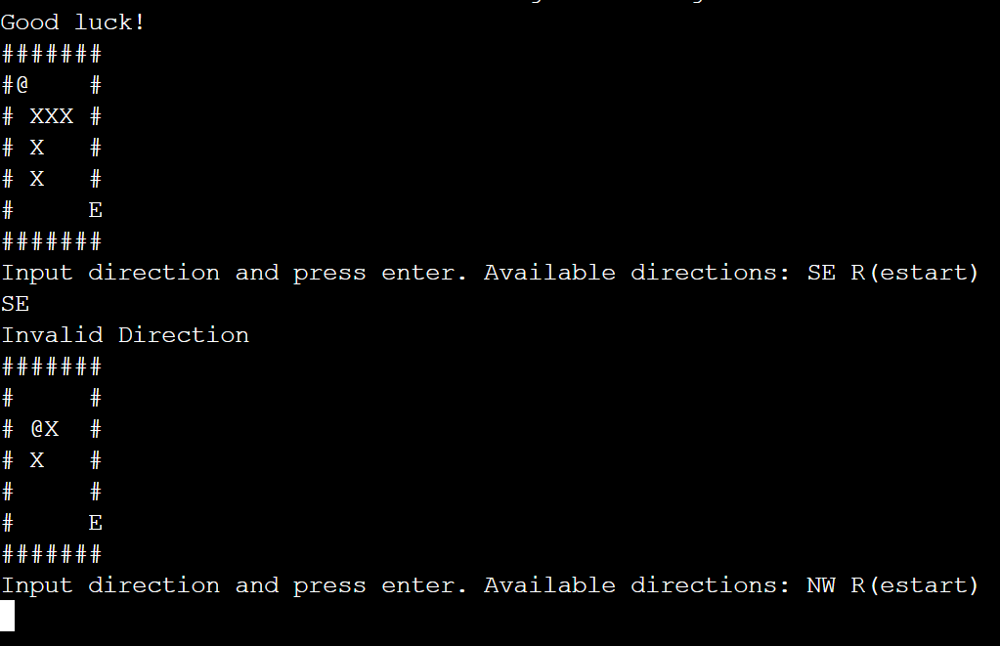
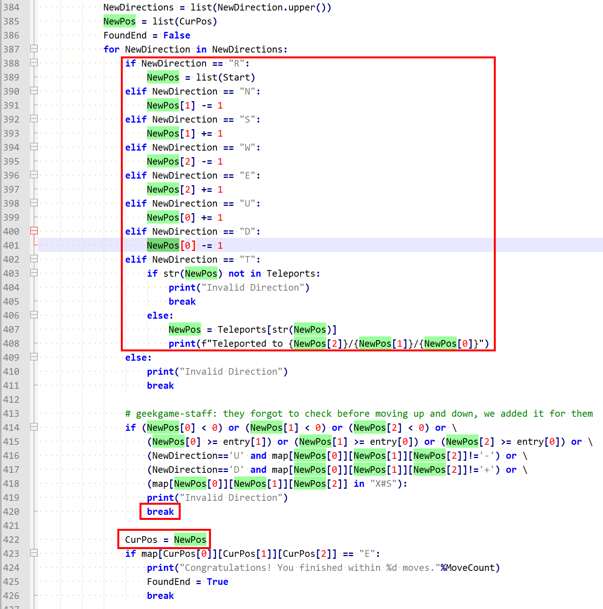

# [Misc] 智慧检测器

- 命题人：xmcp
- 破坏者：200 分
- 调停者：250 分

## 题目描述

CTF 之家讯（作者 / 侑师傅），GeekGame 于 11 月 19 日举行线上发布会，发布了一道题目《Misc 智慧题》。
题目以经典的走迷宫作为主要玩法，选手需要在指定步数内通关 3 个迷宫关卡。

记者了解到，今年早些的 <a target="_blank" rel="noopener noreferrer" href="https://github.com/Nautilus-Institute/quals-2022/blob/main/twisty/twisty.py">D 比赛</a> 也出现过类似的题目，
针对部分网友提出的“题目抄袭”质疑， GeekGame 宣传负责人表示，《Misc 智慧题》是 GeekGame 具有自主知识产权的题目，
为了选手的解题体验加入了 D 比赛相关题目的兼容层，因此遵循开源协议使用了 DOSP（DBiSai Open-Source Project） 的开源代码，这是业界通行做法。
在玩法方面，GeekGame 这道题目为了将寒气传达给每一名选手，对移动步数有全新的要求，因此对选手智慧程度的考察远高于 D 比赛，而且修正了 DOSP 代码中的多处 bug，因此不构成抄袭。
GeekGame 还表示，在明年即将举行的第三届比赛中，所有题目将实现完全自主化替代，届时题目代码将不含任何源于 DOSP 的部分。

     
    ↑ GeekGame 线上发布会精彩片段 / 图：视觉火星

据约霍·翰普金斯大学报道，一名内部验题人表示，D 比赛的出题人可能不太会 Python，以致于比赛当时的选手在没有源码的情况下随便试试就用非预期解把题给秒了。
希望 GeekGame 把这些恶性 bug 都改好了。

<strong>让游戏崩溃</strong>可以获得 Flag 1，<strong>通关游戏</strong>可以获得 Flag 2。

<strong>第二阶段提示：</strong>

<ul>
<li>Flag 1：游戏具有一处 Python 新手程序员经常犯的错误，造成了穿墙 bug。试着找出这个 bug，然后构造一个 <code>IndexError</code>。</li>
<li>Flag 2：第三关可以开局先去看看终点的位置在哪里，然后按 R 重新开始。</li>
</ul>

**【终端交互：连接到题目】**

**[【附件：下载题目源码（prob03-src.py）】](attachment/prob03-src.py)**

## 预期解法

这个题基本和 DEFCON Quals 2022 的 twisty 题目一样，是个走迷宫游戏，NSWE 移动，在写着 + 和 - 的格子里可以 UD 上下，在写着 T 的格子里可以传送，只能看到离自己很近的一个区域。下载源码之后进行一个比较，发现这个题目确实如题面所说修复了几处 bug，同时增加了移动步数限制，要求通过每关都不能超出 99 步。

简单计算发现，迷宫第三关一共有 80 层，每层大小是 55*55，显然是无法在 99 步之内正常通关的。再根据题面和 Flag 1 的提示，我们应该找出这个游戏的 bug 从而用非正常手段通关。

然后随便来玩玩这个游戏，多玩一会容易发现它能穿到墙里：

结合源代码理解一下这个 bug 的成因：

游戏用 CurPos 变量记录当前位置，用 NewPos 变量记录下一步的位置。对于每一步移动，388~408 行按照移动方向更新了 NewPos，420 行检测到如果移动非法则 break 掉，422 行把 NewPos 更新到 CurPos 实现移动。

问题出在 422 行。在 Python 里进行 `CurPos = NewPos` 这个赋值会让这个列表指向同一处内存，从而在下一轮循环里的 388~408 行虽然是在修改 NewPos，但实际上也同时修改了 CurPos，因此即使被检测到移动非法，也已经更新了 CurPos！正确的写法应该是 `CurPos = NewPos[:]`。

因此，如果一行输入有多步动作，从第二步开始就可以无视障碍随意移动（最多这样移动一步后会被 break 掉，所以只能穿一堵墙）。

理解 bug 的原理之后出 Flag 1是非常简单的，比如说我们在第一关试图向上移动，但是因为第一关只有一层，就会在 Z 轴出现 IndexError：

然后再看 Flag 2。利用这个 bug 可以快速向上移动，只需要一行输入两步，第一步随便走一个可行的方向，第二步是 U。程序会记录为走了一步，实际走了一步并往上移动了一层。因此用这种方法可以在大约 80 步内移动到顶层，同时赠送了 80 次随机游走机会。利用剩下的十几次机会走到终点就可以了。

当然，如果真是纯纯的随机游走的话，有几率走不到终点就耗尽次数了。我们可以第三关开局先随便走一个方向然后按 D，这样就会从第 0 层下降到第 -1 层。因为 Python 里面 [-1] 表示列表的最后一个元素，这样就直接穿越到了迷宫的最后一层。虽然这样穿越之后没法直接走到终点（414 行判断到 Z<0 就 break 了），但是至少能让我们看看终点的具体位置，然后按 R 重新回到第 0 层。这样就可以在往上爬的过程中尽量往终点的方向凑，99 步之内到达终点的概率就大幅增加。

## 命题花絮

此题的命题动机显然正是今年的 DEFCON Quals。看起来那个题目是想让选手当场写一个 AI 把迷宫解出来，但奈何这题 bug 太多了，除了上面说的穿墙 bug 以外，在处理 U/D 的时候甚至没有检测当前格子是不是 +/-。因此可以直接 UUUUU 就飞升到最顶层。我感觉当时所有队都是用非预期解把这个题目做出来的。

另外这题的步数限制本来是 95，后来为了避免部分非酋体验不佳就加大到了 99。目前看来加大到 99 之后限制过于宽松了，有很多选手没先去看终点位置就直接通关了。

另外本题题面这个 UI 截图显然是抄的《主播女孩重度依赖》，桌面背景图是《理塘县城》，直播视频画面模仿了鸿蒙 PPT，“400K 高清地图” 对应了华为车机 2K 屏幕实为 1920*1080 分辨率的梗，H 比赛和 D 比赛的全名不言而喻。在我出这道题花费的所有时间里，可能有一半都用来画这张截图了，笑。

