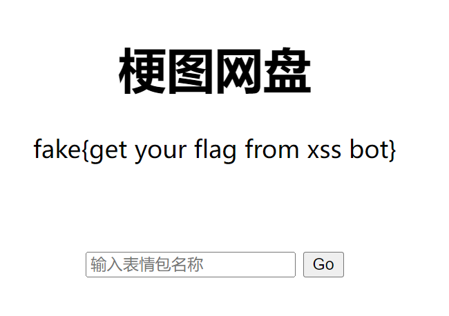
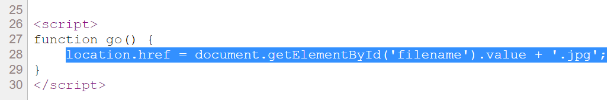
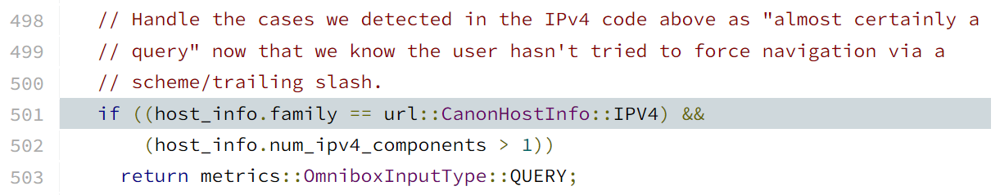
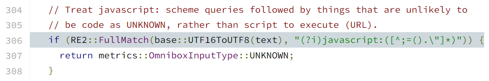

# [Web] 给钱不要！

- 命题人：xmcp
- 要钱不给！！：200 分
- 信息不漏！！！：250 分

## 题目描述

<blockquote>
<p>给钱不要，要钱不给，信息不漏！</p>
<p>Give money no need. Need money no give. Information no leak.</p>
</blockquote>
<p>You 酱是 GeekGame 比赛的资深命题人，她深知“人”是信息安全中最薄弱的环节，人的使用习惯胜过一切安全措施。毕竟电脑只要不开机就不会中毒，<a target="_blank" rel="noopener noreferrer" href="https://www.bilibili.com/video/BV1GJ411x7h7/">链接</a>只要不点就不会被骗。</p>
<p>话虽如此，但她最近沉迷于收集疯狂星期四表情包。身为超级嘿客的你偶然发现她经常使用的表情包下载网站存在一种 XSS 漏洞，只要在网站上输入一串字符就可以泄露她珍藏的 Flag。
为了宝贵的奖金，你决定试试看她在魅力十足的疯狂星期四面前还能否保持理性。</p>
<p>鲁莽的攻击行为总是伴随着风险：如果 You 酱觉得你发给她的字符串很可疑，机智的她就会立刻将你举报到保卫部，然后很快就会有骑着白色高级电瓶车的保安出现在楼下将你带走。这可就遭了。</p>
<p><strong>补充说明：</strong>完全没有思路可以看看 Chrome 地址栏自动补全的相关源码。不看源码的话，或许灵感 + 一定程度的 Fuzz 也能起到效果。</p>
<div class="well">
<p><strong>萌新教学：</strong></p>
<p>本题提供了一个模拟受害者行为的程序，称为 XSS Bot。XSS Bot 会自动操作浏览器将 Flag 放置在目标网站上，然后输入你提供的字符串。</p>
<p>请设法利用目标网站上的漏洞，获得受害者浏览器中的 Flag。</p>
</div>
<div class="well">
<p><strong>第二阶段提示：</strong></p>
<ul>
<li>来看看 <a target="_blank" rel="noopener noreferrer" href="https://chromium.googlesource.com/chromium/src/+/refs/tags/106.0.5249.163/components/omnibox/browser/autocomplete_input.cc#235">Chrome 是如何解析地址栏输入的内容的</a>。</li>
<li>Flag 1：试着让 Chrome 把一个任意的 IP 地址解析成 QUERY。</li>
<li>Flag 2：试着让 Chrome 把一个 Bookmarklet 解析成 UNKNOWN。</li>
</ul>
</div>

**【网页链接：访问目标网站】**

**【终端交互：连接到 XSS Bot】**

**[【附件：下载 XSS Bot 源码（prob06-xssbot.py）】](attachment/prob06-xssbot.py)**

## 预期解法

目标网站的功能简单到不能再简单，只有一个文本框和一个按钮。XSS Bot 会把输入的内容填入文本框然后按下按钮。



不难发现网站中的 XSS 漏洞。这其实是一个开放跳转漏洞，可以跳转到攻击者指定的 URL，因此如果输入一个 `javascript:` URL 就能直接执行代码。



但是本题难点在于绕过 XSS Bot 里的过滤。XSS Bot 是直接通过 Chrome 地址栏（Omnibox）的自动补全服务进行的过滤（[相关逻辑在源码的 AutocompleteInput::Parse 里](https://chromium.googlesource.com/chromium/src/+/refs/tags/106.0.5249.163/components/omnibox/browser/autocomplete_input.cc#501)），如果 Chrome 认为这是一个网址，就直接退出。如何让 Chrome 认为自己的 payload 不是网址是此题的主要难点。

先看 Flag 1，此 Flag 需要构造一个被 Chrome 识别成 QUERY 的网址，然后这个网址的标题由攻击者完全控制。

预期解是利用 IPv4 地址编码的多样性。我们日常使用的 IPv4 地址表示方式是点分十进制（12.34.56.78），但其实每个 IPv4 地址只是一个 32 位整数而已，可以有很多编码方式。例如，以下所有 URL 都是等价的，不信你就把它输入进 Chrome 试试看：

- http://12.34.56.78 （点分十进制）
- http://0xc.0x22.0x38.0x4e （点分十六进制）
- http://014.042.070.0116（点分八进制）
- http://12.0x22.070.78 （点分十、十六、八、十进制）
- http://203569230 （十进制）
- http://0xc22384e （十六进制）
- http://01410434116 （八进制）
- http://12.2242638 （点分，但没有完全点分）

对于 Chrome 来说，虽然它支持上述每种表述方式，但并不意味着用户在地址栏里输入数字 203569230 然后按回车就会跳转到这个 IP 地址——用户显然是打算搜索这个数字。因此 Chrome 进行了一些特判，如果用户输入的内容虽然严格来讲是一个 IP 地址但长得不太像 IP 地址，就视为搜索。



因此，顺着这个逻辑不难构造出一个可行 payload：`http://60.13492082:1919?`。

在比赛中还发现有一些非预期解，Taoky 的 Writeup 里指出了 [Chrome 的单元测试](https://github.com/chromium/chromium/blob/main/components/omnibox/browser/autocomplete_input_unittest.cc) 里面就包括了很多有趣的网址被识别成 QUERY 的例子，基本可以认为是此题所有可行解法的一个超集。比如：

```c++
{u"1.2:45", metrics::OmniboxInputType::QUERY}, // 这个就是上面讲的预期解
{u"filesystem:http", metrics::OmniboxInputType::QUERY},
{u"user@1.2:45", metrics::OmniboxInputType::QUERY},
```

再说 Flag 2，我们继续看 Chrome 源码，里面有一个很有趣的段落：



Chrome 为什么要加这么一段呢？原来是有一个 [古早的 bug](https://bugs.chromium.org/p/chromium/issues/detail?id=31661)，有人在地址栏里搜索《JavaScript: The Definintive Guide》这本书的名字，然后被认为是 javascript: 代码给执行了。因此 Chrome 就加入了这个判断，如果输入的内容符合正则表达式 `javascript:([^;=().\"]*)` 就给视为文本而非代码。

仔细一看，如果没有分号、等号、圆括号、点、双引号，确实不像代码。但真的如此吗？出于 JavaScript 语言的灵活性，就算 ban 了这些符号，依然可以写出任意的程序来。比如反引号实际上是可以执行任意函数的：

```javascript
javascript:open`javascript:alert\x281\x29`
javascript:setTimeout`alert\x281\x29`
javascript:eval['call']`${'alert\x281\x29'}`
javascript:Function`alert\x281\x29```
```

或者还可以利用 [Bookmarklet 的一个鲜为人知的特性](https://en.wikipedia.org/wiki/Bookmarklet)：如果 `javascript:` 后面的内容是一个字符串，它就会被浏览器视为 HTML 解释。也就是说，我们可以直接写成这样：

`javascript:'<title>'+document['body']['textContent']`

它相当于 `document.write` 后面的内容。

用上述两种思路中的任何一种都可以拿到 Flag 2。

## 命题花絮

本题的命题动机是 [这个知乎回答](https://www.zhihu.com/question/560616439/answer/2722866208)，感觉很有意思就拿来出了。

顺便一提，通过 `location.href` 跳转也是一个实际网站中比较容易犯的错误。在今年一次 HVV 中，我找到了某网站的注销接口有这种漏洞。即访问 `/logout?next=ANY_URL`，会在返回的 JS 代码里面执行 `location.href='ANY_URL'`。如果 ANY_URL 处是 `javascript:...` 就可以执行任意代码了。

因为漏洞出在注销接口，利用比较困难，不能用它直接收 Cookie（因为已经注销了），但是可以用来钓鱼。我直接写了一个比较复杂的 payload 去钓管理员的密码：用 `history.replaceState` 把 URL 换成登录页面的网址， 用 `iframe` 显示了真实的登录框，然后监听了提交表单的事件，从而把输入的密码发过来。这样就构造出了一个 100% 真实的钓鱼网站，真实到 URL 是完全正确的，而且浏览器的记住密码功能也在正常工作，一般用户根本没有任何办法发现。

如果校外的同学不清楚题目名称《给钱不要，要钱不给，信息不漏》是什么意思的话，它是鄙校保卫部经常使用的一句宣传口号：


在网上搜了搜，最后《信息不漏》这半句话似乎只有北大在用。

此题的两个 Flag 是互相独立的，因此哪个放到 Flag 1、哪个放到 Flag 2 是在出题的时候要考虑的问题之一。我仔细想了想，感觉两个 Flag 各有各的难点，可能老赛棍做 JavaScript 会比较熟练，但萌新随便搞搞没准写 IP 地址的难度比写 JavaScript 代码的难度要低一些。最后，在决定了题目名称叫《给钱不要》之后，我突然意识到，在网页标题里写 V 我 50 ==《要钱不给》，用 JavaScript 读 DOM ==《信息不漏》，于是就如此把 Flag 的顺序确定下来了。此处应该感谢保卫部？