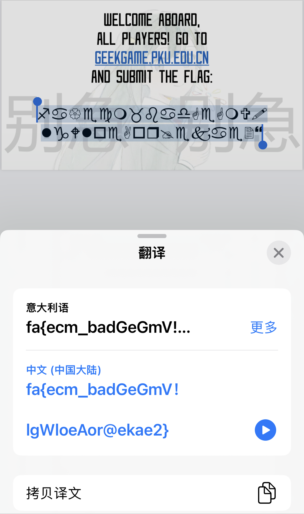

# [Tutorial] †签到†

- 命题人：xmcp
- 题目分值：100 分

## 题目描述

<blockquote>

《PKU GeekGame》是北京大学自主研发的一款全新 CTF 解题赛。
比赛发生在一个被称作「<ruby>信息高速路<rt>互联网</rt></ruby>」的幻想世界，
在这里，报名的选手将被授予访问题目的<ruby>「权能」<rt>Token</rt></ruby>，导引赛博之力。
你将扮演一位名为「黑客」的神秘角色，在自由的解题过程中邂逅类型各异、考点独特的题目们，找出程序的漏洞或者隐藏的信息，同时逐步发掘「Flag」的真相。

</blockquote>

欢迎参赛！随着比赛进行，我们会发布对题目的补充说明、提示及后续赛程安排，届时将在本平台和 QQ 群 691076890 发布。

如果你对题目有疑问，可以在群里私聊管理员或发邮件到 geekgame at pku.edu.cn。除通过上述方式与组委会联系外，所有选手在比赛结束前不得与他人讨论题目。

<strong>补充说明：此题 Flag 是在英文中有意义的内容。</strong>

<strong>萌新教学：</strong>

本比赛的每道题目都对应着一个或多个被称为 Flag 的答案，其形如 <code>flag{...}</code>。
Flag 区分大小写，所有字符均为可打印 ASCII 字符。
你需要按照要求在题目所给附件中解出 Flag，或者攻击题目指定的系统在服务器中得到 Flag。将 Flag 输入到下面的文本框即可得分。

<a href="#/game">比赛主页</a> 的 “资料推荐” 栏目有一些让你快速了解常见解题方法的资料，例如第一届 PKU GeekGame 签到题的题解对解出本题可能有帮助。
<a href="#/info/faq">选手常见问题</a> 的 “常用工具” 栏目列举了一些你可能会用到的工具。

<strong>第二阶段提示：</strong>

<ul>
<li><a target="_blank" rel="noopener noreferrer" href="https://github.com/PKU-GeekGame/geekgame-1st/tree/master/writeups">第一届 PKU GeekGame 的部分选手题解</a> 真的对解出本题有帮助。此题相比于第一届签到题的唯一难点就在于不允许复制。</li>
<li>不允许复制并不意味着不能复制。不能复制也不意味着无法解题。</li>
</ul>

**[【附件：下载题目附件（prob19.pdf）】](attachment/prob19.pdf)**

## 预期解法

第一届的签到题出的难了点，被吐槽签到都不会做，因此本届进行了一个简单的摆烂。<del>跟往年题一模一样的题目，这回总不能不会做了吧？</del>

我们直接打开 PDF，进行一个复制：

然后就跟第一届的解法完全一样了，对那两行 Wingdings 字体的文字进行一个栅栏密码的解，即可得到 Flag。

什么，你说打开 PDF 之后显示无法复制？

这是因为出题的时候用 Acrobat 设置了权限，禁止了复制功能，因此支持这一权限设定的 PDF 客户端会阻止用户复制。但显然这种权限设定是没什么用的：

- Firefox 浏览器（和所有其他基于 pdf.js 的阅读器）不支持这一权限设定，因此可以毫无阻碍地复制。
- Chrome 浏览器可以双击选中文字，然后右键 “用百度搜索 xxxx”，从而看到文本。
- iOS Safari 浏览器可以选中文字之后选择 “翻译”，从而看到文本。
- 最近几个版本的 Chrome 浏览器 [还有一个 bug](https://bugs.chromium.org/p/chromium/issues/detail?id=1380985)，虽然右键菜单里复制是灰色的，但实际上按 Ctrl+C 能正常复制出内容。这是出题的时候偶然发现的，已经报告给 Chrome。没想到出个签到题还能遇到 Chrome 的 0day。
- Acrobat 虽然不让复制，但是可以在侧边栏里打开 “内容” 这个 Tab，在里面可以看到具体的文本。
- 再不济你可以把 Wingdings 字体的每个字符都打出来，然后人工比对是不是？

## 命题花絮

Welcome Aboard 那几行字的字体跟第一届一样，都是 SAO UI。当时选这个字体是因为 PowerPoint 2019 导出 PDF 的时候会把它转成位图，而 Wingdings 不会，因此全选之后上面的那几行字选不中，只有下面的文字能选中，非常的有趣。后来我升级到了 PowerPoint 2021，导出 PDF 的时候不会把 SAO UI 字体转换成位图了，尴尬（

可以注意到本届的 PDF 在后面加了 “别急” 字样和一张学园偶像美图，这是为了给试图 OCR 的选手稍微增加一点点难度，同时精确选中下面那两行字也变得稍微困难了一些。

本届签到题的 PDF 跟上届相比没有经过阴间剪裁，采用了正常的 16:9 长宽比。因此写题面的时候想了半天能不能把 Wide-Screen Baroque 这个词缝进去，但最终还是没能成功（
