# [Tutorial] 小北问答 · 极速版

- 命题人：xmcp、debugger（题面：xmcp）
- 及格摆烂：200 分
- 满分卷王：200 分

## 题目描述

菜宝十分擅长网上冲浪，会使用十种甚至九种搜索引擎。本届 PKU GeekGame 一开始，她就急不可耐地打开了小北问答题目，想要在一血榜上展现她惊人的情报搜集能力。

为了让菜宝玩得开心，小北问答题目全新升级为小北问答 · 极速版。

<ul>
<li>小北问答 · 极速版自带<strong>省流助手</strong>，基于 socket 通信的纯文字 UI 简洁朴实，不浪费网络上的每一毫秒。</li>
<li>小北问答 · 极速版自带<strong>速通计时</strong>，只有手速够快的 CTF 选手才是好的 CTF 选手。</li>
<li>小北问答 · 极速版自带<strong>肉鸽玩法</strong>，每次连接到题目都有不一样的问题在等着你。</li>
</ul>

赶紧打开网页终端体验小北问答 · 极速版，把 Flag 抱回家吧！

<strong>萌新教学：</strong>

如下面的说明所示，本题在 <code>prob01.geekgame.pku.edu.cn</code> 主机开放了 TCP 10001 端口。
你可以通过网页终端、命令行工具 netcat 或者 pwntools 等带 socket 通信功能的库连接到这个端口，参见 <a href="#/info/faq">FAQ：关于终端交互</a>。

请与这个端口上的程序交互获得 Flag。连接频率限制是 30 秒 3 次。

题目会要求输入个人 Token 来验证你的选手身份。点击页面底部的 “复制个人 Token” 按钮可以复制自己的 Token。网页终端会自动填入 Token。

<strong>第二阶段提示：</strong>

<ul>
<li>题库共有 8 道题，每次会选择其中的 7 道。其中询问质数的题有 1/8 的几率回答正确，被抽走的几率是 2/9；其余题目均有确定的正确答案，被抽走的几率是 1/9。因此，如果你有一道题不会，仍然有 1/72 的几率解出题目。</li>
<li>出题人经过一些社工找到了他朋友的位置，大概在 695 Hawthorn Ave, Boulder, CO 附近。</li>
</ul>

**【终端交互：连接到题目】**

## 预期解法
本节作者：xmcp

本题题库有 8 个题目，每次会选择其中的 7 道。因此这是第一次**你不必做出每道题就能拿 Flag**的小北问答，在有一题不会的情况下把脚本挂着多跑几分钟也能出 Flag。

下面来挨个说说每个题目。

> 访问网址 “http://ctf.世界一流大学.com” 时，向该主机发送的 HTTP 请求中 Host 请求头的值是什么？（此问命题人：debugger）

答案是 `ctf.xn--4gqwbu44czhc7w9a66k.com`。

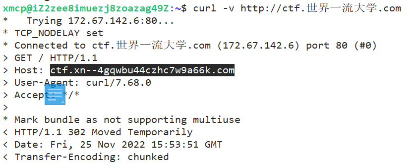

顺便一提域名的这种编码方式叫做 [Punycode](https://en.wikipedia.org/wiki/Punycode)。

虽然访问这个网址会跳转到比赛平台，但也不能写 geekgame.pku.edu.cn，因为跳转之后就不是**向该主机**发送的 HTTP 请求了。

> 北京大学某实验室曾开发了一个叫 gStore 的数据库软件。最早描述该软件的论文的 DOI 编号是多少？（此问命题人：debugger）

答案是 `10.14778/2002974.2002976`。

就是这一篇论文：

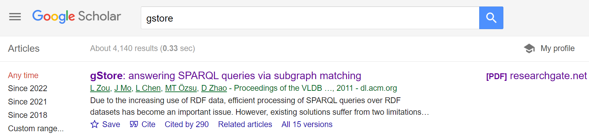

_debugger注：DOI号在[上面搜索结果的URL](https://dl.acm.org/doi/10.14778/2002974.2002976)里面（P.S. 从该链接访问论文的内容需要ACMDL的订阅）。你可以在gStore的[官方文档](https://raw.githubusercontent.com/pkumod/gStore/1.0/docs/help/gStore_help_ZH.pdf)或者[主页](http://www.gstore.cn/pcsite/index.html#/patent)上找到这篇论文，后者还有论文的PDF（VLDB主页和ResearchGate也有论文的PDF），但是在PDF里面没有论文的DOI号，你可以再到搜索引擎里面搜该论文标题，从而得到上面的链接。_

> 在第一届 PKU GeekGame 比赛的题目《电子游戏概论》中，通过第 {pygame_lv} 级关卡需要多少金钱？（此问命题人：debugger）
>
> （其中 pygame_lv 介于 5 到 14 之间）

答案是 `300+int(level**1.5)*100`。

相关源码可以在 [第一届比赛的题目存档](https://github.com/PKU-GeekGame/geekgame-1st/blob/master/src/pygame/game/server/libtreasure.py#L19) 中找到。可能不太好找，但确实能找到。

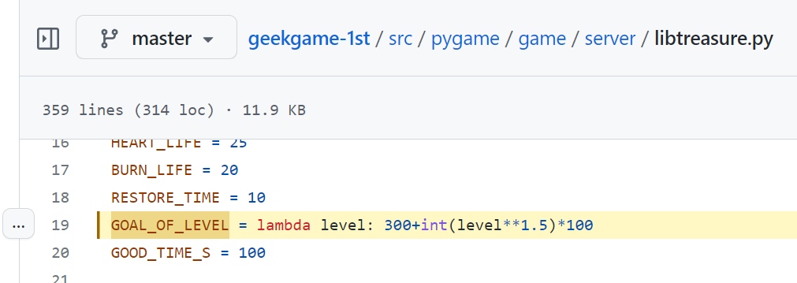

本题题目是动态的，因此你需要用 pwntools 稍微解析一下题目问的数字是什么。

> 支持 WebP 图片格式的最早 Firefox 版本是多少？（此问命题人：debugger）

答案是 `65`。

在 [MDN 文档](https://developer.mozilla.org/en-US/docs/Web/Media/Formats/Image_types#webp_image) 里可以找到。

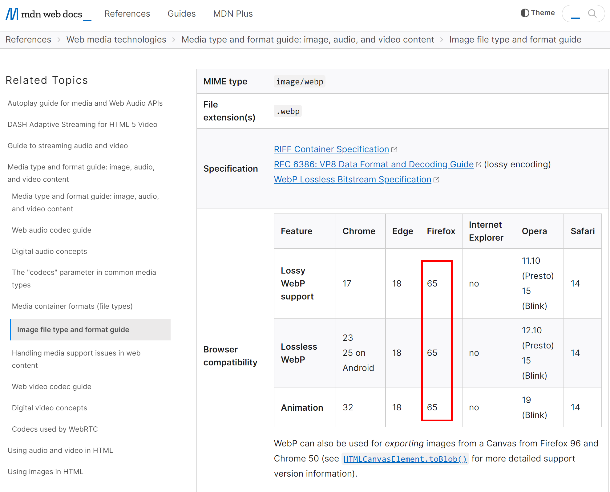

_debugger注：更方便的方法是用[caniuse](https://caniuse.com/?search=webp)。此外，[维基百科的WebP条目](https://en.wikipedia.org/wiki/WebP)也有相关信息。_

> 每个 Android 软件都有唯一的包名。北京大学课外锻炼使用的最新版 PKU Runner 软件的包名是什么？（此问命题人：xmcp、刘肖）

答案是 `cn.edu.pku.pkurunner`。

首先在网上搜索 PKURunner。

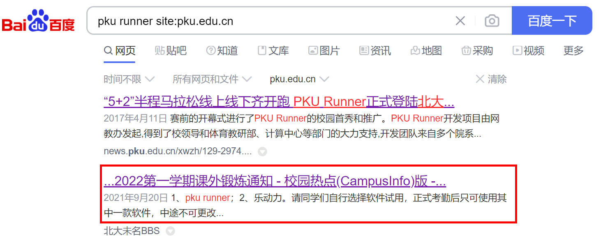

然后找到官网。

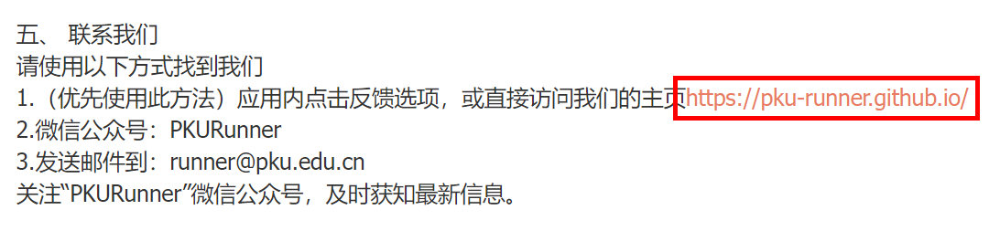

然后下载 APK。

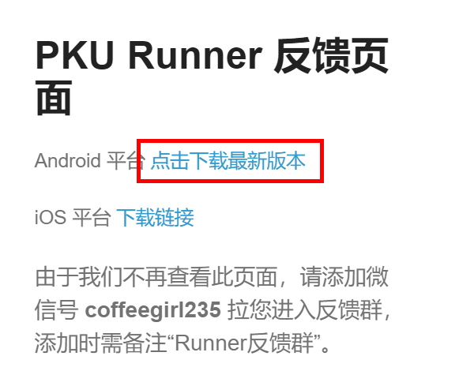

接下来[看看文档](https://developer.android.com/studio/build/application-id#change_the_package_name)，发现 Android 软件的包名在 `AndroidManifest.xml` 里面的 `package` 属性里。

于是把 APK 解压一下，找到 `AndroidManifest.xml` 搜索 `package`。

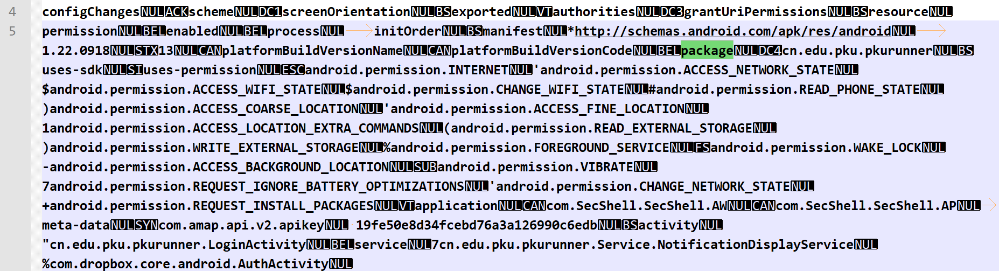

> 我有一个朋友在美国，他无线路由器的 MAC 地址是 d2:94:35:21:42:43。请问他所在地的邮编是多少？（此问命题人：xmcp）

答案是 `80304`。

这题考察的是 [Wi-Fi positioning system](https://en.wikipedia.org/wiki/Wi-Fi_positioning_system)。很多科技公司为了提高定位的速度，都维护了世界上各种路由器 MAC 地址（即 BSSID）到经纬度的映射。这样一来手机就不需要持续打开 GPS，可以直接根据附近 WiFi 信息来计算出自己的大致位置。非蜂窝版 iPad 在联网后能显示位置也是出于这个系统。这些信息当然是由用户自动上传的，所以这个系统从用户隐私的角度确实存在一些小问题。

本题给出的 MAC 在验题时同时存在于 WiGLE 和苹果的数据库，其中 WiGLE 是用谷歌搜索相关关键词之后很容易找到的一个免费数据库。

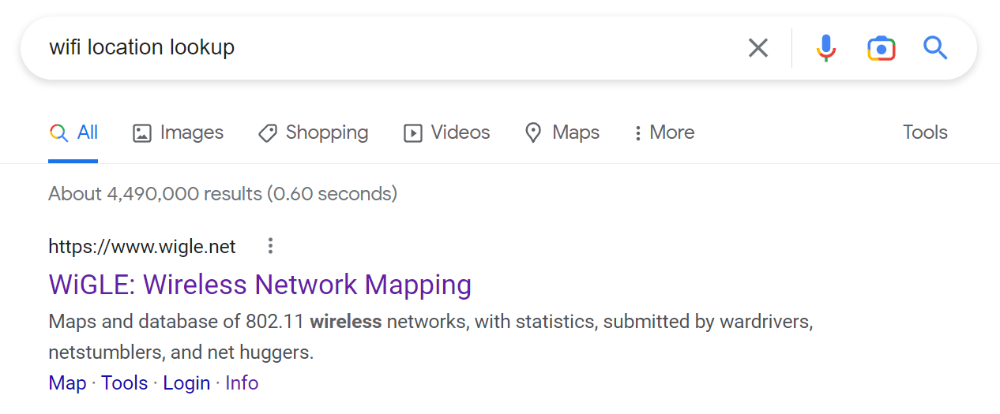

在 WiGLE 里输入这个 MAC 地址，或者直接使用它的 API，即可得到答案。

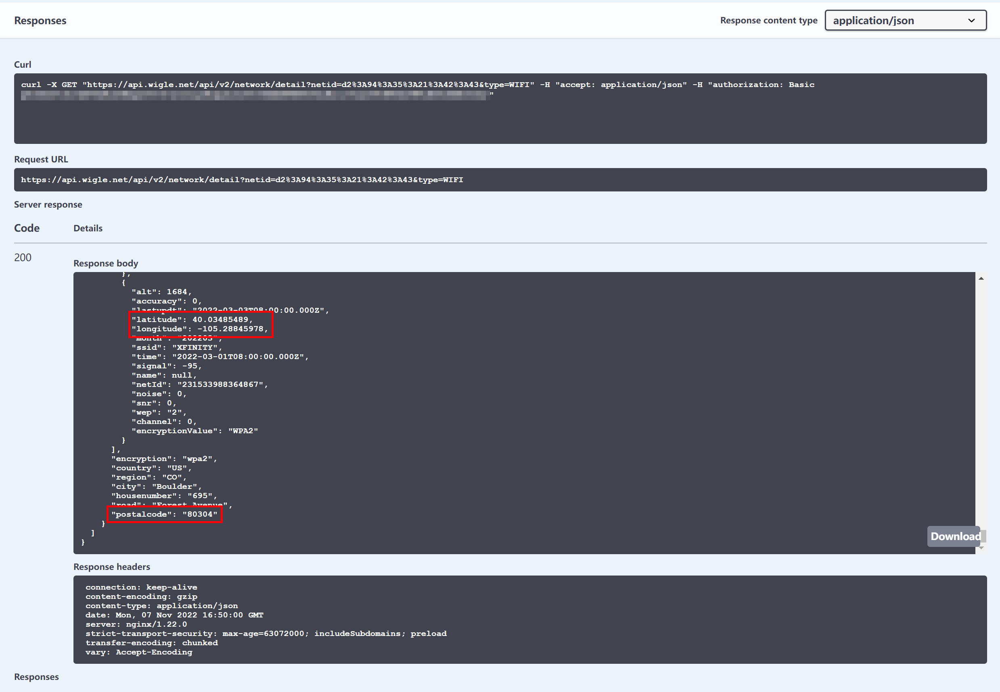

使用苹果的 API 也可以。虽然苹果没有公开他们的 API，但是在 GitHub 上能搜到不少。

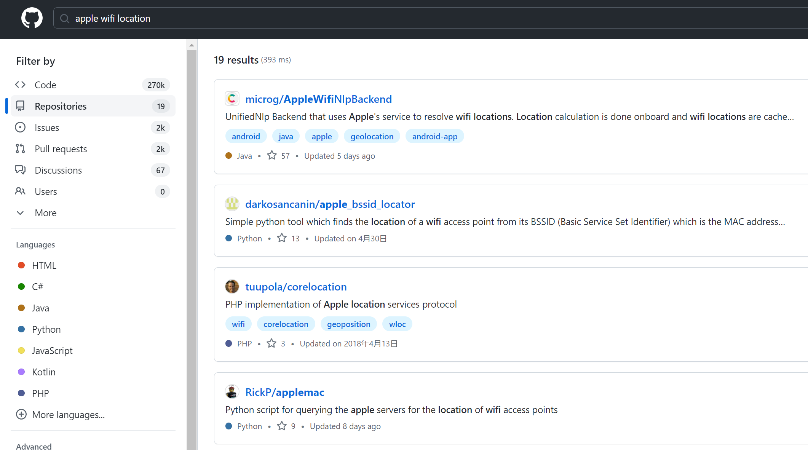

如果你使用苹果的 API，可能遇到以下两个问题。第一个问题是有些脚本写得很粗糙，比如 [GONZOsint/geowifi](https://github.com/GONZOsint/geowifi) 在解析经纬度的时候直接粗暴地在字符串的两位之后添加小数点。

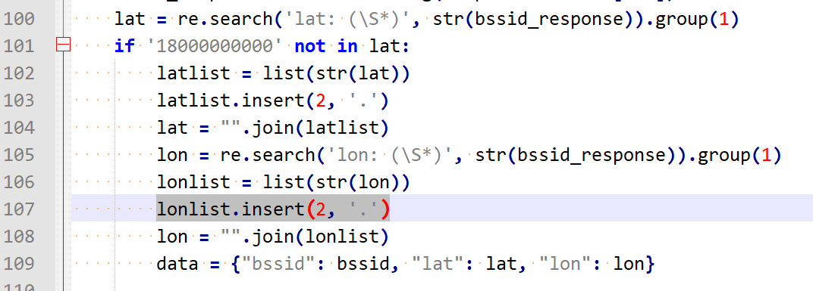

因此，本题的经纬度（`-105.xxx`）就会被错误地解析成 `-1.05xxx`，直接跑出美国了。如果你不幸使用了这个脚本，需要给它 debug 一下。

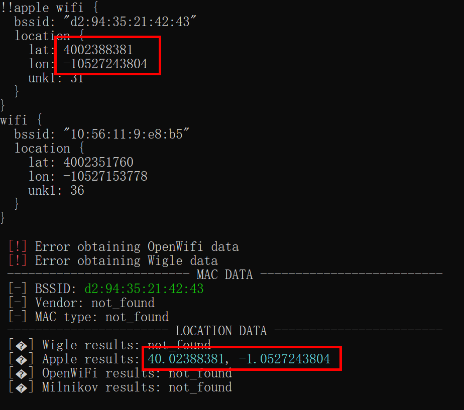

另一个问题是在比赛开始之后的一段时间，这个 BSSID 就从苹果的数据库里消失了。可能是因为查询人数太多，触发了苹果的一些保护措施。所以用 WiGLE 查是比较稳妥的。当然也有一些其他的查询服务，但他们大多都不提供公众免费查询服务。

> 视频 bilibili.com/video/BV1EV411s7vu 也可以通过 bilibili.com/video/av_____ 访问。下划线内应填什么数字？（此问命题人：debugger）

答案是 `418645518`。

[在知乎上](https://www.zhihu.com/question/381784377/answer/1099438784)可以找到 mcfx 对于 BV→AV 号的换算算法，直接抄过来跑一下就行。

当然，不抄也可以，直接在 B 站的网页里有多种渠道能看到 AV 号。比如，点击视频下方的分享。

再点击嵌入代码，即可在链接里找到 `aid=418645518`。

> 我刚刚在脑海中想了一个介于 {prime_range_lower} 到 {prime_range_upper} 之间的质数。猜猜它是多少？（此问命题人：xmcp）
>
> （其中 prime_range_lower 和 prime_range_upper 在 9000000000 到 9990000000 之间，且范围内有 8 个质数）

这题没有固定的答案，用 sympy 枚举一下范围内的质数，然后随机提交其中的一个，有 1/8 的几率解出本题。

在上述 8 个题中，每次会随机抽出其中一道，保留其余 7 道。其中询问质数的题目被抽出的概率是 2/9，其他题目是 1/9。

因此，如果你前面 7 道题都会做，解出所有答案的概率是 2/9 + 7/9/8 = 0.32。如果前面 7 道题有一道不会做，解出所有答案的概率是 1/9/8 = 0.0139。由于每十秒钟可以连接一次，挂机跑一段时间就能出 Flag 了。

## 命题花絮

询问 MAC 地址位置那道题确实是我找在美国的同学问到的。

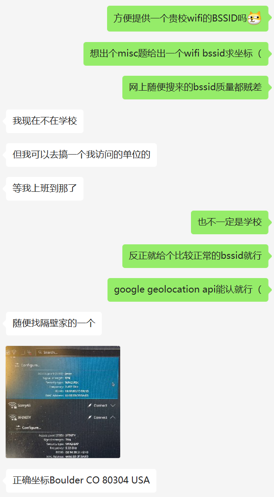

在比赛开始之后这个 MAC 地址从苹果的数据库里消失了，是没有预料到的一处失误。当时评估了一下影响，因为 1) WiGLE 数据库里仍然能查到这个地址 2) 放弃这道题也能出 Flag，所以认为这个失误不影响解题，就没有改题。在第二阶段的时候就果断公布了这个问题的正确答案。看来用线上系统出题果然还是比较容易翻车的。

另外 BV 转 AV 号的题目，本来是维护了一个 BV 号的列表，每次在里面随机抽取的。但是因为 Misc 题目已经比较多，本题最后被分到了 Tutorial 分类，为了使本题难度符合 Tutorial 这个名字，就改成了固定选取一个 BV 号。

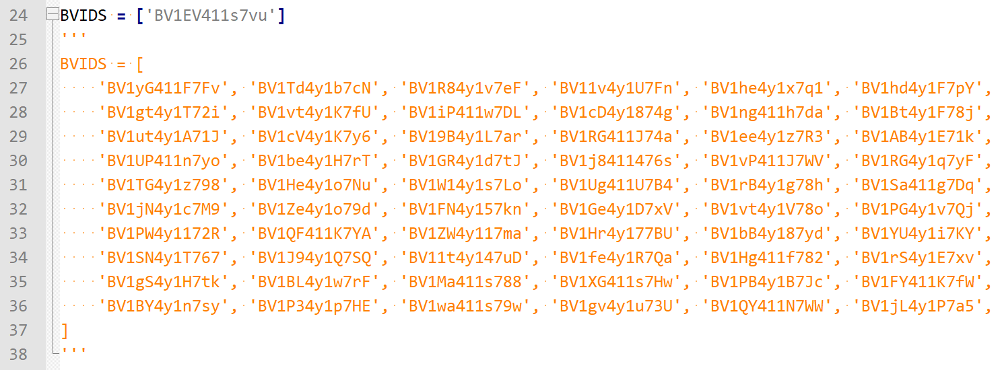
