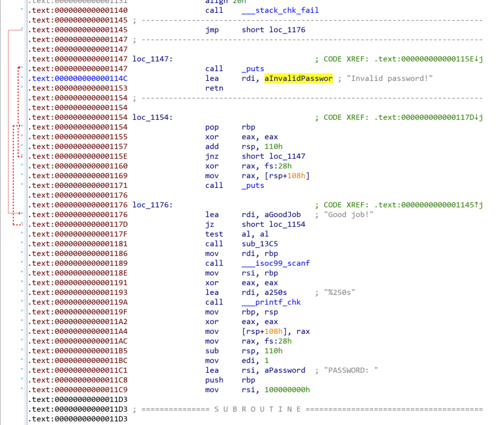
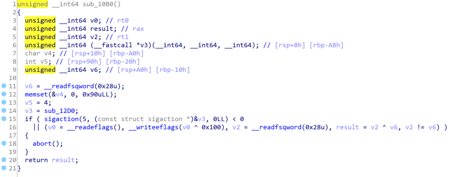
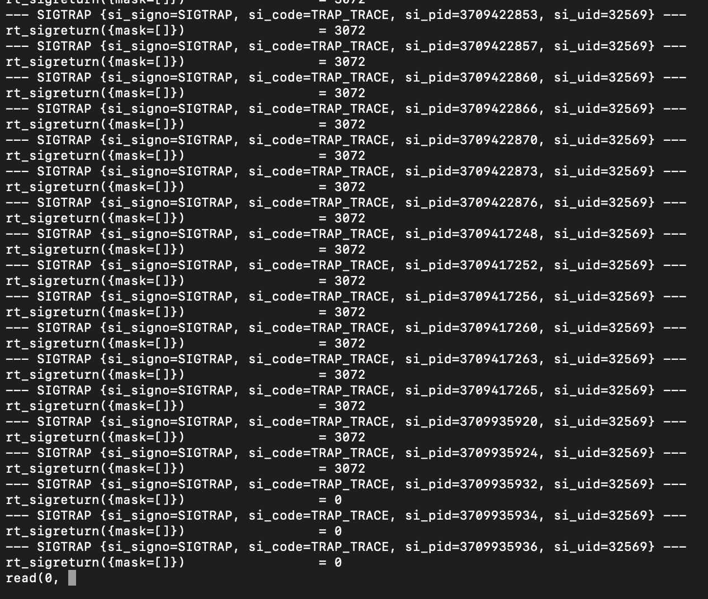

# [Binary] TTOWRSS

- 命题人：MaxXing
- 题目分值：350 分

## 题目描述

<p>不知所云的标题，但，看到它的第一眼时，我就被击穿了——</p>
<p>仿佛听到内心深处的呼喊，然后强烈地为之着迷。</p>
<p>去了解祂，愈深入，愈病态，像信徒被神谕所蛊惑。</p>
<p>易拉罐的金属——铝铸造成鄙视链；或是用来铸币，收买谁的灵魂。</p>
<p>那些游离于世俗之外的，语言、画面、情绪。直至，我发现自己已无法从中脱身。</p>
<p>呃呃，所以谁能告诉我这个程序要输什么密码才能通过啊？</p>
<div class="well">
<p><strong>第二阶段提示：</strong></p>
<ul>
<li>在 Linux 环境中，挂一个 GDB 跑跑这个程序，发生了什么现象？</li>
<li>Linux 中，什么机制可以处理这种现象？程序中对应的处理函数是什么？</li>
<li>这个函数会修改 <code>x86-64</code> 架构下的 <code>rip</code> 寄存器。</li>
<li>从这个函数入手，尝试分析程序从执行 <code>main</code> 函数开始到 <code>main</code> 返回前的行为。</li>
</ul>
</div>

**[【附件：下载题目附件（prob22-crackme）】](attachment/prob22-crackme)**

## 预期解法

拿到程序之后先运行:

```
$ ./prob22-crackme
PASSWORD:
```

看起来确实要输入一个密码, 随便输点什么, 回车之后会出现 “Invalid password!”.

打开 IDA, 找到程序里 “PASSWORD: ” 和 “Invalid password!” 两个字符串, 可以看到他们出现在了某段代码里, 但这段代码并没有被识别成函数, 而且看起来逻辑也很奇怪.



继续看看能被 IDA 识别且看起来有意义的函数, 发现 `sub_10B0` 调用 `sigaction` 注册了一个 signal handler, handler 为 `sub_12D0`:



`sigaction` 函数的第一个参数为 `signum`, 即需要被 handler 处理的信号的类型. 查阅相关[资料](https://www-uxsup.csx.cam.ac.uk/courses/moved.Building/signals.pdf)/[源代码](https://elixir.bootlin.com/glibc/latest/source/bits/signum-generic.h#L58)得知, `5` 代表的是 `SIGTRAP`.

同时我们注意到, 执行完 `sigaction` 之后, `sub_10B0` 使用 `__readeflags` (实为 `pushfq` 指令) 和 `__writeeflags` (实为 `popfq` 指令) 翻转了 `eflags` 寄存器的第 8 位.

查阅相关[资料](https://en.wikipedia.org/wiki/FLAGS_register)得知, 这一位为 `TF`, 即 “trap flag”. `TF` 置位时, 程序每执行一条指令, 就会触发一次 “trap”, 即单步执行. 此时 Linux 会告知程序发生了 `SIGTRAP`, 并进入对应的 handler 处理信号.

也就是说, 程序在执行完 `sub_10B0` 函数过后, 每执行一条指令, 程序就会触发一次 `SIGTRAP`, 同时 signal handler `sub_12D0` 就会被执行一次.

为了验证这一思路是否正确, 我们可以用 `strace` 跟踪下程序:



捅了 `SIGTRAP` 窝了, 看起来我们的推理没什么问题.

`sub_12D0` 刚好也能被 IDA 正确识别并反编译. 需要注意的是, 作为一个 signal handler, `sub_12D0` 是有参数的, 而且它确实用到了自己的参数. 关于 signal handler 参数的详细定义可以参考[手册](https://man7.org/linux/man-pages/man2/sigaction.2.html)以及[源代码](https://elixir.bootlin.com/glibc/latest/source/sysdeps/unix/sysv/linux/x86/sys/ucontext.h).

简单梳理一下其中的逻辑, 我们可以得出如下的伪代码:

```c
text_start = 0x1098;  // .text 段的起始地址
text_end = 0x1445;  // .text 段的结束地址
bitmap = 0x40e0;  // bitmap 的地址
if (text_start <= rip && rip < text_end) {  // 如果 rip 位于 .text 段内
  text_offset = rip - text_start;  // 计算当前指令相对 .text 段的偏移
  if (bittest(bitmap[text_offset / 8], text_offset % 8)) {  // 如果 bitmap 里对应位为 1
    counter = 0;
    i = rip - 1, j = text_offset - 1;
    while (counter != 2) {  // 从当前位开始, 找到 bitmap 里倒数第二个为 1 的位
      counter += (bitmap[j / 8] >> (j % 8)) & 1;
      i--, j--;
    }
    rip = i + 1;  // 把 rip 更新成找到的位对应的地址
  }
}
```

可以发现, 在执行 `.text` 段的代码时, handler 会在一个 bitmap 里查找当前指令对应的位, 并且接着往回找, 找到从当前指令往前数的第二个位, 并将 `rip` 寄存器更新为这一位对应的地址.

看起来 bitmap 的内容和程序里指令的地址有关, 我们不妨写个脚本把 bitmap 对应的地址读出来:

```py
with open('prob22-crackme', 'rb') as f:
  bitmap = f.read()[0x30e0:]
  for i in range(0x1445 - 0x1098):
    if (bitmap[(i // 8)] >> (i % 8)) & 1:
      print(hex(i + 0x1098))
```

对照发现, 输出的内容刚好对应了 IDA 里两段无法识别的代码中, 每条指令的起始地址.

由此我们看出, 这个 bitmap 的作用是标记指令的起始地址. 而 signal handler 所做的事情, 是在每次要执行下一条指令之前, 把 `rip` 设置到这条指令的上上一条指令处——也就是说, 让程序倒序执行!

此时再回过头看刚刚两段被 IDA 标红的代码: 确实, 如果倒着理解的话, 整个的逻辑就说得通了. 按照这样的思路, 人肉反编译, 我们可以整理出程序的逻辑:

```c
int *table1 = (int *)0x4020;
short *table2 = (short *)0x2040;
char *table3 = (char *)0x20a0;
int check_flag(char *flag) {
  int i = 0;
  for (;;) {
    char c = flag[i];
    if ((c == 0) != (table1[i] < 0)) return 0;
    if (c == 0) break;
    if (c != (table2[table1[i] ^ table3[table1[i]]] & 0x7F)) return 0;
    i++;
  }
  return 1;
}
```

据此即可得到 flag.

## 相关实现

参考 [`src` 目录](src), 附自动化生成任意类似程序的脚本.

## 花絮

题目标题 TTOWRSS 实际代表 “The Truth Of What Rice Shower Said”, 即:

> 米浴说的道理~

主要是因为这个题里的程序是倒序执行的, 这让我想起了倒放.

在决定要用这个思路出题的几天后, 我终于搞出了一个能跑的原型, 于是晚上把它发到出题组群里……

结果第二天上午就被 [@lrh2000](https://github.com/lrh2000/) 逆出来了.
