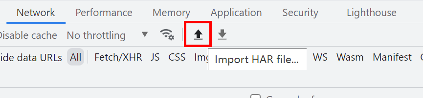

# [Web] 企鹅文档

- 命题人：xmcp
- 题目分值：300 分

## 题目描述

<blockquote>

在一个开源软件学术大会上，主持人突然说：下面请认为无代码开发会减少安全漏洞的同志坐到会场左边，认为无代码开发会增加安全漏洞的同志坐到会场右边。

大部分人坐到了左边，少数人坐到右边，只有 You 酱还坐在中间不动。

主持人：侑同志，你到底认为无代码开发会减少还是增加漏洞？

回答：我认为无代码开发会减少原来存在的漏洞，但是会带来很多新的漏洞。

主持人慌忙说：那请您赶快坐到主席台上来。

</blockquote>

企鹅文档相信大家都很熟悉，它是企鹅公司久负盛名的在线文档编辑平台。但是基于企鹅文档的无代码 OA 系统是怎么回事呢？下面就让小编带大家一起了解吧。

基于企鹅文档的无代码 OA 系统，其实就是用企鹅文档来实现 OA 系统。很多企业、学校、组织之前使用 OA 系统来下发通知和填报报表，现在这些机构很多都转向了使用企鹅文档来下发通知和填报报表，当然可以选择问卷星这些类似的服务。

大家可能会感到惊讶，用企鹅文档来填报报表不会出现安全和隐私问题吗？但事实就是这样，小编也感到非常惊讶。

那么这就是基于企鹅文档的无代码 OA 系统了，大家有没有觉得很神奇呢？快快点击左下角的阅读原文来看看基于企鹅文档的无代码 OA 系统吧。

<strong>第二阶段提示：</strong>

<ul>
<li>本题其实是一道流量分析题。</li>
<li>在 Chrome 开发者工具的 Network 功能中，点击放大镜按钮可以搜索流量中的内容。</li>
</ul>

**【网页链接：访问企鹅文档】**

**[【隐藏附件：kAiQcWHobsBzRJEs_next.7z】](attachment/kAiQcWHobsBzRJEs_next.7z)**

## 预期解法

点击链接访问到的是一个腾讯文档的共享表格。

中间的这些单元格显示没有查看权限。

真的是这样的吗？我们打开 Chrome DevTools 的 Network 工具，直接进行一个搜索。

发现受到保护的内容其实完全就在流量里，只是前端不予展示。直接把链接复制出来，访问即可下载第二关附件。唯一一点需要注意的就是链接实际上前一半和后一半位于不同的响应里，如果你只找到了一个响应那是不全的，这一点通过观察表格行号不难发现。

或者也可以使用已有的下载腾讯文档的轮子，比如有一些选手用了 [kuloPo/TencentDocDownload](https://github.com/kuloPo/TencentDocDownload)。

下载到一个 HAR 文件，可以导入到 Chrome DevTools 里。

导入之后我们故技重施，继续搜索流量内容。

发现后面有很多奇怪的数字。根据提示中的截图，表格共有 11 列，把这些数字视作单元格编号（即 x%11 是列号，x/11 是行号）的话恰好能跟提示截图里面的涂黑单元格对上。因此可以推测出腾讯文档使用这种方式标记出了哪些单元格具有被涂黑的样式。

然后写一个脚本把字符画给可视化出来即可看出 Flag。我写的脚本在 `sol/solve.py`。

如果你想要一个不那么脑洞的解法，可以尝试流量重放，即自己打开一个长得差不多的腾讯文档，然后抓包把腾讯返回的响应改成 HAR 里记录到的内容。这样就能直接在网页里看到同样的效果。有一些选手是这么做的，但我感觉直接猜出数字的含义要比流量重放更简单一些。

## 命题花絮

本题的命题动机是现在很多人都在用腾讯文档或者问卷星这种在线服务收集敏感信息。经常能在群里看到一条消息【@所有人 请在XX点之前填写《壹壹肆伍壹肆登记表》 https://docs.qq.com/sheet/XXXXXX】。点开一看，好家伙，姓名、住址、身份证号全都要填。

这样安全吗？不安全，但大家都在这么做。仔细想想 GeekGame 比赛结束之后也用问卷星来收集选手反馈，里面虽然没有身份证号，但要说敏感信息也不是完全没有。这种场景感觉有点可悲，遂拿来出一道题。

第二关涉及到了腾讯文档查看 “修订记录” 的功能，这对应着现实中的一种攻击场景：

- 受害者将含有大量隐私信息的 Excel 文件导入到腾讯文档
- 受害者在文档中删除了含有隐私信息的列
- 受害者将文档共享给他人：“请填写《壹壹肆伍壹肆登记表》https://docs.qq.com/sheet/XXXXXX”
- 攻击者打开文档，点击 “修订记录”
- 攻击者看到了受害者导入的隐私信息

本来是想直接考察这个点的，但是发现查看修订记录需要有修改文档权限，直接出成题肯定会被选手搅屎。于是没有什么特别好的办法，只能改造成一道流量分析题了。

有选手质疑了一下本题要求攻击腾讯的在线系统是否合适，以及是否与《诚信比赛须知》里的 “不得攻击其他系统” 矛盾，这个问题我在出题的时候也想到了，但是本题实际上所有解题过程都是对着流量嗯看，与正常访问行为没有任何差异，所以我认为按理说不属于攻击腾讯的系统。不过比赛规模做大了之后确实得多注意一下这些问题。

如果腾讯在比赛的几天之内直接更新了网站把这个洞修了确实比较难办，如果真的发生了我可能会考虑直接放出 HAR 文件（即只保留第二关）。这也是为什么本题没有设置成两个 Flag，因为要给这个应急措施留个后手。