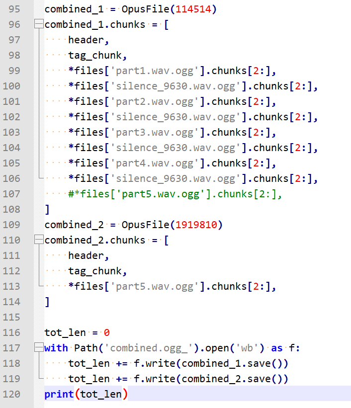

# [Misc] 我用108天录了个音

- 命题人：xmcp
- 一吨重的奖章：300 分
- 两吨重的奖章：200 分

## 题目描述

<blockquote>
<p>嘎嘎~ 机械~ 嘎嘎~</p>
<p><em>—— 吵闹的机械装置</em></p>
</blockquote>
<p>在 22022 年，一种让皮肤迅速坏死的疾病在城市间肆虐，无人维护的电厂、铁路等等现代设施逐渐停止运转。一时间人类文明危在旦夕。</p>
<p>一支担负着拯救人类之重任的远征队决定前往两万年前被废弃的约霍·翰普金斯医院，寻找这种疾病的解药。
远征队在医院储藏室的角落发现了一个触屏机械装置，旁边的标签诉说着它的神奇功效：【道具名称】iCure by Apple$oft 【道具效果】大幅提升解药研发进度。一时间人类文明不再危在旦夕。</p>
<p>这个装置使用了先进的 Voice ID 技术通过语音识别来验证身份，而机主设置的【荷语言】已经失传很久了，队员们反复尝试都不能通过 Voice ID 验证。
iCure 的电量逐渐下降，眼看就要关机，而队员们手头也没有携带兼容 iCure 的 Thundering 充电线缆。一时间人类文明再度危在旦夕。</p>
<p>情急之下，队员们通过速度可达 800mbps（毫比特每秒）的 5G 通信连线到了荷语言专家——也就是你，希望你能够提供一段荷语言的录音文件来通过 Voice ID 的验证。
由于 iCure 的电池已经无法支撑太长时间，<strong>你提供的录音时间应该尽可能短</strong>；由于 22022 年的 5G 频谱资源珍贵，<strong>你提供的录音文件应该尽可能小</strong>。</p>
<p>作为拯救人类文明的酬谢，队员们可以把在储藏室挖掘出的一吨重的奖章赠予你。</p>
<p><strong>补充说明：</strong></p>
<ul>
<li>根据<a target="_blank" rel="noopener noreferrer" href="https://cloud.tencent.com/document/product/1093/46740">腾讯云的相关文档</a>，音频应该编码成单声道 8000Hz 采样率，否则效果不佳。</li>
<li>为了让文件大小不超过 8192 字节，需要选择一种在极低码率（&lt;8kbps）下效果尚可的编码，并仔细调整不同部分的压制参数。出题人编码五句话分别用了 1.6KB、0.8KB、0.8KB、0.8KB、1.2KB。每处静音段用了 0.5KB。</li>
<li>本题限制提交 200 次是为了防止滥用 API。正常解题的选手如果用完了限额可以在选手群联系 xmcp 重新补充。</li>
</ul>
<div class="well">
<p><strong>第二阶段提示：</strong></p>
<ul>
<li>可以使用<strong>不同的参数</strong>压制每个片段再合并起来，使得识别结果无误的部分有更低的码率和更快的语速。</li>
<li>一个 .ogg 文件可以存储多段音频流。ffprobe 遇到这种文件会发生什么？</li>
<li>题目要求在各方面都稍微放松了一些：对文件大小的要求从 8192 字节放宽到了 12288 字节，对句子间隔时间的要求从 9.8 ~ 10.2s 放宽到了 9.5 ~ 10.5s，提交次数限制上调到 400 次。</li>
</ul>
</div>

**【网页链接：访问题目网页】**

**[【附件：下载题目源码（prob02-src.zip）】](attachment/prob02-src.zip)**

## 预期解法

首先看一下题目要求、


（这里 12288 字节是第二阶段的放宽后的限制，第一阶段要求是 8192 字节）

要完全解出两个 Flag 的话，需要做到以下三点：1) 构造一段腾讯云 ASR 能识别出来的语音；2) 把它压缩到特别小（不超过 8192B）的程度；3) 让 ffprobe 显示错误的时长。

先说如何构造语音。在 22022 年显然我们不应该自己录音，可以像营销号那样直接用 AI 配音，这样从发音标准程度和信噪比角度来讲都爆杀录音。比如说，可以试试 [腾讯自家的 TTS](https://cloud.tencent.com/product/tts)。我试了一下这个默认的女声效果就不错，语速和音量我们都尽量拉高来减轻后续压缩工作的负担。


丢进 Audition 里调一下时间轴（自由软件的信徒们当然也可以用 Audacity），确保每两句话的间隔在 10s 附近，然后按腾讯的要求导出成 8000Hz 单声道 WAV，上传上去就可以了。

如果个别单词识别出错，可以换几个声源，总有一个能识别出来（目测女声识别准确率比男声高很多）。如果你发现识别效果特别差，请检查是不是采样率弄错了。

再说如何压缩它。首先要选择正确的音频格式。在题目支持的所有格式里面，WAV 和 PCM 首先排除，因为它们根本不压缩。M4A 和 AAC 是一样的，所以排除。现在只剩 OGG-Opus（OGG是封装格式、Opus是编码格式）、MP3 和 AAC 要三选一。[在维基百科上](https://en.wikipedia.org/wiki/Audio_coding_format) 有一个对比（如下图），这些编码里 Opus 是极低码率下效果最好的，而且 “several blind listening tests have ranked it higher-quality than any other standard audio format at any given bitrate until transparency is reached, including MP3, AAC, and HE-AAC.” 所以在这一步我们理应选择 Opus，如果你选了 MP3 或者 AAC 那肯定是很吃亏的。也有人选了 OGG-Vorbis，它的效果也不太行，还不如 AAC。


确定了格式是 Opus 之后，我们还需要找一个编码器。我们直接使用官方编码器 `opusenc`，它支持动态码率（`--vbr`，这是默认打开的参数），按理说可以让语音段有比较高的码率、静音段有比较低的码率。但如果直接用 `--bitrate 8`（表示平均码率是 8kbps 的 VBR）编码整段音频的话，发现效果并不好，语音段确实有大约 8kbps 的码率，但静音段的码率也有足足 3kbps：


（这里 foobar2000 显示的采样率是 48000Hz，其实文件的采样率就是 8000Hz 没有问题，但是声卡不支持 8000Hz，所以在播放时进行了转换）

如果静音段码率有 3kbps 的话，一共 40s 的静音部分就要占据 3/8*40 = 15KB 的空间，这显然是我们负担不起的。因此我们需要**分别编码语音段和静音段，给静音段设置一个极低的码率，后期再把它们合并起来**。

先在 Audition 里把五段语音和静音段分别切出来：


然后看看静音段码率能凹到多低。我们先试试 1bps：


啊这，opusenc 它不仅拒绝工作，还骂我的参数写得惨无人道（insane）。不过作为开源软件，我们直接下载源码，然后把判断逻辑改掉就完事：


顺便我们注意到还有一个参数 `--framesize` 也会影响到文件大小，Opus 格式最大支持 120ms，但 opusenc 只支持到 60ms，使得文件尺寸并非最优。我们也进行一个简单的修改：


然后就可以用 `--bitrate .001 --framesize 120` 参数愉快地编码了：

可以看到，如此编码后的 10s 静音段排除掉 OGG 文件头只有 512 字节，非常的清真：


然后剩下五处语音段我们就正常编码。我用的参数如下：

```shell
opusenc --bitrate 10 --speech --framesize 60 --padding 0 part1.wav part1.wav.ogg
opusenc --bitrate 5 --speech --framesize 60 --padding 0 part2.wav part2.wav.ogg
opusenc --bitrate 7 --speech --framesize 60 --padding 0 part3.wav part3.wav.ogg
opusenc --bitrate 5 --speech --framesize 60 --padding 0 part4.wav part4.wav.ogg
opusenc --bitrate 5 --speech --framesize 60 --padding 0 part5.wav part5.wav.ogg
```

以上码率是可以手工调节的，即发现腾讯云 ASR 对哪句话识别效果好就调低一点，识别效果不好就调高一点（或者用更慢的语速重新生成一下 WAV）。

现在我们拿到了每段语音，总大小约 7KB，符合题目要求。然后 [学习一下 OGG 的容器格式](https://xiph.org/ogg/doc/oggstream.html)，写一个脚本把这些音频流合起来就可以了。注意要把多余的 `OpusTags` 头删除掉，不然它会占用好几百个字节的空间。我写了一个这样的脚本，在 `sol/combiner.py`。把合并好的文件提交上去，如果腾讯云识别正确就能得到 Flag 1，如果识别错误就回去调整码率或者 TTS 语速，我试两三次就没问题了。

最后一步是让 `ffprobe` 显示错误的时长。在上一步学习 OGG 容器格式的时候，发现 OGG 支持 Multiplex，即一个文件其实能包装多段音频流。而 ffprobe 只会显示其中最后一段音频流的时长。因此，我们对脚本进行一个修改，使得它将两段序列号不同的音频流输出到 OGG 文件里：



这里第一段音频流包含前四句和各自后续的静音段，第二段音频流只包括 `part5.wav.ogg` 的内容，时长只有两秒。ffprobe 只会输出第二段音频流的两秒作为整个文件的时长。把这个文件提交一下即可获得 Flag 2。最终 Payload 的文件大小是 7326 字节，按理说凹一下还可以更小一些（因为后面的码率都是我随便设的，没仔细调）。

最终构造出的音频在 `sol/solution_flag1.ogg` 和 `sol/solution_flag2.ogg_`。

最后强调一下，由于本题 8192 字节的限制并不是非常紧张，因此修改 opusenc 源码的步骤是非必需的。有选手并没有改源码，直接用原程序就支持的 `opusenc --bitrate 0.5 --framesize 60` 参数去编码静音段，然后凹了一下其余部分的码率，也做到了 8192 字节以内。

## 仅能解出 Flag 1 的解法

此题如果你没打算出 Flag 2，想直接拿 Flag 1 跑路的话，并不需要了解 OGG 文件格式，直接想办法把音频时长凹进 30s 即可。我们发现对于 AAC 音频，ffprobe 会读取之前几秒的音频数据并根据文件大小和前几秒的平均码率估算出时长。也就是说，如果前几秒的码率很高而后面的码率很低，ffprobe 就会估算出一个很短的时长；反之，如果前几秒的码率很低而后面的码率很高，ffprobe 就会估算出一个很长的时长。

所以可以选择放弃压缩到 8192 字节这个要求，直接用 AAC 搞出前面码率很高、后面码率很低的文件，这样可以拿到 Flag 1。

然而 ffprobe 似乎对于 OGG-Opus 音频总是会完整读取整个文件然后计算出总时长，没仔细看源码，但反正我没法通过变化码率在 OGG-Opus 格式下成功糊弄 ffprobe。所以如果想拿 Flag 2 还是得用上面提到的办法去整多段音频流。

在比赛里，有很多选手发现直接把文件后缀进行一个修改（比如 .mp3 改 .aac）有概率能让 ffprobe 识别出错误的时长，且让腾讯云 API 有一定概率能正常识别。这并不是预期解，不过感觉这种思路也有点意思。详见相关选手 Writeup。

## 命题花絮

这题好像被喷的很惨，很多选手都表示腾讯云的 ASR 识别结果太拉，实在没法把文件压缩到 8KB，很影响自己的解题体验。总之先谢罪（

我仔细想了想，原因可能在于本题对选手**技术选型的能力**要求远超其他题目。也就是说，选手要想流畅地做出 Flag 2，需要：

- 认识到应该使用 AI 配音而不是自己录音
- 认识到应该使用识别效果好的女声模型
- 认识到语速应该尽可能快
- 认识到应该编码成 8000Hz 单声道音频
- 认识到要在几种格式中选择 OGG-Opus
- 认识到应该使用 opusenc 编码器
- 认识到应该使用不同的编码参数分开编码几段文件
- 认识到识别结果不佳时应该逐段调整码率和语速
- ……

单看上述选择来说，每一项都是很合理的，因为这样做确实能在减小文件大小的前提下让识别尽量准确。但如果选手在上述这些选择中有一项甚至好几项都步入了误区，比如文件格式选成了 AAC，编码 ogg 文件试图使用 ffmpeg（它编码出来的静音段真是大到离谱），或者音频的语速比较缓慢，那么不管怎么卷都很难压缩进 8KB。此时选手必须意识到自己哪处的选型有误，然后重新做出选择，如果一直在死胡同里重复尝试压缩就会发现腾讯云一会识别对、一会识别错，体验极差。选手需要及时洞察出调整哪个参数是解决问题的关键，<del>这是深度学习研究的必备技能</del>，题目对这方面的引导确实不太够。

谢罪之余，说说这题的命题背景。

“把语音信号高效地数字化”是个很有趣的话题，因为人类语音的特殊性，使用高效的编码算法后，几 kbps （[甚至 700bps](http://www.rowetel.com/?page_id=452)）就足以让语音信号理解起来毫无障碍了。感觉这个知识对许多人来说都很新颖，于是我就研究了几天语音编码，然后出了道题。<del>然后大家都不会做，看来这个知识确实很新颖</del>。

至于通过 VBR 来糊弄音频长度这个 Trick，是源于上学期《日本经济》通选课的期末考试。当时是线上开卷考试，我下载了整个学期的课程录像，然后丢到腾讯云 ASR 去识别，方便考试的时候直接搜索。结果腾讯云直接报错说音频长度超过 5 个小时，然而每段录像实际上都不到 3 个小时。我仔细研究了一下，发现是因为爬下来的录像是 MP4 格式的（其中音频编码是用的 M4A，即 AAC），而且录像的开始时间比实际上课时间要早十分钟左右，因此在录像的前十分钟内老师都没有佩戴话筒，是完全的静音段，码率极低。这样一来任何通过码率估算时长的软件都会给出一个很离谱的结果。
