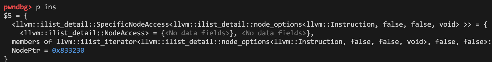
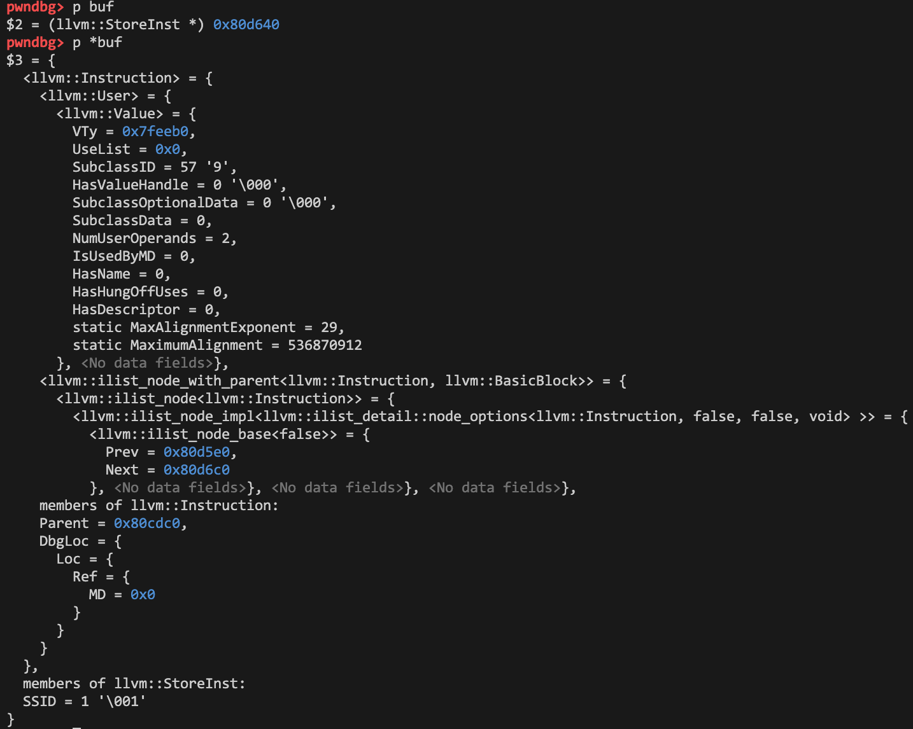

# [Binary] 混淆器

- 命题人：Q1IQ
- 题目分值：500 分

## 题目描述

<p>小Q觉得混淆器很神奇，他想知道控制流平坦化是怎么实现的，于是他从网上找了个开源的混淆器跑了跑。</p>
<p>然而，他发现这个混淆器总会莫名其妙crash，他修了半天也没找到bug在哪里。</p>
<p>为了让这个混淆器发挥剩余价值，小Q一拍脑瓜把它变成了一道菜单题。</p>
<div class="well">
<p><strong>第二阶段提示：</strong></p>
<p>bug在分支指令的处理中。</p>
</div>

**【终端交互：连接到题目】**

**[【附件：下载题目附件（prob12.tar）】](attachment/prob12.tar)**

## 预期解法


### 出题思路

LLVM Pass 原本用于转换和优化 LLVM IR，因为可以处理IR，所以也可以用来做插桩和混淆等。Pass类二进制题目这两年在CTF比赛里越来越常见，网上的例题和教程也越来越多，这类题目两年前还算是压轴难题，而现在已经变成了某种意义上的常规题，所以这次比赛我选择了Pass这个载体来出这道题，对于新手来说无论是Pass技术本身还是Pass类的题目在网上都有一些教程可供参考和学习。

大多数Pass类题目是这样实现的：重写 `runOnFunction`，处理 IR 中具有特定名称的函数，这些函数会事先预留一些漏洞，比如后门、任意地址读写、数组越界读写、整数溢出等等。

最初我的想法是模仿这种模式出一道Pass类的面向新手的题目，于是就想到最简单的模式还是任意地址读写写got表或free_hook，可是各种形式的任意地址读写都已经快被出个遍了。次简单的形式是UAF或者栈溢出漏洞，UAF的难度在于新手可能不了解glibc的堆，栈溢出难度在于Pass只运行一次就结束没有泄露，权衡后我采用的漏洞点是把UAF放在LLVM IR的链表上，于是有了这道题。

### 题解

题面总体上描述了这道题的设计：

[开源的混淆器] 题目中控制流混淆的代码源自于ollvm的[控制流平坦化Pass](https://github.com/obfuscator-llvm/obfuscator/blob/llvm-4.0/lib/Transforms/Obfuscation/Flattening.cpp)，我修改了其中switch-case要用到的随机数的实现，其他部分都是源码。

[bug在哪里] bug埋在分支指令的处理中，位于whatapass.cpp的346行，在处理后继基本块数量大于2的基本块时，释放了一个 `Inst` ，这是一个不正常的释放。编译一个带分支的程序即可触发crash，例如这样：
```C
// poc.c
void m41n(int a)
{
    int b = 1;
    if(b == 3){
        return ;
    }
    return;
}
int main()
{
    return 1;
}
```

```
root@docker-desktop:/pwn/binary_whatapass# clang -emit-llvm -S poc.c -o poc.ll
root@docker-desktop:/pwn/binary_whatapass# ./opt -load ./LLVMWhataPass.so -Whatapass poc.ll -o /dev/null
What a pass! 
Instruction has bogus parent pointer!
Stack dump:
0.      Program arguments: ./opt -load ./LLVMWhataPass.so -Whatapass poc.ll -o /dev/null 
1.      Running pass 'Function Pass Manager' on module 'poc.ll'.
2.      Running pass 'Module Verifier' on function '@m41n'
#0 0x00007ffff42894ff llvm::sys::PrintStackTrace(llvm::raw_ostream&) (/lib/x86_64-linux-gnu/libLLVM-10.so.1+0x9814ff)
#1 0x00007ffff42877b0 llvm::sys::RunSignalHandlers() (/lib/x86_64-linux-gnu/libLLVM-10.so.1+0x97f7b0)
#2 0x00007ffff4289ac5 (/lib/x86_64-linux-gnu/libLLVM-10.so.1+0x981ac5)
#3 0x00007ffff7fb13c0 __restore_rt (/lib/x86_64-linux-gnu/libpthread.so.0+0x153c0)
#4 0x00007ffff43f28e9 (/lib/x86_64-linux-gnu/libLLVM-10.so.1+0xaea8e9)
#5 0x00007ffff426d457 llvm::raw_fd_ostream::write_impl(char const*, unsigned long) (/lib/x86_64-linux-gnu/libLLVM-10.so.1+0x965457)
#6 0x000000000080cc90 
Segmentation fault
```

[菜单题] 题目设计了几个菜单函数：

- `wher3`：分配一个大小不超过0x400的块
- `re4d`：从块中读数据，保存在 vector 里，没有越界
- `wr1te`：向块中写数据，写入的数据可以是IR文件里的立即数，也可以是`re4d`读到的数，没有越界
- `c1ear`：将块 free 掉，此处没有 UAF
- `g1ft`：打开 /flag 读取flag值，用变表 base64 编码 flag，但是没有将结果保存下来
- `p4int`：遍历IR文件的基本块和指令，并打印出它们的地址

注意到遍历基本块和指令时使用的是迭代器，例如遍历指令用的是 `BasicBlock::iterator` ，查看 [`llvm::BasicBlock::iterator`](http://www.few.vu.nl/~lsc300/LLVM/doxygen/classllvm_1_1BasicBlock.html#a1445356b70fbb95acc5e0d3d2ac9101c) 的定义，实际上它等于 [`ilist_iterator`](http://www.few.vu.nl/~lsc300/LLVM/doxygen/classllvm_1_1ilist__iterator.html) ，`ilist_iterator` 的 [++](https://llvm.org/doxygen/ilist__iterator_8h_source.html#l00156) 操作符是重载的，功能是用 `getNext()` 获取下一个节点，因此迭代器遍历的顺序就是链表从前往后的顺序。

```
  156   ilist_iterator &operator++() {
  157     NodePtr = IsReverse ? NodePtr->getPrev() : NodePtr->getNext();
  158     return *this;
  159   }
```

更简单的方法是源码调试，带 `-g` 编译源码，在 `p4int` 函数下断点打印 `ins` ，可以直接看到它的类型是 `llvm::ilist_iterator`。



在346行下断点查看被释放掉的 `Inst`，查看它的 `member`，可以注意到 `Prev` 和 `Next` 指针在其中。



因此解题主要靠两处 UAF ，一处是在调用 `g1ft` 读取并编码 flag 后，保存 flag 内容的块会被释放，通过调试找到它的大小为0x90，用 `wher3` 分配回来，得到的块的前0x10字节会被清空，但是前0x10字节不包含flag内容所以不会影响，flag内容可以用 `re4d` 保存下来用于后续泄露；另一处则是在 `Inst` 被释放后，将其分配回来，使用 `wr1te` 修改它的 `Next` 指针使其内容为flag的某8个字节，则会在遍历并打印指令地址时将其泄露出来，代码见 exp1。

除了将 `Next` 指针篡改为flag的值，也可以改为flag的地址。这种做法稍复杂一些，因为不仅需要先读 `Inst` 的数据拿到堆地址，还需要使拿到的堆地址和 flag 的地址最好在同一块 0x100 的内存里。由于 `Inst` 和 flag 块的内存都是临时申请的，所以具体解法是在申请前就把它们需要的块放在 tcache 里，代码见 exp2。

此外，由于 `Next` 指针保存的地址和实际的指令地址有0x18的偏移，所以泄露地址里的最后一个字节要加上0x18。exp 每次运行泄露8字节编码后的 flag，泄露完成后用变表 base64 解码即得到flag。最后贴一个 exp 的运行输出。
```
root@docker-desktop:/pwn/whatapass# clang -emit-llvm -S exp.c -o exp.ll
root@docker-desktop:/pwn/whatapass# ./opt -load ./LLVMWhataPass.so -Whatapass exp.ll -o /dev/null
What a pass! 
BB: 0x1448fe0
        Inst: 0x1449088
        Inst: 0x1449770
        Inst: 0x1449868
        Inst: 0x1449a00
        Inst: 0x1449bb0
        Inst: 0x1449cd0
        Inst: 0x1449dd0
        Inst: 0x1449ed0
        Inst: 0x1449fd0
        Inst: 0x144a0d0
        Inst: 0x144a1d0
        Inst: 0x144a2d0
        Inst: 0x144a388
        Inst: 0x14234a8
        Inst: 0x144c970
        Inst: 0x14235f8
BB: 0x144aed0
        Inst: 0x1423568
        Inst: 0x144b308
BB: 0x144b170
        Inst: 0x14236e8
BB: 0x144ad80
        Inst: 0x144a430
        Inst: 0x14237d8
        Inst: 0x1423850
        Inst: 0x7873587a72466d62         <======= flag here
Stack dump:
0.      Program arguments: ./opt -load ./LLVMWhataPass.so -Whatapass exp.ll -o /dev/null 
1.      Running pass 'Function Pass Manager' on module 'exp.ll'.
2.      Running pass 'What a pass' on function '@m41n'
```
