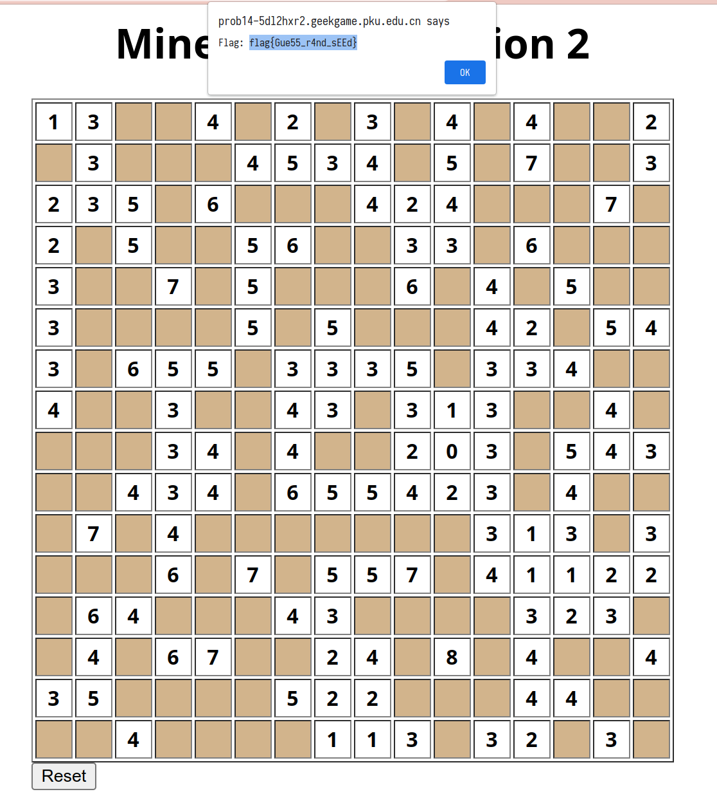
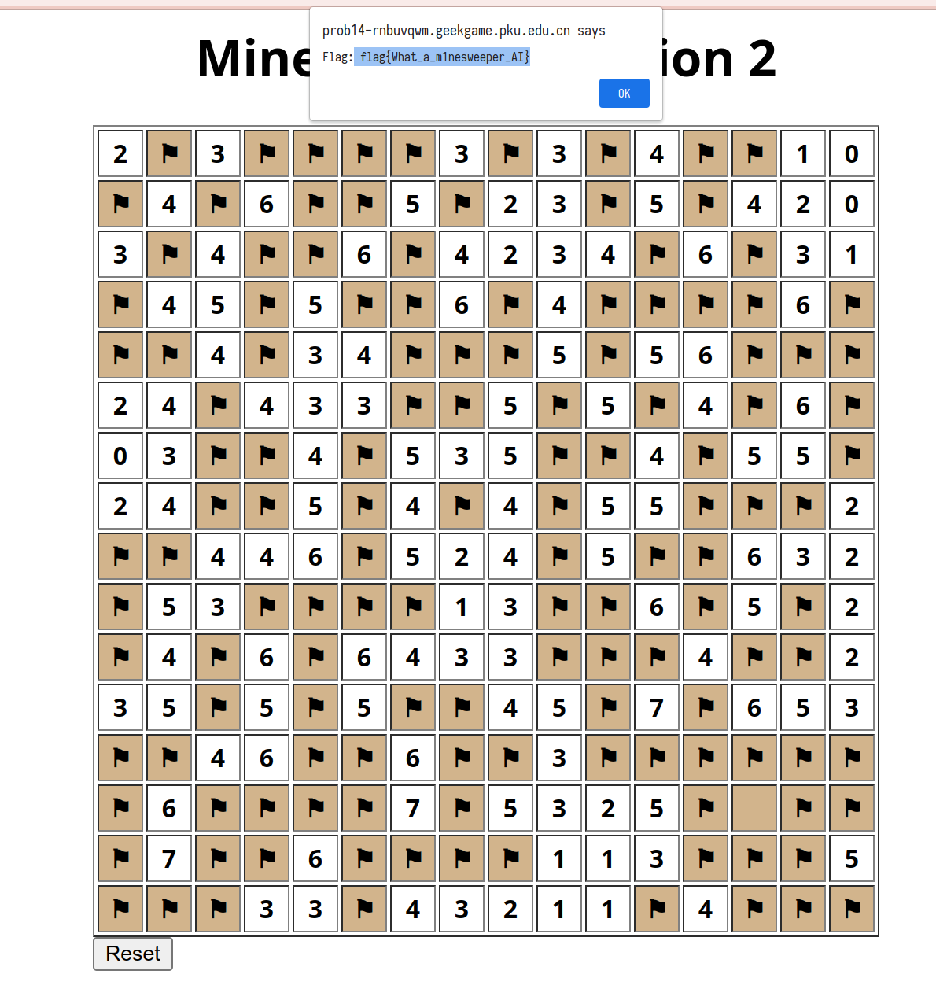

# 扫雷 II

## Flag 1

阅读源码可知，第一关的随机数生成直接使用了 `math/rand`，并且随机数种子为 `time.Now().UnixMilli()`。因为我们可以通过 `POST /reset` 控制重新生成随机数种子，因此就可以掌握到随机数种子大致的时间范围。从而，我们可以利用一次失败的尝试获取到第一次生成的 `Board`，然后暴力枚举随机数种子，这样就可以得到第二次的 `Board`，从而拿到 Flag 1。

一开始是手工一个个填的（虽然可以调用 API 但是手工填有不一样的刺激感）：



后来把几部分内容整合成了 [flag1.go](./flag1.go)。

## Flag 2

想要爆破 Flag 2，不仅需要准确时间戳，还需要一个 8 位的随机数。并且，在生成棋盘之前，预先计算了很大的位移，这就导致暴力枚举的耗时变得很长。

用求解 Flag 1 的程序测试了几次，本地发起请求的时间和实际 `reset` 的时间差大概在 10--30 ms 之间，这样把时间戳的搜索范围减小之后，用时 5 分 29 秒爆破出了结果。

代码见 [flag2.go](./flag2.go)。

## Flag 3

需要注意 `genBoard3` 中的一处细节：第一行和最后一行没有用 `crypto/rand`（也即 `securerand`），因此我们可以靠这两行的信息来确定时间戳。

得到时间戳之后，我们可以生成一个没有经过 `securerand` 处理的棋盘。这个棋盘只有第一行和最后一行是保证正确的，中间的行正确性不能保证。对于中间行，我们能够知道的是：

- 偶数行（第 0、2、4... 行）与实际棋盘只会在 `0x5554` 所代表的列，也即第 2、4、6...14 列上有差异；
- 奇数行（第 1、3、5... 行）与实际棋盘只会在 `0x2aaa` 所代表的列，也即第 1、3、5...13 列上有差异。

所以其他列上的情况与我们生成的棋盘是一致的。

使用这些信息：

```txt
The server is reset at 2022-11-23 00:25:33.872 +0800 CST
2X3XXXX3X3X4XX10
X*X*X*5*2*X*X*20
3X*X*6*4*3*X*X*1
X*5*5*X*X*X*X*6X
XX*X*4*X*5*5*X*X
2*X*3*X*5*5*4*6X
03*X*X*3*X*4*5*X
2*X*5*4*4*5*X*X2
XX*4*X*2*X*X*6*2
X*3*X*X*3*X*X*X2
X4*6*6*3*X*X*X*2
3*X*X*X*4*X*X*53
XX*6*X*X*3*X*X*X
X*X*X*7*5*2*X*XX
X7*X*X*X*1*3*X*5
XXX33X43211X4XXX
It is your turn now...
```

再结合人工尝试，最终得到了 Flag 3。



代码见 [flag3.go](./flag3.go)。
