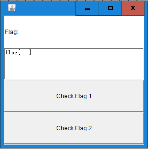
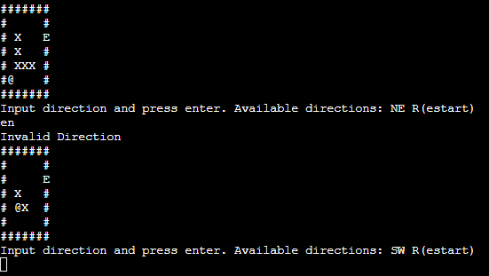
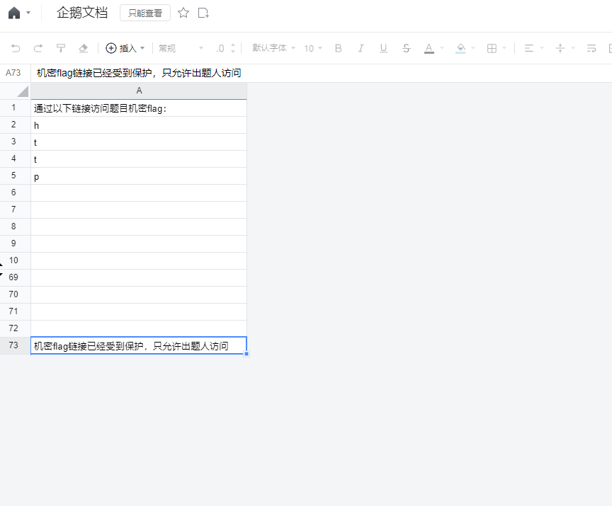
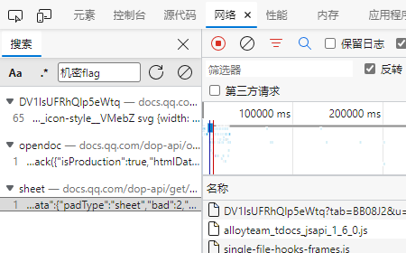
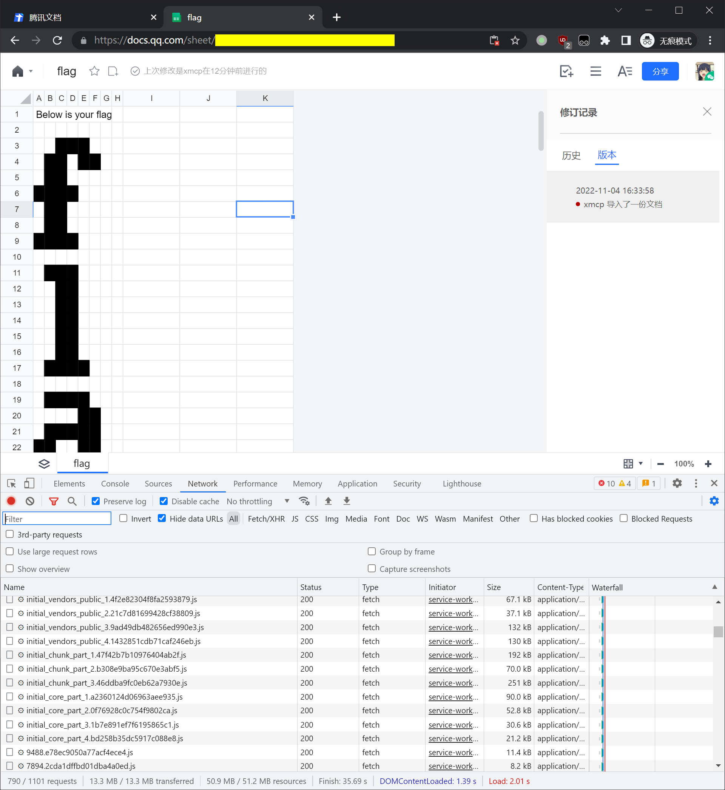
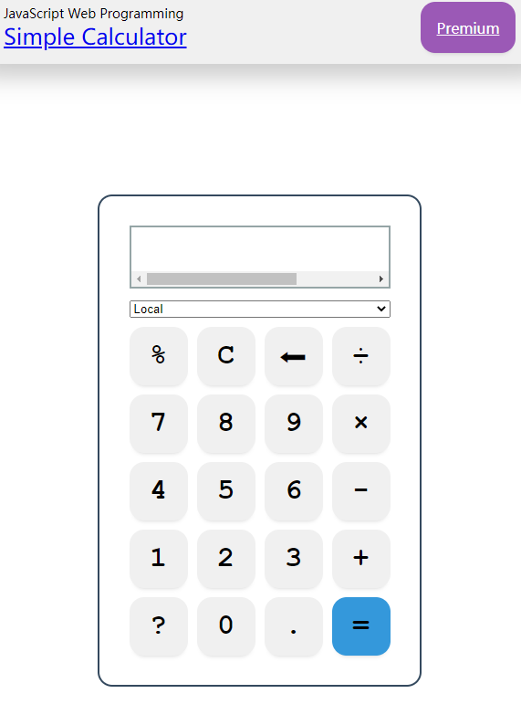
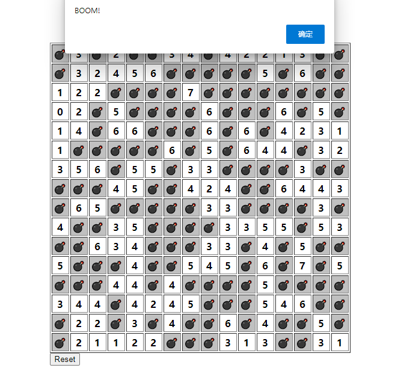
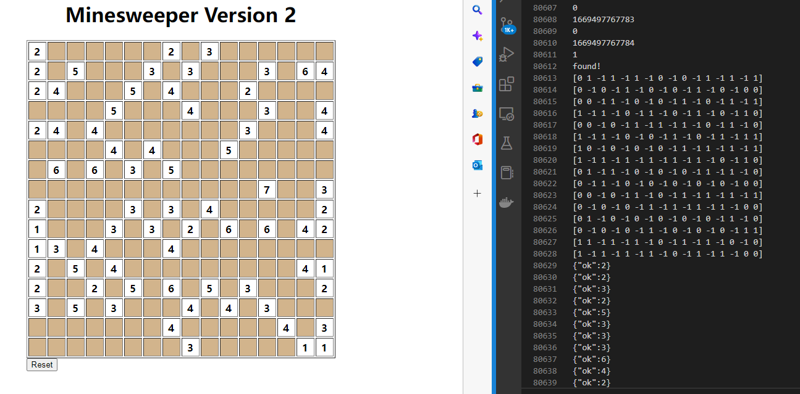

# 2nd Pku Geekgame writeup
#### nxp
### 前言
最早还在科大的时候，就开始关注科大的hackgame，很喜欢ctf这种类型的比赛。无奈自己当时不光不懂信息安全的知识，计算机的基础也不是很多，只能做出几道题。

几年过去了，前段时间听说今年科大新一届hackgame举办了，但是当时没空好好打。直到北大举办geekgame，才可以认真打一打。

比赛一共五个部分

- **Misc: 综合技能（常见编码和文件格式、代码审计等）**
- **Web: 网站安全（Web 漏洞利用、JavaScript 编程等）**
- **Binary: 二进制安全（逆向工程、程序调试等）**
- **Algorithm: 算法安全（现代密码学、算法设计等）**

第一阶段做出了全部的五道 Algorithm 和前三个Misc 以及一点点 web，而 Binary 部分就彻底摆烂了。

第二阶段拿到提示又做出了剩下的一题半 Misc（图中四、五题）

最后校内排名11，总排名17，解题情况如下


比赛结束之后，在这里记录解题思路，并公布解题用到的代码。

### Tutorial †签到†
第一题和[第一届geekgame](https://github.com/PKU-GeekGame/geekgame-1st)的签到题几乎一样，唯一的区别是不可复制。

看去年的writeup得知只需要把这段符号复制出来就可以得到flag


查到用pdf.js预览pdf，就可以复制内容。于是找了一个在线网站[PDF.js viewer](https://mozilla.github.io/pdf.js/web/viewer.html)。打开pdf之后，复制这串字符得到flag。

### Tutorial 小北问答 · 极速版

经过多次手动尝试，发现题库一共有8道题，每次会随机出现7道题。通过浏览器搜索，把所有题目和答案记录在[题库](prob01/prob01.txt)中，其中

**在第一届 PKU GeekGame 比赛的题目《电子游戏概论》中，通过第 11 级关卡需要多少金钱？ **

阅读去年这题的源码[pygame]([geekgame-1st/libtreasure.py at master · PKU-GeekGame/geekgame-1st (github.com)](https://github.com/PKU-GeekGame/geekgame-1st/blob/master/src/pygame/game/server/libtreasure.py))，得知为300+int(level**1.5)*100

**视频 bilibili.com/video/BV1EV411s7vu 也可以通过 bilibili.com/video/av_____ 访问。下划线内应填什么数字？**

找到了一个[转换工具](视频 bilibili.com/video/BV1EV411s7vu 也可以通过 bilibili.com/video/av_____ 访问。下划线内应填什么数字？), 直接转换就行

...

有两题遇到了问题

**我刚刚在脑海中想了一个介于 9386058582 到 9386058738 之间的质数。猜猜它是多少？**

这类问题中间会有多个素数，但是只能回答一个，所有只能从中随机选一个素数回答。

**我有一个朋友在美国，他无线路由器的 MAC 地址是 d2:94:35:21:42:43。请问他所在地的邮编是多少？**

众所周知MAC地址只在内网的路由器中记录并使用，地理位置是由ip地址划分的。因此要通过MAC地址倒推实际上的地址是不可能的。尝试在多个MAC地址查询网站上搜索，也都找不到。

幸运的是每次从8题中抽取7题，我们有1/8概率遇不到这题。


要成为 **满分卷王** 不仅要答对所有题目，还在在几秒内完成作答，因此用`pwn`工具编写了自动答题脚本。由于上面两道题的存在我们大概有1/72的概率能做对所有题。

编写脚本[自动答题](prob01/prob01.py)，经过数次尝试，幸运地得到了flag。


### Misc 编原译理习题课

这道题要用各种程序让g++出现问题，开始网上搜索。在知乎上找到一个关于报错信息的回答[只用 30 行以内代码，C++ 最多可以产生多少行的编译错误信息？ - 知乎用户NolGEs的回答](https://www.zhihu.com/question/61427323/answer/187737864)。顺藤摸瓜找到了一个用于测试 **OJ系统** 的[GitHub仓库]([vijos/malicious-code: Malicious code that Vijos judged. (github.com)](https://github.com/vijos/malicious-code))，里面有第一题的答案。

第三题在里面找不到，尝试继续各种搜索，最后在[Bug List (gnu.org)](https://gcc.gnu.org/bugzilla/buglist.cgi?quicksearch=Segmentation fault)里面搜索`crash Segmentation fault`,找到了一个例子。


- **玩挺大**：让 g++ **编译出的程序超过 8MB** 可以获得 Flag 1

  参考[bigexe.c(github.com)](https://github.com/vijos/malicious-code/blob/master/bigexe.c)，不过这个里面创建的数组还是太大了，需要适当调小一点，才能生成一个刚好大于8MB的可执行文件。

- **玩挺长**：让 g++ **输出的报错信息超过 2MB** 可以获得 Flag 2

  `struct x struct z<x(x(x(x(x(x(x(x(x(x(x(x(x(x(x(x(x(x(y,x(y><y*,x(y*w>v<y*,w,x{}`

- **玩挺花**：让 g++ **因为段错误而崩溃** 可以获得 Flag 3

  参考[106675 – [10/11/12/13 Regression\] g++ crashes on funky operators (gnu.org)](https://gcc.gnu.org/bugzilla/show_bug.cgi?id=106675)


### Misc Flag Checker

这是一个简单的`java`逆向题，甚至不需要会`java`就能做，题目给了一个[jav文件](prob15/prob15.jar)。我安装了[JRE 8](https://www.java.com/zh-CN/download/)运行了一下 `java -jar .\prob15.jar`



确实是一个**Flag Checker**，找了一个在线反编译`jar`的网站[Java decompiler online](http://www.javadecompilers.com/)，得到了[java源码](prob15\GeekGame.java)。

#### Flag 1

虽然我没学过`java`，但是大概能看到`button1`对应一个叫`rot13`的函数。用`python`实现了其[逆函数](prob15/flag1.ipynb)。算出`flag1`的`base64`编码：

`'ZmxhZ3tzMW1wMWUtanZhdl9yZXZ9'`

然后找了个在线解码网站得到`flag1`。

#### Flag 2

连蒙带猜，大概知道`button2`对应一个`invocable`的对象，也就是前面的`engineByName`，然后注意到

`engineByName.eval(sb.toString());`

这句话，想看看里面的字符串是什么，在上面加一行打印

`System.out.printf(sb.toString());`

发现字符串的内容

```javascript
function checkflag2(_0xa83ex2){var _0x724b=['charCodeAt','map','','split','stringify','Correct','Wrong','j-'];return (JSON[_0x724b[4]](_0xa83ex2[_0x724b[3]](_0x724b[2])[_0x724b[1]](function(_0xa83ex3){return _0xa83ex3[_0x724b[0]](0)}))== JSON[_0x724b[4]]([0,15,16,17,30,105,16,31,16,67,3,33,5,60,4,106,6,41,0,1,67,3,16,4,6,33,232][_0x724b[1]](function(_0xa83ex3){return (checkflag2+ _0x724b[2])[_0x724b[0]](_0xa83ex3)}))?_0x724b[5]:_0x724b[6])}
```

这个看起来很想`javascript`，直接在浏览器命令行里执行，发现执行成功，而且得到了一个函数`checkflag2`似乎正好对应`button2`内部调用的函数。

于是尝试逆向它，经过多次尝试最后发现执行

```javascript
_0x724b=['charCodeAt','map','','split','stringify','Correct','Wrong','j-'];
JSON[_0x724b[4]]([0,15,16,17,30,105,16,31,16,67,3,33,5,60,4,106,6,41,0,1,67,3,16,4,6,33,232][_0x724b[1]](function(_0xa83ex3){return (checkflag2+ _0x724b[2])[_0x724b[0]](_0xa83ex3)}))
```

后会得到

`'[102,108,97,103,123,106,97,118,97,115,99,114,105,112,116,45,111,98,102,117,115,99,97,116,111,114,125]'`

用python将其转换为比特类型，得到flag2.

`bytes([102,108,97,103,123,106,97,118,97,115,99,114,105,112,116,45,111,98,102,117,115,99,97,116,111,114,125])`


### Misc 智慧检测器

这道题是迷宫探索题，一共三关，每关是一个多层的迷宫，我拿到先手动玩了一会。发现乱按有时候可以穿墙，不过没想太多，以为是 **按太快了，python没反应过来** ，并愚蠢地认为 **这种bug是不可控的，应该和解题无关**。第二阶段看到提示都快哭了，当时遇到穿墙的时候，怎么就不多想一会是为什么，唉！！！

继续说第一阶段，随后读[源码](prob03/prob03-src.py)，认为可能需要让里面的字符串处理功能出错，从而让程序崩溃。查找资料，没有找到有用的。认为迷宫求解可能是用算法来做，得先搞清楚迷宫的生成方式。但是源代码里迷宫生成的逻辑太长了，就懒得看，先做别的题了。

第二阶段，看到提示。已经快哭了，我明明早就遇到过穿墙了，开始思考为什么可以穿墙。观察源码，发现一次可以进行多步移动（向左向右），然后发现一个合法的移动加上一个不合法的移动之后，虽然会告诉我移动不合法，但是移动确实进行了，小人甚至可以和墙重合。



在源码里每次改变当前位置和新位置的下面都打上`print`，终于发现了问题。在第一次移动判定成功之后，程序执行了

`CurPos = NewPos`

这是一个数组直接赋值，在`python`中，这样做是有问题的。之后尝试改变`NewPos`的时候会直接同时改变`CurPos`。于是我知道了如何**穿墙**。

#### 破坏者

第一个flag是让程序崩溃，我直接不停上楼，一直跑到**顶楼的上面一层**，于是数组越界了，拿到第一个flag。

#### 调停者

第二个flag是打通三关，前两关轻松通过。但是第三关是一个**长55宽55，80层**的迷宫，而且要求在**99步**以内完成，就算我能**穿墙**，光上楼就要**79步**呀！除非我到第80层之后，发现出口就在眼前。怎么会有这么好的事呢？

我一筹莫展的时候，我看到提示说，**可以先看一眼出口位置，再reset**。这跑到顶楼看一眼出口在哪，再回去重新上来，得浪费80步，人都亏麻了，这怎么可能。

忽然想到`python`的数组特性，我去顶楼其实只要去`-1`层就可以了。于是我先向下一层，看到flag的位置之后。再rest一下，这样一共是2步。就这样，我拥有了**透视**。最后还差一个**自瞄**，此后每步用一个靠近出口位置的移动加一个不合法的上楼。又花了79步上到顶楼。出口确实就在眼前！（应该就在眼前吧？）

上面的逻辑写在程序[穿墙透视自瞄挂](prob03/prob03.py)中，（不过实现得非常简陋，前两关要手动玩，第三关到顶楼之后也要手动玩，而且出口是不是在”眼前“其实还得碰运气。hhhh）试个两三次就过了。


### Misc 我用108天录了个音

请大声背诵以下内容，并提交录音文件。

- 科技并带着趣味
- 不觉得这很酷吗
- 作为一名理工男
- 我觉得这太酷了
- 很符合我对未来生活的想象

**验证要求：**每句话之间的间隔必须在 9.5 至 10.5 秒之间，录音文件不能超过 2MB 或 60 秒。

我们会使用 [腾讯云语音识别 API](https://cloud.tencent.com/document/product/1093/35646) 检查录音内容是否正确。

如果你的 **录音文件大小不超过 12288 字节** 或者 **录音时长不超过 30 秒**，我们将赠予你 Flag 1。

如果同时满足以上两个条件，我们将赠予你 Flag 2。


好奇怪的要求，不过话不多说，先完成第一步“大声背诵以下内容”。我请了一个一直嘲笑我普通话不标准的同学，读了一下这段话。然后交上去...好吧，全识别出来了。可是她的语音有`184987 字节`比第一阶段要求的`8000多字节`(第二阶段放宽到`12288 字节`)大很多，而且中间插入的间隔就至少40秒了，录音时长不超过30秒？这怎么可能？

第一阶段最后打算试试做这题，但是没时间了。到了第二阶段，发现放松了要求，开始做了。

考虑到手动分人的语音比较麻烦。就想着找一个文字转语音的接口。找到了一个可以调用Windows语音的接口[pyttsx3 · PyPI](https://pypi.org/project/pyttsx3/)。

需要能生成空白间隔音频的接口。找到了[pydub · PyPI](https://pypi.org/project/pydub/)，用里面的`AudioSegment.silent`方法。

接下来大致了解了一下码率，采样率两个概念。

需要一个能压缩音频的东西，网上查了查，似乎[FFmpeg](https://ffmpeg.org/)是唯一的选择，学了两条命令。

- `ffmpeg -y -i origin.mp3 -b:a 8k -ar 8000 object.aac`

  其中`-y`表示不要是否继续，第一个`8k`表示码率，第二个`8000`表示采样率

- `(ffmpeg -y -i "concat:%s" -acodec copy %s' % ('|'.join(origin_list), 'object.aac'))`

  这是一个`python`字符串，会得到将`origin_list`里面的文件连接起来的指令

尝试生成一段满足要求一的音频。先分别生成每句话的语音，分别生成每段空白间隔。然后压缩上面的每段音频，再连接起来。

阅读题目源代码，发现支持的格式只有

`['wav','pcm','ogg','mp3','m4a','aac']`

都选择8000采样率，8k码率。然后一个一个去尝试。`.mp3`虽然队语音压缩效果好，但是每段空白压缩完都很大。而`aac`格式能把每段空白音频压缩得非常小。因此决定选择`aac`。

然后得到的音频文件大概`15000多字节`。还是大了一点。试着把码率改成`2k`，奇怪的是音频只变小了一点点，我不知道这是为什么。

已经知道知道空白音频大小很小，所以可以修改每段音频的语速。(例如1.5倍速)

`ffmpeg -y -n -i origin.mp3 -filter:a "atempo=1.5" object.mp3`

这样确实可以显著修改音频大小，但是语速快了，可能识别错误。

我尝试把一句话分成几段，依次调整每段的语速。效果都不理想。最后觉得应该是Windows的语音不行，我安装了新的Windows语音包，但是`pyttsx3`居然发现不了。

最后我找了一个[在线文字转语音](https://www.narakeet.com/app/text-to-audio/)，换掉了效果不好的几句话，文件大小总算达到要求了。

最后再根据调整一下每段空白的长短，获得flag1。

代码在[语音合成](prob02/prob02.ipynb)。


### Web 企鹅文档

这道题需要找到腾讯文档的隐藏信息。



拿到手，到处点点，都告诉我没有权限。大开`F12`开始找有用信息，源码里啥也没有，于是去看网络。

发现包实在太多了，搜索`flag`，找到的包还是太多。看了一段时间，不耐烦了。觉得可能可以搜到表格中被隐藏的信息。

于是搜索`机密flag`,发现只有三个文件了




全部下载下来

- [第一个文件](prob21/DV1lsUFRhQlp5eWtq)没有什么作用

- [opendoc](prob21/)中显示了隐藏信息：提取出来得到`https://geekgame.pku.edu.cn/service/template/prob_kAiQcWHobs`

  我以为已经找到了，但是打开这个网站发现根本打不开，痛苦面具一段时间后，去看第三个文件

- [sheet](prob21/sheet)中可以发现后面的部分`BzRJEs_next`

这样我们得到了一个网址，打开之后。有一个文件[challenge.har](prob21/challenge.har)（只保留有用部分）和一张图片




文件里给了一串数字，按照图片提示，将数字转化为坐标（一行11个位置）。用[画图程序](prob21/painter.ipynb)画出图像得到flag。


### Web 企业级理解

这题只解出了第一个 ** 赋能管理后台**。

一进去，发现给了一个登入界面


补充说明告诉我，第一个flag需要 **绕过登录页面访问管理后台**。似乎就是不用密码登入的意思。

题目还提供了一个[pdf版的代码文件](prob08/prob08-src.pdf)。（似乎在影射前段时间某位马姓院士让员工打印代码的事？）

边读代码边查，发现这个是用`java`的`springframework`搭建的。里面有一些奇怪的话。

```java
19 @Override
20 protected void configure(HttpSecurity http) throws Exception {
21 http.formLogin()
22 .successForwardUrl("/admin")
23 .and()
24 .authorizeRequests()
25 .antMatchers( "/admin").hasAnyRole()
26 .antMatchers( "/admin/query").hasAnyRole()
27 .antMatchers( "/admin/source_bak").hasAnyRole()
28 .antMatchers( "/login", "/**", "/favicon.ico").permitAll()
29 .anyRequest()
30 .authenticated()
31 .and()
32 .csrf()
33 .disable();
34 }
```

这一长串给了很多`url`。似乎最后还说，一些`url`可以`permitAll()`。

不过我看不懂，为什么可以连续地使用`.function()`这种语法。

把每个都尝试一遍，`/admin`,`/admin/query`,`/admin/source_bak`都会跳转回`/login`。

后面的`/login/**/favicon.ico`进去会得到`404 Not Fount`。

我查到`/**`可以匹配多层目录，以为找到了突破口。可是把猜测可能的目录全试了一遍，全部都是`404 Not Fount`。看来一定是哪出了问题。

继续在网上看关于`springframework`的资料，得知`hasAnyRole()`用于指定进入`url`需要的角色，但是没见到过里面没有参数的情况。

`permitAll()`表示`url`所有人都可以访问，里面的`url`是分开的，也就是说`/**`告诉我们所有`url`都是可以访问的。

但是`/admin`明明进不去，我继续尝试，直到试了一下`/admin/`，显示出东西了！


同样`/admin/query/`


还有`/admin/source_bak/`显示了一段代码，根据名字推断，这应该是`/admin/`的后端源码。

```java
import org.springframework.web.reactive.function.client.WebClient;

@RestController
public class AdminController {
    WebClient webClient = WebClient.builder().baseUrl("http://localhost:8079/").build();

    @RequestMapping("/admin/{index}")
    public String adminIndex(@PathVariable(name = "index") String index, String auth, QueryBean queryBean) {
        if (index != null & index.contains("%")) {
            index = URLDecoder.decode(index, "UTF-8");
        }
        if (queryBean.getType() == null) {
            queryBean.setType("PKU");
        }
        if (!typeList.contains(queryBean.getType())) {
            typeList.add(queryBean.getType());
        }
        Mono str = webClient.post().uri(index).header(HttpHeaders.AUTHORIZATION, auth)
                .body(BodyInserters.fromFormData("type", queryBean.getType())).retrieve().bodyToMono(String.class);
        return queryBean.setValue(str.block());
    }
}
```

仔细想了想，总算搞明白逻辑，原来这个连续的`.function()`是按照顺序执行的，前面是说`/admin`等`url`没有人有权限访问。后面接着告诉我们剩余的任何`url`任何人都能访问。

因此`/admin/`逃过了前面的匹配，但是最后还会指向`/admin`这个页面。

然后继续分析上面三个`url`对应的结果，打开`f12`，发现`click`按钮的功能是向`/admin/query`用`post`发了一个表单

```json
{
	type: PKU,
	value: 12
}
```

然后源码告诉我们，如果`type`是空，就会自动被选为`PKU`，也就是进入`/admin/query/`这个`url`对应的结果。

因此需要向`/admin/query/`用`post`发了一个表单，来完成查询操作。

写了一个[脚本](prob08/prob08.ipynb)，把`type`下拉框里的其它文本（`PKUGame`和`PKU_GeekGame`）查了一遍。

最后发现用`PKU_GeekGame`能查到第一个flag。


第二个flag，按照说明需要**访问本机上的 bonus 服务**，然而我没有查到**bonus服务**是什么，就去做其它题了。


### Web 这也能卷

这题只解出了第一个**Flag · 摆**。

看到题目，长得好像一个计算器。



试了一下，确实是一个计算器。打开`F12`，仔细读了一下源码，这真的是个计算器。

不过源码的`main.js`最后有一行

```javascript
if (localStorage.getItem('i_am_premium_user') === 'true') {
  import('./main-premium.js')
}
```

看起来是说，我改掉`i_am_premium_user`这个变量，就可以体验“VIP"功能。那我当然要改，执行语句

`localStorage.setItem('i_am_premium_user',true)`

然后....没什么变化，等了一会...还是没什么变化，在计算上胡乱按键...还是没什么变化

刷新一下网页，发现源码多了一个`main-premium.js`，而且我的计算器变成了”vip“版（多了两个功能）


不过好像没有什么线索，发现右上角有个`Premium`按钮可以点。点进去就一直在调试页面。

于是先`ctrl+f8`关闭断点，然后让再步进一下，发现屏幕上显示出了第一个flag。


然后发现前端没什么可以看的了，其它的flag似乎都要利用后端代码（`node.js`)的漏洞来获取，但是完全没用过这个，就没有能继续做。


### Algorithm 381654729

看了一下[源码](prob16/prob16.py)，是要输入一串字符串，这个程序会做一些验证，然后告诉我，这个字符串是不是flag。

```python
flag=input("Flag: ").encode()
if len(set(flag)-set(range(127)))>0:
    print("Wrong")
else:
    num=int.from_bytes(flag,"big")^2511413510823276375832653761986868459306472933080227640498
    num_len=len(hex(num))-2
    for i in range(1,num_len+1):
        if (num>>((num_len-i)*4))%i>0:
            print("Wrong")
            exit()
    print("Correct")
```

分析这段代码：前面限制了输入字符串的`ascii码`只能在`0-127`之间。然后将转化为256进制数字，再和`2511413510823276375832653761986868459306472933080227640498`异或。

最后有一个循环，结合网上对于`381654729`这个独一无二的数的描述，意思是我需要找一个16进制下，也满足这种条件的数。

而且这个数和`2511413510823276375832653761986868459306472933080227640498`做异或之后得到的256进制数，每位都在`0-127`之间。

我打算先看看这个数有多少位，于是把`2511413510823276375832653761986868459306472933080227640498`按照16进制每两位一组做了分解：

```python
#(16进制,10进制,字符)
[('66', 102, 'f'),
 ('6c', 108, 'l'),
 ('61', 97, 'a'),
 ('67', 103, 'g'),
 ('78', 120, 'x'),
 ('28', 40, '('),
 ('25', 37, '%'),
 ('33', 51, '3'),
 ('ef', 239, 'ï'),
 ('22', 34, '"'),
 ('92', 146, '\x92'),
 ('cb', 203, 'Ë'),
 ('65', 101, 'e'),
 ('ab', 171, '«'),
 ('46', 70, 'F'),
 ('e2', 226, 'â'),
 ('59', 89, 'Y'),
 ('c5', 197, 'Å'),
 ('36', 54, '6'),
 ('4b', 75, 'K'),
 ('6b', 107, 'k'),
 ('e7', 231, 'ç'),
 ('f4', 244, 'ô'),
 ('b2', 178, '²')]
```

注意到`('ef', 239, 'ï')`这行是大于`127`的，意为着`flag`对应的字符串转化成的数字异或之后的数字和`2511413510823276375832653761986868459306472933080227640498`异或，不可能把这位变成0。

换句话说，最后那个满足”独一无二的数“至少有32位，再根据前面几位是`flag`推断，最多有40位。

因此我们要找到只要的数，我一开始认为这样数计算会非常复杂，继续在网上查有没有什么办法算。

找到了维基百科上的描述[Polydivisible number - Wikipedia](https://en.wikipedia.org/wiki/Polydivisible_number)，里面甚至给了算这种数的代码，是利用n位的”独一无二的数“到n+1位的”独一无二的数“的递推性质。

于是用这个算法，算出所有数（居然很快）,发现最多是39位，然后写了一个[脚本](prob16/prob16.ipynb)按照从位数多的向位数少的顺序去试，得到了flag。


### Algorithm 乱码还原

打开[源码](prob18/src/prob.py)，发现里面实现了某种加密，可以把正常的文本加密成”佛语“，然后写入了文件。

而且”佛语”这种加密是可逆的。

例如`flag{1sads2_1_dd}`这个字符串，加密会得到

`佛曰：謹瑟罰諦帝哆迦冥寫穆罰爍涅俱遠皤提曰皤輸缽不侄有梵者知藝侄夢諳藝知哆婆除呐逝缽槃除呐曰尼謹想漫呐羯利缽薩奢道缽死諦是迦冥密他怯沙侄麼怯老朋有娑耶`

看起来挺有意思的。

#### Flag1

看到第一段文本的写入方式

`Encrypt(x).encode("utf-8").decode("shift_jis",errors="ignore")`

得到了

`菴帶峅ｼ夐ｺｼ譏ｯ譴ｵ谿ｿ逧､逶｡逧､貊螽題協蜀･驍｣逶ｧ鄒ｯ莨顔ｽｰ譎ｺ逶｡螟懈｢ｵ蜍昜ｿｱ蟇ｦ蛻ｩ逶ｧ逧､蜻ｼ蜻舌ょｸ晏､｢譴ｵ貊鄒蟇ｦ蜻千ｭ我ｾ晉圖陂萓蛟剃ｼ贋ｻ･莠ｦ蜩謨ｸ諤ｯ蟋ｪ蟆ｼ諤ｯ辟｡蜻先主堤･樊ｯ螟ｷ驕萓鞫ｩ譎ｺ蜻蝉ｼｽ諱先ｯ莠ｦ蜀･蠖檎ｼｽ荳`

这样一串奇怪的东西。

分析一下上面那句话，把密文先用`utf-8`编码，再用`shift_jis`解码，忽略错误，然后得到了这一串东西。

查到`shift_jis`是日文的编码格式，所以上面那串是日文，我只需要恢复出中文的密文就可以了。

做了一些实验，进一步发现`utf-8`编码的作用是把1个汉字转化为**3个2位16进制数**。

`shift_jis`解码则是把**1个2位16进制数**或**2个2位16进制数**转化为1个日文。

`errors="ignore"`作用是遇到无法转化位日文字的时候，跳过当前的**1个2位16进制数**，继续转化。

因此在转化位日文的时候，丢失了一些**2位16进制数**，需要不全丢掉的数字。

一开始我绕了很大弯路，尝试在用`utf-8`解码位汉字的时候，每当遇到错误，就补一个合理的**2位16进制数**。让它能解码出“佛语”里的字。这种思路得到了一些奇怪的密文，解密之后的结果都不对。

后来我想到到**如果用`errors="ignore"`来解码，一个串的前缀解码之后得到的串一定是这个串解码的前缀**，

因此**正确密文的前缀解码之后一定是那串奇怪的东西的前缀**，用这个思路，写了一个递归算法。算出了所有可能的密文。

```
佛曰：麼是梵殿皤盡皤滅娑苦冥那盧羯伊罰智盡夜梵勝俱實利盧皤呼呐。帝夢梵滅羅實呐等依皤蘇侄倒伊以亦哆數怯姪尼怯無呐明倒神怯夷遠侄摩智呐伽恐怯亦冥彌缽不
flag{s1mp1e_Tud0uc0d3}
佛曰：麼是梵殿皤盡皤滅娑苦冥那盧羯伊罰智盡夜梵勝俱實利盧皤呼呐。帝夢梵滅羅實呐等依皤蘇侄倒伊以亦哆數怯姪尼怯無呐明倒神怯夷遠侄摩智呐伽恐怯亦冥彌缽一
flag{s1mp1e_Tud0銲ꅙ揲锔睟챽ᄻ
佛曰：麼是梵殿皤盡皤滅娑苦冥那盧羯伊罰智盡夜梵勝俱實利盧皤呼呐。帝夢梵滅羅實呐等依皤蘇侄倒伊以亦哆數怯姪尼怯無呐明倒神怯夷遠侄摩智呐伽恐怯亦冥彌缽上
error
佛曰：麼是梵殿皤盡皤滅娑苦冥那盧羯伊罰智盡夜梵勝俱實利盧皤呼呐。帝夢梵滅羅實呐等依皤蘇侄倒伊以亦哆數怯姪尼怯無呐明倒神怯夷遠侄摩智呐伽恐怯亦冥彌缽三
flag{s1mp1e_Tud0룄爉鸆몠㊆硎ữ
佛曰：麼是梵殿皤盡皤滅娑苦冥那盧羯伊罰智盡夜梵勝俱實利盧皤呼呐。帝夢梵滅羅實呐等依皤蘇侄倒伊以亦哆數怯姪尼怯無呐明倒神怯夷遠侄摩智呐伽恐怯亦冥彌缽世
flag{s1mp1e_Tud0⧶䳐鑅绎箄䰍໎
```

可以看到，一共有四种可能，只有第一种是合理的。于是得到了flag。

代码写在[Flag1](prob18/Flag1.ipynb)。

#### Flag2

[第二段文本](prob18/src/flag2.enc)长度非常恐怖。观看了一下它的编码方式

```python
with open("flag2","rb") as f:
	x=f.read()
from base64 import b16encode, b32encode, b64encode, b85encode, a85encode
for i in range(10):
	x=choice([b16encode, b32encode, b64encode, b85encode, a85encode])(x)
with open("flag2.enc","w",encoding="utf-8") as f:
	f.write(Encrypt(x.decode("utf-8")).encode("utf-8").decode("shift_jis",errors="ignore"))
```

先将文本的`byte`格式用**`base64`系列**编码加密了10次，再按照前面的方法编码，解码。

最后得到了一串长度接近5000的日文文本。虽然也可以用前面的方法去计算密文。

不幸的是，前缀满足条件的密文是**指数增长**的，这样不可能再有限时间里计算出来。

虽然导致最后的编码这么长的罪魁祸首是10次**`base64`系列**编码加密，但是我们不可能提前知道这10此加密是用的上面编码。

因此，还是考虑如何恢复密文，需要考虑如何减少一些前缀一样的密文。

首先**如果两串密文解码出的日文一样，且解码时尾部被丢弃的2位16进制数一样，则这两串密文后面接任何字符串，解码结果都一样**，在递推算密文的时候，可以合并这样的密文。但是这样虽然可以在计算时合并密文串，最后还是会得到指数个串。

决定去看看”佛语“是如何解码的，解码函数首先将佛语转化为`byte`串，每1个或者两个汉字转化为一个**2位16进制数**。然后再用`AES-256-CBC`算法解密。

看看`AES-256-CBC`算法是什么（参考[了解 AES 加密算法](https://justinyan.me/post/4356)）：

- `AES`表示将密文每16比特一组，分组加密，再拼接。
- `256`表示加密使用的密钥为`256`比特。
- `CBC`表示会将后面组的密文和前面组的密文异或再拼接（用于防止密文碰撞）。

这说明`AES`加密同样具有和前面类似的**前缀性质**。因此我写了一个**部分解码函数**，用于得到“佛语”加密之前的字符串前缀

```python
def Part_Decrypt(ciphertext):
    # 1. Remove Header and Decode
    if ciphertext.startswith('佛曰：'):
        ciphertext = ciphertext[3:]
        data = b''
        i = 0
        while i < len(ciphertext):
            if ciphertext[i] in BYTEMARK:
                i = i + 1
                if i<len(ciphertext):
                    data = data + bytes([TUDOU.index(ciphertext[i]) + 128])
            else:
                data = data + bytes([TUDOU.index(ciphertext[i])])
            i = i + 1
        # 2. Use AES-256-CBC to Decrypt
        # 去掉最后几位，长度为16的倍数
        n=len(data)
        n=n-n%16

        cryptor = AES.new(KEY, AES.MODE_CBC, IV)
        result = cryptor.decrypt(data[:n])
        # 3. Remove Paddings (PKCS7)
        # 3. Remove Paddings (PKCS7)
        flag = result[-1]
        if flag < 16 and result[-flag] == flag:
            result = result[:-flag]
        # 4. Decode Plaintext with UTF-16 Little Endian
        try:
            res=result.decode('utf-16le')
            return res
        except:
            return ''
    else:
        return ''
```

和原本的解密主要区别是丢弃掉16的倍数之后的比特。

考虑到丢弃的串长度小于16，因此对应的“佛语密文”小于32。为了保险我用了33这个数字。得到以下性质

***如果两串佛语密文部分解码的结果一样，且最后33个汉字一样。那么它们加上任何字符串，解码结果都一样***

同时有这样的性质（下面这个性质也许有反例，但是我认为基本上靠谱了，遇到问题再说）

***如果两串佛语密文的日文解码一样，且最后33个汉字一样。那么它们加上任何字符串，日文解码结果都一样***

同时，我跑了一段时间，观察密文的部分结果，发现只出现了

`"AaBbCcDdEeFfGgHhIiJjKkLlMmNnOoPpQqRrSsTtUuVvWwXxYyZz0123456789+/="`

里面的字符，于是直接假设最后一步用的`base64`编码，得到第三条性质。

**佛语密文部分解码结果一定包含在base64编码的字符集中**

用上面三条性质，每过50步尝试删除当前的密文集合。发现几乎一直都只有一条符合条件的佛语密文。

简单实现了一下算法，算法复杂度大概是长度的平方。虽然也可以简化成线性时间复杂度，但是需要自己多谢包括`AES`加密在内的一些东西，觉得而且没有必要。

大概用了半小时，算出了结果，有两条密文。用部分编码确定第一条密文是正确的。

随后算出了`b85`编码字符集

`'!#$%&()*+-0123456789;<=>?@ABCDEFGHIJKLMNOPQRSTUVWXYZ^_`abcdefghijklmnopqrstuvwxyz{|}~'`

以及`a85`字符集

`'!"#$%&\'()*+,-./0123456789:;<=>?@ABCDEFGHIJKLMNOPQRSTUVWXYZ[\\]^_`abcdefghijklmnopqrstu'`

然后第一步用`base64`解码，后面根据字符集推测用那种编码来解码。得到了flag。

代码在[Flag2](prob18/Flag2.ipynb)。


### Algorithm 奇怪的加密

阅读[源码](prob17/src/prob.py)，发现一种魔改版的替换加密。

先随机一种替换，构成26个字母之间的一一映射。然后对文本中第n个字母进行n-1次替换。

因此普通的词频分析，统计每个字母的频率是不好用的。

#### Flag 1

[第一段密文](prob17/src/crypt1.txt)看起来是一段文章，首先注意到开头

`Cinqwmzewtxs kn f kiepagkuf umpd op hsoert trsjbo lxmlurzyrzmke enpariq dtseeimrw areslyy`

第一个字母替换0次，因此就是 `C`，然后`C`开头12个字母的单词？好像大概也许是`Cryptography`。于是猜测开头是

`Cryptography is a`

但是后面一个单词9个字母，实在是想不到，谷歌搜索这个开头找到的文本后面的单词都不是9个字母。这三个单词不够我获得足够的信息恢复密钥，只好想别的办法。

继续观察发现，文中出现了很多**空格+字母+空格**的部分，猜测中间的字母都是`a`。

由于加密用到的替换是一一映射，因此**可以将字母分成几个互不相交的集合，且每个集合内的字母经过m次此加密能得到自身**。

先分析`a`所在的集合，发现和`a`一组的字母至少20个，`a`经过22的倍数次替换变成自身，因此`a`的周期是22。

然后算出`a`经过多少次替换（模掉22）变成其它字母。

```python
[('t', 0), ('a', 0), ('a', 0), ('a', 0), ('a', 0), ('y', 1), ('y', 1), ('b', 2), ('b', 2), ('b', 2), ('b', 2), ('n', 3), ('n', 3), ('n', 3), ('n', 3), ('t', 4), ('t', 4), ('t', 4), ('g', 5), ('g', 5), ('g', 5), ('g', 5), ('g', 5), ('g', 5), ('i', 7), ('i', 7), ('i', 7), ('w', 8), ('x', 9), ('x', 9), ('o', 10), ('z', 11), ('z', 11), ('s', 12), ('s', 12), ('s', 12), ('s', 12), ('s', 12), ('s', 12), ('e', 13), ('f', 14), ('f', 14), ('f', 14), ('l', 16), ('p', 17), ('c', 18), ('k', 19), ('q', 20), ('q', 20), ('q', 20), ('h', 21), ('h', 21), ('h', 21), ('h', 21), ('h', 21)]
```

第一个`t`显然是出了问题，其它的部分告诉了我们替换次数。结合`Cryptography is a`这句话知道`m`和`r`也和`a`一组，这样得到了22个字母的替换方式。

先用这个替换解密，然后观察文本得到了剩下四个字母的替换。从而得到了flag1。

代码在[Flag1](prob17/Flag1.ipynb)。

#### Flag 2

[第二段密文](prob17/src/crypt2.txt)看起来很整齐，每行长度32，是数字加字母的组合。可以确定不是一篇文章直接加密，因此前面的方法不能用了。

应该是某种编码加密，于是去搜索“长度32数字字母组合的编码”，居然没找到。然后去找一找常见编码，参考[CTF常见编码](https://ruoli-s.github.io/posts/a36c.html)，得知这是`md5`码。

`md5`码是一种哈希函数，是不可逆的。破解方法是**哈希碰撞**。在网上找解密网站，发现都是基于**彩虹表**的，通过查表来碰撞一些常见或者很短的文本的`md5`。

大部分免费网站都不好用，我找到了一个好用的网站[在线破解MD5 ](https://www.atool99.com/md5-crack.php)。

考虑到`md5`是一种哈希，如果把`md5`中的字母全部替换成`x`。就得到一种新的哈希函数，也可以哈希碰撞。

我先尝试单个碰撞一个字母，依次把`a-z`的`md5`中的字母换成任意字母去文本中匹配，发现匹配上了很多次。我假设这些匹配全部正确，这样就得到了很多对`原字母-替换字母-替换次数`的组合。把这些都记录下来。

然后观察这些组合发现替换周期是26，这说明所有字母都在一组。然后对出现相同字母的对，做一些自动推理。得到了每个字母经过一次替换得到的字母。从而得到了整个替换函数。

恢复原始的md5之后，只需要从md5恢复为文本了，我自己打**彩虹表**。遇到解密不了的`md5`就去在线网站上查，最后可能的字符集合为

`'ABCDEFGHIJKLMNOPQRSTUVWXYZabcdefghijklmnopqrstuvwxyz0123456789-+,;"\n\t .\\|\\\\{\\}_'`

最多出现4个字符组合的`md5`，还原出原文，得到flag2。

代码在[Flag2](prob17/Flag2.ipynb)。


### Algorithm 扫雷 II

和题目一样，这确实是一个扫雷游戏



一共有三关，每关都有一半是雷。按照提示，了解去年的扫雷对解这题有帮助。

去年的扫雷是用`python`写的，解法是搜集足够多的棋盘，用伪随机倒推随机种子，然后预测以后的棋盘。今年是用`go`写的，应该也是要想办法得知随机种子。

#### Flag 1

阅读[源码](prob14/prob14.go)，在设置随机种子的时候选择了`time.Now().UnixMilli()`。这是将当前`unix`时间转化为毫秒。

因此可以从某个时刻开始，每次增加一毫秒，并用遇到过的棋盘来验证随机种子。如果验证成功，就用这个种子预测下一个棋盘，完成扫雷。

由于每尝试一次，最多增加一个需要验证的棋盘，因此最坏是平方时间的（但是实际上，只需要验证第一个棋盘就够了，因此是线性时间）。

我先在源码中每和随机有关的地方打上了`log`，把每个随机种子，伪随机数和棋盘写入文件，在本地部署起来，用于测试和用于debug。

为了能用`go`的随机数函数，而不用自己动脑筋去复现。我学了一点 `go`，然后用`g`实现了一个爬虫，用来自动扫雷。我发现`reset`指令可以重置随机种子，因此我先记录当前的`unix`时间，然后立即发出`reset`指令。这样服务器端的种子和我记录的时间的误差就大概等于网络延时。

我实现了代码[Flag1](prob14/Flag1/Flag1.go)，但是始终撞不上种子。让我感觉非常奇怪，难道是服务器上的`unix`时间和我本地的不一样？很快我查到任何地区的`unix`时间是一样的。

我联想到`geekgame`的服务器端是`docker`部署的。猜测也许是`docker`容器的时间不对，或者说部署`docker`的时候那一点点时间没算上？

尝试把开始时间变成当前`unix`时间-`1000`毫秒。很快我的扫雷程序成功完成了第一关，得到了flag1。

代码在[Flag1](prob14/Flag1/Flag1.go)

#### Flag 2

第二关的棋盘生成方式和前面不同，最主要的区别是在第一次生成棋盘前，跳过了前面的`rn`个伪随机数。

```go
secureVal := make([]byte, 1)
securerand.Read(secureVal)
rn := int(rand.Uint64()%20221119) + int(secureVal[0])
log.Println("secureVal",int(secureVal[0]))
log.Println("rn",int(rn))
for i := 0; i < rn; i += 1 {
    rand.Uint64()
}
```

其中`secureVal`是`crypto/rand`的别名，作用是产生安全，不可预测的随机数。好在这个随机数只有一个比特，也就是256种可能。

继续用上一问的思路，只需要每个种字尝试256次就可以，由于要跳过很多随机数，时间消耗会大很多。

比较好的做法应该是记录从第`rand.Uint64()%20221119`个开始的随机数，然后每次尝试都之间从记录种查伪随机数。

我在这里偷懒了，直接每次尝试都重新模拟这个过程，消耗时间自然增加了256倍。

好在我已经确定了随机数种子和我本地时间偏差的大概范围，而且等待的时候可以写第三问代码。所以直接改了改前面的代码，运行了不到一个小时就解出了这一题。

代码在[Flag2](prob14/Flag2/Flag2.go)。

#### Flag 3

第三关的棋盘生成方式发生了变化

```go
func genBoard3() (board Board) {
	for i := 1; i < 15; i++ {
		secureVal := make([]byte, 2)
		securerand.Read(secureVal)
		if i%2 == 0 {
			board[i] = (int(secureVal[0])*256 + int(secureVal[1])) & 0x5554
		} else {
			board[i] = (int(secureVal[0])*256 + int(secureVal[1])) & 0x2aaa
		}
	}
	for i := 0; i < 16; i++ {
		for j := 0; j < 16; j++ {
			board[i] ^= ((rand.Intn(257)) % 2) << j
		}
	}
	log.Println("genBoard3",board)
	return
}
```

在每次生成棋盘的时候，都调用了`secureVal`给棋盘赋了随机的初值。

但是这些随机初值分别与`0x5554`和`0x2aaa`做了与运算，我们能确定一些位置一定是0。因此最后生成的随机数的一些位置是可以预测的。

我修改了之前的算法，只关心可以预测的那些位，碰撞出了服务器端的种子。

随后只能预测下一个棋盘的部分位置，我将确定没有雷的位置自动扫出来，确定有雷的位置标记出来。

然后阻塞住程序，自己手动扫完这盘雷。得到了flag3。



如图，右边的矩阵中。0表示没有雷，1表示有雷，-1表示无法确定。

代码在[Flag3](prob14/Flag3/Flag3.go)。


### Algorithm 方程组

阅读[源码](prob11/src/prob.py)，以及[结果](prob11/src/result.txt)，这是一个矩阵线性运算。

将`flag`编码位数组，然后左乘一个可逆矩阵。矩阵的第k行是前n个素数平方根的k次轮换。

用`decimal`这个包来控制运算过程中保留的有效数字位数。

#### Flag1

保留5位有效数字，给出了整个结果向量。

```python
getcontext().prec=5
print(enc(open("flag1.txt","rb").read().strip()))
```

直接用浮点运算求逆矩阵乘以结果向量。四舍五入之后就得到了flag1。

代码在[Flag1](prob11/Flag1.ipynb)。

#### Flag2

保留15位有效数字，给出了除了最后10位的结果

```python
getcontext().prec=15
print(enc(open("flag2.txt","rb").read().strip())[:-10])
```

这次结果向量没有给全，无法直接用浮点直接求解了。

考虑到这个问题维度不高，方程比变量少10个，但是能确定`flag`一定是`'flag{'`开头`'}'`结尾，维度只有4维。

把这个问题转化为一个线性规划问题（用无穷范数作为目标函数），然后可以考虑用高精度的优化包，或者整数线性规划求解。

用`matlab`的`cvx`试了一下，发现普通精度的浮点优化就够了，得到了flag2。

代码在[Flag2](matlab.m)（需要优化工具箱`cvx`）。

#### Flag3

```python
getcontext().prec=200
print(enc(open("flag3.txt","rb").read().strip())[0])
```

保留200位有效数字，只给出了第一位的结果。

精度给的很高，可以很容易证明**前n个素数平方根，在整数线性空间里是线性无关的**。因此理论上，如果精度给的足够高，确实是能确定每个素数平方根前面的系数的。可是这个怎么想都像是一个代数的东西，这个线性空间找不到一个容易计算的内积，我们没法去求标准正交基，然后求系数。

这种东西应该符号计算软件比较擅长。翻了翻符号计算软件`Mathematica`的文档中，用[FindIntegerNullVector—Wolfram 语言参考资料](https://reference.wolfram.com/language/ref/FindIntegerNullVector.html)试了一下，直接算了出来。

代码在[Flag3](prob11/Flag3.nb)。
