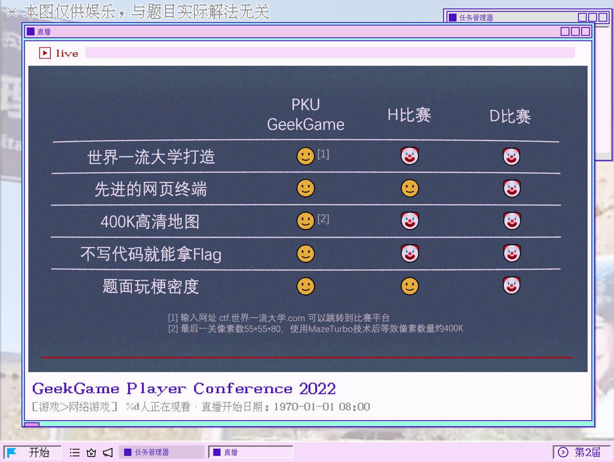

# 题目列表

| 分类 | # | 官方题解和源码 | 题目标题 | Flag | 分值 | 校内通过 | 总通过 |
| --- | --- | --- | --- | --- | --- | --- | --- |
| Tutorial | prob19 | [→ signin](../official_writeup/signin/) | †签到† | / | 100 | 153+8 | 567+33 |
|  | prob01 | [→ trivia](../official_writeup/trivia/) | 小北问答 · 极速版 | 及格摆烂 | 200 | 98+7 | 228+17 |
|  |  |  |  | 满分卷王 | 200 | 45+9 | 85+22 |
| Misc | prob04 | [→ gcc](../official_writeup/gcc/) | 编原译理习题课 | 玩挺大 | 150 | 70+7 | 159+17 |
|  |  |  |  | 玩挺长 | 150 | 82+4 | 185+11 |
|  |  |  |  | 玩挺花 | 200 | 50+9 | 106+15 |
|  | prob15 | [→ javarev](../official_writeup/javarev/) | Flag Checker | Flag 1 | 150 | 66+5 | 169+12 |
|  |  |  |  | Flag 2 | 150 | 58+4 | 120+9 |
|  | prob03 | [→ nautilus](../official_writeup/nautilus/) | 智慧检测器 | 破坏者 | 200 | 39+17 | 90+35 |
|  |  |  |  | 调停者 | 250 | 32+8 | 53+13 |
|  | prob02 | [→ txspeech](../official_writeup/txspeech/) | 我用108天录了个音 | 一吨重的奖章 | 300 | 6+7 | 11+10 |
|  |  |  |  | 两吨重的奖章 | 200 | 0+3 | 0+3 |
|  | prob05 | [→ openssh](../official_writeup/openssh/) | 小Z的服务器 | Flag 1 | 350 | 2+1 | 3+2 |
|  |  |  |  | Flag 2 | 300 | 2+0 | 3+1 |
| Web | prob21 | [→ txdocs](../official_writeup/txdocs/) | 企鹅文档 | / | 300 | 39+14 | 94+25 |
|  | prob06 | [→ omnibox](../official_writeup/omnibox/) | 给钱不要！ | 要钱不给！！ | 200 | 4+7 | 10+10 |
|  |  |  |  | 信息不漏！！！ | 250 | 7+4 | 21+6 |
|  | prob07 | [→ mediawiki](../official_writeup/mediawiki/) | 私有笔记 | 知识，与你分享 | 200 | 19+13 | 53+18 |
|  |  |  |  | 来我家做客吧 | 300 | 8+11 | 28+20 |
|  | prob08 | [→ antweb](../official_writeup/antweb/) | 企业级理解 | 赋能管理后台 | 150 | 18+13 | 39+27 |
|  |  |  |  | 盘活业务增长 | 150 | 7+5 | 16+14 |
|  |  |  |  | 打通整个系统 | 250 | 6+5 | 14+12 |
|  | prob09 | [→ ultimatesandbox](../official_writeup/ultimatesandbox/) | 这也能卷 | Flag · 摆 | 100 | 26+8 | 55+19 |
|  |  |  |  | Flag · 大 | 200 | 4+0 | 8+2 |
|  |  |  |  | Flag · 烂 | 350 | 3+0 | 7+0 |
| Binary | prob10 | [→ instbox](../official_writeup/instbox/) | 简单题 | / | 350 | 9+2 | 29+7 |
|  | prob22 | [→ ttowrss](../official_writeup/ttowrss/) | TTOWRSS | / | 350 | 3+1 | 12+4 |
|  | prob20 | [→ cube64](../official_writeup/cube64/) | 次世代立方计算机 | / | 400 | 1+1 | 4+2 |
|  | prob12 | [→ whatapass](../official_writeup/whatapass/) | 混淆器 | / | 500 | 0+1 | 1+1 |
|  | prob13 | [→ saferust](../official_writeup/saferust/) | 编原译理习题课 · 实验班 | Flag 1 | 200 | 4+14 | 16+19 |
|  |  |  |  | Flag 2 | 500 | 3+0 | 8+2 |
| Algorithm | prob16 | [→ polydivisible](../official_writeup/polydivisible/) | 381654729 | / | 200 | 57+4 | 104+9 |
|  | prob18 | [→ tudoucode](../official_writeup/tudoucode/) | 乱码还原 | Flag 1 | 200 | 43+2 | 71+5 |
|  |  |  |  | Flag 2 | 250 | 15+5 | 23+7 |
|  | prob17 | [→ strangeencrypt](../official_writeup/strangeencrypt/) | 奇怪的加密 | Flag 1 | 250 | 29+3 | 42+7 |
|  |  |  |  | Flag 2 | 200 | 16+7 | 23+11 |
|  | prob14 | [→ sweeper2](../official_writeup/sweeper2/) | 扫雷 II | Flag 1 | 150 | 11+2 | 19+5 |
|  |  |  |  | Flag 2 | 200 | 10+1 | 13+4 |
|  |  |  |  | Flag 3 | 300 | 9+2 | 11+6 |
|  | prob11 | [→ equation](../official_writeup/equation/) | 方程组 | Flag 1 | 100 | 55+2 | 85+5 |
|  |  |  |  | Flag 2 | 200 | 27+7 | 38+8 |
|  |  |  |  | Flag 3 | 300 | 1+8 | 7+9 |

“分值” 表示题目原始分值，实际分值取决于校内第一阶段通过人数。

“校内通过” 和 “总通过” 人数的两个部分分别表示第一阶段和第二阶段的通过人数。

## [Tutorial] †签到†

**[【→ 官方题解和源码】](../official_writeup/signin/)**

<blockquote>

《PKU GeekGame》是北京大学自主研发的一款全新 CTF 解题赛。
比赛发生在一个被称作「<ruby>信息高速路<rt>互联网</rt></ruby>」的幻想世界，
在这里，报名的选手将被授予访问题目的<ruby>「权能」<rt>Token</rt></ruby>，导引赛博之力。
你将扮演一位名为「黑客」的神秘角色，在自由的解题过程中邂逅类型各异、考点独特的题目们，找出程序的漏洞或者隐藏的信息，同时逐步发掘「Flag」的真相。

</blockquote>

欢迎参赛！随着比赛进行，我们会发布对题目的补充说明、提示及后续赛程安排，届时将在本平台和 QQ 群 691076890 发布。

如果你对题目有疑问，可以在群里私聊管理员或发邮件到 geekgame at pku.edu.cn。除通过上述方式与组委会联系外，所有选手在比赛结束前不得与他人讨论题目。

<strong>补充说明：此题 Flag 是在英文中有意义的内容。</strong>

<strong>萌新教学：</strong>

本比赛的每道题目都对应着一个或多个被称为 Flag 的答案，其形如 <code>flag{...}</code>。
Flag 区分大小写，所有字符均为可打印 ASCII 字符。
你需要按照要求在题目所给附件中解出 Flag，或者攻击题目指定的系统在服务器中得到 Flag。将 Flag 输入到下面的文本框即可得分。

<a href="#/game">比赛主页</a> 的 “资料推荐” 栏目有一些让你快速了解常见解题方法的资料，例如第一届 PKU GeekGame 签到题的题解对解出本题可能有帮助。
<a href="#/info/faq">选手常见问题</a> 的 “常用工具” 栏目列举了一些你可能会用到的工具。

<strong>第二阶段提示：</strong>

<ul>
<li><a target="_blank" rel="noopener noreferrer" href="https://github.com/PKU-GeekGame/geekgame-1st/tree/master/writeups">第一届 PKU GeekGame 的部分选手题解</a> 真的对解出本题有帮助。此题相比于第一届签到题的唯一难点就在于不允许复制。</li>
<li>不允许复制并不意味着不能复制。不能复制也不意味着无法解题。</li>
</ul>

## [Tutorial] 小北问答 · 极速版

**[【→ 官方题解和源码】](../official_writeup/trivia/)**

菜宝十分擅长网上冲浪，会使用十种甚至九种搜索引擎。本届 PKU GeekGame 一开始，她就急不可耐地打开了小北问答题目，想要在一血榜上展现她惊人的情报搜集能力。

为了让菜宝玩得开心，小北问答题目全新升级为小北问答 · 极速版。

<ul>
<li>小北问答 · 极速版自带<strong>省流助手</strong>，基于 socket 通信的纯文字 UI 简洁朴实，不浪费网络上的每一毫秒。</li>
<li>小北问答 · 极速版自带<strong>速通计时</strong>，只有手速够快的 CTF 选手才是好的 CTF 选手。</li>
<li>小北问答 · 极速版自带<strong>肉鸽玩法</strong>，每次连接到题目都有不一样的问题在等着你。</li>
</ul>

赶紧打开网页终端体验小北问答 · 极速版，把 Flag 抱回家吧！

<strong>萌新教学：</strong>

如下面的说明所示，本题在 <code>prob01.geekgame.pku.edu.cn</code> 主机开放了 TCP 10001 端口。
你可以通过网页终端、命令行工具 netcat 或者 pwntools 等带 socket 通信功能的库连接到这个端口，参见 <a href="#/info/faq">FAQ：关于终端交互</a>。

请与这个端口上的程序交互获得 Flag。连接频率限制是 30 秒 3 次。

题目会要求输入个人 Token 来验证你的选手身份。点击页面底部的 “复制个人 Token” 按钮可以复制自己的 Token。网页终端会自动填入 Token。

<strong>第二阶段提示：</strong>

<ul>
<li>题库共有 8 道题，每次会选择其中的 7 道。其中询问质数的题有 1/8 的几率回答正确，被抽走的几率是 2/9；其余题目均有确定的正确答案，被抽走的几率是 1/9。因此，如果你有一道题不会，仍然有 1/72 的几率解出题目。</li>
<li>出题人经过一些社工找到了他朋友的位置，大概在 695 Hawthorn Ave, Boulder, CO 附近。</li>
</ul>

## [Misc] 编原译理习题课

**[【→ 官方题解和源码】](../official_writeup/gcc/)**

<blockquote>

一个测试工程师走进一家酒吧，要了一杯啤酒。

一个测试工程师走进一家酒吧，要了一杯咖啡。

一个测试工程师走进一家酒吧，要了 0.7 杯啤酒。

一个测试工程师走进一家酒吧，要了-1 杯啤酒。

一个测试工程师走进一家酒吧，要了一份雪王大圣代和冰鲜柠檬水。

一个测试工程师走进一家酒吧，对核验健康宝的店员出示了舞萌 DX 玩家二维码。

一个测试工程师走进一家酒吧，打开了 PKU GeekGame 比赛平台。

一个测试工程师走进一家酒吧，用 g++ 编译他的代码。

酒吧没炸，但 g++ 炸了。

</blockquote>

你知道多少种让 g++ 爆炸的姿势呢？快来大显身手吧。

<ul>
<li>让 g++ <strong>编译出的程序超过 8MB</strong> 可以获得 Flag 1</li>
<li>让 g++ <strong>输出的报错信息超过 2MB</strong> 可以获得 Flag 2</li>
<li>让 g++ <strong>因为段错误而崩溃</strong> 可以获得 Flag 3</li>
</ul>

<strong>第二阶段提示：</strong>

<ul>
<li>前两个问题是开发 OJ 系统需要考虑的。PoC 很容易在网上搜索到。</li>
<li>第三问考的是 GCC 的 bug（internal compiler error）。可以参考一下 GCC 的 bug tracker。</li>
</ul>

## [Misc] Flag Checker

**[【→ 官方题解和源码】](../official_writeup/javarev/)**

我们发现，有很多选手在比赛中提交了错误的 Flag。

为了防止这种情况发生，给选手良好的参赛体验，这里有一个简单的 Java 程序。

你可以在程序里面输入要提交 Flag ，程序会帮你检查 Flag 是否正确。

是不是非常的贴心呢？

<strong>提醒：JRE 版本高于 15 时可能无法运行此程序。建议使用 JRE 8 运行。</strong>

<strong>第二阶段提示：</strong>

<ul>
<li>有众多工具可以反编译Java程序（包括一些IDE也有反编译功能）。不像C或C++，反编译产生的Java通常都非常接近原始Java代码。</li>
<li>JavaScript可以直接复制到浏览器开发者工具进行调试。</li>
</ul>

## [Misc] 智慧检测器

**[【→ 官方题解和源码】](../official_writeup/nautilus/)**

CTF 之家讯（作者 / 侑师傅），GeekGame 于 11 月 19 日举行线上发布会，发布了一道题目《Misc 智慧题》。
题目以经典的走迷宫作为主要玩法，选手需要在指定步数内通关 3 个迷宫关卡。

记者了解到，今年早些的 <a target="_blank" rel="noopener noreferrer" href="https://github.com/Nautilus-Institute/quals-2022/blob/main/twisty/twisty.py">D 比赛</a> 也出现过类似的题目，
针对部分网友提出的“题目抄袭”质疑， GeekGame 宣传负责人表示，《Misc 智慧题》是 GeekGame 具有自主知识产权的题目，
为了选手的解题体验加入了 D 比赛相关题目的兼容层，因此遵循开源协议使用了 DOSP（DBiSai Open-Source Project） 的开源代码，这是业界通行做法。
在玩法方面，GeekGame 这道题目为了将寒气传达给每一名选手，对移动步数有全新的要求，因此对选手智慧程度的考察远高于 D 比赛，而且修正了 DOSP 代码中的多处 bug，因此不构成抄袭。
GeekGame 还表示，在明年即将举行的第三届比赛中，所有题目将实现完全自主化替代，届时题目代码将不含任何源于 DOSP 的部分。

     
    ↑ GeekGame 线上发布会精彩片段 / 图：视觉火星

据约霍·翰普金斯大学报道，一名内部验题人表示，D 比赛的出题人可能不太会 Python，以致于比赛当时的选手在没有源码的情况下随便试试就用非预期解把题给秒了。
希望 GeekGame 把这些恶性 bug 都改好了。

<strong>让游戏崩溃</strong>可以获得 Flag 1，<strong>通关游戏</strong>可以获得 Flag 2。

<strong>第二阶段提示：</strong>

<ul>
<li>Flag 1：游戏具有一处 Python 新手程序员经常犯的错误，造成了穿墙 bug。试着找出这个 bug，然后构造一个 <code>IndexError</code>。</li>
<li>Flag 2：第三关可以开局先去看看终点的位置在哪里，然后按 R 重新开始。</li>
</ul>

## [Misc] 我用108天录了个音

**[【→ 官方题解和源码】](../official_writeup/txspeech/)**

<blockquote>

嘎嘎~ 机械~ 嘎嘎~

<em>—— 吵闹的机械装置</em>

</blockquote>

在 22022 年，一种让皮肤迅速坏死的疾病在城市间肆虐，无人维护的电厂、铁路等等现代设施逐渐停止运转。一时间人类文明危在旦夕。

一支担负着拯救人类之重任的远征队决定前往两万年前被废弃的约霍·翰普金斯医院，寻找这种疾病的解药。
远征队在医院储藏室的角落发现了一个触屏机械装置，旁边的标签诉说着它的神奇功效：【道具名称】iCure by Apple$oft 【道具效果】大幅提升解药研发进度。一时间人类文明不再危在旦夕。

这个装置使用了先进的 Voice ID 技术通过语音识别来验证身份，而机主设置的【荷语言】已经失传很久了，队员们反复尝试都不能通过 Voice ID 验证。
iCure 的电量逐渐下降，眼看就要关机，而队员们手头也没有携带兼容 iCure 的 Thundering 充电线缆。一时间人类文明再度危在旦夕。

情急之下，队员们通过速度可达 800mbps（毫比特每秒）的 5G 通信连线到了荷语言专家——也就是你，希望你能够提供一段荷语言的录音文件来通过 Voice ID 的验证。
由于 iCure 的电池已经无法支撑太长时间，<strong>你提供的录音时间应该尽可能短</strong>；由于 22022 年的 5G 频谱资源珍贵，<strong>你提供的录音文件应该尽可能小</strong>。

作为拯救人类文明的酬谢，队员们可以把在储藏室挖掘出的一吨重的奖章赠予你。

<strong>补充说明：</strong>

<ul>
<li>根据<a target="_blank" rel="noopener noreferrer" href="https://cloud.tencent.com/document/product/1093/46740">腾讯云的相关文档</a>，音频应该编码成单声道 8000Hz 采样率，否则效果不佳。</li>
<li>为了让文件大小不超过 8192 字节，需要选择一种在极低码率（&lt;8kbps）下效果尚可的编码，并仔细调整不同部分的压制参数。出题人编码五句话分别用了 1.6KB、0.8KB、0.8KB、0.8KB、1.2KB。每处静音段用了 0.5KB。</li>
<li>本题限制提交 200 次是为了防止滥用 API。正常解题的选手如果用完了限额可以在选手群联系 xmcp 重新补充。</li>
</ul>

<strong>第二阶段提示：</strong>

<ul>
<li>可以使用<strong>不同的参数</strong>压制每个片段再合并起来，使得识别结果无误的部分有更低的码率和更快的语速。</li>
<li>一个 .ogg 文件可以存储多段音频流。ffprobe 遇到这种文件会发生什么？</li>
<li>题目要求在各方面都稍微放松了一些：对文件大小的要求从 8192 字节放宽到了 12288 字节，对句子间隔时间的要求从 9.8 ~ 10.2s 放宽到了 9.5 ~ 10.5s，提交次数限制上调到 400 次。</li>
</ul>

## [Misc] 小Z的服务器

**[【→ 官方题解和源码】](../official_writeup/openssh/)**

看呐，小 Z 给组里的服务器装好了系统！

看呐，小 Z 在服务器上安装了 OpenSSH 服务！

看呐，小 Z 设置好了公钥登录！

看呐，小 Z 新建了一个管理员账号，在根目录放了一个 Flag！

看呐，小 Z 把管理员账号的家目录设置成了跟自己一样！

看……诶，这样做是不是有什么问题来着？

究竟是什么问题呢？

<strong>注意：本题终端将在连接 10 分钟后关闭，如需长时间调试建议下载源码运行。</strong>

<strong>第二阶段提示：</strong>

<ul>
<li>Flag 1: <code>authorized_keys</code> <a target="_blank" rel="noopener noreferrer" href="https://github.com/openssh/openssh-portable/blob/2dc328023f60212cd29504fc05d849133ae47355/regress/check-perm.c#L93-L149">生效条件</a><ul>
<li>函数 <code>realpath</code> 干了什么？</li>
</ul>
</li>
<li>Flag 2: <code>ssh_config</code> <a target="_blank" rel="noopener noreferrer" href="https://man.openbsd.org/ssh_config">官方文档</a><ul>
<li>形如 <code>*Command</code> 的配置项可以干什么？</li>
</ul>
</li>
</ul>

## [Web] 企鹅文档

**[【→ 官方题解和源码】](../official_writeup/txdocs/)**

<blockquote>

在一个开源软件学术大会上，主持人突然说：下面请认为无代码开发会减少安全漏洞的同志坐到会场左边，认为无代码开发会增加安全漏洞的同志坐到会场右边。

大部分人坐到了左边，少数人坐到右边，只有 You 酱还坐在中间不动。

主持人：侑同志，你到底认为无代码开发会减少还是增加漏洞？

回答：我认为无代码开发会减少原来存在的漏洞，但是会带来很多新的漏洞。

主持人慌忙说：那请您赶快坐到主席台上来。

</blockquote>

企鹅文档相信大家都很熟悉，它是企鹅公司久负盛名的在线文档编辑平台。但是基于企鹅文档的无代码 OA 系统是怎么回事呢？下面就让小编带大家一起了解吧。

基于企鹅文档的无代码 OA 系统，其实就是用企鹅文档来实现 OA 系统。很多企业、学校、组织之前使用 OA 系统来下发通知和填报报表，现在这些机构很多都转向了使用企鹅文档来下发通知和填报报表，当然可以选择问卷星这些类似的服务。

大家可能会感到惊讶，用企鹅文档来填报报表不会出现安全和隐私问题吗？但事实就是这样，小编也感到非常惊讶。

那么这就是基于企鹅文档的无代码 OA 系统了，大家有没有觉得很神奇呢？快快点击左下角的阅读原文来看看基于企鹅文档的无代码 OA 系统吧。

<strong>第二阶段提示：</strong>

<ul>
<li>本题其实是一道流量分析题。</li>
<li>在 Chrome 开发者工具的 Network 功能中，点击放大镜按钮可以搜索流量中的内容。</li>
</ul>

## [Web] 给钱不要！

**[【→ 官方题解和源码】](../official_writeup/omnibox/)**

<blockquote>

给钱不要，要钱不给，信息不漏！

Give money no need. Need money no give. Information no leak.

</blockquote>

You 酱是 GeekGame 比赛的资深命题人，她深知“人”是信息安全中最薄弱的环节，人的使用习惯胜过一切安全措施。毕竟电脑只要不开机就不会中毒，<a target="_blank" rel="noopener noreferrer" href="https://www.bilibili.com/video/BV1GJ411x7h7/">链接</a>只要不点就不会被骗。

话虽如此，但她最近沉迷于收集疯狂星期四表情包。身为超级嘿客的你偶然发现她经常使用的表情包下载网站存在一种 XSS 漏洞，只要在网站上输入一串字符就可以泄露她珍藏的 Flag。
为了宝贵的奖金，你决定试试看她在魅力十足的疯狂星期四面前还能否保持理性。

鲁莽的攻击行为总是伴随着风险：如果 You 酱觉得你发给她的字符串很可疑，机智的她就会立刻将你举报到保卫部，然后很快就会有骑着白色高级电瓶车的保安出现在楼下将你带走。这可就遭了。

<strong>补充说明：</strong>完全没有思路可以看看 Chrome 地址栏自动补全的相关源码。不看源码的话，或许灵感 + 一定程度的 Fuzz 也能起到效果。

<strong>萌新教学：</strong>

本题提供了一个模拟受害者行为的程序，称为 XSS Bot。XSS Bot 会自动操作浏览器将 Flag 放置在目标网站上，然后输入你提供的字符串。

请设法利用目标网站上的漏洞，获得受害者浏览器中的 Flag。

<strong>第二阶段提示：</strong>

<ul>
<li>来看看 <a target="_blank" rel="noopener noreferrer" href="https://chromium.googlesource.com/chromium/src/+/refs/tags/106.0.5249.163/components/omnibox/browser/autocomplete_input.cc#235">Chrome 是如何解析地址栏输入的内容的</a>。</li>
<li>Flag 1：试着让 Chrome 把一个任意的 IP 地址解析成 QUERY。</li>
<li>Flag 2：试着让 Chrome 把一个 Bookmarklet 解析成 UNKNOWN。</li>
</ul>

## [Web] 私有笔记

**[【→ 官方题解和源码】](../official_writeup/mediawiki/)**

大家或许做过 Hackergame 2022 “Flag 的痕迹”一题，或许没做过，这不重要。

总之，<ruby>现在<rt>2020年</rt></ruby>小 Z 在自己的机器上部署了一个 MediaWiki 用于记录自己的笔记，把 Flag 放在里面，然后想方设法不让其他人看到。
但是，这次不仅 Flag 被泄漏了，黑客还在机器上干了更多坏事……

一些说明：

<ol>
<li>此题和 Hackergame 的题目解法没有直接联系。</li>
<li>此题不是代码审计题，一开始就阅读源代码是错误的选择。</li>
</ol>

<strong>第二阶段提示：</strong>

<ul>
<li>提供以下配置文件：<a target="_blank" rel="noopener noreferrer" href="/service/attachment/prob07/Dockerfile">Dockerfile</a>、<a target="_blank" rel="noopener noreferrer" href="/service/attachment/prob07/LocalSettings.php">LocalSettings.php</a>。</li>
<li>2021年12月，MediaWiki爆出<strong>一系列</strong>漏洞，允许攻击者访问私有 wiki 的任何内容，以及修改公开 wiki 的任何页面（例如维基百科的首页）。所幸，漏洞被发现并修复前没有造成已知的负面影响。</li>
<li>2020年7月，Score扩展爆出漏洞，允许攻击者执行任意命令。漏洞发现不久，Score扩展就在维基媒体计划禁用了。在此漏洞的修复过程中，又发现了一系列绕过方法。维基媒体计划的最终的处理方法是把LilyPond放到一个独立的容器运行；13个月后（2021年8月），Score扩展才被重新启用。</li>
<li>可以参考MediaWiki bug report system对相关漏洞的讨论。</li>
</ul>

## [Web] 企业级理解

**[【→ 官方题解和源码】](../official_writeup/antweb/)**

<blockquote>

本题（不含以下题面）由赞助商蚂蚁集团提供。

</blockquote>

大型企业的软件开发方式与开源项目是不同的。
只有拥有了大型企业特有的企业级理解，才能够更好地让产品为客户赋能，实现前端与后台的解耦，将需求对齐到场景的完整链路中，实现从底层到盈利层的打通……

有些企业选择了坚如磐石的 Java 8 语言，只有在数十亿设备上都能运行的环境才是稳定可靠的环境。

有些企业选择了历久弥新的 Spring Framework，毕竟只需要写几行配置就能为一个巨大的 Web App 增加自动生成的登录页面，工程师放心，产品经理也放心。

有些企业选择了让程序员用 A4 纸书面打印代码来考核工作量，因为 “Talk is cheap, show me your code.” 是每名科班程序员的信条。

有些企业选择了用毕业典礼欢送每一名员工，即将毕业的 You 酱心有不甘，摸了摸胸前的工牌，在会议室的桌上捡起了两张同事上周打印出来的代码，希望能够成为自己职业道路上的一份纪念。

<ruby>你<rt>You</rt></ruby>，有着企业级理解吗？

<strong>补充说明：</strong>本题不需要爆破密码。三个 Flag 分别需要绕过登录页面访问管理后台、访问本机上的 bonus 服务、通过 bonus 服务在机器上执行命令。

<strong>注意：题目返回的 Flag 格式可能形如 <code>flag1{...}</code>，请改成 <code>flag{...}</code> 后提交。</strong>

<strong>第二阶段提示：</strong>

<ul>
<li>Flag 1：很多 HTTP 框架都会在判断网址对应的 Endpoint 时去除网址结尾的斜杠。</li>
<li>Flag 2：可以通过 web 服务访问本机的 bonus 服务，以及别忘了源码是可以下载的。</li>
<li>Flag 3：“这确实不是漏洞，这是特性” —— Log4j 对他的好兄弟 Commons Text 点了一个赞。</li>
</ul>

## [Web] 这也能卷

**[【→ 官方题解和源码】](../official_writeup/ultimatesandbox/)**

<blockquote>

某大学的很多课都有作业，特别是程序设计课程，往往会要求同学们写些简单程序当作业。
可惜，现在大家都很卷，考试总能取得极高的分数，甚至大作业也会卷出新花样来。
倘若某人在作业上开摆，那么等待他的往往只能是一个寄字，这也是某大学“摆寄”花名之由来。

</blockquote>

你有一位室友，他的口头禅是“我是摆大最摆的人”和“我从不内卷”。

这一次，他选修了一门叫《JavaScript程序设计》的课程。自从选修这门课程后，你发现他
天天熬到半夜，对着VSCode傻笑，实为异常。

一天，你在偶然间听到了他的喃喃自语：“只要我把小作业当期末作业做，大作业当毕业设计做，势必能卷过其他卷王！”
听到这，感觉收到了欺骗的你勃然大怒，打开了他的第一个“小”作业——一个“简单”的计算器。

另外，通过一顿家园，你获得了他的后端源码，<del>这让这道题的难度大大降低。</del>

<strong>第二阶段提示：</strong>

对于Flag1:

<ul>
<li>成为会员会有不错的收获。</li>
<li>不要试图逆向<code>premium.js</code>，会变得不幸。</li>
</ul>

对于Flag2:

<ul>
<li>flag在<code>/* What's this? */</code>这处被删除的源代码里。</li>
</ul>

对于Flag3:

<ul>
<li>文档是个好东西。<a target="_blank" rel="noopener noreferrer" href="https://nodejs.org/api/process.html#process">看看文档吧</a>。</li>
<li>出题人当初是不打算给chrome沙箱的，但想了想还是给以降低难度。</li>
<li>Node.JS是怎么调试的？</li>
</ul>

## [Binary] 简单题

**[【→ 官方题解和源码】](../official_writeup/instbox/)**

<blockquote>

题太难了？来看看简单题吧！

只有一种指令的机器，够简单吧！

</blockquote>

你可以提交一段 x86-64 机器码，题目会检查这段机器码<strong>只包含一种汇编指令</strong>，然后运行它。

<strong>Flag 位于服务器磁盘中的 <code>/flag.txt</code> 文件。</strong>

<strong>第二阶段提示：</strong>

指令种类是在运行前检查的，运行时并非只能执行一种指令。

## [Binary] TTOWRSS

**[【→ 官方题解和源码】](../official_writeup/ttowrss/)**

不知所云的标题，但，看到它的第一眼时，我就被击穿了——

仿佛听到内心深处的呼喊，然后强烈地为之着迷。

去了解祂，愈深入，愈病态，像信徒被神谕所蛊惑。

易拉罐的金属——铝铸造成鄙视链；或是用来铸币，收买谁的灵魂。

那些游离于世俗之外的，语言、画面、情绪。直至，我发现自己已无法从中脱身。

呃呃，所以谁能告诉我这个程序要输什么密码才能通过啊？

<strong>第二阶段提示：</strong>

<ul>
<li>在 Linux 环境中，挂一个 GDB 跑跑这个程序，发生了什么现象？</li>
<li>Linux 中，什么机制可以处理这种现象？程序中对应的处理函数是什么？</li>
<li>这个函数会修改 <code>x86-64</code> 架构下的 <code>rip</code> 寄存器。</li>
<li>从这个函数入手，尝试分析程序从执行 <code>main</code> 函数开始到 <code>main</code> 返回前的行为。</li>
</ul>

## [Binary] 次世代立方计算机

**[【→ 官方题解和源码】](../official_writeup/cube64/)**

“这是什么？一个 JAR 包？你确定没搞错吗？”

“你不能质疑我<ruby>超级嗨客<rt>スーパーハカー</rt></ruby>的实力，他们的服务器上确实只有这一个可疑的文件。”

“那这就是传说中的‘次世代立方计算机’咯？”

“确切地说，根据服务器里的其他文档，这是这个计算机的 RTL 描述。”

“真不敢想象，这么个文件，居然能描述一个……可以用来构建元宇宙的计算机。”

“我超！元……宇宙？！这也太酷了！很符合我对……”

“行了行了，说正经的，这玩意要怎么用呢？”

“我不道哇。是不是得想办法把它运行起来，然后里面会输出什么东西之类的吧？”

“不可能这么简单，我觉得里面肯定用了什么<strong>加密手段</strong>和<strong>编码手段</strong>。”

“确实，毕竟是 THERN。”

“是啊，全球顶尖的组织，世界最高的机密，你觉得我们的胜算有几成？”

<strong>“无所谓，我会出手。”</strong>

补充说明：

<ul>
<li>Cube64 计算机某些内部状态的初始值可能会影响其输出。</li>
<li>Cube64 输出的内容使用 base64 解码后即可得到 Flag。</li>
</ul>

<strong>第二阶段提示：</strong>

<ul>
<li>如果无法理解 Scala 里各种抽象的语法，你可以尝试运行 JAR 包，检查生成的 FIR（FIRRTL）文件，其语法相对更好理解。</li>
<li>你不仅需要分析 Cube64 的 RTL 描述，还需要分析 ROM 中的程序，最好能用其他编程语言写一个等价的程序。</li>
<li>程序从内存读取输入，且只会在输入正确的情况下，输出一个合法的 flag（base64 解码后以 <code>flag{</code> 开头），所以你可能需要枚举所有输入。</li>
</ul>

## [Binary] 混淆器

**[【→ 官方题解和源码】](../official_writeup/whatapass/)**

小Q觉得混淆器很神奇，他想知道控制流平坦化是怎么实现的，于是他从网上找了个开源的混淆器跑了跑。

然而，他发现这个混淆器总会莫名其妙crash，他修了半天也没找到bug在哪里。

为了让这个混淆器发挥剩余价值，小Q一拍脑瓜把它变成了一道菜单题。

<strong>第二阶段提示：</strong>

bug在分支指令的处理中。

## [Binary] 编原译理习题课 · 实验班

**[【→ 官方题解和源码】](../official_writeup/saferust/)**

<blockquote>

某学院的学生走进一家酒吧，发现酒吧每两个小时才营业一次，需要事先预定。

某学院的学生走进一家酒吧，发现很多人并没有事先预定，把吧台占满了。

某学院的学生走进一家酒吧，发现要扫两次码才能启动点单小程序。

某学院的学生走进一家酒吧，发现保安不让把手机带进去，因为手机是大功率电器。

某学院的学生走进一家酒吧，发现酒吧的暖气响个不停。

某学院的学生走进一家酒吧，发现酒吧包间的隔音很差。

某学院的学生走进一家酒吧，发现天花板上贴的墙纸掉了下来。

某学院的学生走进一家酒吧，发现酒吧门口施工把电线挖断了。

某学院的学生走进一家酒吧，发现酒吧门口施工把水管也挖断了。

某学院的学生走进一家酒吧，发现酒吧突然开始消防演习，烟雾熏了一脸。

某学院的学生走进一家酒吧，发现酒吧无线网的 IPv6 无法正常工作。

某学院的学生走进一家酒吧，发现收银台在施工，结账需要绕到后厨。

某学院的学生走进一家酒吧，发现老板娘在的日子就不供应鸡尾酒。

某学院的学生走进一家酒吧，发现点的饮品需要自己在 7 点前去门口领取。

某学院的学生走进一家酒吧，发现进入酒吧的顾客如果不每天做核酸就会被老板电话轰炸。

这个学生很生气，模仿一位测试工程师在酒吧里编译他的代码，想要炸掉酒吧。

可惜他学习的编程语言是 Rust，怎么也不炸。他愤怒地大叫 “你不要咄咄逼人！”

酒吧炸了。但他的编译器仍然完好无损。

</blockquote>

请提交一段 Safe Rust 代码，<strong>让程序出现段错误</strong>可以获得 Flag 1，<strong>读取打开的 /flag2 文件</strong>获得 Flag 2。

<strong>第二阶段提示：</strong>

以下两个提示二选一即可：

<ul>
<li><a target="_blank" rel="noopener noreferrer" href="https://github.com/Qwaz/rust-cve">Rust CVEs 合集</a></li>
<li><a target="_blank" rel="noopener noreferrer" href="https://doc.rust-lang.org/reference/abi.html#the-link_section-attribute">link_section 属性</a></li>
</ul>

## [Algorithm] 381654729

**[【→ 官方题解和源码】](../official_writeup/polydivisible/)**

381654729，被称为“神奇而又独一无二的数”。

小 Z 找到了一个类似的数，并把 Flag 编码到这个数里面，你能找到它吗？

<strong>第二阶段提示：</strong>

如果不考虑Flag里面只有可见字符，符合条件的数共8407789个。试着把它们都找出来。

## [Algorithm] 乱码还原

**[【→ 官方题解和源码】](../official_writeup/tudoucode/)**

<blockquote>

将需要打码的文字输入在上面的文本框里，点击『听佛说宇宙的真谛』按钮，就能在下面得到打码后的文字。

将需要解码的文字输入在下面的文本框里，记得带上『佛曰：』或『如是我闻：』的文字，点击『参悟佛所言的真意』按钮，就能在上面的文本框里得到解码后的文字。

顺便说下，为什么有时候会出现『太深奥了，参悟不出佛经的真意……』的情况，那是因为某些深井冰的网站（百度说的就是你！），会将繁体字转换为简体字，这样你复制后的文字已经不是最初的原文了，所以解不出。本佛祖的代言人已经尽力的去尝试参悟了，可惜还是有部分被篡改的佛语无能为力，十分抱歉o(&gt;﹏&lt;)o

</blockquote>

——<a target="_blank" rel="noopener noreferrer" href="https://www.keyfc.net/bbs/tools/tudoucode.aspx">与佛论禅</a>

小 Z 身在日本，有人给小 Z 发了一大段佛语，但是小 Z 一打开，全是乱码。这该怎么办啊？

<strong>第二阶段提示：</strong>

<ul>
<li>可以先用Encrypt函数随便加密一段文本，然后转成Shift-JIS，看看转成Shift-JIS的过程会发生什么变化（这不是无损的转换）。</li>
<li>AES是分组密码，可以了解一下分组密码的原理。</li>
</ul>

## [Algorithm] 奇怪的加密

**[【→ 官方题解和源码】](../official_writeup/strangeencrypt/)**

小 Z 学习了简易替换密码、维吉尼亚密码等多种古典密码，然后自己设计了一种古典密码。

小 Z 认为，这种密码没人能破解。

是这样的吗？

Flag 2 提示：

<ol>
<li>此部分和 Flag 1 没有关联，也即不需要先解出 Flag 1</li>
<li>搜索引擎会给你一些帮助，虽然不是必需的</li>
<li>如果你还原的原文正确，把原文的内容放到搜索引擎里面搜索，会告诉你下一步做什么</li>
</ol>

<strong>本题 Flag 格式符合此正则表达式：<code>flag\{[a-z0-9_]+\}</code></strong>

<strong>第二阶段提示：</strong>

<ul>
<li>根据上下文你或许能知道某些字母对应的明文。如果第i个和第j个字母的明文和密文都相同，这说明了什么？</li>
<li>另外，英文字母的分布是有规律的，而加密的置换可以分解成若干个不相交的轮换，因此……</li>
<li>Flag 2：明文符合此正则表达式：<code>[0-9a-f\n]+</code>。另外，数字不会被加密，在密文还是保持原样。</li>
</ul>

## [Algorithm] 扫雷 II

**[【→ 官方题解和源码】](../official_writeup/sweeper2/)**

对于上一届 PKU GeekGame 的 “扫雷” 题目，有选手说：

 

<table role="presentation" style="margin:auto; display:table; border-collapse: collapse; border: none; background-color: transparent; width: auto;"><tr>
<td style="width: 20px; vertical-align: top; border: none; color: #B2B7F2; font-size: 40px; font-family: &#39;Times New Roman&#39;, Times, serif; font-weight: bold; line-height: .6em; text-align: left; padding: 10px; text-orientation: upright">“
</td>
<td style="vertical-align: top; border: none; padding: 4px 10px;">建议主办方下次出扫雷这种题的时候可以真的搞一个扫雷的 UI 这样更好玩 虽然终端也能实现相同的逻辑，但是趣味性就差很多了</td>
<td style="width: 20px; vertical-align: bottom; border: none; color: #B2B7F2; font-size: 40px; font-family: &#39;Times New Roman&#39;, Times, serif; font-weight: bold; line-height: .6em; text-align: right; padding: 10px; text-orientation: upright">”
</td></tr>
<tr>
<td colspan="3" class="cquotecite" style="border: none; padding-right: 4%; font-size: smaller; text-align: right;"><cite>——zzh1996</cite>
</td></tr></table>

 

因此我们今年就做了一个<strong>更好玩</strong>的扫雷游戏。

提示：理解去年的 “扫雷” 题目的解法对解出本题会有帮助。

<strong>第二阶段提示：</strong>

<ul>
<li>如果从来没用过Go，或者不知道Go的随机数怎么生成，可以看看用Python写的等价的<a target="_blank" rel="noopener noreferrer" href="/service/attachment/prob14/prob14.zip">服务端实现</a>。</li>
<li>注意Go的time包使用的是monotonic clock，所以时间可能会快于实际的系统时间。</li>
<li>第三关真的是扫雷。经过一些处理后你甚至可以手玩。</li>
</ul>

<!--styling from https://zh.wikipedia.org/wiki/Template:Cquote, CC BY-SA 3.0-->

## [Algorithm] 方程组

**[【→ 官方题解和源码】](../official_writeup/equation/)**

小 Z 编了一道数学练习题，解一个线性方程组。根据《高等代数》课上老师说的，如果方程数量小于变量数量，那么方程有无穷多个解。但是……

<strong>第二阶段提示：</strong>

<ul>
<li>第二问的方程组有多少个自由变量？P.S：Flag 2格式符合此正则表达式：<code>flag\{[a-z0-9_]+\}</code>。</li>
<li>阅读一下<a target="_blank" rel="noopener noreferrer" href="https://reference.wolfram.com/language/ref/LatticeReduce.html">https://reference.wolfram.com/language/ref/LatticeReduce.html</a>，包括里面给的范例。当然，做这道题并不是必须要用Mathematica。</li>
</ul>

